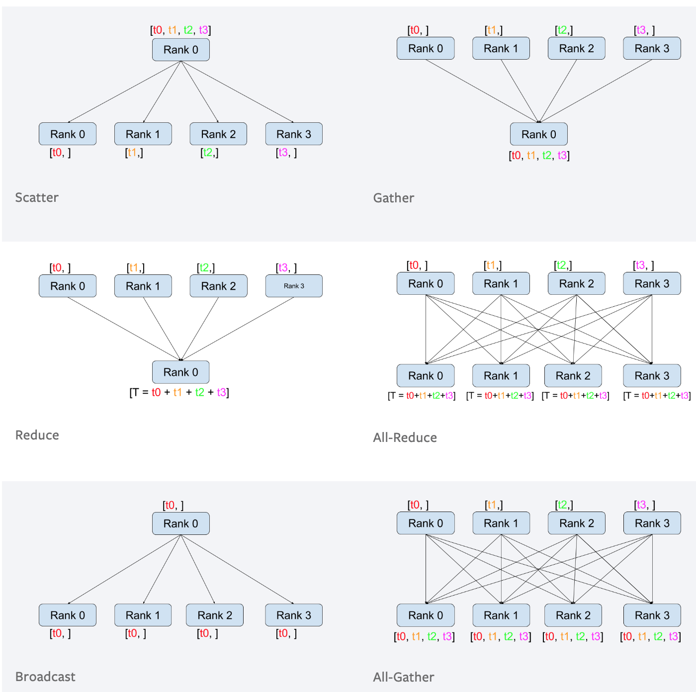

# DDP: Under the Hood

Source: [PyTorch Doc: Writing Distributed Applications with PyTorch](https://pytorch.org/tutorials/intermediate/dist_tuto.html)

- The distributed package included in PyTorch (torch.distributed) enables researchers and practitioners to easily parallelize their computations across processes and clusters of machines. To do so, it leverages message passing semantics allowing each process to communicate data to any of the other processes. As opposed to the multiprocessing (torch.multiprocessing) package, processes can use different communication backends and are not restricted to being executed on the same machine.

- <em>init_process function</em>: ensures that every process will be able to coordinate through a master, using the same ip address and port.
```python
def run(rank, size):
    """ Distributed function """
    pass

def init_process(rank, size, fn, backend='gloo'):
    """ Initialize the distributed environment. """
    os.environ['MASTER_ADDR'] = '127.0.0.1'
    os.environ['MASTER_PORT'] = '29500'
    dist.init_process_group(backend, rank=rank, world_size=size)
    fn(rank, size)


if __name__ == "__main__":
    size = 2
    processes = []
    mp.set_start_method("spawn")
    for rank in range(size):
        p = mp.Process(target=init_process, args=(rank, size, run))
        p.start()
        processes.append(p)

    for p in processes:
        p.join()
```

### Point-to-point communication

- Point-to-point communication is useful when we want more fine-grained control over the communication of our processes. They can be used to implement fancy algorithms, such as the one used in [Baidu’s DeepSpeech](https://github.com/baidu-research/baidu-allreduce) or [Facebook’s large-scale experiments](https://research.fb.com/publications/imagenet1kin1h/)

<div class="container py-4 py-md-5 px-4 px-md-3 text-body-secondary">
    <div class="row" >
      <div class="col-lg-4 mb-4">
        </img>
      </div>
    </div>
</div>

```python


def run(rank, size):
    tensor = torch.zeros(1)
    if rank == 0:
        tensor += 1
        # Send the tensor to process 1
        #dist.send(tensor=tensor, dst=1)		# Blocking point-to-point communication
        req = dist.isend(tensor=tensor, dst=1)	# Non-blocking point-to-point communication
    else:
        # Receive tensor from process 0
        #dist.recv(tensor=tensor, src=0)		# Blocking point-to-point communication
        req = dist.irecv(tensor=tensor, src=0)	# Non-blocking point-to-point communication

    req.wait()									# after req.wait() has been executed we are guaranteed that the 												# communication took place
    print('Rank ', rank, ' has data ', tensor[0])
```


### Collective communication

- As opposed to point-to-point communcation, collectives allow for communication patterns across all processes in a group. A group is a subset of all our processes. To create a group, we can pass a list of ranks to dist.new_group(group). By default, collectives are executed on all processes, also known as the world. For example, in order to obtain the sum of all tensors on all processes, we can use the dist.all_reduce(tensor, op, group) collective.

<div class="container py-4 py-md-5 px-4 px-md-3 text-body-secondary">
    <div class="row" >
      <div class="col-lg-4 mb-4">
        </img>
      </div>
    </div>
</div>

- PyTorch comes with 4 such operators, all working at the element-wise level:
	- dist.ReduceOp.SUM,
	- dist.ReduceOp.PRODUCT,
	- dist.ReduceOp.MAX,
	- dist.ReduceOp.MIN.

```python
""" All-Reduce example."""
def run(rank, size):
    """ Simple collective communication. """
    group = dist.new_group([0, 1])
    tensor = torch.ones(1)
    dist.all_reduce(tensor, op=dist.ReduceOp.SUM, group=group)
    print('Rank ', rank, ' has data ', tensor[0])
```

- There are a total of 6 collectives currently implemented in PyTorch.
	- dist.broadcast(tensor, src, group): Copies tensor from src to all other processes.
	- dist.reduce(tensor, dst, op, group): Applies op to every tensor and stores the result in dst.
	- dist.all_reduce(tensor, op, group): Same as reduce, but the result is stored in all processes.
	- dist.scatter(tensor, scatter_list, src, group): Copies the ith tensor scatter_list[i] to the ith process.
	- dist.gather(tensor, gather_list, dst, group): Copies tensor from all processes in dst.
	- dist.all_gather(tensor_list, tensor, group): Copies tensor from all processes to tensor_list, on all processes.
	- dist.barrier(group): Blocks all processes in group until each one has entered this function.


### Distributed Training:

##### Replicate the functionality of DistributedDataParallel
- we want to implement a distributed version of stochastic gradient descent. Our script will let all processes compute the gradients of their model on their batch of data and then average their gradients. 


- Splitting the dataset:
	- In order to ensure similar convergence results when changing the number of processes, we will first have to partition our dataset. 
	- Assuming we have n replicas (=world_size), then each process will have a <math>num_train_samples / world_size samples</math>. We also divide the batch size by the world_size in order to maintain the overall given batch size.

- Forward-backward-optimize training code,

```python
""" Distributed Synchronous SGD Example """
def run(rank, size):
    torch.manual_seed(1234)
    train_set, bsz = partition_dataset()
    model = Net()
    optimizer = optim.SGD(model.parameters(),
                          lr=0.01, momentum=0.5)

    num_batches = ceil(len(train_set.dataset) / float(bsz))
    for epoch in range(10):
        epoch_loss = 0.0
        for data, target in train_set:
            optimizer.zero_grad()
            output = model(data)
            loss = F.nll_loss(output, target)
            epoch_loss += loss.item()
            loss.backward()
            average_gradients(model)
            optimizer.step()
        print('Rank ', dist.get_rank(), ', epoch ',
              epoch, ': ', epoch_loss / num_batches)

""" Gradient averaging. """
def average_gradients(model):
    size = float(dist.get_world_size())
    for param in model.parameters():
        dist.all_reduce(param.grad.data, op=dist.ReduceOp.SUM)
        param.grad.data /= size
```

### Communication Backends

One of the most elegant aspects of torch.distributed is its ability to abstract and build on top of different backends. As mentioned before, there are currently three backends implemented in PyTorch: Gloo, NCCL, and MPI. 

- Gloo Backend
	- It supports all point-to-point and collective operations on CPU, and all collective operations on GPU. The implementation of the collective operations for CUDA tensors is not as optimized as the ones provided by the NCCL backend.
- MPI Backend
	- The Message Passing Interface (MPI) is a standardized tool from the field of high-performance computing. It allows to do point-to-point and collective communications and was the main inspiration for the API of torch.distributed. 
	- The advantage of using the MPI backend lies in MPI’s wide availability - and high-level of optimization - on large computer clusters
- NCCL Backend
	- The NCCL backend provides an optimized implementation of collective operations against CUDA tensors. <b>If you only use CUDA tensors for your collective operations, consider using this backend for the best in class performance</b>. The NCCL backend is included in the pre-built binaries with CUDA support.


### Initialization Methods

- Environment Variable
	- By setting the following four environment variables on all machines, all processes will be able to properly connect to the master, obtain information about the other processes, and finally handshake with them.
		- MASTER_PORT: A free port on the machine that will host the process with rank 0.
		- MASTER_ADDR: IP address of the machine that will host the process with rank 0.
		- WORLD_SIZE: The total number of processes, so that the master knows how many workers to wait for.
		- RANK: Rank of each process, so they will know whether it is the master of a worker.

- Shared File System
	- The shared filesystem requires all processes to have access to a shared file system, and will coordinate them through a shared file. This means that each process will open the file, write its information, and wait until everybody did so. After that all required information will be readily available to all processes. 

- TCP
	- Initializing via TCP can be achieved by providing the IP address of the process with rank 0 and a reachable port number. Here, all workers will be able to connect to the process with rank 0 and exchange information on how to reach each other.

