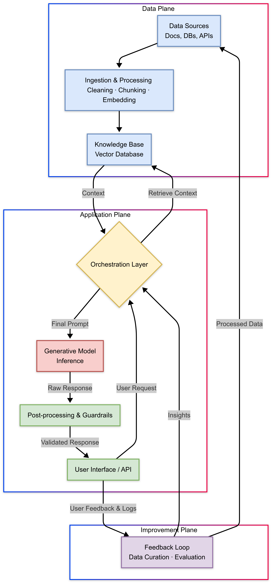

# Product Architecture

## Introduction: The New Full-Stack for AI Products

Generative AI (GenAI) systems represent a paradigm shift from traditional software. Their non-deterministic, resource-intensive, and constantly evolving nature demands a new architectural approach. Unlike conventional applications where logic is explicit and outputs are predictable, GenAI products operate on probability, making every user query a unique computational event with a range of potential outcomes.

A robust technical architecture is therefore critical to building defensible, reliable, and scalable GenAI products. This guide presents a holistic framework for architects and technical leaders, covering the essential patterns and layers—from data ingestion and context management to guardrails, performance optimization, and continuous learning loops. Mastering this "new full-stack" for AI is about orchestrating data, prompts, infrastructure, safety, and user experience into a cohesive system that is not only intelligent but also trustworthy and continuously improving.

---

## Part I: The Foundational GenAI Stack

At its core, a production-grade GenAI system is a sophisticated, multi-layered stack designed for scalability, reliability, and continuous improvement. It is a distributed system of interacting services where the management of data flow and component orchestration are paramount.

### Anatomy of a Modern GenAI Architecture

The end-to-end flow of a modern GenAI application is a continuous loop that processes data, augments model knowledge, generates safe responses, and learns from user interactions. This canonical architecture can be visualized as a series of interconnected stages.

### The Core Functional Layers

A robust GenAI architecture is best understood as a series of functional layers, each with distinct responsibilities:

*   **Data Processing Layer:** This foundational layer prepares all data for training, fine-tuning, or Retrieval-Augmented Generation (RAG). It involves collecting, cleaning, and transforming data into model-consumable formats, most notably vector embeddings for semantic understanding.
*   **Generative Model Layer:** This is the "engine" of the system, where the core AI model (e.g., an LLM) is selected, customized, and served for inference. It includes the high-performance infrastructure (GPUs/TPUs) required to run these models at scale.
*   **Orchestration Layer:** Acting as the "central nervous system," this layer coordinates the complex interactions between all components. It receives user requests, manages context retrieval, constructs prompts, and handles the logic for generating a response, including error handling and retries.
*   **Deployment and Integration Layer:** This layer exposes the generative model via APIs, allowing it to be integrated into end-user applications. Key considerations here are scalability, security, and efficient resource management.
*   **Monitoring and Observability Layer:** This layer provides real-time insights into key performance indicators (KPIs) like latency, throughput, and cost. Crucially, it also tracks GenAI-specific quality metrics such as hallucination rates, factual consistency, and the activation of safety guardrails.
*   **Feedback and Continuous Improvement Layer:** A defining feature of a mature architecture, this layer captures user feedback (both explicit and implicit) to create a virtuous cycle or "data flywheel," ensuring the model's accuracy and relevance evolve over time.

---

## Part II: The Core Decision Framework: Choosing Your Adaptation Strategy

A critical strategic decision in GenAI development is how to adapt a general-purpose model to a specific task. This is a spectrum of techniques that can be combined to create an effective and defensible product.

### 1. Prompt Engineering

This is the most direct method of guiding a model’s behavior at inference time by carefully crafting the input text (the prompt).

*   **Mechanism:** Provides clear instructions, context, and few-shot examples without altering the model's underlying weights. Advanced techniques like **Chain-of-Thought (CoT)** prompting encourage the model to break down problems into intermediate steps, improving reasoning.
*   **Best For:** Quick prototypes, tasks where the model's general knowledge is sufficient, and controlling output format on the fly. It is fast, cost-effective, and easy to iterate on.

### 2. Retrieval-Augmented Generation (RAG)

RAG is an architectural framework that enhances a model's knowledge by connecting it to external, dynamic data sources.

*   **Mechanism:** When a user submits a query, the system first retrieves relevant information from a knowledge base (typically a vector database) and then injects this information into the prompt as context for the LLM.
*   **Why RAG?** It mitigates hallucinations, provides up-to-date and verifiable information (allowing for citations), and keeps proprietary data secure in a private knowledge base.
*   **The RAG Pipeline:**
    *   **Data Ingestion & Chunking:** Breaking source documents into manageable pieces. Strategies range from simple fixed-size chunks to more advanced semantic chunking.
    *   **Embedding:** Converting text chunks into numerical vectors using a text embedding model.
    *   **Indexing & Retrieval:** Storing and indexing embeddings in a vector database for efficient similarity search.
    *   **Re-ranking and Synthesis:** Using a more powerful model to re-order retrieved documents for relevance before the final LLM synthesizes an answer.

### 3. Fine-Tuning

This process adapts a pre-trained model by continuing the training process on a smaller, specialized dataset, directly modifying the model's internal weights.

*   **Mechanism:** "Teaches" the model new skills, a specific style or tone, or complex patterns present in the new data. **Parameter-Efficient Fine-Tuning (PEFT)** methods like **LoRA (Low-Rank Adaptation)** and **QLoRA** make this process more accessible by updating only a small fraction of the model's parameters.
*   **Best For:** Fundamentally changing a model's behavior, teaching it a niche domain with unique jargon (e.g., medical or legal), or enforcing a consistent brand voice.

### Decision Framework: Prompting vs. RAG vs. Fine-Tuning

| Technique | Primary Goal | Cost Profile (Upfront / Operational) | Data Requirements | Key Challenge | Ideal Use Case |
| :--- | :--- | :--- | :--- | :--- | :--- |
| **Prompt Engineering** | Steer model behavior at inference time | Low / Variable (token-based) | Minimal; a few high-quality examples | Crafting robust prompts that cover edge cases | Quick prototypes; tasks using general knowledge. |
| **RAG** | Inject external, dynamic knowledge | Medium / High (retrieval + tokens) | A corpus of proprietary documents | Maintaining a high-quality, up-to-date knowledge base | Q&A over private docs; customer support bots. |
| **Fine-Tuning (PEFT)** | Teach the model a new skill or style | High / Potentially Lower | A curated, high-quality dataset of labeled examples | High computational cost; data curation effort | Adapting to a brand voice; learning domain jargon. |
| **Hybrid (FT+RAG)** | Combine specialized skill with dynamic knowledge | Very High / High | Both a fine-tuning dataset and a document corpus | System complexity and orchestration | Expert assistants (e.g., medical, legal). |

**The most powerful approach is often a hybrid one: Fine-Tune for Skill, RAG for Knowledge.** This creates a digital expert that combines specialized reasoning ability with real-time, factual knowledge.

---

## Part III: Building for Reliability and Safety with Guardrails

Guardrails are the safety mechanisms that define and enforce the boundaries of acceptable AI behavior, moving beyond simple prompt instructions to a robust, architected safety system.

### Types of Guardrails

*   **Input Guardrails:** Analyze the user's input *before* it reaches the LLM to protect the system.
    *   **PII Detection and Redaction:** Identifies and anonymizes Personally Identifiable Information.
    *   **Prompt Injection Detection:** Blocks attempts to manipulate the model with malicious instructions.
    *   **Topical Guardrails:** Ensures the query is relevant to the application's domain.
*   **Output Guardrails:** Validate the LLM's response *before* it is shown to the user to protect the user.
    *   **Moderation Filtering:** Checks for toxic, harmful, or inappropriate language.
    *   **Factual Consistency Checking:** In RAG systems, verifies that the response is grounded in the retrieved sources.
    *   **Syntax Checks:** Ensures the output conforms to a required format (e.g., valid JSON or executable code).

### Implementation Strategies

1.  **Rule-Based & Programmatic Checks:** Use regular expressions or code to validate formats (e.g., email addresses) or check for keywords.
2.  **Model-Based Validation:** Employ smaller, specialized machine learning models (or another powerful LLM) to classify inputs and outputs for toxicity, relevance, or factuality.
3.  **Asynchronous Execution:** Run guardrail checks in parallel with the main LLM call to minimize their impact on latency. If a guardrail is triggered, the final response can be blocked or corrected before being sent to the user.

---

## Part IV: Advanced Patterns: Agents, Orchestration, and Performance

To move beyond simple Q&A, GenAI systems can be architected as autonomous "agents" that can reason, plan, and execute multi-step tasks.

### Agentic Systems

An AI agent is an LLM augmented with the ability to observe, reason, and act within an environment.

*   **Agent Patterns:**
    *   **Deterministic Chains:** A predefined, linear sequence of steps, ideal for repeatable tasks.
    *   **Single-Agent Systems:** A single LLM dynamically decides which tools to use to accomplish a goal.
    *   **Multi-Agent Collaboration:** Multiple specialized agents collaborate, often coordinated by a supervisor agent, to solve complex, cross-functional problems.
*   **Core Components:**
    *   **Perception:** Ingesting information from the environment (e.g., data loaders).
    *   **Memory:** Maintaining short-term (conversation history) and long-term (knowledge base) context.
    *   **Planning/Decision-Making:** The core LLM reasoning engine that plans actions.
    *   **Action/Tool Use:** Executing decisions by calling external functions or APIs (e.g., web search, database query).

### Performance Engineering

LLM inference is slow and expensive. A production architecture must be optimized for latency, throughput, and cost.

*   **Intelligent Caching:**
    *   **Exact Match Caching:** Stores responses for identical prompts in a key-value store like Redis.
    *   **Semantic Caching:** Uses vector embeddings to serve cached responses for semantically similar queries.
*   **Model Optimization:**
    *   **Quantization:** Reduces the numerical precision of model weights (e.g., to 4-bit or 8-bit integers) to decrease memory footprint and accelerate inference.
    *   **Inference Engines:** Specialized serving frameworks like **vLLM** and **NVIDIA's TensorRT-LLM** use techniques like PagedAttention and optimized CUDA kernels to maximize throughput and reduce latency.

---

## Part V: Closing the Loop: Evaluation, Monitoring, and UX

A successful GenAI product must be trustworthy, observable, and capable of learning over time. These are not features, but fundamental properties of the architecture.

### Holistic Evaluation (LLM Evals)

Evaluating GenAI is challenging due to the open-ended nature of its outputs. A multi-faceted strategy is required:

*   **Automated Metrics:** For tasks like summarization, metrics like **ROUGE** (n-gram overlap) and **BERTScore** (semantic similarity) provide a quantitative baseline.
*   **LLM-as-a-Judge:** A powerful technique where a capable LLM (e.g., GPT-4) is used to score another model's output based on a detailed rubric, enabling scalable evaluation of subjective qualities like helpfulness and coherence.
*   **Human Evaluation:** Remains the gold standard for nuanced quality assessment, often done through pairwise comparisons ("Is response A or B better?") to ensure high inter-annotator agreement.

### Monitoring and Observability

*   **Monitoring vs. Observability:** Monitoring tells you *what* is happening (e.g., latency is high), while observability helps you ask *why* (e.g., by tracing a request through every component).
*   **What to Log (MELT - Metrics, Events, Logs, Traces):**
    *   **Prompts & Responses:** To debug failure cases.
    *   **Performance Metrics:** Latency (Time to First Token), throughput, and cost per query.
    *   **Quality & Safety Metrics:** Hallucination rate, guardrail trigger rate, toxicity scores.
    *   **User Feedback:** Explicit (thumbs up/down) and implicit (regeneration requests) signals.
    *   **End-to-End Traces:** To follow a request's execution path across all services.

### Defensive UX and the Data Flywheel

The user experience must be designed to handle the probabilistic nature of AI and build trust. This is complemented by a system that learns from user interactions.

*   **Defensive UX:**
    *   **Set Expectations:** Be transparent about the AI's limitations.
    *   **Provide Attribution:** In RAG systems, cite sources to allow users to verify information.
    *   **Enable Control:** Make AI outputs easy to dismiss, edit, or correct.
*   **The Data Flywheel:** This is the virtuous cycle where user engagement generates data that is used to improve the system, which in turn drives more engagement. Feedback is used to create regression tests, identify knowledge gaps for RAG, and generate high-quality examples for fine-tuning. A well-architected data flywheel is a key competitive moat.