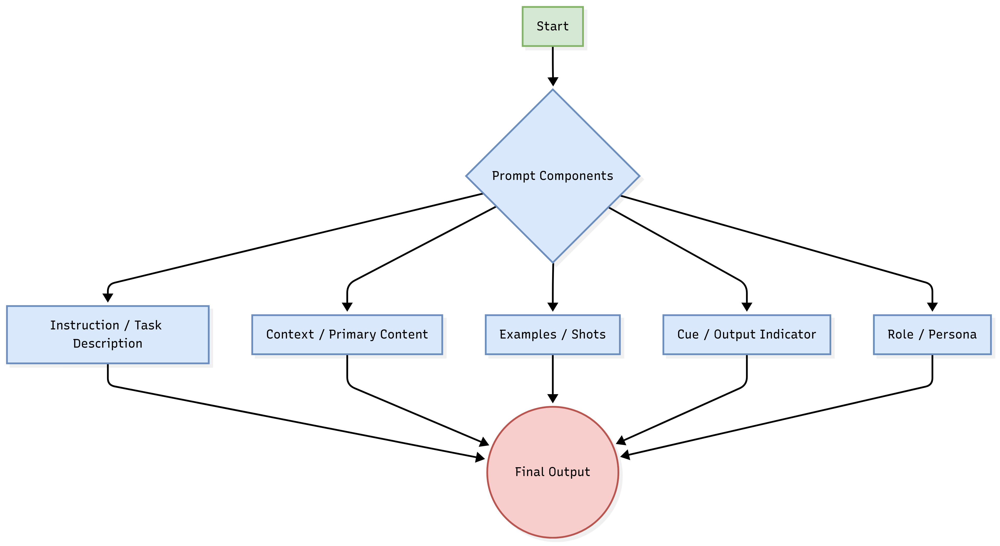

# Prompt Engineering

##

### **An Introduction to Human-AI Communication**

Prompt engineering is the art and science of crafting effective instructions (prompts) to guide Large Language Models (LLMs) toward a desired outcome. While anyone can write a prompt, creating one that consistently produces accurate, relevant, and reliable results requires skill and understanding. Think of it as a form of **human-AI communication**; the clearer and more precise your instructions, the better the AI can understand and execute your intent.

At their core, LLMs are sophisticated prediction engines. They take a sequence of text as input and predict the next most likely sequence of words based on the patterns learned from their vast training data. Your prompt temporarily "configures" the model's weights for a specific task, activating the desired "program" or capability within the model's latent space.

While this process can involve a lot of "fiddling," effective prompt engineering is a disciplined, iterative process that demands systematic experimentation, evaluation, and rigor, much like any other machine learning endeavor. It is a crucial skill for building modern AI applications, though it is important to remember that production-ready AI also requires a broader knowledge of machine learning principles, statistics, and software engineering.

This guide synthesizes best practices and advanced techniques, covering the essential components of a prompt, a wide array of prompting strategies, and the critical considerations for deploying prompt-based applications in production.

### **Section 1: Key Factors & Considerations**

Before writing a single line of a prompt, it's crucial to understand the environment and the parameters that influence the model's output. Effective prompt engineering goes beyond just the text of the prompt itself.

#### **Model Selection & Capability**

The first and most critical decision is choosing the right model for your task. Prompts must be optimized for the specific model and version you are using.

*   **Model Choice:** Different models have distinct strengths.
    *   **GPT Models (e.g., GPT-4, GPT-4o):** Known for their strong reasoning, instruction-following capabilities, and speed. They are versatile and often a good starting point.
    *   **Reasoning Models:** These models are designed to generate an internal chain of thought to excel at complex, multi-step planning tasks. They are often slower and more expensive but can be more powerful for intricate problems.
    *   **Specialized and Open-Source Models (e.g., Gemma, Llama, Claude):** These models may be optimized for specific tasks (like code generation) or offer more control and customization through fine-tuning.
*   **Instruction Following & Robustness:** A model's ability to adhere to instructions and its robustness to slight prompt perturbations (e.g., "5" vs. "five," capitalization changes) dictates the amount of engineering effort required. More powerful models tend to be more robust, requiring less "fiddling."

#### **LLM Output Configuration (Sampling Controls)**

LLMs work by predicting the probability of the next token. You can control the randomness and creativity of this process using several key parameters:

| Parameter | Description | Use Case |
| :--- | :--- | :--- |
| **Temperature** | Controls the degree of randomness. A value between 0 and 2. | **Low (e.g., 0.2):** For deterministic, factual tasks like extraction or summarization. A temperature of 0 is best for tasks with a single correct answer. **High (e.g., 0.9):** For creative tasks like writing a story or brainstorming ideas. |
| **Top-p (Nucleus Sampling)** | Selects from the smallest possible set of tokens whose cumulative probability exceeds a certain threshold (p). | A common alternative to Temperature. A high value like **0.95** allows for creativity while cutting off the long tail of improbable tokens. |
| **Top-k** | Selects the next token from the top 'k' most likely tokens. | Less commonly used than Temperature or Top-p. A low 'k' restricts the model's choices, while a high 'k' allows for more diversity. |
| **Max Output Tokens** | The maximum number of tokens the model can generate in its response. | Crucial for controlling cost, latency, and preventing overly verbose or runaway responses. |

**Best Practice:** It is generally recommended to adjust either Temperature or Top-p, but not both at the same time, to control the randomness of the model's output.

#### **Context Window and Efficiency**

The context window is the maximum number of tokens a model can consider when generating a response. This has been a rapidly expanding area, with models now supporting context windows of up to two million tokens.

*   **Limitations:** All models have a finite context window. Exceeding it will result in an error or truncation of the input.
*   **"Needle in a Haystack" (Lost in the Middle):** Research has shown that models tend to pay more attention to information at the very beginning and very end of the prompt. Critical instructions or data placed in the middle of a long context may be overlooked.
*   **Tokenization & Space Efficiency:** LLMs break words into "tokens." Be mindful that formatting (like excessive whitespace) and phrasing can impact token count and thus cost.

### **Section 2: The Anatomy of a Prompt**

A well-structured prompt typically consists of several components that work together to guide the model effectively.

*   **Instruction (Task Description):** A clear and specific directive telling the model what to do. This is the most crucial component.
*   **Context (Primary Content):** The information, data, or text that the model needs to work with. This is the "grounding" material for the task.
*   **Examples (Few-shot Learning):** One or more examples of the desired input/output format. This helps the model understand patterns and expectations through in-context learning.
*   **Cue (Output Indicator):** A word or phrase at the end of the prompt to "jumpstart" the model's response in the desired format (e.g., `JSON:`, `Summary:`).
*   **Role (Persona):** Assigning a persona to the model (e.g., "You are an expert copywriter," "Act as a helpful travel guide"). This helps define the tone, style, and perspective of the response.
*   **Supporting Content:** Additional information that can influence the output, such as the current date, user preferences, or a list of important topics.

#### **System, User, and Assistant Prompts**

Modern LLM APIs often structure prompts into distinct roles, which are then combined internally using a model-specific template.

*   **System Prompt:** Contains high-level instructions from the developer. It's used to define the model's persona, overall goals, and strict rules it must follow. A well-crafted system prompt can significantly improve performance and safety.
*   **User Prompt:** Contains the specific query or input from the end-user.
*   **Assistant Prompt:** Represents the model's previous responses in a conversation, which is essential for maintaining context in multi-turn dialogues and for providing few-shot examples in a chat format.

**Crucial Note on Chat Templates:** Different models use unique templates to format these roles into a single string for processing. For example, Llama 2 uses `<s>[INST] <<SYS>>...<</SYS>>...[/INST]`, while Llama 3 uses a different format with tokens like `<|begin_of_text|>`. **Using the wrong template for a model can severely degrade performance or cause unexpected behavior.** Always verify and use the correct template for your chosen model.

### **Section 3: Prompting Techniques & Strategies**

From simple queries to complex, multi-step reasoning, these techniques provide a toolbox for interacting with LLMs.

#### **Basic Prompting (In-Context Learning)**

*   **Zero-Shot Prompting:** The simplest form, where the model is given an instruction without any prior examples. This relies entirely on the model's pre-existing knowledge.
    > **Example:** "Classify the following movie review as positive, neutral, or negative: 'The film was a masterpiece of cinematic storytelling.'"
*   **One-Shot & Few-Shot Prompting:** Providing one or more examples ("shots") to guide the model's response format and style. This is a powerful form of in-context learning.
    > **Example (Few-Shot):**
    > **Review:** "I loved every minute of it." **Sentiment:** Positive
    > **Review:** "It was an okay movie, nothing special." **Sentiment:** Neutral
    > **Review:** "A complete waste of time." **Sentiment:** Negative
    > **Review:** "The acting was incredible, but the plot was slow." **Sentiment:**

#### **Advanced Reasoning Techniques**

These techniques are designed to improve performance on complex tasks that require logic, planning, and multi-step problem-solving.

*   **Chain-of-Thought (CoT) Prompting:** Instructing the model to "think step by step" and articulate its reasoning process before giving the final answer. This simple addition dramatically improves performance on arithmetic, commonsense, and symbolic reasoning tasks.
    > **Example:** "Q: Roger has 5 tennis balls. He buys 2 more cans of tennis balls. Each can has 3 tennis balls. How many tennis balls does he have now? A: Let's think step by step. Roger started with 5 balls. 2 cans of 3 balls each is 2 * 3 = 6 balls. So, 5 + 6 = 11 balls. The answer is 11."
*   **Self-Consistency:** An enhancement to CoT where the model generates multiple reasoning paths for the same problem (using a higher temperature) and then takes the majority vote on the final answer. This improves accuracy by exploring diverse perspectives.
*   **Tree of Thoughts (ToT):** Generalizes CoT by allowing the model to explore multiple reasoning paths in a tree-like structure. It can evaluate intermediate thoughts and backtrack if a path seems unpromising, making it well-suited for problems that require exploration or strategic planning.
*   **Step-Back Prompting:** A technique where the model is first prompted to consider a more general, high-level concept or principle related to the specific question. The answer to this "step-back" question is then used as context to answer the original, more specific query, activating broader knowledge.

#### **Augmented Language Models: Extending Capabilities**

These strategies connect the LLM to external systems, overcoming its limitations of static knowledge and lack of real-world interaction.

*   **Retrieval-Augmented Generation (RAG):** This powerful technique connects the LLM to an external knowledge base. When a user asks a question, the system first retrieves relevant information and provides it to the LLM as context within the prompt. This ensures answers are grounded in up-to-date, factual, or proprietary data, significantly reducing hallucinations.

*   **ReAct (Reason and Act):** This framework enables the LLM to interact with external tools (affordances) to gather information or perform actions. The model operates in a loop: it **reasons** about what it needs to do next, decides on an **action** (like a search query or an API call), and then **observes** the result from the tool to inform its next reasoning step.

#### **Other Key Strategies**
*   **Task Decomposition (Prompt Chaining):** Breaking down a complex task into a sequence of simpler subtasks, each handled by a dedicated prompt. This improves reliability, makes debugging easier, and allows for using different (and potentially cheaper) models for different sub-tasks.
*   **Automated Prompt Engineering (APE):** Using LLMs themselves to generate, critique, or refine prompts. Specialized tools like DSPy or Promptbreeder aim to automate the discovery of optimal prompts. While powerful, these tools can incur hidden API costs and should be used with careful oversight.

### **Section 4: Trade-offs in Prompt Engineering**

Every prompting decision involves balancing competing priorities.

| Factor | Description | Trade-offs |
| :--- | :--- | :--- |
| **Complexity vs. Performance** | More complex prompts (e.g., detailed CoT, Few-Shot with many examples) often lead to higher accuracy. | Increased complexity can be harder to maintain and may not be necessary for simpler tasks. |
| **Latency vs. Accuracy** | Techniques that require the model to "think more" (like CoT, Self-Consistency, ReAct) increase the time to first token and overall response time. | For real-time applications, lower latency from simpler prompts might be preferable, even at the cost of some accuracy. |
| **Cost vs. Reliability** | Longer prompts and more complex reasoning chains consume more tokens, leading to higher API costs. | While more expensive, techniques like RAG and CoT can significantly reduce the business cost of hallucinations and incorrect answers. |
| **Specificity vs. Generality** | Highly specific prompts are reliable for a narrow task but may fail on slight variations. | More general prompts can handle a wider range of inputs but might be less accurate. |

### **Section 5: Common Challenges, Pitfalls, and Defensive Prompting**

Deploying LLMs in the real world introduces significant challenges, particularly around security and reliability.

#### **Common Pitfalls**
*   **Ambiguity and Vague Instructions:** Prompts like "Summarize this" can lead to inconsistent results. Be specific: "Summarize this article in three concise bullet points."
*   **Model Hallucination:** Models can confidently invent facts. Grounding with RAG is the primary mitigation.
*   **Recency Bias ("Lost in the Middle"):** Models often give more weight to the beginning and end of a prompt. Critical instructions should be placed accordingly.
*   **JSON Repair:** Models can generate malformed or truncated JSON due to token limits. Use libraries like `json-repair` to handle these cases.

#### **Defensive Prompting: Securing Your Application**

Prompt attacks are a serious threat where malicious users manipulate your LLM to perform unintended actions. A layered defense is essential.

**Types of Attacks:**
*   **Prompt Injection:** A user's input contains hidden instructions that trick the model into ignoring its original purpose and following the attacker's commands. This is especially dangerous for applications connected to tools (indirect prompt injection).
*   **Jailbreaking:** Coaxing the model to bypass its safety filters and generate harmful content, often through role-playing scenarios (e.g., "DAN" - Do Anything Now).
*   **Prompt/Information Extraction:** Tricking the model into revealing its own system prompt or sensitive information from its training data or context.

**Defense Strategies:**
1.  **Model-Level Defense:** Fine-tuning the model to recognize and prioritize system-level instructions over user-provided instructions (Instruction Hierarchy).
2.  **Prompt-Level Defense:**
    *   **Instructional Defense:** Explicitly state what the model should *not* do.
    *   **Repetition:** Repeat key instructions at both the beginning and end of the prompt.
    *   **XML/Markdown Tagging:** Wrap user input in tags (e.g., `<user_input>...</user_input>`) and instruct the model to only process content within those tags.
3.  **System-Level Defense (Guardrails):**
    *   **Input/Output Filtering:** Use an external model or keyword list to scan for malicious patterns or sensitive information.
    *   **Isolation:** Execute any code generated by the model in a sandboxed environment.
    *   **Human-in-the-Loop:** Require human approval for any high-stakes actions (e.g., database writes, sending emails).

### **Section 6: Best Practices & Production Insights**

Moving from experimentation to a production-grade system requires discipline and structure.

*   **Be Specific and Clear:** Avoid ambiguity. Use simple, direct language. Start instructions with action verbs.
*   **Provide an "Out":** Instruct the model on what to do if it cannot complete a task (e.g., "If the answer is not in the provided text, respond with 'Information not found.'").
*   **Break Down Complex Tasks:** Chain multiple simpler prompts instead of using one monolithic prompt.
*   **Iterate and Document:** Prompt engineering is an iterative process. Document every prompt attempt in a structured format, tracking the prompt, model, parameters, output, and a quality rating.
*   **Version Control Your Prompts:** Treat prompts like code. Store them in version control (like Git) and separate them from your application logic. Consider using a versioned **prompt catalog** for managing prompts across applications.
*   **Automate Evaluation:** Create a standardized evaluation set ("eval") of input-output pairs to measure the performance of different prompts automatically and pin production applications to specific model snapshots for consistency.

### **Section 7: Key Questions for a Lead GenAI/ML Engineer**

Leading a team requires asking the right strategic questions to ensure projects are robust, scalable, and aligned with business goals.

1.  **Prompt Management & Governance:**
    *   How are we versioning, storing, and deploying our prompts? Are they treated as first-class citizens like code?
    *   What is our process for evaluating prompt performance, and do we have a standardized evaluation set for regression testing?
    *   How do we facilitate collaboration on prompts between engineers and non-technical domain experts?

2.  **Performance & Cost:**
    *   What are the latency and cost implications of our chosen prompting strategies? Have we benchmarked alternatives?
    *   Are we using the most cost-effective model for each sub-task in our workflow?
    *   How does our system's performance degrade as the context gets longer?

3.  **Security & Reliability:**
    *   What is our multi-layered defense strategy against prompt injection attacks?
    *   How are we mitigating model hallucinations? Is RAG being used for all knowledge-intensive tasks?
    *   What guardrails are in place to filter inputs and outputs, especially when the model is connected to external tools or APIs?

4.  **Strategy & Scalability:**
    *   How will our prompts and systems adapt to new model releases? What is our process for re-evaluating and migrating?
    *   Are we breaking down complex problems into manageable steps, or are we relying on a single, monolithic prompt that is hard to debug and maintain?
    *   What is the business impact and ROI of our GenAI features, and how do we measure it against key metrics?