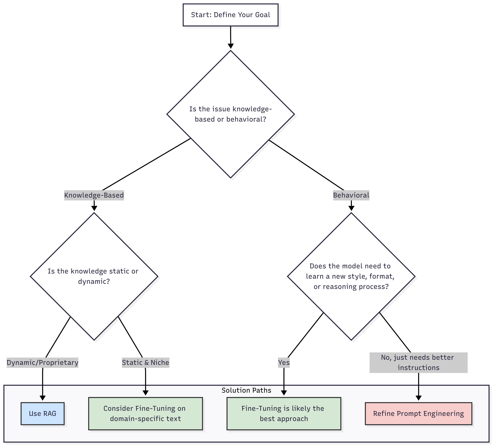
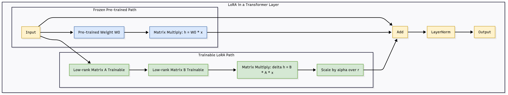
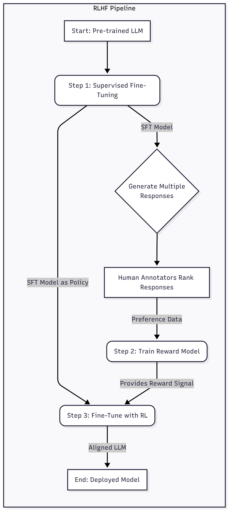

# Fine-Tuning

## 1. Introduction: Why Fine-Tune an LLM?

Large Language Models (LLMs) have demonstrated remarkable capabilities in understanding and generating human-like text. Pre-trained on vast amounts of data from the internet, these models, often called foundation models, possess a broad understanding of language, grammar, and general world knowledge. However, to unlock their full potential for specific, nuanced tasks, a crucial step is often required: **fine-tuning**.

Fine-tuning is the process of taking a pre-trained LLM and further training it on a smaller, task-specific dataset. This process adapts the model's parameters to excel in a particular domain or application, transforming a generalist model into a specialized expert. Think of it as hiring an experienced professional and then providing them with company-specific training; they already have the foundational skills, and you're just adding the specialized knowledge they need to excel in their new role.

### When to Consider Fine-Tuning

While powerful, fine-tuning is not always the first or best solution. A pragmatic approach to leveraging LLMs often involves a tiered strategy:

1.  **Start with Prompt Engineering:** Before diving into the complexities of fine-tuning, explore what can be achieved with well-crafted prompts. Techniques like few-shot learning, where you provide a few examples of the desired input and output in the prompt, can often yield surprisingly good results with minimal effort.
2.  **Incorporate Retrieval-Augmented Generation (RAG):** If your model's failures stem from a lack of specific, up-to-date, or proprietary information, RAG is an excellent next step. RAG connects the LLM to external knowledge bases, allowing it to retrieve relevant information in real-time to inform its responses. This is particularly useful for tasks requiring current information, as fine-tuned models are limited to the static data they were trained on.
3.  **Opt for Fine-Tuning for Behavioral Adaptation:** If the model's shortcomings are behavioral—for instance, it struggles with a specific format, tone, or complex reasoning style—then fine-tuning becomes a compelling option. Fine-tuning is superior for teaching the model *how* to behave, rather than *what* it knows.

Here's a decision-making framework to help you choose the right path:

## 2. The Spectrum of Fine-Tuning: From Full Updates to surgical precision

Fine-tuning isn't a monolithic concept; it encompasses a range of techniques, each with its own trade-offs in terms of performance, cost, and complexity. These methods can be broadly categorized into two main camps: full fine-tuning and parameter-efficient fine-tuning (PEFT).

### 2.1. Full Fine-Tuning (SFT)

Supervised Fine-Tuning (SFT) is the most traditional and straightforward approach. It involves updating all the weights of a pre-trained model on a labeled, task-specific dataset.

*   **How it works:** You provide the model with input-output pairs (e.g., a question and its correct answer, a sentiment and its classification). The model's predictions are compared to the ground-truth labels, and the error is used to adjust all of its parameters through backpropagation.
*   **Advantages:**
    *   **High Performance:** Can achieve the highest accuracy for a specific task, as the entire model is optimized for it.
    *   **Maximum Flexibility:** Gives the model the most freedom to adapt its core knowledge and capabilities.
*   **Disadvantages:**
    *   **Resource Intensive:** Requires significant computational power, high-end GPUs, and large amounts of memory and storage.
    *   **Costly and Time-Consuming:** Training all parameters is a slow and expensive process.
    *   **Catastrophic Forgetting:** The model may "forget" some of its general capabilities while specializing in the new task.
    *   **Deployment Challenges:** Storing and deploying a full copy of the model for each new task is inefficient and can create a significant I/O bottleneck.

### 2.2. Parameter-Efficient Fine-Tuning (PEFT)

PEFT methods have emerged as a more resource-friendly alternative, addressing many of the drawbacks of full fine-tuning. The core idea is to freeze the vast majority of the pre-trained model's parameters and only update a small, strategically chosen subset. This allows for significant reductions in computational and storage costs while often achieving performance comparable to full fine-tuning.

Here's a table comparing the key characteristics of Full Fine-Tuning and PEFT:

| Feature | Full Fine-Tuning | Parameter-Efficient Fine-Tuning (PEFT) |
| --- | --- | --- |
| **Parameters Trained** | All model parameters | A small subset (typically <1%) |
| **Computational Cost** | Very high | Low |
| **GPU Memory Required** | Very high | Low |
| **Storage per Task** | Full model size | Small adapter/prompt weights |
| **Risk of Forgetting** | High | Low |
| **Inference Latency** | None (weights are self-contained) | May have slight latency (can often be merged) |
| **Best For** | High-accuracy, domain-specific needs with ample resources | Resource-constrained environments, multi-task deployment, rapid experimentation |

## 3. A Deeper Dive into PEFT Techniques

The world of PEFT is rich and varied, with several innovative techniques gaining prominence. These can be broadly grouped into adapter-based methods and soft prompt-based methods.

### 3.1. Adapter-Based Methods

These methods involve injecting small, trainable neural network modules, known as "adapters," into the architecture of the pre-trained model. The original model weights remain frozen, and only the adapter parameters are trained.

#### 3.1.1. Traditional Adapters

This technique inserts small, dense, bottleneck-style layers after the attention and feed-forward layers in each block of the Transformer architecture. While effective, this can introduce a slight increase in inference latency because the additional layers must be processed sequentially.

#### 3.1.2. Low-Rank Adaptation (LoRA)

LoRA has become one of the most popular and effective PEFT techniques. Instead of adding new layers, LoRA works on the principle that the change in weights during fine-tuning (ΔW) has a low "intrinsic rank." This means the weight update can be approximated by decomposing it into two much smaller, low-rank matrices (A and B).

*   **How it works:** During training, only the low-rank matrices A and B are updated, dramatically reducing the number of trainable parameters. After training, the product of these matrices (B\*A) can be merged back into the original weight matrix (W' = W + B\*A), meaning there is **no additional inference latency**.
*   **Key Hyperparameters:**
    *   **Rank (r):** This determines the size of the low-rank matrices. A smaller `r` means fewer parameters but less expressive power. Typical values range from 4 to 64.
    *   **Alpha (α):** A scaling factor that controls the magnitude of the LoRA update. A common heuristic is to set α to be twice the value of `r`.
*   **Why it works:** The hypothesis is that pre-trained models exist in a low intrinsic dimension. The updates needed for adaptation also lie in a low-rank subspace, which LoRA efficiently captures.

#### 3.1.3. Quantized Low-Rank Adaptation (QLoRA)

QLoRA is an even more memory-efficient extension of LoRA. It allows for the fine-tuning of massive models on a single GPU by introducing several key innovations:

*   **4-bit NormalFloat (NF4):** A new, information-theoretically optimal data type for quantizing the frozen, pre-trained weights to 4-bit precision. This drastically reduces the memory footprint of the base model.
*   **Double Quantization:** A technique that quantizes the quantization constants themselves, saving even more memory.
*   **Paged Optimizers:** Uses NVIDIA's unified memory to prevent out-of-memory errors during gradient checkpointing, which can cause memory spikes.

In essence, QLoRA loads the base model with quantized 4-bit weights, attaches the LoRA adapters (which are trained in 16-bit precision), and then dequantizes the necessary weights on the fly during the forward and backward passes. This results in significant memory savings at the cost of slightly increased training time.

### 3.2. Soft Prompt-Based Methods

Instead of adding modules to the model's architecture, these methods modify how the model processes the input by introducing special trainable tokens, often called "soft prompts."

#### 3.2.1. Prompt Tuning

This technique prepends a sequence of trainable "soft prompt" tokens to the embedded input. The model's original parameters are frozen, and only these soft prompt tokens are updated during training. It's a very lightweight method but can sometimes be less powerful than adapter-based approaches.

#### 3.2.2. Prefix Tuning

Similar to prompt tuning, prefix tuning also adds trainable tokens. However, it prepends these tokens not just to the input layer but to every layer of the Transformer model. This gives the model more fine-grained control over its behavior at each processing step.

Here is a summary of the most prominent PEFT techniques:

| PEFT Method | How it Works | Key Advantages | Key Disadvantages |
| --- | --- | --- | --- |
| **Adapters** | Inserts small, trainable layers into the model. | Good performance, well-established. | Can add inference latency. |
| **LoRA** | Injects trainable low-rank matrices parallel to existing weights. | No inference latency after merging, very parameter-efficient. | Performance can be sensitive to `r` and `α`. |
| **QLoRA** | LoRA combined with 4-bit quantization of the base model. | Extremely memory-efficient, allows fine-tuning huge models on single GPUs. | Slower training time due to quantization/dequantization. |
| **Prompt Tuning** | Adds trainable "soft prompt" tokens to the input layer. | Very few trainable parameters, simple concept. | May be less powerful than other methods. |
| **Prefix Tuning** | Adds trainable "prefix" tokens to every model layer. | More expressive than prompt tuning. | Can be more complex to implement and tune. |

## 4. Aligning LLMs with Human Preferences

Beyond adapting an LLM for a specific domain, a critical aspect of fine-tuning is **alignment**: ensuring the model's outputs are helpful, harmless, and aligned with human values and preferences. This is typically a multi-step process that builds upon initial supervised fine-tuning.

### 4.1. Supervised Fine-Tuning (SFT) for Alignment

The first step in the alignment process is often a round of SFT on a high-quality, curated dataset of instruction-response pairs. This dataset contains examples of the model behaving as desired (e.g., following instructions correctly, providing helpful explanations). SFT helps the model learn the general format and style of a helpful assistant.

### 4.2. Reinforcement Learning from Human Feedback (RLHF)

RLHF is a more advanced technique that uses human preferences to further refine the model. It's a complex but powerful process that was instrumental in the development of models like ChatGPT.

The RLHF process typically involves three steps:

1.  **SFT Model:** Start with a model that has been instruction-tuned via SFT.
2.  **Train a Reward Model:** Use the SFT model to generate multiple responses to a set of prompts. Human labelers then rank these responses from best to worst. This preference data is used to train a separate "reward model" that learns to predict which responses humans will prefer.
3.  **Fine-Tune with Reinforcement Learning:** The SFT model is then fine-tuned using a reinforcement learning algorithm (like Proximal Policy Optimization - PPO). The reward model provides the "reward" signal, guiding the LLM to generate outputs that will receive a higher score, thus aligning it more closely with human preferences.

### 4.3. Direct Preference Optimization (DPO)

While powerful, RLHF is complex, unstable, and computationally expensive. Direct Preference Optimization (DPO) has emerged as a simpler, more stable, and often more effective alternative.

DPO bypasses the need for a separate reward model and reinforcement learning. It reframes the alignment problem as a direct classification task on the human preference data. The core insight is that the language model itself can be used to implicitly define the reward function.

DPO directly optimizes the language model to assign a higher probability to preferred responses and a lower probability to dispreferred ones, using a single-stage, supervised learning process. This makes the alignment process simpler, faster, and more accessible. Models like Zephyr-7B, Llama 3, and Phi-3 have successfully used DPO for alignment.

## 5. Synthetic Data in Fine-Tuning

A significant challenge in fine-tuning is the need for high-quality, task-specific data, which can be expensive and time-consuming to create. A growing trend is the use of **synthetic data**—data generated by another, more powerful LLM (a "teacher" model) instead of by humans.

There are two primary approaches to generating synthetic data:

1.  **Distillation:** This involves using a stronger model (e-g., GPT-4) to generate instruction-response pairs, explanations, or preference data. A smaller "student" model is then fine-tuned on this synthetic data. This is a powerful way to transfer the capabilities and reasoning skills of a large, proprietary model to a smaller, open-source one. Models like Orca and Vicuna were trained using this method.
2.  **Self-Improvement:** In this approach, a model learns from its own outputs. This can involve an iterative loop where the model generates responses, evaluates them (either with a reward model or by checking against verifiable criteria like in coding or math problems), and then fine-tunes itself on the high-quality generations. This avoids reliance on external models but is limited by the model's initial capabilities.

**Constitutional AI**, developed by Anthropic, is a fascinating example of self-improvement for harmlessness. The model critiques and revises its own responses based on a set of principles (a "constitution"), generating synthetic preference data that is then used for preference-tuning.

## 6. Practical Guide to Fine-Tuning an LLM

Here’s a step-by-step workflow for approaching an LLM fine-tuning project:

1.  **Define the Task and Choose a Base Model:** Clearly identify your goal. Are you adapting the model for a specific domain (e.g., medical, legal), or a specific task (e.g., summarization, code generation)? Select a pre-trained base model that is well-suited for your task. Factors to consider include model size, architecture, and licensing.

2.  **Prepare Your Dataset:** This is one of the most critical steps. Ensure your data is high-quality, clean, and representative of the task. For SFT, structure your data into instruction-response pairs. The quality and diversity of your data will have a huge impact on the final model's performance.

3.  **Set Up Your Environment:** Fine-tuning requires a robust environment, typically with access to GPUs. Set up the necessary libraries like PyTorch, Transformers from Hugging Face, and PEFT.

4.  **Choose a Fine-Tuning Strategy:**
    *   **Start with PEFT, specifically QLoRA,** if you have limited resources. It offers the best balance of performance and efficiency.
    *   Consider **full fine-tuning** only if PEFT methods don't meet your performance targets and you have the necessary computational budget.

5.  **Configure Hyperparameters:**
    *   **Learning Rate:** This is a crucial hyperparameter. Start with a small learning rate (e.g., 3e-4 for LoRA).
    *   **Batch Size:** Use the largest batch size that fits into your GPU memory. Gradient accumulation can be used to simulate a larger batch size.
    *   **Epochs/Iterations:** For instruction fine-tuning, iterating over the dataset more than once can sometimes degrade performance due to overfitting. It's often best to train for a single epoch.
    *   **LoRA `r` and `α`:** If using LoRA, experiment with different values for rank (`r`) and alpha (`α`). A good starting point is `r=8` and `α=16`, or `r=16` and `α=32`. Applying LoRA to all linear layers often yields the best results.

6.  **Train and Validate:** Run the training process while monitoring performance on a validation set to prevent overfitting.

7.  **Evaluate Model Performance:** After training, rigorously evaluate your model on an independent test set. Use a combination of automated metrics and human evaluation to get a holistic view of its performance.

By following this guide, you can navigate the complex but rewarding world of LLM fine-tuning, creating specialized models that are powerful, efficient, and tailored to your unique needs.