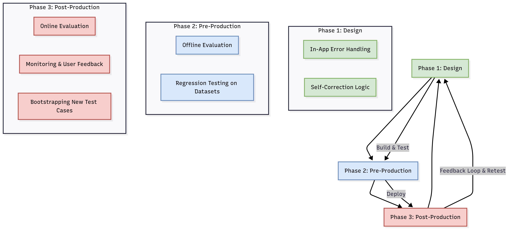
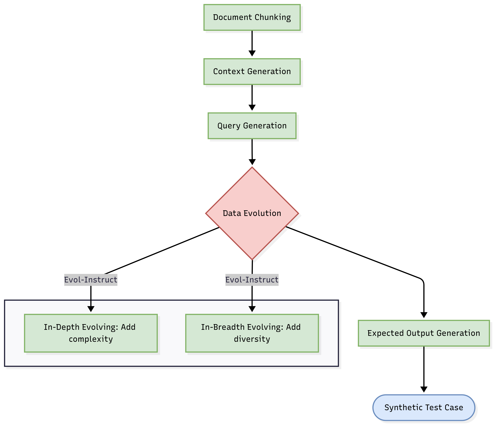
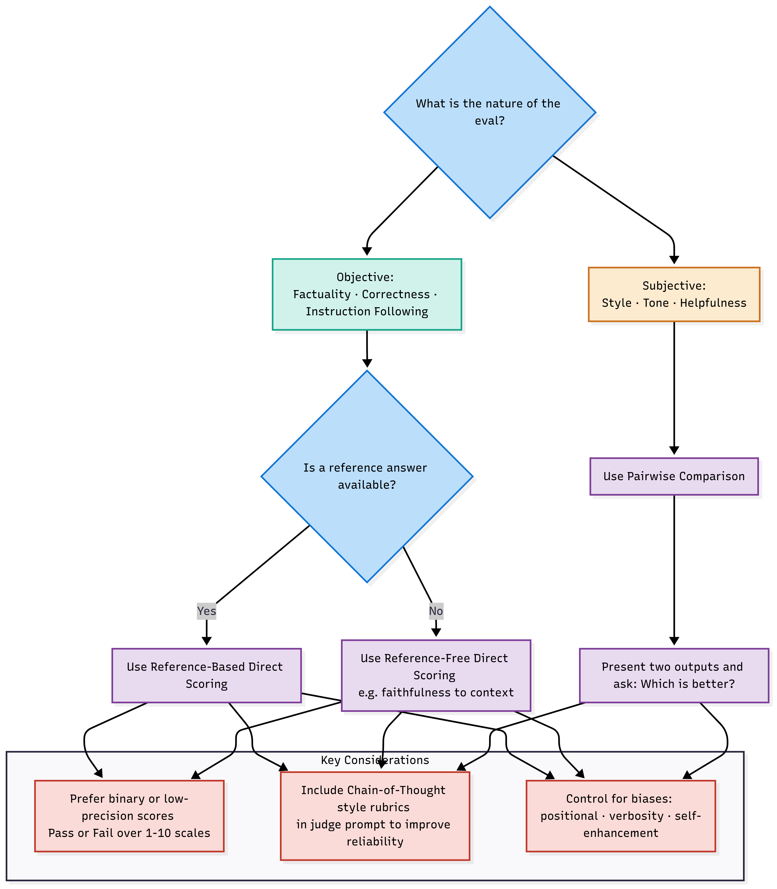

# Evaluating GenAI Applications

## Introduction: Why Traditional Testing Isn't Enough

Large Language Models (LLMs) have introduced a paradigm shift in application development. Unlike traditional software with deterministic logic, LLM-based systems are non-deterministic, generating a distribution of possible outcomes from a single input. They ingest arbitrary text, can hallucinate, and output nuanced natural language, making conventional testing methods like simple pass/fail unit tests insufficient.

The most common root cause of unsuccessful LLM products is a **failure to create robust evaluation systems**. Effective evaluation, or "evals," is the flywheel for rapid iteration. It allows you to systematically measure performance, debug issues, and confidently ship improvements. This guide provides a comprehensive framework for evaluating your LLM systems, from initial design through to production monitoring.

---

## Part 1: Foundational Concepts

Before diving into specific techniques, it's crucial to understand the core concepts that underpin all GenAI evaluation.

### LLM vs. LLM System Evaluation

A common point of confusion is the difference between evaluating an LLM and an LLM *system*.

*   **LLM Evaluation** focuses on the raw performance of a foundational model (e.g., GPT-4, Llama 3) on standardized academic benchmarks like MMLU, HellaSwag, or TruthfulQA. These evals measure macro performance across a wide array of general tasks.
*   **LLM System Evaluation** is the practical, use-case-specific assessment of your entire application. This includes not just the LLM, but all the components you control: prompts, Retrieval Augmented Generation (RAG) pipelines, agentic tools, context data, and more. Your goal isn't to prove a model's general intelligence, but to ensure your *application* reliably accomplishes its specific task.

This distinction is critical. A model's high score on a public leaderboard does not guarantee its performance in your RAG-based chatbot. You must build custom benchmarks for your specific system.

### The Evaluation Flywheel: A Lifecycle Approach

Effective evaluation is not a one-off task but a continuous cycle that spans the entire application lifecycle. This can be broken down into three distinct phases.

*   **Design Phase:** Building fast, simple checks directly into your application's logic to enable self-correction at runtime.
*   **Pre-Production Phase:** Running offline batch evaluations on curated datasets to benchmark performance, catch regressions, and validate changes before deployment.
*   **Post-Production Phase:** Implementing online evaluation and monitoring on live traffic to catch real-world failures, gather user feedback, and identify new edge cases to add to your pre-production datasets (a process called *bootstrapping*).

### Categories of Evaluation Methods

Evaluation methods fall into two broad categories, each with its own trade-offs.

| Method | Description | Pros | Cons |
| :--- | :--- | :--- | :--- |
| **Human Evaluation** | Humans manually score or compare LLM outputs based on a set of criteria. | **Gold Standard:** Best for nuanced, subjective tasks. Helps define and refine evaluation criteria. | Expensive, slow, not scalable, can be inconsistent. |
| **Automated Evaluation** | Uses algorithms or other models to score outputs. | Fast, cheap, scalable, reproducible. Essential for CI/CD. | May not capture nuance, requires careful validation against human judgment. |

Automated evaluation can be further broken down:
*   **Code-Based / Heuristic Evals:** Use hard-coded rules, assertions, or traditional NLP metrics (e.g., checking for valid JSON, measuring keyword overlap with ROUGE, or calculating Levenshtein distance). They are fast and cheap but are often too rigid for evaluating natural language.
*   **LLM-as-a-Judge:** Uses a powerful LLM (the "judge") to evaluate the output of another LLM based on a given prompt and criteria. This is the most promising and flexible method for automating nuanced evaluations.

---

## Part 2: The Evaluation Lifecycle in Practice

### Phase 1: Design (In-App, Real-time Correction)

During the design phase, you can build self-healing capabilities into your application. This involves adding simple, fast-running tests (assertions) into the application's control flow, often orchestrated by a framework like LangGraph. If a test fails, the error is fed back to the LLM for an automatic correction attempt.

**Key Principles:**
*   **Simplicity and Speed:** Use cheap, hard-coded assertions (e.g., schema checks, import validation) that can run at runtime without significant latency.
*   **Targeted Checks:** Focus on common, predictable failure modes.

**Examples:**
1.  **Self-Corrective Code Generation:**
    *   **Generate Code Node:** LLM generates code.
    *   **Import Check Node:** Run a simple assertion to verify all imported libraries exist. If it fails, loop back to the generation node with the error message.
    *   **Execution Check Node:** Execute the code. If it throws a syntax error, loop back with the traceback.
2.  **Self-Corrective RAG:**
    *   **Retrieve Node:** Fetch documents.
    *   **Grade Relevance Node (LLM-as-Judge):** An LLM judge quickly checks if the retrieved documents are relevant to the query. If not, trigger a web search or inform the user.
    *   **Generate Node:** Generate an answer based on relevant documents.
    *   **Grade Hallucination Node (LLM-as-Judge):** Check if the generated answer is grounded in the retrieved documents. If not, loop back to regenerate.

### Phase 2: Pre-Production (Offline Evaluation & Regression Testing)

This is the most critical phase for ensuring quality before release. It involves running your LLM system against a standardized dataset and scoring it on predefined metrics.

#### Step 1: Build Your Evaluation Dataset

Gathering good data is often the hardest part of testing. You don't need millions of examples; often **50-100 high-quality, diverse examples** are enough to start.

| Data Source | Description | Best For |
| :--- | :--- | :--- |
| **Manually Curated** | Hand-written examples by domain experts covering key features, scenarios, and user personas. | Starting a new project, testing specific edge cases. |
| **Application Logs** | Real user interactions sampled from production traffic (if available). | Ensuring realism, catching common user behaviors. |
| **Synthetic Data** | Artificially generated examples created by an LLM to expand coverage. | Augmenting datasets when real data is scarce, creating challenging scenarios. |

**Generating High-Quality Synthetic Data:**
Synthetic data isn't just about prompting an LLM for "more examples." A robust process, as detailed by Confident AI, involves several steps to create diverse and complex test cases.

1.  **Document Chunking:** Break down your knowledge base into manageable, semantically meaningful chunks.
2.  **Context Generation:** Select a chunk and find other semantically similar chunks to form a rich `context`.
3.  **Query Generation:** Use an LLM to generate a relevant user `input` (query) based on the `context`.
4.  **Data Evolution (Evol-Instruct):** Iteratively rewrite the generated query to make it more complex, nuanced, or diverse (e.g., add constraints, request multi-step reasoning, introduce hypothetical scenarios).
5.  **Expected Output Generation:** Use an LLM to generate the ideal `expected_output` for the evolved query based *only* on the original `context`.

#### Step 2: Define Evaluation Criteria & Metrics

Your evaluation metrics are the quantifiable measures of your system's performance. For LLM systems, especially RAG, metrics can be divided into assessing the **retrieval** and **generation** components.

**Core Metrics for RAG Systems:**

| Component | Metric | Question It Answers |
| :--- | :--- | :--- |
| **Retrieval** | **Contextual Precision** | Of the documents retrieved, how many are actually relevant? (Penalizes noise) |
| **Retrieval** | **Contextual Recall** | Did we retrieve ALL the necessary documents to answer the question? (Penalizes missing info) |
| **Retrieval** | **Contextual Relevancy** | How relevant is the retrieved context *overall* to the user's query? |
| **Generation** | **Faithfulness** | Is the answer factually consistent with and grounded in the retrieved context? (Anti-hallucination) |
| **Generation** | **Answer Relevancy** | Does the answer directly and comprehensively address the user's question? |
| **Generation** | **Answer Correctness** | Is the answer semantically similar and factually aligned with a ground-truth `expected_output`? |

**Note on Traditional Metrics:** Metrics like **BLEU** (precision-focused) and **ROUGE** (recall-focused) measure n-gram overlap. They are fast but often correlate poorly with human judgment because they miss semantic meaning. Use them with caution, primarily for tasks where lexical overlap is a good proxy for quality.

#### Step 3: Run Tests and Catch Regressions

With your dataset and metrics, you can now benchmark your system. Regression testing involves running these benchmarks every time you make a change (e.g., update a prompt, switch a model) to ensure performance doesn't degrade. This is perfectly suited for automation in a **CI/CD pipeline**.

**Best Practices for LLM Testing in CI/CD:**
*   **Isolate Datasets:** Run a small, critical subset of tests on every commit, and reserve the full dataset for major changes or nightly runs to balance cost and speed.
*   **Use Caching:** Cache LLM calls for unchanged inputs to dramatically reduce costs and speed up test runs.
*   **Plan for Flakiness:** LLM-as-a-Judge evals can be "flakey." Have a process for human review of failed tests to avoid blocking merges unnecessarily.

### Phase 3: Post-Production (Online Evaluation & Monitoring)

Once your application is live, evaluation shifts to monitoring real-world performance. This is crucial because your pre-production dataset will never cover every possible user interaction.

**Key Activities:**
1.  **Setup Tracing:** Log the entire lifecycle of a request—user input, retrieval steps, tool calls, final output. This is invaluable for debugging.
2.  **Collect User Feedback:**
    *   **Explicit:** Add thumbs up/down buttons or feedback forms.
    *   **Implicit:** Monitor user behavior like copy-pasting the answer (positive signal) or immediately rephrasing their query (negative signal).
3.  **Run Online, Reference-Free Evals:** Since there's no `expected_output` for live traffic, use reference-free metrics (often LLM-as-a-Judge) to score production outputs for qualities like:
    *   Faithfulness (is the answer grounded in the retrieved context?)
    *   Toxicity or Bias
    *   Answer Relevancy
4.  **Bootstrapping:** Analyze the failures and poor-quality outputs identified in production. Curate them into new, challenging test cases and add them back to your pre-production dataset. This makes your regression suite more robust over time.

---

## Part 3: A Deep Dive into LLM-as-a-Judge

LLM-as-a-Judge is the most powerful tool for automating nuanced evaluation, but it's also the most complex to get right. Simply asking GPT-4 to "rate this response from 1-10" often leads to inconsistent, unhelpful results. Hamel Husain's **"Critique Shadowing"** provides a robust, iterative process for building a reliable judge.

**The Critique Shadowing Process:**
1.  **Find the Principal Domain Expert:** Identify the single person (e.g., lead lawyer for a legal AI, head of support for a chatbot) whose judgment is the standard of truth. Don't rely on a committee.
2.  **Elicit Pass/Fail Judgments with Critiques:** Give the expert a diverse set of 30-50 examples. For each, ask for two things:
    *   A simple **Pass/Fail** judgment. This forces clarity on what truly matters.
    *   A detailed **critique** explaining the reasoning behind the judgment.
3.  **Iteratively Build the Judge Prompt:** Use the expert's pass/fail examples and critiques as high-quality, few-shot examples in your judge's prompt.
4.  **Align the Judge with the Expert:** Run the LLM judge on the same examples and compare its judgments to the expert's. Track the agreement rate. Iterate on the prompt (by refining instructions or adding better examples) until you reach >90% agreement.
5.  **Perform Error Analysis:** Once aligned, use your judge to score a larger dataset. Analyze the failures. Are they concentrated in a specific feature, scenario, or user persona? This tells you where to focus your development efforts.

### LLM-as-a-Judge: Best Practices & Decision Framework

**Key Takeaways for LLM-as-a-Judge:**
*   **Binary is Better:** Start with **Pass/Fail** judgments. They are less ambiguous and more actionable than a 1-10 scale. What's the real difference between a 3 and a 4? No one knows.
*   **Pairwise for Subjectivity:** For subjective criteria like writing style or helpfulness, it's easier and more reliable for both humans and LLMs to compare two outputs (**Pairwise Evaluation**) than to score one in isolation (**Direct Scoring**).
*   **Control for Biases:** LLM judges are prone to biases. Mitigate **positional bias** by running evaluations twice, swapping the order of responses. Be aware of **verbosity bias** (favoring longer answers) and **self-enhancement bias** (an LLM favoring its own output).
*   **Use Strong Judges:** Use the most powerful model you can afford as the judge (e.g., GPT-4o, Claude 3 Opus), even if your application uses a cheaper model. You can often save costs by using a cheaper model (like GPT-3.5) once you provide it with high-quality, few-shot examples derived from the stronger model's reasoning.

---

## Part 4: Tools and Frameworks

Several open-source and managed platforms have emerged to streamline the evaluation process.

| Tool/Framework | Primary Focus | Key Features |
| :--- | :--- | :--- |
| **LangSmith** | Unified platform for tracing, debugging, and evaluation. | Tracing, annotation queues, dataset management, regression testing, online evaluators. |
| **DeepEval** | Open-source LLM testing and evaluation framework. | Pre-built metrics (G-Eval, Summarization), Pytest integration, synthetic data generation. |
| **RAGAS** | Specialized open-source framework for evaluating RAG pipelines. | Metrics for retrieval (Context Precision/Recall) and generation (Faithfulness). |
| **Arize Phoenix** | Open-source library for LLM evaluation and observability. | LLM and code-based evaluators, experiment tracking, CI/CD integration. |
| **TruLens** | Open-source library for evaluating and tracking LLM apps. | Tracing, feedback functions, leaderboard comparisons. |
| **Azure AI Studio / Vertex AI** | Managed cloud services for the entire MLOps lifecycle. | Integrated model evaluation jobs, prompt flow, monitoring. |

---

## Conclusion: Setting a Risk-Adjusted Bar

Perfect evaluation is impossible. As Eugene Yan points out, even with advanced RAG and prompting, a baseline hallucination rate of 5-10% is common, and getting below 2% is prohibitively difficult. The goal is not to eliminate all risk but to manage it effectively.

Calibrate your evaluation bar to the level of risk associated with your application:
*   **High-Stakes:** A customer-facing medical or financial chatbot requires an extremely high bar for factual accuracy and safety.
*   **Low-Stakes:** An internal document summarization tool can tolerate a higher error rate, as the outputs are reviewed by employees.

Don't let the pursuit of perfection lead to paralysis. The key is to **start small, set realistic criteria, collect feedback, and iterate frequently**. By implementing the robust, lifecycle-based evaluation framework outlined in this guide, you can move from subjective "vibe checks" to a systematic process that drives continuous improvement and allows you to build and deploy GenAI applications with confidence.