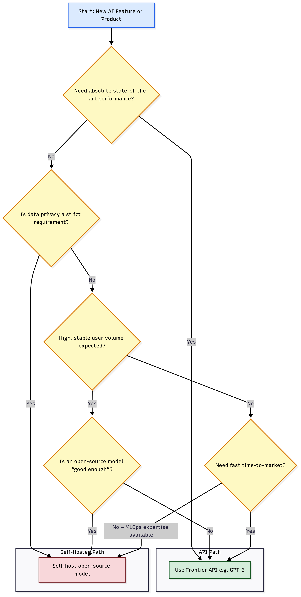
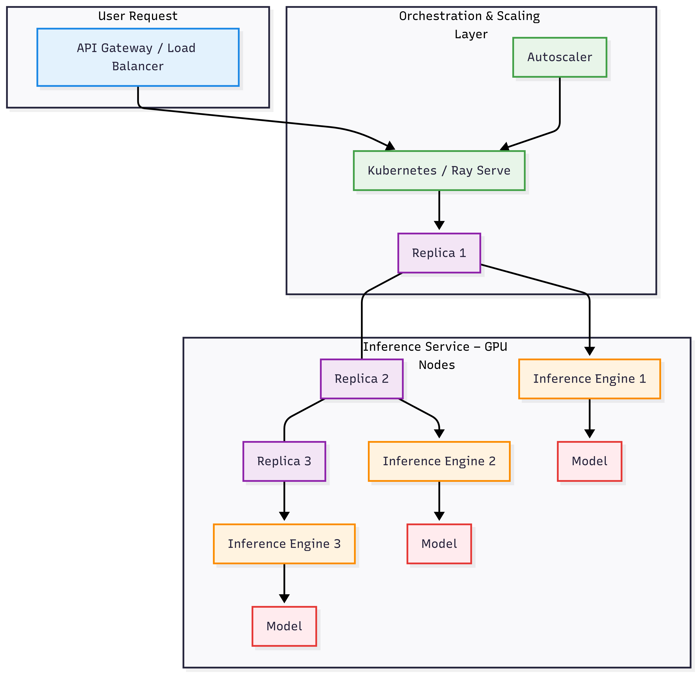
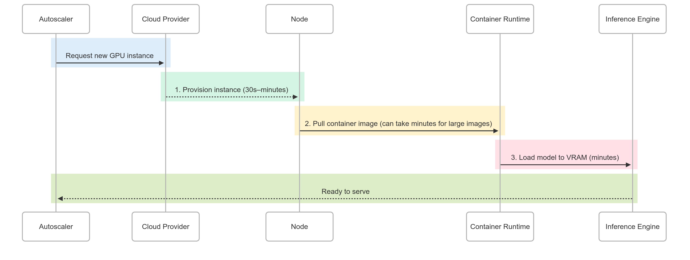

# Deployment and Serving

## Introduction: From Prototype to Production

Large Language Models (LLMs) have evolved from research curiosities to foundational components of modern software. However, the journey from a working model in a notebook to a scalable, cost-effective, and reliable production service is fraught with technical and financial challenges. This guide provides a comprehensive framework for technical leaders, architects, and engineers to navigate the complexities of LLM deployment. We will explore the core strategic decision between using third-party APIs and self-hosting, dissect the fundamental principles of inference performance, model costs at scale, and provide a deep dive into the modern serving stack and its optimization techniques.

---

## Part 1: The Core Strategic Decision: API vs. Self-Hosting

The first and most critical decision is whether to use a managed LLM via an API (like OpenAI's GPT series or Anthropic's Claude) or to self-host an open-source model (like Llama 3 or Mistral) on your own infrastructure. This is not a simple "build vs. buy" question but a complex trade-off across several strategic vectors.

### Decision-Making Framework

To make an informed choice, evaluate your project's needs against these six critical factors:

| Vector | API-Based Solution (e.g., OpenAI, Anthropic) | Self-Hosted Solution (Open-Source Models) |
| :--- | :--- | :--- |
| **Total Cost of Ownership (TCO)** | **Predictable OpEx:** Pay-per-token model. Scales linearly with usage. No upfront hardware costs, but can become prohibitively expensive at high scale. | **High CapEx/Fixed OpEx:** Requires investment in GPUs and MLOps engineering talent. Cost per token is lower at scale, but you pay for idle capacity. |
| **Performance & Latency Control** | **"Black Box" Performance:** Subject to shared resource contention, network latency, and provider outages. You have no control over the underlying stack. | **Granular Control:** Full control over hardware, inference engine, and batching strategies. Can be tuned to meet specific latency and throughput SLOs. |
| **Customization & Differentiation** | **Limited:** Some fine-tuning APIs exist, but you are constrained by the provider's tools. Differentiation is primarily through prompt engineering and application logic. | **Unlimited:** Deep customization of model architecture, fine-tuning on proprietary data, and applying advanced techniques (e.g., speculative decoding) to create a unique competitive moat. |
| **Data Privacy & Security** | **Potential Risk:** User data is sent to a third party, which may conflict with regulations like GDPR or HIPAA, despite provider privacy pledges. | **Maximum Security:** Data never leaves your trusted environment (e.g., VPC). This is often the deciding factor for finance, healthcare, and legal industries. |
| **Operational Complexity** | **Low:** A simple software engineering task involving HTTP requests. The provider handles all MLOps complexity. | **High:** Requires significant expertise in Kubernetes, GPU management, performance monitoring, model versioning, and CI/CD for ML. |
| **Speed to Market** | **Very Fast:** The quickest path to an MVP. Allows teams to focus on the application and user experience instead of infrastructure. | **Slower Initial Setup:** Requires a longer initial investment in building the infrastructure, but can offer greater agility for model iteration later on. |

### Visualizing the Decision Path

The following diagram illustrates a typical decision-making process for choosing between an API and a self-hosted solution.

---

## Part 2: Understanding LLM Inference Fundamentals

Regardless of the deployment strategy, understanding the mechanics of LLM inference is crucial for performance engineering and cost management.

### The Two-Step Generation Process

LLM inference is not a monolithic operation. It consists of two distinct phases with different computational profiles:

1.  **Prefill (Prompt Processing):** The model processes the input tokens in parallel. This phase is **compute-bound**, meaning its speed is limited by the number of arithmetic operations (FLOPs) the GPU can execute per second. The latency of this step is dependent on the input prompt's length.
2.  **Decode (Token Generation):** The model generates one output token at a time, feeding each new token back into the model to generate the next. This phase is typically **memory bandwidth-bound**, as each step requires loading the entire set of model weights from GPU memory (VRAM). Its speed is limited by how quickly data can be moved, not by raw computation.

This distinction is key: optimizing for a chatbot with short prompts and long answers (decode-heavy) is different from optimizing for a summarizer with long documents and short summaries (prefill-heavy).

### Core Performance Metrics

To measure and optimize performance, we focus on a few key metrics:

*   **Latency (User-Perceived Speed):**
    *   **Time to First Token (TTFT):** The time from when a user sends a request until the first token of the response is received. This is critical for interactive applications as it determines perceived responsiveness. It is dominated by the prefill step.
    *   **Time Per Output Token (TPOT):** The average time to generate each subsequent token after the first. This dictates the "streaming" speed of the response. A TPOT around 120 ms (or ~8 tokens/second) is faster than a human can read.
    *   **Total Latency:** `TTFT + (TPOT * Number of Output Tokens)`

*   **Throughput (System Capacity):**
    *   **Tokens per Second (TPS):** The total number of output tokens the system can generate across all concurrent requests. This is a primary metric for system efficiency and cost.
    *   **Requests per Second/Minute (RPS/RPM):** The number of user requests the system can handle concurrently while maintaining acceptable latency.

### The Memory Bandwidth Bottleneck

For most real-time LLM serving workloads (small to medium batch sizes), performance is dictated by memory bandwidth, not peak FLOPs.

*   **Model Bandwidth Utilization (MBU):** This metric measures how efficiently the serving stack is using the available hardware memory bandwidth. It is calculated as:
    `MBU = (Achieved Memory Bandwidth) / (Peak Memory Bandwidth)`
    Where `Achieved Memory Bandwidth = (Model Size in GB + KV Cache Size in GB) / TPOT in seconds`.
    An MBU close to 100% indicates a highly optimized, memory-bound system. An MBU of 50% means there is significant room for software optimization to better saturate the hardware.

*   **Model FLOPs Utilization (MFU):** This metric is relevant for compute-bound workloads (like prefill or very large batches). It measures the ratio of achieved FLOPs to the theoretical peak FLOPs of the hardware.

For inference, **MBU is often the more important metric to track and optimize.**

---

## Part 3: Cost and Scaling Analysis

### 3.1 API Cost Modeling

API pricing is based on a pay-per-token model, making costs directly proportional to usage.

*   **Key Heuristics:**
    *   **Cost Asymmetry:** Output tokens are significantly more expensive than input tokens (often 5-8x), as decoding is more resource-intensive.
    *   **Linear Scaling:** Costs scale linearly with users and usage. Doubling users or queries doubles the bill.
    *   **1.3 Tokens per Word:** A useful rule of thumb for English text.

**Example Monthly Cost Projection (Hypothetical "GPT-5" Pricing):**
*Assumptions: $1.25/1M input tokens, $10.00/1M output tokens. "Average User" = 10k total tokens/day.*

| Daily Active Users (DAU) | Monthly Cost (Average User) | Monthly Cost (Power User: 125k tokens/day) |
| :--- | :--- | :--- |
| **1,000** | ~$1,688 | ~$28,875 |
| **1,000,000** | ~$1,687,500 | ~$28,875,000 |
| **10,000,000**| ~$16,875,000 | ~$288,750,000 |

### 3.2 Self-Hosting Cost Modeling

Self-hosting costs are driven by GPU hardware and the engineering effort to maintain it. The core principle is **utilization**: a GPU costs a fixed amount per hour, so maximizing the tokens it processes is key to cost efficiency.

**Step 1: Determine Hardware Requirements**
The primary constraint is VRAM, which must hold the model's parameters and the KV cache for concurrent requests.

*   **VRAM for Weights:** `VRAM (GB) ≈ Num. Parameters (Billions) * Bytes per Parameter`
    *   FP16/BF16: 2 bytes per parameter
    *   INT8 Quantization: 1 byte per parameter
    *   INT4 Quantization: 0.5 bytes per parameter

| Model Size | FP16 VRAM (GB) | INT8 VRAM (GB) | Example GPU(s) Needed |
| :--- | :--- | :--- | :--- |
| **7B** | 14 GB | 7 GB | 1x NVIDIA A10G (24GB) |
| **13B** | 26 GB | 13 GB | 1x NVIDIA A100 (40GB) |
| **70B** | 140 GB | 70 GB | 1x NVIDIA H100 (80GB) or 2x A100 (40GB) |

**Step 2: Estimate Throughput and Infrastructure Needs**
*Assumptions: 70B model on an H100 GPU achieves an aggregate throughput of **200 tokens/second**. AWS H100 instance costs **~$3.93/hour (~$2,832/month)**. Peak usage occurs in an 8-hour window.*

**Example Monthly Cost Projection (Self-Hosted 70B Model):**
*Based on the "Average User" profile (10k tokens/day).*

| Daily Active Users (DAU) | Peak Tokens/Sec | Required H100 GPUs | Estimated Monthly Infrastructure Cost (incl. 15% overhead) |
| :--- | :--- | :--- | :--- |
| **1,000** | 347 | 2 | ~$6,514 |
| **1,000,000**| 347,222 | 1,737 | ~$5,655,544 |
| **10,000,000**| 3,472,222 | 17,362 | ~$56,499,000 |

This analysis highlights that at massive scale, the TCO for self-hosting can become competitive with API costs, but it requires substantial infrastructure and a highly optimized serving stack to achieve the necessary throughput.

---

## Part 4: The Modern Self-Hosted LLM Serving Stack

A production-grade self-hosting solution is a multi-layered system designed for performance and scalability.

### 4.1 Inference Engines: The Core of Performance

The inference engine is the software that runs the model on the GPU, managing memory and execution.

| Engine | Core Technology | Key Strength | Best Use Case |
| :--- | :--- | :--- | :--- |
| **vLLM** | Python, **PagedAttention** for KV cache management | Highest throughput and memory efficiency, especially with dynamic batch sizes and long contexts. | General-purpose high-throughput serving where maximizing GPU utilization is key. |
| **Hugging Face TGI** | Rust, Optimized kernels, Advanced **prefix caching** | Production-readiness, excellent long-context performance, and robust support for guided generation (e.g., JSON output). | Interactive applications (RAG, tool use) requiring reliability and long-prompt handling. |
| **TensorRT-LLM (with Triton)** | C++, Model compilation and kernel fusion | Maximum raw performance on NVIDIA GPUs via deep hardware-specific optimizations. Enterprise-grade versatility. | Deployments requiring the absolute lowest latency on NVIDIA hardware, often in complex multi-node setups. |

### 4.2 Orchestration and Scaling Platforms

These platforms manage the lifecycle of inference services across a cluster of machines.

*   **Kubernetes (with KServe):** The industry standard for container orchestration. KServe adds a serverless inference layer, simplifying deployments with features like autoscaling (including scale-to-zero), model versioning, and canary rollouts. Ideal for organizations with existing Kubernetes and DevOps expertise.
*   **Ray Serve:** A Python-native framework ideal for ML-centric teams. Its strength is **model composition**, allowing complex multi-model pipelines (e.g., RAG systems) to be defined and scaled in pure Python, abstracting away much of the infrastructure complexity.

### 4.3 Operational Challenge: The "Cold Start" Problem

A unique challenge for LLMs is the significant time it takes to initialize a new replica. This "cold start" can take minutes and consists of three stages:

**Solutions:**
*   **Cloud Provisioning:** Maintain a pool of "standby" instances to reduce provisioning time.
*   **Container Image Pulling:** Use on-demand file pulling and peer-to-peer networking to fetch only necessary files, reducing initial pull times from minutes to seconds.
*   **Model Loading:** Use distributed file caches and stream model weights directly into GPU memory (e.g., with Safetensors `mmap`), bypassing slow disk I/O.

---

## Part 5: The Performance Engineering Playbook

Achieving optimal performance requires a combination of techniques that target memory usage, throughput, and latency.

| Technique | Primary Goal | Mechanism | Key Trade-off |
| :--- | :--- | :--- | :--- |
| **Continuous Batching** | **Throughput** | Dynamically batches requests at the iteration level, swapping finished sequences with new ones to keep the GPU fully utilized. | Minimal trade-off; a near-universal improvement for throughput in high-concurrency environments. |
| **PagedAttention (vLLM)** | **Throughput, Memory** | Manages the KV cache in non-contiguous memory blocks (pages), eliminating fragmentation and enabling larger effective batch sizes. | Minimal trade-off; foundational for modern memory management. |
| **Quantization (INT8/INT4)** | **Memory, Throughput** | Reduces the numerical precision of model weights (e.g., from FP16 to INT8), halving memory usage and speeding up memory-bound decoding. | Minor, often imperceptible, degradation in model accuracy that must be evaluated for the specific use case. |
| **Speculative Decoding** | **Latency** | Uses a small, fast "draft" model to generate token sequences that are then validated in a single pass by the large "target" model. | Increased VRAM usage (two models in memory) and potential reduction in maximum system throughput. |
| **Optimized Kernels (FlashAttention)** | **Latency, Throughput** | Re-engineers the attention mechanism to reduce the number of memory read/write operations, significantly speeding up processing for long sequences. | No significant trade-off; a standard feature in modern inference engines. |
| **Tensor/Pipeline Parallelism** | **Memory, Latency** | Splits a single large model across multiple GPUs, either by sharding individual layers (Tensor) or assigning whole layers (Pipeline). | Increased cost and communication overhead. Necessary for models too large for a single GPU. |

---

## Part 6: A Strategic Framework for Technical Leadership

Successful LLM deployment is an iterative journey that balances cost, performance, and capability.

### The Three-Horizon Strategy

1.  **Horizon 1 (Now): Prototype and Validate with APIs.** Use commercial APIs for maximum speed to market. Focus on product-market fit, prompt engineering, and understanding user needs with minimal infrastructure investment.
2.  **Horizon 2 (Next 6-12 Months): Optimize and Experiment.** As usage scales and API costs rise, implement optimizations like model routing cascades (using cheaper models for simple tasks). Begin experimenting with self-hosting and fine-tuning open-source models to establish performance baselines.
3.  **Horizon 3 (12+ Months): Scale with a Differentiated Stack.** Make a data-driven decision to migrate to a self-hosted solution if the TCO is favorable and a custom model provides a clear competitive advantage. Use the technical playbook outlined above to build a robust, scalable serving stack.

### Communicating the Strategy

*   **To the CFO:** "API costs are a predictable OpEx that scales with usage. Self-hosting is a CapEx/MLOps investment that lowers variable costs at scale. We will cross a break-even point, but it's a moving target due to falling API prices. Our strategy is to use the flexible option now while preparing to capture long-term savings."
*   **To the Product Team:** "Using an API gets us to market in weeks but limits our control. Building our own stack takes months but allows us to create a faster, cheaper, and unique user experience that competitors cannot easily replicate."
*   **To the Engineering Team:** "Our primary objective when self-hosting is maximizing **tokens per second per dollar of GPU time**. This makes continuous performance benchmarking, utilization monitoring, and optimization our most critical MLOps functions, directly impacting the company's bottom line."

By adopting this structured, adaptive approach, organizations can effectively harness the power of LLMs, delivering innovative AI-powered features while maintaining financial discipline and building a sustainable technological advantage.