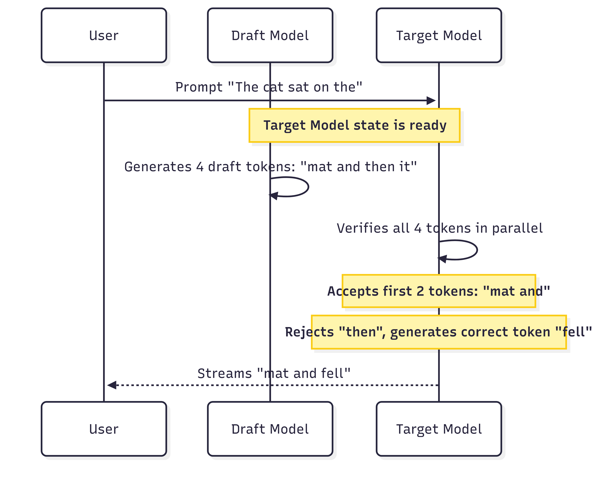
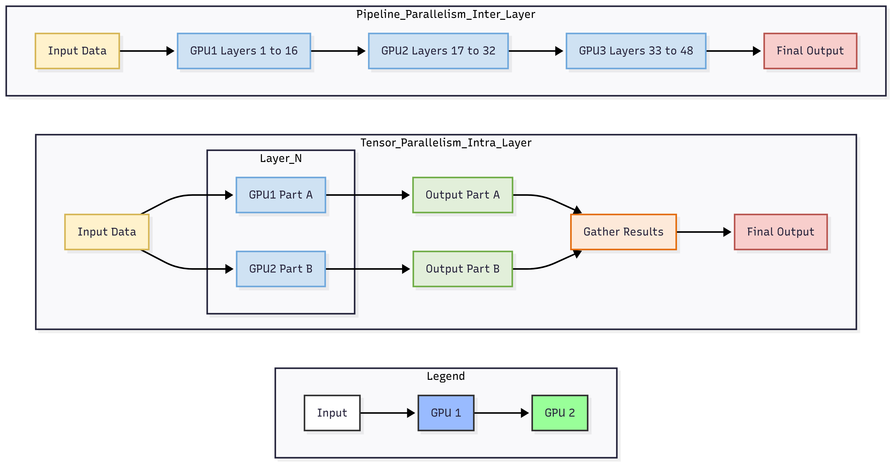
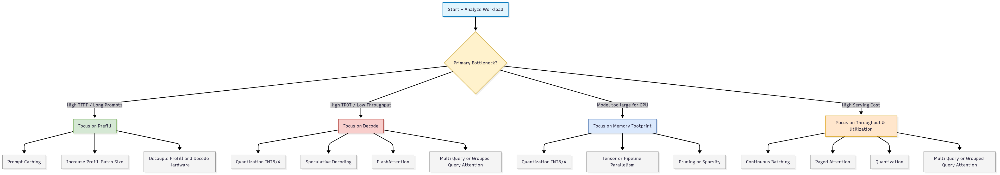

# Inference Optimization

**Objective:** This guide provides a technically deep and comprehensive overview of the principles, techniques, and trade-offs involved in optimizing LLM inference. It aims to equip technical leaders with the knowledge to diagnose performance bottlenecks, select appropriate optimization strategies, and make informed decisions about building or evaluating high-performance LLM serving systems.

---

### **Table of Contents**

1.  **Introduction: The Inference Imperative**
    *   Why Optimization is Not an Afterthought
    *   The Three Pillars of Optimization: Model, Service, and Hardware
2.  **Part 1: Foundational Concepts of LLM Inference**
    *   The Two-Phase Inference Lifecycle: Prefill and Decode
    *   The Core Bottleneck: Understanding the KV Cache
    *   Defining Success: Key Performance and Utilization Metrics
3.  **Part 2: Model-Level Optimization: Making the Model Itself More Efficient**
    *   Model Compression Techniques
        *   Quantization: The Low-Hanging Fruit
        *   Pruning & Sparsity: Trimming the Fat
        *   Knowledge Distillation: The Student and the Teacher
4.  **Part 3: Architectural & Attention Mechanism Optimization**
    *   Redesigning the Attention Head: MHA, MQA, and GQA
    *   Optimizing KV Cache Management: PagedAttention
    *   Hardware-Aware Computation: The Power of Fused Kernels (FlashAttention)
5.  **Part 4: Overcoming the Autoregressive Bottleneck**
    *   Speculative Decoding: Predicting the Future
    *   Parallel Decoding: Breaking Sequential Chains
6.  **Part 5: Service-Level Optimization: Smart Resource Management**
    *   Batching Strategies: From Static to Continuous
    *   Model Parallelism for Scale: Beyond a Single GPU
    *   Prompt Caching: Eliminating Redundant Work
7.  **Part 6: A Holistic Framework for Inference Optimization**
    *   A Decision-Making Flowchart
    *   Mapping Problems to Solutions
    *   The Inevitable Trade-offs
8.  **Conclusion: The Path to Production-Grade Inference**

---

## 1. Introduction: The Inference Imperative

While the training of foundation models captures headlines, the recurring, operational cost of **inference** determines the economic viability and user experience of any AI product. An LLM that is too slow, too expensive, or requires too much hardware is commercially impractical, regardless of its capabilities. Inference optimization is therefore not a final-step polish but a core competency for any organization deploying LLMs at scale.

### Why Optimization is Not an Afterthought

*   **Cost:** Inference is a recurring operational expenditure. Every token generated has a price tag tied to compute, memory, and energy. Efficient inference directly translates to higher margins and a lower total cost of ownership (TCO).
*   **Latency:** For user-facing applications like chatbots, code assistants, or summarization tools, latency is a critical component of the user experience. The perceived "intelligence" of a model is diminished if its responses are not timely.
*   **Scale & Throughput:** The ability to serve a growing number of concurrent users depends on maximizing the number of requests or tokens processed per second (throughput) on a fixed hardware budget.

### The Three Pillars of Optimization: Model, Service, and Hardware

Optimization is an interdisciplinary challenge that spans the entire stack. We can categorize techniques into three levels:

1.  **Model-Level Optimization:** Modifying the model itself to reduce its size, computational complexity, or memory footprint. These techniques (e.g., quantization, pruning) can sometimes alter model behavior.
2.  **Service-Level Optimization:** Changing how the model is served and how resources are managed, without altering the model's weights. These techniques (e.g., batching, parallelism) focus on maximizing hardware utilization and throughput.
3.  **Hardware-Level Optimization:** Designing or selecting specialized hardware (AI accelerators) and writing low-level, hardware-specific code (kernels) to accelerate computation.

This guide focuses primarily on the model and service levels, as these are the domains where most AI teams have direct control.

## Part 1: Foundational Concepts of LLM Inference

Before diving into specific techniques, it is essential to understand the unique computational profile of autoregressive LLMs.

### The Two-Phase Inference Lifecycle: Prefill and Decode

Unlike other neural networks that process inputs in a single forward pass, autoregressive LLMs generate output token by token in a process involving two distinct phases:

1.  **Prefill (Processing the Input):**
    *   **What it is:** The model processes the entire input prompt (all tokens) in a single, large computation step to generate the internal states (keys and values) needed to produce the *first* output token.
    *   **Computational Profile:** This is a **compute-bound** operation. It performs large matrix-matrix multiplications that can highly parallelize and saturate the GPU's computational cores (e.g., Tensor Cores). The latency of this phase is proportional to the input sequence length.

2.  **Decode (Generating the Output):**
    *   **What it is:** The model generates subsequent output tokens one at a time. Each new token requires the keys and values of all preceding tokens (both from the original prompt and the newly generated ones).
    *   **Computational Profile:** This is a **memory-bandwidth-bound** operation. The computation for a single token is small (matrix-vector operations) and cannot fully utilize the GPU's compute power. The performance bottleneck becomes the speed at which model weights and the KV cache can be read from GPU memory (HBM) to the on-chip SRAM for computation.

This dual nature is fundamental. Optimizing for prefill (e.g., Time to First Token) often requires different strategies than optimizing for decode (e.g., Time Per Output Token).

### The Core Bottleneck: Understanding the KV Cache

To avoid recomputing the keys (K) and values (V) for the entire sequence at every decode step, these intermediate tensors are stored in GPU memory. This is the **Key-Value (KV) Cache**.

While it prevents redundant computation, the KV cache is a primary source of memory pressure in LLM inference. Its size grows linearly with both the sequence length and the batch size.

**Calculating KV Cache Size:**

The memory required for the KV cache can be calculated as:

`KV Cache Size (bytes) = 2 * (batch_size) * (sequence_length) * (num_layers) * (hidden_size) * sizeof(precision)`

*   The factor of `2` is for the Key and Value tensors.
*   `hidden_size` is equivalent to `num_heads * dim_head`.
*   `sizeof(precision)` is typically 2 for FP16/BF16.

**Example:** For Llama 2 7B (32 layers, 4096 hidden size) with a batch size of 1 and a sequence length of 4096 in FP16, the KV cache is approximately:
`2 * 1 * 4096 * 32 * 4096 * 2 bytes ≈ 2.15 GB`

For a batch of 32, this balloons to over 68 GB, often exceeding the memory of a single high-end GPU. Managing this cache efficiently is one of the most critical challenges in LLM inference.

### Defining Success: Key Performance and Utilization Metrics

To optimize effectively, we must measure precisely.

#### Performance Metrics

*   **Latency:** The total time from user request to final response. For streaming applications, this is broken down:
    *   **Time to First Token (TTFT):** Measures the duration of the prefill phase. Critical for responsiveness in conversational AI.
    *   **Time Per Output Token (TPOT) / Inter-Token Latency (ITL):** Measures the speed of the decode phase. This should ideally be faster than human reading speed (e.g., < 120 ms/token or > 8 tokens/sec).
*   **Throughput:** The aggregate rate of token generation, typically measured in **Tokens Per Second (TPS)** across all users. This metric is directly linked to the serving cost.
*   **Goodput:** A user-centric metric that measures the number of requests per second that meet a specific Service Level Objective (SLO), such as `TTFT < 200ms` and `TPOT < 100ms`. This prevents optimizing for raw throughput at the expense of user experience.

#### Utilization Metrics

*   **GPU Utilization (`nvidia-smi`):** Often misleading. It only reports the percentage of time the GPU was active, not how *efficiently* it was used. A GPU can be 100% utilized while performing only one operation per second.
*   **Model FLOP/s Utilization (MFU):** The ratio of the observed throughput (in FLOPs) to the theoretical peak FLOP/s of the hardware. This measures computational efficiency. MFU is typically higher during the compute-bound prefill phase.
*   **Model Bandwidth Utilization (MBU):** The ratio of the achieved memory bandwidth to the theoretical peak bandwidth of the hardware. This measures memory efficiency. MBU is the critical metric for the memory-bound decode phase.

## Part 2: Model-Level Optimization: Making the Model Itself More Efficient

These techniques modify the model's weights or structure to reduce its resource requirements.

### Model Compression Techniques

#### Quantization: The Low-Hanging Fruit

Quantization is the process of reducing the numerical precision of a model's weights and/or activations (e.g., from 32-bit or 16-bit floating point to 8-bit or 4-bit integers).

*   **Benefits:**
    1.  **Reduced Memory Footprint:** A model quantized to INT8 is half the size of its FP16 counterpart.
    2.  **Reduced Memory Bandwidth:** Less data needs to be transferred from HBM to on-chip caches, directly accelerating memory-bound operations (decode).
    3.  **Faster Computation:** Modern GPUs have specialized hardware (e.g., Tensor Cores) that perform integer operations much faster than floating-point ones.

*   **Approaches:**
    *   **Post-Training Quantization (PTQ):** A model is trained to convergence in full precision, and its weights are then converted to a lower precision. It's fast and doesn't require retraining.
    *   **Quantization-Aware Training (QAT):** The quantization process is simulated during training or fine-tuning, allowing the model to adapt to the precision loss, which typically yields higher accuracy.

*   **Challenges in Transformers:** Naive PTQ can significantly degrade LLM performance. This is due to **outliers** in the activation values, especially in larger models (>6B parameters), where a few dimensions can have magnitudes 100x larger than others. This high dynamic range makes it difficult to map the values to a low-precision format without significant error.

*   **Advanced Quantization Techniques:**
    *   **Mixed-Precision (e.g., LLM.int8()):** Keeps outlier activation features in high precision (FP16) while quantizing the rest to INT8. This preserves model quality but can have hardware performance limitations if there's no native support for INT8 x FP16 matrix multiplication.
    *   **SmoothQuant:** An elegant solution that mathematically "smooths" the quantization difficulty by migrating it from activations to weights. It scales activations down and weights up by a learned factor, making both easier to quantize to INT8 without performance degradation.
    *   **GPTQ:** An accurate PTQ method that quantizes weights layer by layer, greedily choosing which weights to quantize to minimize the mean squared error, using second-order Hessian information to guide the process. It can achieve near-lossless weight quantization down to 3 or 4 bits.

#### Pruning & Sparsity: Trimming the Fat

Pruning involves removing unimportant weights by setting them to zero, creating a sparse model.

*   **Unstructured Pruning:** Individual weights can be removed anywhere in the model. While it can achieve high sparsity, it results in irregular sparse matrices that are difficult to accelerate on modern hardware without specialized kernels.
*   **Structured Pruning:** Entire rows, columns, or blocks of weights are removed, preserving the dense matrix structure needed for efficient hardware execution. A hardware-friendly variant is **N:M Sparsity**, where N out of every M consecutive weights are zero (e.g., 2:4 sparsity supported by NVIDIA Ampere/Hopper GPUs).

The typical pruning workflow is: **Train -> Prune -> Retrain/Finetune**. Retraining helps the model recover from the accuracy loss incurred during pruning.

#### Knowledge Distillation: The Student and the Teacher

This technique trains a smaller "student" model to mimic the output behavior (logits) of a larger, more capable "teacher" model. The student learns not just the correct labels but also the "dark knowledge" embedded in the teacher's probability distributions. This can produce a compact model that retains a significant portion of the original's capabilities at a fraction of the inference cost. DistilBERT is a classic example, achieving 97% of BERT's performance with 40% fewer parameters.

## Part 3: Architectural & Attention Mechanism Optimization

These techniques specifically target the computational and memory bottlenecks of the Transformer attention mechanism.

### Redesigning the Attention Head: MHA, MQA, and GQA

The standard **Multi-Head Attention (MHA)** projects the Query, Key, and Value tensors into multiple "heads," allowing the model to attend to different information subspaces. However, each head has its own K and V tensors, which significantly bloats the KV cache.

To address this, two popular variants have emerged:

1.  **Multi-Query Attention (MQA):** All heads share a single Key and Value projection. This dramatically reduces the size of the KV cache and the amount of data read from memory during decoding, boosting throughput. The trade-off is a potential drop in model quality due to the reduced representational capacity.
2.  **Grouped-Query Attention (GQA):** A compromise between MHA and MQA. It groups heads together, and all heads within a group share a single K and V projection. This offers a tunable balance between the memory savings of MQA and the quality of MHA. Llama 2 70B is a prominent model that uses GQA.

| Feature | Multi-Head Attention (MHA) | Multi-Query Attention (MQA) | Grouped-Query Attention (GQA) |
| :--- | :--- | :--- | :--- |
| **K/V Projections** | One per query head | One for all query heads | One per group of query heads |
| **KV Cache Size** | Largest | Smallest | Intermediate |
| **Model Quality** | Highest (baseline) | Potential degradation | Near-MHA quality |
| **Inference Speed** | Slowest | Fastest | Intermediate |

### Optimizing KV Cache Management: PagedAttention

Traditional KV cache implementations pre-allocate a large, contiguous block of memory for each sequence to accommodate the maximum possible length. This leads to two major inefficiencies:

1.  **Internal Fragmentation:** Most of the allocated memory goes unused if sequences are shorter than the maximum.
2.  **External Fragmentation:** The varying memory needs of different requests make it hard for the memory manager to find contiguous blocks, leading to wasted space.

**PagedAttention**, inspired by virtual memory paging in operating systems, solves this by partitioning the KV cache into fixed-size blocks. These blocks can be stored non-contiguously in memory. A "block table" for each sequence maps logical tokens to their physical block locations. This approach:

*   **Eliminates Internal Fragmentation:** Memory is allocated on-demand in small blocks as the sequence grows.
*   **Enables Memory Sharing:** Identical prefixes (like a shared system prompt) can be mapped to the same physical blocks across different requests, a concept known as copy-on-write.
*   This results in near-zero memory waste, allowing for much larger batch sizes and significantly higher throughput. vLLM is a popular inference server built around this concept.

### Hardware-Aware Computation: The Power of Fused Kernels (FlashAttention)

As the decode phase is memory-bandwidth bound, the bottleneck isn't the computation itself, but the time spent moving data between the GPU's high-bandwidth memory (HBM) and the much faster on-chip SRAM. The standard attention implementation involves multiple separate operations (matrix multiplies, masking, softmax, dropout), each requiring a round trip to HBM.

**FlashAttention** is a hardware-aware I/O algorithm that fuses these operations into a single GPU kernel. By using techniques like **tiling**, it loads small blocks of the Q, K, and V matrices into SRAM, performs all the attention computations on that block, and writes the final result back to HBM only once.

*   **Key Insight:** Minimize slow HBM read/writes, even at the cost of recomputing some values in fast SRAM.
*   **Result:** FlashAttention provides significant speedups (2-4x) and memory savings (by not storing the large intermediate attention matrix) without changing the mathematical output of the attention operation, making it a drop-in replacement.

## Part 4: Overcoming the Autoregressive Bottleneck

The token-by-token nature of decoding is a fundamental latency bottleneck. The following techniques aim to parallelize or accelerate this process.

### Speculative Decoding: Predicting the Future

This approach uses a small, fast "draft" model to generate a sequence of *k* candidate tokens. Then, the large, accurate "target" model verifies all *k* tokens in a single parallel step (which is compute-bound, similar to prefill).

*   **How it Works:** The target model accepts the draft tokens up to the first mismatch. It then discards the rest and generates one correct token itself. In the best case (all *k* tokens accepted), we generate *k+1* tokens for the cost of one target model forward pass. In the worst case (no tokens accepted), we generate 1 token for the cost of one target and one draft model pass.
*   **Why it's Effective:** It effectively converts the memory-bound decode step into a more efficient, compute-bound verification step, leveraging idle FLOPs during decoding. The speedup is proportional to the acceptance rate of the draft tokens.

### Parallel Decoding: Breaking Sequential Chains

More advanced techniques like **Medusa** aim to break the sequential dependency entirely. Medusa augments a pretrained LLM with multiple "decoding heads." Each head is a small network trained to predict a future token at a specific position (e.g., head 2 predicts token `t+2`). During inference, all heads generate candidate tokens simultaneously. A tree-based attention mechanism then efficiently verifies these candidates to select the most probable sequence. This allows the model to generate multiple tokens in parallel per forward pass, further boosting decoding speed.

## Part 5: Service-Level Optimization: Smart Resource Management

These techniques optimize how requests are scheduled and executed on the hardware, without modifying the model.

### Batching Strategies: From Static to Continuous

Batching requests together improves GPU utilization by processing them in parallel, amortizing the cost of loading model weights.

*   **Static Batching:** Waits for a fixed number of requests to arrive before processing. Simple but inefficient, as it leads to high latency for early arrivals and GPU idling if traffic is low.
*   **Dynamic Batching:** Processes a batch if either a fixed number of requests have arrived OR a time limit has been reached. This improves latency over static batching but can lead to under-filled batches and wasted compute.
*   **Continuous Batching (In-flight Batching):** The state-of-the-art. Instead of waiting for the entire batch to finish, the server immediately evicts finished requests from the batch and inserts new, incoming requests. This maximizes GPU utilization by keeping the batch full and minimizes unnecessary waiting for requests with short generation lengths. PagedAttention is a key enabler for efficient continuous batching.

### Model Parallelism for Scale: Beyond a Single GPU

For models too large to fit on a single device, model parallelism partitions the model across multiple GPUs.

*   **Tensor Parallelism:** Splits individual weight matrices *within* a layer across multiple GPUs. Computations on these shards are performed in parallel, and the results are aggregated via a communication step (e.g., all-reduce). This is excellent for reducing latency but requires high-bandwidth interconnects (like NVLink).
*   **Pipeline Parallelism:** Assigns contiguous blocks of layers to different GPUs, forming a pipeline. Data flows from one GPU to the next. This is effective for fitting large models but introduces "pipeline bubbles" (idle time) and increases latency due to the sequential data flow. It's more common in training than latency-sensitive inference.
*   **Sequence Parallelism:** A more advanced technique that partitions operations like LayerNorm and Dropout along the sequence dimension, which is not possible with tensor parallelism, further reducing activation memory on each device.

### Prompt Caching: Eliminating Redundant Work

Many applications involve prompts with significant overlap, such as a long system prompt or the history in a multi-turn conversation. **Prompt Caching** (or Prefix Caching) stores the precomputed KV cache for these shared prefixes. When a new request arrives with a cached prefix, the server can skip the prefill step for that portion and start decoding immediately, significantly reducing TTFT and cost.

## Part 6: A Holistic Framework for Inference Optimization

With a vast array of techniques, the key is to apply them methodically based on your specific bottlenecks and goals.

### A Decision-Making Flowchart

### Mapping Problems to Solutions

| Problem Statement | Primary Solutions | Secondary Solutions | Key Trade-off |
| :--- | :--- | :--- | :--- |
| **"My chatbot feels sluggish to respond."** (High TTFT) | Prompt Caching, Decoupling Prefill hardware. | FlashAttention. | Prompt caching requires memory; decoupling requires more complex infrastructure. |
| **"The response streams too slowly."** (High TPOT) | Quantization (INT4/INT8), Speculative Decoding. | FlashAttention, MQA/GQA. | Aggressive quantization might impact accuracy. Speculative decoding adds complexity. |
| **"My 70B model won't fit on a single A100."** | Tensor Parallelism, Quantization. | Pipeline Parallelism. | Parallelism introduces communication overhead. |
| **"My GPU bill is too high."** (Low Throughput) | Continuous Batching with PagedAttention, Quantization. | MQA/GQA, Increasing batch size. | Increasing batch size may increase latency; need to find the "goodput" sweet spot. |
| **"My RAG application is slow and expensive."** | Prompt Caching (for the context), PagedAttention, Continuous Batching. | FlashAttention (for long context). | Engineering effort to implement efficient caching and batching. |

### The Inevitable Trade-offs

*   **Latency vs. Throughput:** The most fundamental trade-off. Techniques like batching increase throughput but can add to latency. The goal is to maximize *goodput*.
*   **Performance vs. Accuracy:** Aggressive quantization or pruning can degrade model quality. It's crucial to evaluate performance on key benchmarks after optimization.
*   **Development Effort vs. Gain:** Drop-in solutions like FlashAttention or frameworks like vLLM offer high ROI. Custom kernel writing or implementing novel decoding strategies require specialized expertise and significant engineering investment.

## 8. Conclusion: The Path to Production-Grade Inference

Optimizing LLM inference is a complex but solvable problem. There is no single silver bullet; instead, achieving peak performance and efficiency requires a multi-faceted approach that combines techniques from the model, architecture, and service levels.

For technical leaders, the path forward involves:

1.  **Deeply understanding your workload:** Profile your application to identify whether you are compute-bound (prefill) or memory-bandwidth-bound (decode).
2.  **Adopting a layered optimization strategy:** Start with the highest-impact, lowest-effort techniques like quantization and leveraging state-of-the-art serving frameworks (e.g., NVIDIA TensorRT-LLM, vLLM, SGLang) that incorporate FlashAttention, PagedAttention, and continuous batching out-of-the-box.
3.  **Making informed trade-offs:** Continuously measure performance against your business objectives (cost, latency, user satisfaction) and be prepared to balance them.
4.  **Staying current:** The field is evolving at a breakneck pace. Techniques that are experimental today, like parallel decoding, may become standard tomorrow.

By mastering these techniques, organizations can unlock the full potential of large language models, transforming them from computationally expensive research artifacts into efficient, scalable, and economically viable products.