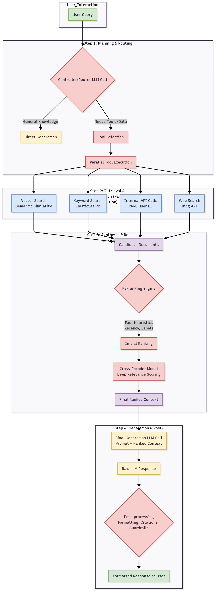

# Industry Case Studies

## **Executive Summary: A Mental Model for the GenAI CTO**

Analysis of market-leading products reveals four foundational pillars that define success. First is the dominance of the **Vertical Co-Pilot Pattern**, where GenAI serves not as a replacement for human experts but as a deeply integrated force multiplier, automating low-value tasks within existing professional workflows. Second, in a world of commoditizing models, defensibility is achieved through a robust **"Trust Stack"**—an architecture built on proprietary data moats, verifiable outputs through Retrieval-Augmented Generation (RAG), and enterprise-grade security. Third, the market is rapidly evolving from simple augmentation to **Agentic AI**, where autonomous systems and multi-prompt architectures execute complex, multi-step workflows, representing a quantum leap in value creation. Finally, enterprise adoption is unequivocally driven by the **Economics of Intelligence**; successful products demonstrate clear, quantifiable ROI in terms of time saved, costs reduced, and productivity gained.

This report will dissect these patterns, providing the architectural blueprints, technical deep dives, and strategic frameworks necessary for technology leaders to build the next generation of winning GenAI products.

## **Section 1: The Anatomy of a Winning GenAI Product: Core Patterns of Success**

A cross-domain analysis of successful Generative AI products reveals a set of recurring strategic patterns. These are not merely features but fundamental architectural and product philosophies that separate market leaders from the multitude of thin wrappers around foundation model APIs.

### **1.1 The Vertical Co-Pilot Pattern: Augmenting, Not Replacing, the Expert**

The most commercially successful enterprise GenAI products are not general-purpose "answer engines." Instead, they are highly specialized, domain-specific "co-pilots" designed to augment the workflow of a high-value professional. The core principle is to automate tedious, repetitive tasks, thereby freeing up expensive human capital for high-judgment, strategic work.

This pattern is consistently observed in high-stakes professional services. In healthcare, Med-PaLM 2 assists with drafting clinical summaries. In the legal field, Harvey AI assists lawyers by producing first drafts and summarizing complex documents. In software development, GitHub Copilot automates writing boilerplate code, functioning as a tireless pair programmer.

The implementation of this pattern is critical. These co-pilots are not standalone applications. They are deeply and seamlessly embedded into the expert's existing systems. GitHub Copilot lives within the IDE; Morgan Stanley’s assistant is integrated into its internal wealth management platform. This deep integration makes the AI feel like a natural extension of the user's existing toolset, dramatically lowering the barrier to adoption and making the product sticky. The product becomes the enhanced workflow, not the AI itself.

### **1.2 The Data Moat & The "Trust Stack": Building Defensibility and Verifiability**

As foundational models become increasingly accessible, they cease to be a durable competitive advantage. True, long-term defensibility is built on two pillars: proprietary data and the architecture constructed to leverage it securely—a **"Trust Stack."**

The **Data Moat** is created when a product is built upon a unique dataset. Morgan Stanley’s wealth management bot is restricted to its proprietary knowledge base of tens of thousands of research reports and market insights, giving it an unassailable advantage in its niche.

The **"Trust Stack"** is the architectural answer to the inherent risks of LLMs, such as hallucination, bias, and data privacy violations. A robust Trust Stack consists of several key layers:

*   **Retrieval-Augmented Generation (RAG) on Controlled Data:** This is the most prevalent architectural pattern for ensuring factual grounding. Instead of relying on the model's parametric memory, the system retrieves relevant information from a curated, trusted knowledge base (internal documents, product catalogs, vetted articles) in real-time and provides it to the model as context. As Swiggy found in building its Restaurant Partner support bot, grounding the LLM on dense FAQ and SOP documents via RAG is essential for providing accurate, conversational answers.
*   **Verifiability by Design:** Leading products do not present AI-generated content as an opaque black box. They provide clear citations and links back to the source documents used in the RAG process. This allows the expert user to quickly validate the AI's output, maintaining their role as the ultimate arbiter of truth.
*   **Security & Privacy First:** Enterprise customers have non-negotiable security requirements. The Trust Stack must address these at an architectural level. Successful products employ stateless architectures, where sensitive data is passed as context for a single API call and never stored or used for model training. Offering on-premise or Virtual Private Cloud (VPC) deployment options, as many are now doing, is also critical for winning enterprise trust.
*   **AI Guardrails:** As GoDaddy learned, some actions should not be left for the model to decide. The Trust Stack must include deterministic "guardrails." This includes code-based checks for PII and offensive content, hard-coded stop phrases (e.g., "transfer to human"), limits on chat interactions to prevent loops, and requiring human approval for sensitive actions.

### **1.3 From Augmentation to Agency: The Rise of Multi-Step, Autonomous Workflows**

The initial wave of GenAI products focused on discrete tasks. The market is now rapidly advancing toward **Agentic AI**: systems that can understand a high-level goal, create a multi-step plan, interact with tools and APIs, and execute that plan with minimal human intervention.

This is a move from a single "mega-prompt" to a more sophisticated, modular architecture. GoDaddy's experience is illustrative: their initial single-prompt system became bloated and inaccurate as more capabilities were added. They pivoted to a **multi-prompt architecture** using a Controller-Delegate pattern. A central "controller" LLM analyzes the user's intent and delegates specific tasks (like searching a knowledge base or summarizing information for a human agent) to specialized, task-oriented prompts ("delegates"). This approach simplifies the codebase, improves accuracy, and reduces token consumption.

Similarly, LinkedIn's system employs a routing agent to decide which specialized AI agent (e.g., job assessment, company understanding) is best equipped to handle a query before proceeding to retrieval and generation.

This agentic or multi-prompt approach underpins the most advanced GenAI systems, enabling them to tackle complex workflows that a single LLM call cannot.

### **1.4 The Economics of Intelligence: Quantifying ROI and Driving Adoption**

For enterprise GenAI products, a clear and quantifiable Return on Investment (ROI) is the ultimate driver of adoption. Winning products are sold on compelling, data-driven business cases.

*   **Time Saved:** This is the most direct metric. Customer support summarization tools can save agents 30-90 seconds per call.
*   **Cost Reduction:** The economics can be tough, especially for ad-supported or low-margin businesses. BuzzFeed and Swiggy found that using large, hosted LLMs at scale can be cost-prohibitive. To manage this, teams are employing several strategies:
    *   **Model Tiering / Adaptive Selection:** Using smaller, faster, cheaper models (like GPT-3.5 Turbo or fine-tuned open-source models) for simple, high-volume tasks, and reserving more powerful, expensive models (like GPT-4) for complex reasoning or when a user is dissatisfied.
    *   **Fine-tuning Open-Source Models:** For narrow use cases, fine-tuning a smaller, open-source model (e.g., FLAN-T5) on data generated by a larger model can reduce costs by ~80% compared to using the large model directly in production.
    *   **Token Optimization:** Meticulously engineering prompts to be succinct and controlling the length of responses saves thousands of dollars at scale.
*   **Productivity & Revenue Lift:** The most sophisticated ROI calculations tie GenAI directly to core metrics. One study found that a generative AI helper boosted customer support agent productivity by an average of 14%. Duolingo saw its paying subscribers grow 62% year-over-year after integrating GPT-4 features, a clear indicator of value.

## **Section 2: The GenAI Architectural Blueprint: A Technical Deep Dive**

Building a production-grade GenAI application involves far more than simply calling an API. The most successful systems employ a sophisticated, multi-stage pipeline designed for accuracy, scalability, and control. The architecture used by Shortwave for its AI email assistant serves as an excellent reference model.

### **The Modern RAG Pipeline**

The core of most enterprise GenAI products is a sophisticated Retrieval-Augmented Generation (RAG) pipeline. This architecture grounds the LLM in factual, proprietary data, mitigating hallucinations and enabling context-aware responses.

Here is a Mermaid diagram illustrating a comprehensive RAG pipeline, 

**Key Stages Explained:**

1.  **Planning & Routing:** The initial user query is first sent to a fast, efficient LLM (e.g., GPT-4o, Claude 3.5 Sonnet). Its job is not to answer, but to *plan*. It deconstructs the query, reformulates it for clarity ("What about Jonny?" becomes "When does Jonny land in Phoenix?"), and determines which tools are needed. This is the **tool selection** or **agent routing** step.
2.  **Parallel Retrieval:** Once the plan is set, the system executes multiple data retrieval tasks in parallel to gather all necessary context. This is a recall-oriented step designed to collect a wide net of potentially relevant information. This includes:
    *   **Vector Search:** The query is embedded and searched against a vector database (e.g., Pinecone) to find semantically similar documents.
    *   **Keyword/Full-Text Search:** Traditional search (e.g., ElasticSearch) is used to find documents based on specific keywords or metadata filters (dates, names, labels) extracted by the planning LLM.
    *   **Internal API Calls:** The system calls internal APIs to fetch structured data, like a user's profile from a CRM or order history from a database. LinkedIn's concept of wrapping these APIs in LLM-friendly "skills" with clear descriptions is a key best practice here.
3.  **Synthesis & Re-ranking:** The parallel retrieval step often yields a large, noisy set of candidate documents and data points—far too much to fit into a prompt. This precision-oriented step filters and ranks the retrieved information:
    *   **Heuristic Re-ranking:** Fast, rule-based heuristics are applied first. For example, documents within a specified date range are boosted, promotions are down-weighted, and more recent documents are prioritized.
    *   **Cross-Encoder Re-ranking:** The top candidates from the heuristic pass are then sent to a more powerful (and slower) cross-encoder model. This model takes both the query and a document chunk as input and outputs a single, highly accurate relevance score. This is a significant step up in quality from simple vector similarity.
4.  **Generation & Post-processing:** The final, ranked context is prepended to the original user query and sent to a powerful generation model (e.g., GPT-4, Claude 3 Opus). The final output is then post-processed to add citations, apply formatting, and run through final safety guardrails before being sent to the user.

## **Section 3: The CTO's Decision Matrix: Key Technical & Strategic Trade-offs**

Building a GenAI product requires navigating a series of critical technical and strategic trade-offs.

| **Decision Area** | **Key Challenge** | **Common Approaches & Trade-offs** | **Winning Strategy** |
| :--- | :--- | :--- | :--- |
| **Model Selection** | Performance vs. Cost vs. Control | **Commercial APIs (OpenAI/Anthropic):** Fast to market, SOTA performance. **Trade-offs:** High variable cost, data privacy concerns, vendor lock-in.   **Open-Source (Self-Hosted):** Full control, better TCO at scale. **Trade-offs:** High MLOps overhead, may lag SOTA. | **Hybrid & Adaptive:** Use a multi-model orchestration layer. Route simple tasks to cheaper, self-hosted models and complex tasks to SOTA APIs. Continuously evaluate and adopt new models. |
| **Knowledge Integration** | Hallucination & Specificity | **Fine-Tuning:** Teaches the model new *behaviors* or *styles*. **Trade-offs:** Expensive, complex, can still hallucinate.   **RAG:** Grounds the model in factual data *at query time*. **Trade-offs:** More complex architecture, depends on retrieval quality. | **RAG is the Default:** For nearly all enterprise use cases requiring factual accuracy, RAG is the starting point. Use fine-tuning as a supplemental tool to adapt model style, not as the primary knowledge injection mechanism. |
| **Structured Output** | Reliability & Parsing | **Prompting for JSON/YAML:** Simple but brittle. LLMs often fail to produce perfectly valid structured data (~1-10% failure rate).   **Model Functions/Tools:** More reliable but only available on certain models.   **Defensive Parsing:** Building custom parsers to fix common LLM mistakes. | **Assume Failure:** Use model-native functions where possible. For other cases, build a defensive YAML/JSON parser that can detect and patch common errors, combined with a re-prompting loop as a final fallback. This is crucial for agentic workflows that rely on structured API calls. |
| **Performance** | Latency & Reliability | **Synchronous API Calls:** Simple but susceptible to high latency and provider outages (up to ~1% failure rate observed).   **Streaming APIs:** Dramatically improves perceived latency for chat interfaces.   **Asynchronous Architecture:** Decouples the system, improving reliability. | **Architect for Asynchronicity and Streaming:** Especially for chat, use streaming APIs to provide a better user experience. Implement robust retry logic with exponential backoff for API calls. Decouple your service from upstream providers to handle timeouts gracefully. |
| **Evaluation & Testing** | Infinite Inputs & Probabilistic Outputs | **Manual Testing:** Necessary but slow and doesn't scale.   **Automated Unit Tests:** Only cover deterministic parts of the system.   **LLM-based Evaluators:** Using a powerful LLM (e.g., GPT-4) to grade the output of another LLM against a rubric. | **A Multi-Layered Approach:** Use LLM-based evaluators in CI/CD for fast iteration. Scale human annotation (via internal teams or dedicated services) to create a "golden set" for evaluating trends. Swarm as a multi-disciplinary team to review live transcripts after major releases. |
| **Data for RAG** | Redundancy & Noise | **Raw Document Ingestion:** Easy but leads to high token usage and includes irrelevant "flowery language."   **Document Clustering:** Grouping similar documents to reduce redundancy.   **Summarization:** Creating condensed versions of documents. | **Tune Your Data:** Use an LLM to pre-process source documents into a more concise format like **Sparse Priming Representations (SPRs)**. This technique summarizes a document into a model-optimized representation, reducing token usage by over 50% and potentially improving retrieval accuracy. |

## **Section 4: The Horizon: Identifying a Winning GenAI Product**

Synthesizing these patterns provides a forward-looking framework for identifying and investing in the next generation of successful GenAI products.

### **The Winning Product Checklist: A CTO's Due Diligence Framework**

When evaluating a new GenAI product idea, apply this rigorous checklist:

*   **Problem Space & ROI:**
    *   Does it solve a high-value problem by providing an order-of-magnitude improvement over the status quo?
    *   Is there a clear, quantifiable value proposition (time saved, cost reduced, revenue generated)?
*   **Data & Defensibility:**
    *   Does the product have a strategy for developing a proprietary data moat?
    *   Is the architecture built around a robust "Trust Stack" (RAG, Guardrails, Security)?
*   **Workflow Integration:**
    *   Is the product deeply embedded into an existing daily workflow, or does it require context-switching? The former is vastly preferable.
*   **Architectural Viability:**
    *   Does the proposed architecture realistically address the trade-offs of latency, cost, and reliability? Is it designed to be modular and adaptable to new models?
*   **Risk Profile (Demand-Risk Framework):**
    *   Where does the idea fall on the Demand-Risk matrix? High-demand, low-risk use cases (e.g., content generation, summarization) are ideal starting points. High-demand, high-risk use cases (e.g., autonomous agents, resolution-focused chatbots) require significant investment in the "Trust Stack" before launch.

### **Final Mind-Map: The GenAI CTO's Strategic Framework**

*   **Core Principle: Workflow-First, Not AI-First.**
    *   Identify a high-pain workflow. Target the most repetitive, data-intensive tasks. Design the product as a deeply embedded co-pilot.
*   **Pillars of a Defensible Product:**
    *   **Data Moat:** Create a proprietary, high-quality dataset that generates a virtuous cycle.
    *   **Trust Stack:** Architect for security, verifiability (RAG), and control (Guardrails) from day one.
    *   **Quantifiable ROI:** Instrument the product to prove its economic value.
*   **Key Architectural Imperatives:**
    *   **Hybrid & Agentic:** Embrace a multi-model, multi-prompt architecture that can orchestrate complex tasks.
    *   **RAG is Non-Negotiable:** Use RAG as the foundation for any application requiring factual accuracy with proprietary or real-time data.
    *   **Tune Your Data, Not Just Your Model:** Pre-process and structure your knowledge base for optimal retrieval performance and cost.
    *   **Observe Everything:** Implement robust monitoring for system health, model quality, and user satisfaction.
*   **The Forward Horizon:**
    *   **The Agentic Shift:** Evolve from task assistance to workflow automation.
    *   **The Multimodal Experience:** Leverage new models that seamlessly fuse text, image, and other modalities to create more intuitive and powerful products.

By internalizing this framework, a CTO or Lead AI Engineer can move beyond the hype cycle and make the disciplined, strategic decisions required to build durable, high-value Generative AI products that will define their industries in the years to come.