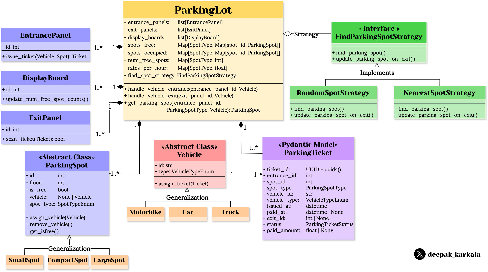
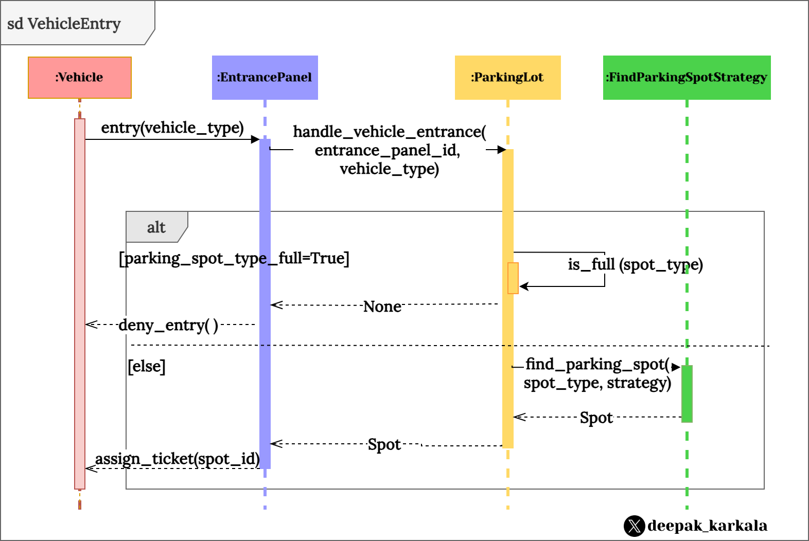

# Parking Lot

## 

### Requirements
<div style="background-color: #FCF1EF; border-radius: 15px; padding: 10px; width: 300px; height: auto; display: block; float: none; margin-left: auto; margin-right: auto;">
	
</div>

### Class Diagram
<div style="background-color: #FCF1EF; border-radius: 15px; padding: 20px;">
	
</div>

### Sequence Diagram
- **Vehicle Entry**

<div style="background-color: #FCF1EF; border-radius: 15px; padding: 20px;">
	
</div>

### Code

- **Vehicle**

```python
"""Module: Vehicle and vehicle types."""

from abc import ABC, abstractmethod
from enum import Enum


class VehicleType(str, Enum):
    """Types of vehicles."""

    CAR = "car"
    TRUCK = "truck"
    MOTORBIKE = "motorbike"


class Vehicle:
    """Class: Vehicle."""

    def __init__(self, vehicle_id: int, vehicle_type: VehicleType):
        """Initializes Vehicle instance

        Args:
            vehicle_id (int): Unique identifier of vehicle
            vehicle_type (Enum): Vehicle type Enum
        """
        self.vehicle_id = vehicle_id
        self.vehicle_type = vehicle_type
        self.ticket = None

    def __str__(self):
        class_name = type(self).__name__
        return f"{class_name}(vehicle_id={self.vehicle_id}, vehicle_type={self.vehicle_type})"


class Car(Vehicle):
    """Class: Car."""

    def __init__(self, vehicle_id: int):
        super().__init__(vehicle_id, VehicleType.CAR)


class Truck(Vehicle):
    """Class: Truck."""

    def __init__(self, vehicle_id: int):
        super().__init__(vehicle_id, VehicleType.TRUCK)


class Motorbike(Vehicle):
    """Class: Motorbike."""

    def __init__(self, vehicle_id: int):
        super().__init__(vehicle_id, VehicleType.MOTORBIKE)

```

- **Parking Spot**
```python
"""Module: Parking spot."""

from enum import Enum

from vehicle import Vehicle


class ParkingSpotType(Enum):
    """Types of Parking Spots."""

    HANDICAPPED = "handicapped"
    COMPACT = "compact"
    LARGE = "large"
    MOTORBIKE = "motorbike"


class ParkingSpot:
    """Class: Parking Spot."""

    def __init__(self, floor: int, spot_id: int, spot_type: ParkingSpotType):
        """Initialize Vehicle instance.

        Args:
            floor (int): Floor number
            spot_id (int): Parking spot number
            parking_spot_type (Enum): Parking spot type Enum
        """
        self._floor = floor
        self.spot_id = spot_id
        self._free = True
        self._vehicle = None
        self.spot_type = spot_type

    def assign_vehicle(self, vehicle: Vehicle):
        """Assign vehicle to parking spot.

        Args:
            vehicle (Vehicle): Vehicle Instance
        """
        self._vehicle = vehicle
        self._free = False

    def remove_vehicle(self):
        """Remove vehicle from parking spot."""
        self._vehicle = None
        self._free = True


class HandicappedSpot(ParkingSpot):
    """Class: Handicapped Parking Spot."""

    def __init__(self, number: int):
        """Initialize handicapped parking spot."""
        super().__init__(number, ParkingSpotType.HANDICAPPED)


class CompactSpot(ParkingSpot):
    """Class: Handicapped Parking Spot."""

    def __init__(self, number: int):
        """Initialize handicapped parking spot."""
        super().__init__(number, ParkingSpotType.COMPACT)


class LargeSpot(ParkingSpot):
    """Class: Large Parking Spot."""

    def __init__(self, number: int):
        """Initialize large parking spot."""
        super().__init__(number, ParkingSpotType.LARGE)


class MotorbikeSpot(ParkingSpot):
    """Class: Motorbike Parking Spot."""

    def __init__(self, number: int):
        """Initialize motorbike parking spot."""
        super().__init__(number, ParkingSpotType.MOTORBIKE)
```

- **Parking Ticket**
```python
"""Module: Parking Ticket."""
from datetime import datetime
from enum import Enum
from uuid import UUID, uuid4

import vehicle
from parking_spot import ParkingSpotType
from pydantic import BaseModel


class ParkingTicketStatus(Enum):
    """Enum: ParkingTicketStatus."""

    UNPAID = "unpaid"
    PAID = "paid"
    LOST = "lost"


class ParkingTicket(BaseModel):
    """Class: Parking Ticket."""

    ticket_id: UUID = uuid4()
    entrance_id: int
    spot_id: int
    spot_type: ParkingSpotType
    vehicle_id: int
    vehicle_type: vehicle.VehicleType
    issued_at: datetime
    paid_at: datetime | None
    exit_id: int | None
    status: ParkingTicketStatus
    paid_amount: float | None
```

- **Entrance, Exit Panels**
```python
"""Module: Entrance, Exit Panels."""
import logging.config
from datetime import datetime
from pathlib import Path
from uuid import uuid4

import yaml
from parking_spot import ParkingSpot
from parking_ticket import ParkingTicket, ParkingTicketStatus
from vehicle import Vehicle

logger = logging.getLogger(__name__)


class EntrancePanel:
    """Class: Entrance Panel."""

    def __init__(self, panel_id: int):
        """Initialize entrance panel instance."""
        self._panel_id = panel_id

    def issue_ticket(
        self, vehicle: Vehicle, parking_spot: ParkingSpot
    ) -> ParkingTicket:
        """Issue ticket to vehicle."""
        parking_ticket = ParkingTicket(
            ticket_id=uuid4(),
            entrance_id=self._panel_id,
            spot_id=parking_spot.spot_id,
            spot_type=parking_spot.spot_type,
            vehicle_id=vehicle.vehicle_id,
            vehicle_type=vehicle.vehicle_type,
            issued_at=datetime.now(),
            paid_at=None,
            exit_id=None,
            status=ParkingTicketStatus.UNPAID,
            paid_amount=None,
        )
        return parking_ticket


class ExitPanel:
    """Class: Exit Panel."""

    def __init__(self, panel_id: int):
        """Initialize exit panel instance."""
        self._panel_id = panel_id

    def scan_ticket(self, ticket: ParkingTicket, rates):
        """Scan ticket at exit."""
        current_timestamp = datetime.now()
        seconds_elapsed = (current_timestamp - ticket.issued_at).seconds
        total_amount = rates[ticket.spot_type] * seconds_elapsed

        # Accept payment and update ticket payment status
        ticket.paid_at = current_timestamp
        ticket.exit_id = self._panel_id
        ticket.status = ParkingTicketStatus.PAID
        ticket.paid_amount = total_amount

        return ticket


class DisplayBoard:
    """Class:Display board."""

    def __init__(self, board_id: int):
        """Initialize display board instance."""
        self._board_id = board_id

    def update_num_free_spot_counts(self, num_free_spots):
        """Update count of free spots."""
        logger.info(f"DisplayBoard{self._board_id}: ")
        for spot_type, free_spots in num_free_spots.items():
            logger.info(f"{spot_type}: {free_spots} free spots available.")

```

- **Parking Lot System**
```python
"""Module: Parking Lot."""
import logging.config
import threading
import time
from collections import defaultdict
from concurrent import futures
from pathlib import Path

import yaml
from panel import DisplayBoard, EntrancePanel, ExitPanel
from parking_spot import ParkingSpot, ParkingSpotType
from parking_spot_strategy import FindNearestSpotStrategy, FindRandomSpotStrategy
from parking_ticket import ParkingTicket
from vehicle import Vehicle

logging.config.dictConfig(
    yaml.safe_load(Path("src/logs/logging_config.yaml").read_text())
)
logger = logging.getLogger(__name__)


class ParkingLot:
    """Class: Parking Lot."""

    def __init__(
        self,
        num_entrance_panels,
        num_exit_panels,
        num_display_boards,
        parking_spot_counts,
        parking_spot_rates_per_sec,
        vehicle_spot_type_mapping,
        find_parking_spot_strategy,
    ):
        """Initialize Parking Lot instance."""
        self._entrance_panels = {}
        self._exit_panels = {}
        self._display_boards = {}

        # Add entrance panels, exit panels, display boards
        self.add_entrance_panels(num_entrance_panels)
        self.add_exit_panels(num_exit_panels)
        self.add_display_boards(num_display_boards)

        # Add parking spots
        self._spots_free = defaultdict()
        self._spots_occupied = defaultdict()
        self._num_free_spots = defaultdict(int)
        self.add_parking_spots(parking_spot_counts)

        self._vehicle_spot_type_mapping = vehicle_spot_type_mapping
        self._rates_per_sec = parking_spot_rates_per_sec
        # Store all tickets for downstream analytics
        self._tickets = defaultdict(ParkingTicket)

        self._lock = threading.Lock()

        # Initializing strategis is done in a separate thread
        self._parking_spot_counts = parking_spot_counts
        self._find_parking_spot_strategy = find_parking_spot_strategy
        self._init_find_parking_spot_strategies()

        logger.info("***** Initialize Parking Lot with Settings *****")
        logger.info(f" Number of entrance panels: {len(self._entrance_panels)}")
        logger.info(f" Number of exit panels: {len(self._exit_panels)}")
        logger.info(f" Number of display boards: {len(self._display_boards)}")
        for spot_type, num_spots in self._num_free_spots.items():
            logger.info(f"{spot_type}: {num_spots} total spots available.")
        logger.info(f" Find parking spot strategy: {self._find_parking_spot_strategy}")
        for spot_type, spot_rate in self._rates_per_sec.items():
            logger.info(f"{spot_type}: {spot_rate} unit per sec.")
        logger.info("************************************************")

    def _init_find_parking_spot_strategies(self):
        with futures.ThreadPoolExecutor(max_workers=4) as executor:
            futures_map = {}  # Map<Strategy, Future>
            futures_map["first"] = executor.submit(FindRandomSpotStrategy)
            futures_map["nearest"] = executor.submit(
                FindNearestSpotStrategy,
                self._entrance_panels,
                self._spots_free,
                self._parking_spot_counts,
            )

            futures.as_completed(futures_map)

            self._find_parking_spot_strategies = {}  # Map<Strategy, strategy instance>
            # Iterate over futures as result becomes available
            for strategy, future in futures_map.items():
                self._find_parking_spot_strategies[strategy] = future.result()

            self._find_parking_spot_strategy = self._find_parking_spot_strategies[
                self._find_parking_spot_strategy
            ]

        return

    def add_parking_spots(self, parking_spot_counts: dict[ParkingSpotType, int]):
        """Add parking spots of different types."""
        acc_num_spots = 0
        for spot_type, num_spots in parking_spot_counts.items():
            self._spots_free[spot_type] = {}

            for i in range(num_spots):
                spot_id = acc_num_spots + i
                self._spots_free[spot_type][spot_id] = ParkingSpot(
                    floor=0, spot_id=spot_id, spot_type=spot_type
                )

            self._spots_occupied[spot_type] = {}
            self._num_free_spots[spot_type] = num_spots
            acc_num_spots += num_spots

    def add_entrance_panels(self, num_entrance_panels: int):
        """Add entrance panels."""
        for i in range(num_entrance_panels):
            self._entrance_panels[i] = EntrancePanel(panel_id=i)

    def add_exit_panels(self, num_exit_panels: int):
        """Add exit panel."""
        for i in range(num_exit_panels):
            self._exit_panels[i] = ExitPanel(panel_id=i)

    def add_display_boards(self, num_display_boards: int):
        """Add display boards."""
        for i in range(num_display_boards):
            self._display_boards[i] = DisplayBoard(board_id=i)

    def notify_display_boards(self):
        """Update display boards with number of free spot counts."""
        for i in range(len(self._display_boards)):
            self._display_boards[i].update_num_free_spot_counts(self._num_free_spots)

    def get_parking_spot(
        self, entrance_panel_id: int, spot_type: ParkingSpotType, vehicle: Vehicle
    ) -> None | ParkingSpot:
        """Find parking spot
        Args:
            entrance_panel_id (int): Unique ID of entrance panel
            spot_type (Enum): ParkingSpotType
            vehicle (Vehicle): Instance of vehicle class
        Returns:
            parking_spot (None | ParkingSpot)
        """
        parking_spot = None

        # Acquire lock
        with self._lock:
            # If parking spots for this vehicle type is full, return None (no ticket assigned)
            if not self._num_free_spots[spot_type]:
                logger.info(f"Parking Spots for {vehicle.vehicle_type} are full")
                return parking_spot

            """Get parking spot."""
            spot_id = self._find_parking_spot_strategy.find_parking_spot(
                entrance_panel_id, spot_type, self._spots_free[spot_type]
            )

            # Get the parking spot for this spot_id
            parking_spot = self._spots_free[spot_type][spot_id]
            # Assign vehicle to this spot
            parking_spot.assign_vehicle(vehicle=vehicle)

            # Remove this spot from free spots and add it to occupied spots
            self._spots_free[spot_type].pop(spot_id)
            self._spots_occupied[spot_type][spot_id] = parking_spot
            self._num_free_spots[spot_type] -= 1
        # Release lock

        return parking_spot

    def handle_vehicle_entrance(
        self, entrance_panel_id: int, vehicle: Vehicle
    ) -> ParkingTicket | None:
        logger.info(
            f"Vehicle: Type: {vehicle.vehicle_type}, Vehicle ID: {vehicle.vehicle_id} at entrance panel id:{entrance_panel_id}"
        )
        """Handle vehicle at entrance panel."""
        if entrance_panel_id >= len(self._entrance_panels):
            raise ValueError("entrance_panel_id is out of bounds")

        # Get the mapping to appropriate parking spot type for this vehicle
        spot_type = self._vehicle_spot_type_mapping[vehicle.vehicle_type]

        # Get parking spot for current vehicle
        parking_spot = self.get_parking_spot(entrance_panel_id, spot_type, vehicle)

        # If parking spots for this vehicle type is full, return None (no ticket assigned)
        if not parking_spot:
            return None

        logger.info(f"Assigned {spot_type} with id:{parking_spot.spot_id}")

        # Issue ticket
        parking_ticket = self._entrance_panels[entrance_panel_id].issue_ticket(
            vehicle=vehicle, parking_spot=parking_spot
        )
        # Assign ticket to vehicle
        vehicle.ticket = parking_ticket

        logger.info(
            f"Ticket assigned, ID:{parking_ticket.ticket_id} at {parking_ticket.issued_at}"
        )

        # Updating display boards with latest counts
        self.notify_display_boards()

        return parking_ticket

    def handle_vehicle_exit(
        self,
        exit_panel_id: int,
        vehicle: Vehicle,
    ):
        """Handle vehicle's exit
        Scan Ticket
        Accept Payment.
        """

        if exit_panel_id >= len(self._exit_panels):
            raise ValueError("exit_panel_id is out of bounds")

        # Scan ticket and handle payment
        ticket = self._exit_panels[exit_panel_id].scan_ticket(
            ticket=vehicle.ticket, rates=self._rates_per_sec
        )
        # Save ticket (in DB) for downstream analytics
        self._tickets[ticket.ticket_id] = ticket

        logger.info(
            f"Vehicle: Type: {ticket.vehicle_type}, Vehicle ID: {ticket.vehicle_id} at exit panel id:{exit_panel_id}"
        )

        # Acquire lock
        with self._lock:
            # Remove this spot from occupied spots and add it to free spots
            spot_id = ticket.spot_id
            spot_type = ticket.spot_type
            parking_spot = self._spots_occupied[spot_type][spot_id]
            self._spots_occupied[spot_type].pop(spot_id)
            self._spots_free[spot_type][spot_id] = parking_spot
            self._num_free_spots[spot_type] += 1
            self.notify_display_boards()

            # Update list of free spots in find parking spot strategies
            self._find_parking_spot_strategy.update_parking_spot(spot_id, spot_type)
        # Release lock

        logger.info(f"Spot freed: {ticket.spot_type} with id:{ticket.spot_id}")
        logger.info(
            f"Ticket scanned, ID:{ticket.ticket_id}. Payment of {ticket.paid_amount} handled at {ticket.paid_at}"
        )

        return
```

- **Parking Lot Application**

```python
"""Module: Parking Lot Application."""
import logging.config
import time
from concurrent import futures
from pathlib import Path
from threading import Thread

import typer
import yaml
# from account import AccountStatus, Admin, Person
from panel import EntrancePanel, ExitPanel
from parking_lot import ParkingLot
from parking_spot import ParkingSpotType
from typing_extensions import Annotated
from vehicle import Car, Vehicle, VehicleType

app = typer.Typer()

logger = logging.getLogger(__name__)


@app.command()
def parking_lot_app(
    num_entrance_panels: Annotated[
        int, typer.Argument(help="Number of entrance panels")
    ] = 2,
    num_exit_panels: Annotated[
        int, typer.Argument(help="Number of entrance panels")
    ] = 2,
    num_display_boards: Annotated[
        int, typer.Argument(help="Number of dispaly boards")
    ] = 1,
    find_parking_spot_strategy: Annotated[
        str,
        typer.Argument(
            help="first: Find first free spot, nearest: Find nearest free spot to entrance"
        ),
    ] = "nearest",
):
    """
    Initialize parking lot app.

    Args:
        num_entrance_panels (int): Number of entrance panels
        num_exit_panels (int): Number of exit panels
    """

    parking_spot_counts = {
        ParkingSpotType.MOTORBIKE: 50,
        ParkingSpotType.COMPACT: 25,
        ParkingSpotType.LARGE: 15,
        ParkingSpotType.HANDICAPPED: 5,
    }

    parking_spot_rates_per_sec = {
        ParkingSpotType.MOTORBIKE: 0.0025,
        ParkingSpotType.COMPACT: 0.005,
        ParkingSpotType.LARGE: 0.01,
        ParkingSpotType.HANDICAPPED: 0.002,
    }

    vehicle_spot_type_mapping = {
        VehicleType.CAR: ParkingSpotType.COMPACT,
        VehicleType.TRUCK: ParkingSpotType.LARGE,
        VehicleType.MOTORBIKE: ParkingSpotType.MOTORBIKE,
    }

    # Create singleton instance of Parking Lot
    parking_lot = ParkingLot(
        num_entrance_panels,
        num_exit_panels,
        num_display_boards,
        parking_spot_counts,
        parking_spot_rates_per_sec,
        vehicle_spot_type_mapping,
        find_parking_spot_strategy,
    )

    # Create vehicles
    car1 = Car(vehicle_id=1)
    car2 = Car(vehicle_id=2)

    def park_one_vehicle(args):
        entrance_panel_id, vehicle = args
        vehicle_id = vehicle.vehicle_id
        vechicle_type = vehicle.vehicle_type
        logger.info(
            f" Vehicle of type: {vechicle_type} with ID: {vehicle_id} arrived at entrance panel with id: {entrance_panel_id} "
        )
        parking_lot.handle_vehicle_entrance(
            entrance_panel_id=entrance_panel_id, vehicle=vehicle
        )

    def exit_one_vehicle(args):
        exit_panel_id, vehicle = args
        vehicle_id = vehicle.vehicle_id
        vechicle_type = vehicle.vehicle_type
        logger.info(
            f" Vehicle of type: {vechicle_type} with ID: {vehicle_id} exiting at exit panel with id: {exit_panel_id} "
        )
        parking_lot.handle_vehicle_exit(exit_panel_id=exit_panel_id, vehicle=vehicle)

    with futures.ThreadPoolExecutor() as executor:
        _ = executor.map(park_one_vehicle, [(0, car1), (1, car2)])
        time.sleep(3)
        _ = executor.map(exit_one_vehicle, [(0, car1), (1, car2)])


if __name__ == "__main__":
    app()
```

### Unit Tests

- **Fixtures**
```python
"""Test Parking lot's vehicle entry and exit scenarios."""
import logging.config
import time
from concurrent import futures

import pytest
from parking_lot import ParkingLot
from parking_spot import ParkingSpotType
from vehicle import Car, CarFactory, Vehicle, VehicleType

logger = logging.getLogger(__name__)


@pytest.fixture(scope="class")
def parking_spot_counts():
    def _parking_spot_counts(num_spots):
        return {
            ParkingSpotType.COMPACT: num_spots,
            ParkingSpotType.MOTORBIKE: 50,
            ParkingSpotType.LARGE: 15,
            ParkingSpotType.HANDICAPPED: 5,
        }

    return _parking_spot_counts


@pytest.fixture(scope="class")
def parking_spot_rates_per_sec():
    return {
        ParkingSpotType.MOTORBIKE: 0.0025,
        ParkingSpotType.COMPACT: 0.005,
        ParkingSpotType.LARGE: 0.01,
        ParkingSpotType.HANDICAPPED: 0.002,
    }


@pytest.fixture(scope="class")
def vehicle_spot_type_mapping():
    return {
        VehicleType.CAR: ParkingSpotType.COMPACT,
        VehicleType.TRUCK: ParkingSpotType.LARGE,
        VehicleType.MOTORBIKE: ParkingSpotType.MOTORBIKE,
    }


@pytest.fixture(scope="class")
def num_spots(request):
    return request.param


@pytest.fixture(scope="class")
def num_vehicles(request):
    return request.param


@pytest.fixture(scope="class")
def factory_parking_lot(
    parking_spot_counts,
    parking_spot_rates_per_sec,
    vehicle_spot_type_mapping,
):
    def _parking_lot(num_spots):
        num_entrance_panels = 2
        num_exit_panels = 2
        num_display_boards = 1
        find_parking_spot_strategy = "nearest"

        return ParkingLot(
            num_entrance_panels,
            num_exit_panels,
            num_display_boards,
            parking_spot_counts(num_spots),
            parking_spot_rates_per_sec,
            vehicle_spot_type_mapping,
            find_parking_spot_strategy,
        )

    return _parking_lot


@pytest.fixture(scope="class")
def factory_vehicles():
    # Factory pattern to create instances of vehicles

    def _vehicles(num_vehicles):
        return [CarFactory().factory_method(vid) for vid in range(num_vehicles)]

    return _vehicles


@pytest.fixture(scope="class")
def parking_lot(num_spots, factory_parking_lot):
    return factory_parking_lot(num_spots)


@pytest.fixture(scope="class")
def vehicles(num_vehicles, factory_vehicles):
    return factory_vehicles(num_vehicles)


@pytest.fixture(scope="class")
def park_vehicles():
    def _park_vehicles(parking_lot: ParkingLot, vehicles: list[Vehicle]):
        def park_one_vehicle(args):
            entrance_panel_id, vehicle = args
            parking_lot.handle_vehicle_entrance(
                entrance_panel_id=entrance_panel_id, vehicle=vehicle
            )

        vehicles_entrance_inputs = []
        for i, vehicle in enumerate(vehicles):
            entrance_panel_id = i % 2
            vehicles_entrance_inputs.append((entrance_panel_id, vehicle))

        with futures.ThreadPoolExecutor() as executor:
            _ = executor.map(park_one_vehicle, vehicles_entrance_inputs)

    return _park_vehicles
```

- **Unit Test 1: Spot Available Vehicle entry granted**
```python
@pytest.mark.parametrize("num_vehicles, num_spots", [(1, 1), (2, 2)], indirect=True)
class TestOneVehicleSpotAvailable:
    """Tests:
    1. Ticket issued to vehicle entry with spot available.
    2. Number of free spots reduces by 1.
    """

    def test_vehicle_ticket_issued(self, parking_lot, vehicles, park_vehicles):
        """Unit test to verify vehicle entry when spot is available"""
        park_vehicles(parking_lot, vehicles)
        assert vehicles[0].ticket is not None

    def test_num_free_spots_after_vehicle_entrance(
        self, num_vehicles, num_spots, parking_lot
    ):
        """Unit Test to verify number of free spots is updated after vehicle's entry."""
        spot_type = ParkingSpotType.COMPACT
        assert parking_lot._num_free_spots[spot_type] == num_spots - num_vehicles
```

- **Unit Test 2: No Spot Available Vehicle entry denied**
```python
@pytest.mark.parametrize("num_vehicles, num_spots", [(1, 0)], indirect=True)
class TestOneVehicleNoSpotAvailable:
    """Test Case: to verify vehicle entry denial if no spot is available"""

    def test_vehicle_entry_denied(self, parking_lot, vehicles, park_vehicles):
        """Unit test to verify vehicle entry is denied when no spot is available"""
        park_vehicles(parking_lot, vehicles)
        assert vehicles[0].ticket is None

    def test_num_free_spots_after_vehicle_entrance(
        self, num_vehicles, num_spots, parking_lot
    ):
        """Unit Test to verify number of free spots is updated after vehicle's entry."""
        spot_type = ParkingSpotType.COMPACT
        assert parking_lot._num_free_spots[spot_type] == num_spots
```

- **Unit Test 3: Spot Available Vehicle entry granted**
```python
@pytest.mark.parametrize("num_vehicles, num_spots", [(2, 1)], indirect=True)
class TestTwoVehicleOneSpotAvailable:
    """Test Case: to verify 2 vehicles entry concurrently"""

    def test_vehicle_entry_denied(self, parking_lot, vehicles, park_vehicles):
        """One vehicle should be issued ticket, other should be denied entry"""
        park_vehicles(parking_lot, vehicles)
        assert (vehicles[0].ticket is None and vehicles[1].ticket is not None) or (
            vehicles[1].ticket is None and vehicles[0].ticket is not None
        )

    def test_num_free_spots_after_vehicle_entrance(
        self, num_vehicles, num_spots, parking_lot
    ):
        """Unit Test to verify number of free spots is updated after vehicle's entry."""
        spot_type = ParkingSpotType.COMPACT
        assert parking_lot._num_free_spots[spot_type] == num_spots - (num_vehicles - 1)
```

- **Unit Test 4: 2 vehicles concurrent entries at multiple entrances**
```python
@pytest.mark.parametrize("num_vehicles, num_spots", [(2, 1)], indirect=True)
class TestTwoVehicleOneSpotAvailable:
    """Test Case: to verify 2 vehicles entry concurrently"""

    def test_vehicle_entry_denied(self, parking_lot, vehicles, park_vehicles):
        """One vehicle should be issued ticket, other should be denied entry"""
        park_vehicles(parking_lot, vehicles)
        assert (vehicles[0].ticket is None and vehicles[1].ticket is not None) or (
            vehicles[1].ticket is None and vehicles[0].ticket is not None
        )

    def test_num_free_spots_after_vehicle_entrance(
        self, num_vehicles, num_spots, parking_lot
    ):
        """Unit Test to verify number of free spots is updated after vehicle's entry."""
        spot_type = ParkingSpotType.COMPACT
        assert parking_lot._num_free_spots[spot_type] == num_spots - (num_vehicles - 1)
```

- **Unit Test 5: Spot nearest to entrance allotted**
```python
@pytest.mark.parametrize("num_vehicles, num_spots", [(2, 2)], indirect=True)
class TestNearestSpotAssigned:
    """Test Case: to verify if nearest spot to entrance is assigned"""

    def test_nearest_spots_assigned(
        self, num_spots, parking_lot, vehicles, park_vehicles
    ):
        """Two vehicles should be issued spots at two ends of spots, closest to entry"""
        park_vehicles(parking_lot, vehicles)
        assert (
            vehicles[0].ticket.spot_id is 0
            and vehicles[1].ticket.spot_id is num_spots - 1
        ) or (
            vehicles[1].ticket.spot_id is 0
            and vehicles[0].ticket.spot_id is num_spots - 1
        )

    def test_num_free_spots_after_vehicle_entrance(
        self, num_vehicles, num_spots, parking_lot
    ):
        """Unit Test to verify number of free spots is updated after vehicle's entry."""
        spot_type = ParkingSpotType.COMPACT
        assert parking_lot._num_free_spots[spot_type] == num_spots - num_vehicles

```