# Guide: Model Deployment & Serving

## 
**Document Purpose:** This guide provides a deep, comprehensive dive into the principles, patterns, challenges, and best practices for deploying and serving machine learning models in production. It's designed for experienced Lead MLOps Engineers to build robust mental models and decision-making frameworks for creating scalable, reliable, and efficient ML serving solutions, drawing from extensive industry best practices and real-world implementations.

**Core Philosophy:** Model deployment and serving are not merely final steps but integral, ongoing, and iterative processes within the MLOps lifecycle. They demand a synergistic blend of software engineering rigor, astute infrastructure awareness, and ML-specific considerations to transform trained models into valuable, production-grade services. The ultimate goal is to deliver predictions reliably, efficiently, and adaptively, while consistently ensuring quality, governance, and alignment with business objectives.

---

### I. Understanding the ML Deployment & Serving Landscape

The journey of a machine learning model from a research environment to a value-generating production asset culminates in its deployment and serving. For a Lead MLOps Engineer, a precise understanding of these foundational concepts is paramount, as ambiguities here can cascade into flawed architectural choices, operational inefficiencies, and ultimately, project failure. The persistent need to clarify these terms across industry literature suggests a common "deployment gap," where the full scope of making a model robustly and scalably operational is often underestimated.

*   **What is Model Deployment?**
    *   The multifaceted process of integrating a trained ML model and its associated assets—such as code, artifacts, and data dependencies—into a live production environment.
    *   This makes the model *available* to be used for its intended purpose in a real-world setting.
    *   It bridges the gap between an offline trained artifact and a live, accessible service or batch process.
    *   "Deploy" is a loose term; production is a spectrum. For some, it's plots in notebooks; for others, it's serving millions daily.
*   **What is Model Serving?**
    *   The operational aspect of running deployed models to handle inference requests and return predictions.
    *   Encompasses the infrastructure, APIs, and processes for real-time or batch prediction.
*   **Key Distinction:** Deployment is the *act* of transitioning the model to production, while serving is the *mechanism* that enables interaction with it. Serving is a critical stage *within* the broader deployment process. A model can be deployed but unserved (unusable), but cannot be served without being deployed.
    *   **Granular View:**
        *   **Model Serving Runtime:** Packages the model and sets up APIs.
        *   **Model Serving Platform:** Provides scalable infrastructure for the runtime.
        *   **Model Deployment (Process):** Integration of the packaged model into the serving platform.
*   **Why is it Different from Traditional Software Deployment?**
    *   **Data Dependency:** Model behavior is learned from data; prediction quality hinges on input data validity and its consistency with training data.
    *   **Dual Systems:** ML involves distinct but interconnected training systems (pipelines) and serving systems.
    *   **Model Staleness & Decay:** Models degrade over time due to data/concept drift; they don't "age like fine wine."
    *   **Automated Decision-Making & Bias:** Implicit biases in data can lead to unfair or unintended outcomes.
    *   **Experimental Nature:** ML development is iterative, often involving frequent model updates and experimentation.
    *   **CI/CD/CT:** Continuous Integration (CI) / Continuous Delivery (CD) extends to data, schemas, models, and training pipelines. Continuous Training (CT) is a unique ML aspect concerned with automatically retraining models.
*   **MLOps Maturity Levels for Deployment & Serving:**
    *   **Level 0 (Manual):** Manual handoff from Data Science to Operations, infrequent releases, no CI/CD for models, deployment typically means deploying a prediction service as a single unit. Characterized by script-driven processes, disconnection between ML and Ops, and lack of active performance monitoring.
    *   **Level 1 (ML Pipeline Automation):** Automated ML pipeline for CT, enabling continuous delivery of the model *service*. Emphasizes experimental-operational symmetry and modularized, containerized code for components. Includes automated data and model validation, pipeline triggers, and metadata management.
    *   **Level 2 (CI/CD Pipeline Automation):** A robust, automated CI/CD system for the ML *pipeline itself*, allowing data scientists to rapidly explore, implement, build, test, and deploy new pipeline components and models to the target environment.
*   **The MLOps Lifecycle Context:**
    *   **Design & Experimentation:** Business understanding, data engineering (acquisition, preparation, validation, labeling, splitting), model engineering (training, evaluation, testing, packaging).
    *   **ML Operations (Deployment & Serving):** Packaging, deploying to production, exposing via serving mechanisms.
    *   **Monitoring & Iteration:** Continuous monitoring of performance, health, and data drift, feeding back to trigger retraining or new development cycles.

---

### II. Key Considerations Before Deployment: Aligning with Business Objectives & Requirements

1.  **Define Success & Business Value:**
    *   Establish clear, measurable Key Performance Indicators (KPIs) beyond technical model metrics (e.g., revenue impact, efficiency gains, user engagement).
    *   Determine acceptable error rates and the business consequences of incorrect predictions.
2.  **Evaluate Project Requirements:**
    *   **Deployment Complexity vs. Team Capability:** Align strategy with team's MLOps expertise and available resources.
    *   **Real-time vs. Batch Processing:** Driven by the immediacy needs of predictions.
    *   **Traffic Volume & Resource Needs:** Estimate inference load to plan for compute (CPU/GPU) and infrastructure.
    *   **Scaling to Zero:** Is it a requirement for cost optimization in intermittent traffic scenarios?
    *   **Latency Constraints:** Critical for online systems; impacts architecture and optimization choices.
    *   **Data Freshness:** How up-to-date must the data for inference be?
3.  **Techno-Economic Optimization:**
    *   Constantly weigh the technical complexity and cost against anticipated business value. Avoid over-engineering.
    *   What is the Minimum Viable Deployment (MVD) to achieve core business goals?
    *   What is the ROI for added complexity or cost?

---

### III. Pre-Deployment Preparations: Building a Solid Foundation

1.  **Model Packaging & Artifacts:**
    *   **Serialization:** Saving the trained model (weights, architecture) in a portable format (e.g., `pickle`, `joblib`, ONNX, TensorFlow SavedModel, PyTorch `state_dict` + TorchScript).
        *   **Note:** Exporting a model involves converting it into a format usable by another application. This includes the model definition (structure, layers, units) and parameter values. TensorFlow 2 uses `tf.keras.Model.save()`; PyTorch uses `torch.onnx.export()`.
    *   **Dependencies:** Clearly define and package all code, library versions (e.g., `requirements.txt`, `conda.yaml`), and environment dependencies.
        *   **Docker for Reproducibility & Portability:**
            *   **Dockerfile:** A text document with all commands to assemble an image. `FROM` specifies base image, `RUN` executes commands, `COPY` adds files, `CMD`/`ENTRYPOINT` defines runtime command.
            *   **Image Layers:** Each instruction creates a layer; Docker caches layers to speed up builds. Minimize layers by chaining `RUN` commands (`apt-get update && apt-get install -y ...`).
            *   **`.dockerignore`:** Prevents unwanted files (local data, build artifacts, `.git`) from being included, reducing image size and build context.
            *   **Best Practices:**
                *   Use official, trusted base images where possible.
                *   Keep containers ephemeral: design for stop/destroy/rebuild with minimal configuration.
                *   Install only necessary packages to minimize size and attack surface.
                *   Sort multi-line `RUN` arguments (e.g., `apt-get install`) alphabetically for readability and to optimize layer caching.
                *   One main process per container for better scalability, reusability, and logging.
                *   Tag images consistently (e.g., `your-repo/image-name:version`, `your-repo/image-name:latest`). Use unique tags for production deployments.
            *   **ML-Specific Docker Wrappers:** Tools like Cog (Replicate), BentoML, Truss (Baseten) simplify Dockerization for ML models by providing standard prediction service definitions and YAML for dependencies.
        *   **Model-Agnostic Formats (e.g., ONNX):** Aim for interoperability across frameworks. Allows defining a network in one language and running it elsewhere.
            *   **Reality Check:** Translation layers can have bugs; may not support all custom operations or feature transformations.
    *   **Metadata:** Essential for tracking, governance, and reproducibility. Must include model version, training data source/version, hyperparameters, evaluation metrics, code commit hash, environment details.

2.  **Software Interfaces for ML Models:**
    *   **Why:** Abstract away model implementation details, enabling consistent interaction patterns, easier integration, and interchangeability of models. "Boundaries between separate chunks of software."
    *   **Design Principles:** Clearly state necessary inputs and expected outputs. Focus on the interface, not the implementation details.
    *   **Object-Oriented Approach (MLOOP - Machine Learning Object Oriented Programming):**
        *   Define a base `Model` class with common methods:
            *   `predict(input_features)`: For single instance prediction.
            *   `predict_batch(batch_input_features)`: For batch predictions.
            *   `serialize(path)` / `deserialize(path)` (or `save`/`load`).
            *   `to_remote(remote_path)` / `Model.from_remote(remote_path)`: For persisting/loading from object storage.
        *   Create subclasses for specific ML libraries (e.g., `SklearnModel(Model)`, `TensorflowModel(Model)`) to handle library-specific implementation details (e.g., input reshaping for scikit-learn).
    *   **Standardized API Payloads:**
        *   While no universal standard exists, cloud providers have their conventions (e.g., Google Cloud AI Platform's "instances" list, Azure's "data" list, SageMaker's specific formats). Aspire to a consistent internal standard.

3.  **Model Registries: Centralized Model Lifecycle Management:**
    *   **Why:** A versioned, centralized system to track model lineage, artifacts, metadata, and deployment stages (e.g., development, staging, production, shadow). Acts as a crucial communication layer between training and inference processes. Facilitates governance, auditability, and reproducibility.
    *   **Key Metadata to Store:**
        *   Model ID, name, version (semantic versioning is good practice).
        *   Registration date, training date.
        *   Offline evaluation metrics (accuracy, F1, RMSE, custom business metrics).
        *   Path to serialized model artifact (e.g., S3 URI, GCS path).
        *   Current deployment stage/status.
        *   Training dataset (name, version, pointer).
        *   Source code commit hash or Docker image ID of the training code/environment.
        *   Hyperparameters used for training.
        *   Publisher/owner information.
        *   Human-readable description of model purpose and changes from previous version.
    *   **API for Registry (Example Operations):**
        *   `publish_model(model_artifact, name, version, metrics, ...)`
        *   `get_model(name, version_or_stage)`
        *   `update_model_stage(name, version, new_stage)`
        *   `list_model_versions(name)`
        *   `log_metadata(name, version, key, value)`
    *   **Tools:**
        *   **MLflow Model Registry:** Open-source, integrates with MLflow Tracking.
        *   **Vertex AI Model Registry (Google Cloud).**
        *   **Amazon SageMaker Model Registry.**
        *   **Azure Machine Learning Model Registry.**
        *   **Neptune:** Primarily an experiment tracker, but logged artifacts and metadata can serve registry-like functions or integrate with dedicated registries.
        *   Custom solutions often built on relational databases

4.  **Offline Testing & Validation (Pre-Deployment):**
    *   **Data Validation:** (Covered extensively in a separate Data Testing guide)
        *   Ensure training, validation, and test splits are representative and preprocessed consistently (avoiding data leakage).
        *   Validate against a schema (e.g., using TFDV, Great Expectations).
        *   Check for data drift/skew compared to a reference dataset.
    *   **Model Performance on Hold-Out Dataset:**
        *   Evaluate against pre-defined thresholds for optimizing metrics (e.g., accuracy, F1, AUC) and satisficing metrics (e.g., latency, model size).
        *   Data splitting strategy must reflect production use (e.g., temporal splits for time-series, stratified for classification).
    *   **Performance on Specific Examples & Critical Subpopulations (Slices):**
        *   Ensure model doesn't systematically underperform for important user segments (demographics, regions, lead sources) or known critical edge cases. (Tesla example of testing stop signs under various occlusions).
        *   Define slices based on domain knowledge or through error analysis.
    *   **Behavioral Testing (e.g., using CheckList framework for NLP):**
        *   **Invariance Tests (INV):** Input perturbations that *should not* change the prediction (e.g., changing names in sentiment analysis: "Mark was great" vs. "Samantha was great").
        *   **Directional Expectation Tests (DIR):** Input perturbations that *should* change the prediction in a specific, known direction (e.g., adding "not" should flip sentiment).
        *   **Minimum Functionality Tests (MFTs):** Simple input-output pairs to test basic capabilities (e.g., "I love this" -> positive).
    *   **Model Robustness & Perturbation Tests:** Evaluate how the model handles noisy data, typos, or slight adversarial perturbations.
    *   **Fairness and Bias Checks:** Use tools and metrics to identify and mitigate unintended biases in model predictions across different demographic groups.
    *   **Model Calibration Tests:** Assess if predicted probabilities are well-aligned with empirical frequencies (i.e., if a model predicts 80% probability, is it correct 80% of the time?).
    *   **Overfitting/Underfitting Checks:** Compare performance on training data versus validation/test data.
    *   **Regression Tests for Models:** Maintain a suite of examples that previously caused bugs or critical failures, ensuring new model versions don't reintroduce these issues.
    *   **Infrastructure Compatibility & Contract Tests (Staging):**
        *   Verify that the packaged model artifact (e.g., Docker image) can be loaded and invoked successfully in a staging environment that mimics production.
        *   Test the model's serving interface (e.g., REST API) with sample inputs and assert expected outputs.

---

### IV. Choosing a Deployment Strategy: The Serving Spectrum

Machine learning models can deliver predictions through various mechanisms, each suited to different operational needs and constraints. The "serving spectrum" ranges from offline batch processing of large datasets to instantaneous online predictions for interactive applications, and even extends to specialized deployments on edge devices. A Lead MLOps Engineer must possess a nuanced understanding of these strategies to guide the selection of the most appropriate approach for any given ML application.

**A. Batch Prediction (Asynchronous Inference)**

1.  **Use Cases & Scenarios:**
    *   Predictions are not required instantaneously; a delay (hours, days) is acceptable (e.g., daily lead scoring, weekly email recommendations).
    *   Large volumes of data need to be processed efficiently.
    *   Cost optimization is a factor (can use off-peak, cheaper compute).
    *   Universe of inputs is manageable for pre-computation OR predictions are needed for a defined set (e.g., all active users).
    *   **Examples:** Netflix pre-computing recommendations, DoorDash demand/supply predictions.
2.  **Architectural Patterns & Components:**
    *   **Data Source:** Data lake (S3, GCS), data warehouse (Snowflake, BigQuery), operational DBs.
    *   **Workflow Orchestrator:** Apache Airflow, Kubeflow Pipelines, Prefect, Dagster, AWS Step Functions, Azure Data Factory, Google Cloud Composer. Schedules and manages the batch job.
    *   **Batch Prediction Job/Processor:**
        *   Loads model from Model Registry.
        *   Retrieves and processes input data.
        *   Generates predictions.
        *   Can run on Spark for distributed processing.
    *   **Prediction Store:** Database, data warehouse, object storage for downstream consumption.
    
    

3.  **Tooling:**
    *   **Orchestration:** Airflow, Kubeflow, Prefect, Dagster.
    *   **Processing:** Spark, Dask, Pandas.
    *   **Cloud Services:** AWS SageMaker Batch Transform, Google Vertex AI Batch Predictions, Azure ML Batch Endpoints.
4.  **Pros & Cons:**
    *   **Pros:** Simpler implementation, cost-effective for large volumes, high throughput, inspectable predictions before use.
    *   **Cons:** High latency/stale predictions, unsuitable for dynamic inputs, potential for wasted compute if not all predictions are used, delayed error detection.
5.  **Key MLOps Decision:** Defining an "acceptable staleness threshold" to balance prediction freshness with compute cost and pipeline complexity. This determines the batch processing frequency.

**B. Online/Real-time Prediction (Synchronous Inference via Model-as-Service)**

1.  **Use Cases & Scenarios:**
    *   Predictions needed synchronously with user requests or system events (e.g., fraud detection, live recommendations, dynamic pricing, UberEats ETA).
    *   Low latency is critical (milliseconds).
    *   Often requires near real-time features.
2.  **Architectural Patterns & Components (Model-as-Service):**
    *   **API Endpoint:** Model exposed via network (REST, gRPC).
    *   **API Gateway:** Manages requests (auth, rate limiting, routing).
    *   **Load Balancer:** Distributes traffic across model server instances.
    *   **Model Serving Instances:** Compute resources (VMs, containers) running the model.
    *   **Online Feature Store (Optional):** Low-latency access to features.
    *   **Containerization (Docker) & Orchestration (Kubernetes):** Standard for scalable, resilient deployment.
    
    

3.  **Implementation & Tooling:**
    *   **Serving Logic (API Wrappers):** Flask, FastAPI (Python).
    *   **Model Serving Runtimes:** BentoML, TensorFlow Serving, TorchServe, NVIDIA Triton, Titan Takeoff.
    *   **Deployment Platforms (Model Serving Platforms):**
        *   **Kubernetes-based:** KServe, Seldon Core, Reddit Gazette.
        *   **Serverless:** AWS Lambda, Google Cloud Functions, Azure Functions.
        *   **Managed Cloud ML:** SageMaker, Vertex AI, Azure ML.
        *   **BentoCloud.**
4.  **Pros & Cons:**
    *   **Pros:** Fresh predictions, interactive applications, independent scaling of model service, on-demand prediction generation.
    *   **Cons:** Higher infrastructural complexity, latency is a major challenge, online feature engineering complexity and monitoring.
5.  **Key MLOps Challenge:** Training-serving skew due to different feature generation paths for batch training and online serving. Feature Stores aim to mitigate this.

**C. Streaming Prediction (Online Inference with Real-Time Streaming Features)**

1.  **Use Cases & Scenarios:**
    *   Models reacting to patterns in continuous, high-velocity data streams (e.g., real-time IoT anomaly detection, adaptive personalization based on in-session clicks).
2.  **Architectural Patterns:**
    *   **Stream Processing Engines:** Apache Flink, Kafka Streams, Spark Streaming, Beam.
    *   **Real-time Feature Engineering Pipelines:** Stateful computations on streams (windowed aggregations).
    *   **Hybrid Architectures (Lambda/Kappa):** Combining real-time stream features with batch-processed historical context.
    *   **Online Feature Stores:** Serve real-time computed features.
    

3.  **Online Learning vs. Batch Learning in Streaming Contexts:**
    *   **Online Learning:** Model parameters updated continuously/micro-batches. Highly adaptive, less memory, but complex, sensitive to noise, risk of catastrophic forgetting.
    *   **Batch Learning (Periodic Retraining):** Models retrained at intervals using accumulated stream data. More stable, easier to manage, less susceptible to noise, but slower adaptation. *Many systems opt for frequent offline retraining.*
4.  **Key MLOps Decision:** The "complexity-freshness frontier." Balance the business value of extreme data freshness against the increased operational cost and complexity of true online learning or very frequent micro-batching.

**D. Edge Deployment (On-Device Inference)**

1.  **Use Cases & Scenarios:**
    *   Low/No internet connectivity needed (autonomous vehicles, remote sensors).
    *   Ultra-low latency requirements (real-time AR, robotics).
    *   Enhanced data privacy/security (data stays on-device, e.g., GDPR).
    *   Bandwidth/cost reduction (less data sent to cloud).
    *   Power efficiency for battery-operated devices.
2.  **Architecture:** Model weights deployed to/loaded on client device (mobile, browser, IoT). Inference runs locally. May use hybrid cloud-edge (cloud for training/updates, edge for inference).
    

3.  **Frameworks & Tooling:**
    *   **Mobile:** CoreML, MLKit, TensorFlow Lite (TFLite), PyTorch Mobile/Edge (ExecuTorch).
    *   **Browser:** TensorFlow.js, ONNX.js, WebAssembly (WASM).
    *   **General Edge/Compilers:** Apache TVM, NVIDIA TensorRT, OctoML, TinyML, Modular.
4.  **Challenges & Considerations:**
    *   **Model Size & Efficiency:** Aggressive model compression is paramount.
    *   **Hardware Heterogeneity & Resource Constraints:** Limited CPU, memory, power.
    *   **Model Update & Management:** Complex (OTA updates), versioning across diverse devices.
    *   **Framework Maturity & Debugging:** Can be harder than server-side.
    *   **Security of On-Device Models:** Susceptible to reverse engineering.
5.  **Edge MLOps - A Specialized Discipline:**
    *   Requires distinct strategies for deployment, monitoring (telemetry from potentially disconnected devices), and updates.
    *   Cannot simply extend cloud-centric MLOps practices.
6.  **Mindset for Edge Deployment:**
    *   **Start with Edge Requirement:** Design architecture with device constraints *first*.
    *   **Iterate on Target Hardware:** Test extensively on the actual edge devices.
    *   **Fallback Mechanisms:** Essential for when on-device model fails.

**E. Decision Framework: Choosing the Right Deployment Strategy**

*This decision flow highlights that non-functional requirements (latency, data freshness, cost, operational complexity, offline needs) are primary drivers.*

---

### V. Prediction Serving Patterns and Architectures

**A. Model-as-Service: API Styles - REST vs. gRPC**

The Model-as-Service pattern, where models are exposed as network-callable services, is a cornerstone of modern ML deployment. The choice of API profoundly impacts performance and integration.

*   **REST (Representational State Transfer) APIs:**
    *   **Mechanism:** Uses standard HTTP methods (POST for predictions). Data typically exchanged via JSON.
    *   **Pros:** Ubiquitous, simple to implement and consume, human-readable payloads aid debugging, wide client library support.
    *   **Cons:** Higher latency/overhead due to text-based serialization (JSON parsing) and HTTP/1.1 limitations. Primarily unary streaming.
    *   **Tools:** Flask, FastAPI. Many serving frameworks (TF Serving, MLflow) offer REST endpoints.
*   **gRPC (Google Remote Procedure Call) Endpoints:**
    *   **Mechanism:** High-performance RPC framework using HTTP/2 and Protocol Buffers (Protobufs) for binary serialization.
    *   **Pros:** Lower latency, higher throughput (efficient Protobufs, HTTP/2 multiplexing). Supports various streaming patterns (unary, server-streaming, client-streaming, bidirectional). Strong typing via `.proto` files.
    *   **Cons:** Binary payloads (harder to debug manually), steeper learning curve, more involved client setup (generated stubs), tighter client-server coupling. Browser support (gRPC-Web) can be complex.
    *   **Tools:** NVIDIA Triton, TensorFlow Serving provide robust gRPC support.
*   **Performance:** gRPC generally outperforms REST for ML inference, especially with large payloads or high QPS.
*   **Decision:** REST for public/simple APIs. gRPC for internal, high-performance microservice communication. Consider supporting both if diverse consumers exist.

**B. Serverless Functions for Model Inference**

Fully managed execution environments where code (and model) is invoked on demand.

*   **Architecture:** Event-driven, stateless. Model, dependencies, and inference logic packaged for the serverless platform.
*   **Pros:** Cost-effective for intermittent workloads (pay-per-use), automatic scaling (including to zero), reduced operational overhead.
*   **Cons:** Cold start latency, execution time limits, resource constraints (package size, memory, CPU), statelessness can add complexity for models needing state.
*   **Best Fit:** Sporadic/unpredictable traffic, lightweight models, event-triggered predictions, tolerance for some latency variability. (FSDL Recommendation: Start with serverless!)

**C. Kubernetes for Scalable and Resilient Model Hosting**

The de facto standard for container orchestration, enabling robust, scalable ML serving.

*   **Role:** Manages deployment, scaling, and resilience of containerized model servers.
*   **Key K8s Concepts:** Pods (model server instance), Deployments (manages replicas), Services (stable endpoint, load balancing), Horizontal Pod Autoscaler (HPA), Node Affinity/Selectors (for GPU scheduling), Resource Requests/Limits.
*   **Patterns:**
    1.  **Direct Deployment:** Package serving framework (Triton, TF Serving, custom Flask) in Docker, deploy via K8s Deployments/Services.
    2.  **ML-Specific K8s Platforms:** KServe, Seldon Core. Extend K8s with CRDs for ML inference, simplifying serverless inference, canary rollouts, explainability, monitoring. (Reddit's Gazette is a custom K8s-based solution).
*   **Benefits:** Scalability (HPA), resilience (auto-restart, rescheduling), resource efficiency, portability, rich ecosystem.
*   **Challenges:** Inherent complexity of K8s management, steep learning curve. Managed K8s (EKS, GKE, AKS) or higher-level platforms (KServe) can mitigate this.
*   **Total Cost of Ownership (TCO):** Crucial when evaluating K8s – includes infrastructure and significant engineering/operational effort if self-managed.

**D. Comparison of High-Level Serving Architectures (Monolithic, Microservices, Embedded)**

| Feature           | Monolithic                                     | Microservices                                       | Embedded (Edge)                                         |
| :---------------- | :--------------------------------------------- | :-------------------------------------------------- | :------------------------------------------------------ |
| **Description**   | ML model part of single app unit               | ML model as independent, network-callable service   | ML model runs directly in client app/device             |
| **Pros**          | Initial simplicity                             | Scalability, independent updates, fault isolation   | Lowest latency, offline use, data privacy               |
| **Cons**          | Hard to scale/update, single point of failure  | Distributed system complexity, network latency      | Update complexity, resource-constrained, manageability  |
| **ML Use Cases**  | Simple prototypes, small non-critical apps     | Most production ML systems, complex apps            | Mobile AI, IoT, autonomous systems                      |
| **Scalability**   | Poor (scales as whole unit)                    | High (individual service scaling)                   | Device-limited; scales by number of devices             |
| **Maintainability**| Low (tight coupling)                           | Moderate-High (loose coupling, more components)     | Low-Moderate (tied to app/device lifecycle)             |
| **Latency**       | Low (if co-located) to Moderate                | Moderate (network call overhead)                    | Very Low (local execution)                              |

**E. Popular Serving Frameworks/Tools Overview**

| Framework/Tool         | Primary Use Case                                     | Key Features                                                                                               | K8s Native | Main ML Frameworks        | License      |
| :--------------------- | :--------------------------------------------------- | :--------------------------------------------------------------------------------------------------------- | :----------- | :------------------------ | :----------- |
| **NVIDIA Triton**      | High-performance, multi-framework GPU/CPU inference  | Dyn. batching, concurrent exec, ensembles, HTTP/gRPC, TensorRT, ONNX, TF, PyTorch, Python backend           | Yes          | All Major                 | BSD-3-Clause |
| **KServe**             | Serverless ML inference on K8s                       | CRD, scale-to-zero, canary, inference graph, pre/post, TF, PyTorch, SKL, XGB                               | Yes          | All Major                 | Apache 2.0   |
| **Seldon Core**        | Advanced ML deployment/orchestration on K8s        | Complex graphs, A/B, MAB, explainers, TF, PyTorch, SKL, XGB. V2: Kafka-based dataflow.                 | Yes          | All Major                 | BSL 1.1 (Paid for Prod) |
| **BentoML**            | Python-first model packaging & serving               | "Bentos", auto API gen (REST/gRPC), adapt. batching, multi-framework, Docker/K8s/Serverless deploy        | Via Cont.    | Python-based              | Apache 2.0   |
| **MLflow Model Serving** | Serving models from MLflow ecosystem                 | Standard "flavors", local serving, REST API, cloud platform integrations                                     | Via Cont.    | All Major (via `pyfunc`)  | Apache 2.0   |
| **TensorFlow Serving** | High-performance serving for TF models               | SavedModel, versioning, batching, gRPC/REST, optimized for TF                                              | Via Cont.    | TensorFlow                | Apache 2.0   |
| **TorchServe**         | Flexible serving for PyTorch models                  | `.mar` archives, eager/script, custom handlers, versioning, batching, gRPC/REST, metrics                     | Via Cont.    | PyTorch                   | Apache 2.0   |
| **Cloud Platforms (SageMaker, Vertex AI, Azure ML)** | Managed end-to-end MLOps                             | Auto-scaling endpoints, integration with cloud services, built-in monitoring, native & custom container support | N/A (Managed) | All Major                 | Paid         |
| **Titan Takeoff**      | LLM-specific deployment & self-hosting               | Proprietary inference engine for LLMs, quantization, multi-GPU, GUI, cloud/on-prem                           | Via Cont.    | HuggingFace LLMs          | Paid         |

---

### VI. Performance Optimization for Inference

Reducing inference latency and increasing throughput are critical for online and edge deployments.

**A. Model Compression Techniques**

1.  **Quantization:**
    *   **What:** Using fewer bits (e.g., FP16, BF16, INT8) for weights/activations.
    *   **Benefits:** Smaller model, faster computation, less memory/power.
    *   **Types:** Post-Training Quantization (PTQ) vs. Quantization-Aware Training (QAT). QAT usually yields better accuracy.
    *   **Tools:** TF Lite, PyTorch, TensorRT, HuggingFace Optimum.
    *   **Downsides:** Potential accuracy loss. Risk of under/overflow. Efficient rounding/scaling is non-trivial.
    *   **Roblox BERT Case Study:** Quantization from 32-bit float to 8-bit int reduced latency 7x and increased throughput 8x.
2.  **Pruning:**
    *   **What:** Removing "unimportant" weights (making matrices sparse) or structures (filters, neurons).
    *   **Benefits:** Reduces model size and computation, especially with sparse hardware support.
    *   **Challenges:** Defining importance, iterative process (prune-finetune). Value debated.
3.  **Knowledge Distillation:**
    *   **What:** Small "student" model mimics larger "teacher" model.
    *   **Benefits:** Student can learn complex patterns, often better than training from scratch. Architecture-agnostic.
    *   **Example:** DistilBERT (40% smaller, 97% of BERT's understanding, 60% faster).
    *   **Challenges:** Needs good teacher. Can be sensitive to application/architecture. Infrequently used in practice outside popular distilled models.
4.  **Low-Rank Factorization / Compact Architectures:**
    *   **What:** Decomposing large weight matrices. Designing inherently efficient architectures.
    *   **Examples:** MobileNets (depthwise separable convolutions), SqueezeNets.
    *   **Benefits:** Significant parameter/FLOP reduction.
    *   **Challenges:** Requires architectural expertise.

**B. Hardware Acceleration & Optimized Runtimes/Compilers**

*   **Specialized Hardware:** GPUs (NVIDIA), TPUs (Google), NPUs, DSPs, FPGAs, ASICs.
*   **Optimized Serving Runtimes:** TensorFlow Serving, TorchServe, NVIDIA Triton.
    *   These runtimes often perform graph optimizations like **Operator Fusion** (e.g., Conv+Bias+ReLU) to reduce memory access and kernel launch overhead.
*   **Compilers (Apache TVM, MLIR, XLA):**
    *   **Goal:** Translate high-level framework code (TF, PyTorch) through Intermediate Representations (IRs) to optimized machine code for diverse hardware backends. "Lowering" process.
    *   **autoTVM / Ansor (TVM):** Use ML to search for optimal operator schedules/configurations for a given hardware target. Can be slow (hours/days for complex models) but is a one-time optimization per model/hardware pair.
    *   **MLIR (Multi-Level IR):** Google-led project for a common IR infrastructure.

**C. Server-Side Inference Optimizations**

*   **Concurrency:** Process multiple requests in parallel (multiple model instances or threads).
*   **Adaptive/Dynamic Batching:** Group incoming individual requests into batches server-side to improve throughput (especially on GPUs). Requires tuning batch size and timeout.
*   **Caching:** Store & reuse predictions for frequently seen inputs.
*   **Asynchronous APIs & gRPC:** More efficient than synchronous REST for high throughput.
*   **GPU Sharing:** Run multiple model instances (or different models) on one GPU if a single instance doesn't fully utilize it.
*   **Model Warmup:** Pre-load models and run dummy inferences to mitigate cold-start latency for initial real requests.

---

### VII. CI/CD for Model Serving: Automating Model Deployments

In previous sections, we've meticulously prepared our "signature dishes" (models) – packaging them, optimizing for specific "ovens" (hardware), and understanding the "runtime engines" and "inference server" architectures that bring them to life. Now, we must establish the automated processes – the **Continuous Integration (CI) and Continuous Delivery/Deployment (CD) pipelines** – that ensure any changes to our model serving infrastructure or the models themselves are rolled out reliably, rapidly, and safely.

MLOps leverages CI/CD to manage the lifecycle of model serving applications. This is distinct from, yet complementary to, the CI/CD for *training pipelines* and the Continuous Training (CT) process.

**A. Why CI/CD for Model Serving?**

Automating the deployment of model serving components offers significant benefits:

1.  **Reliability & Consistency:** Automated builds and tests reduce human error, ensuring that the serving application and model configurations are deployed consistently across environments (Staging, Production).
2.  **Speed & Velocity:** Faster, automated releases mean new models or improvements to the serving logic can reach users more quickly.
3.  **Reproducibility:** Every deployment is traceable to specific code versions, configurations, and model artifacts, aiding in debugging and rollbacks.
4.  **Reduced Operational Overhead:** Automating manual deployment steps frees up engineering resources.
5.  **Risk Mitigation:** Automated testing and progressive delivery strategies (covered in Section 9.6) minimize the impact of faulty deployments.

**B. Scope of CI/CD in Model Serving**

The CI/CD pipeline for model serving typically manages two types of artifacts:

1.  **The Serving Application/Infrastructure:** This includes:
    *   The API code (e.g., FastAPI, Flask application).
    *   The Dockerfile and container image for the serving application.
    *   Infrastructure as Code (IaC) for the serving platform (e.g., Terraform for AWS App Runner, Kubernetes manifests for KServe/Seldon).
    *   Configurations for the inference server (e.g., Triton model repository configuration, TF Serving model config files).
2.  **The ML Model Artifacts (Promotion & Activation):** While models are *produced* by training pipelines, the CD part of model serving can be responsible for:
    *   Fetching an approved model version from the Model Registry.
    *   Making it available to the serving infrastructure (e.g., copying to a specific S3 location monitored by the server, updating a K8s deployment to use a new model image/path).
    *   Activating the new model version within the inference server (e.g., via API calls to Triton/TF Serving to load a new version and potentially switch traffic).

**C. Continuous Integration (CI) for Serving Components**

The CI pipeline for the model serving application is triggered by code changes to the serving logic, its Dockerfile, or its IaC.

*   **Key CI Steps:**
    1.  **Source Code Checkout:** From the feature branch or PR.
    2.  **Linting & Static Analysis:** Check code quality and IaC for errors/best practices (e.g., `flake8`, `black`, `tflint`, `checkov`).
    3.  **Unit Tests:** For API handlers, any pre/post-processing logic within the serving app, utility functions. Mock external dependencies like model runtimes if testing API logic in isolation.
    4.  **Build Serving Application Artifact:**
        *   Build the Docker image for the serving application (e.g., FastAPI + model loading code).
        *   Tag the image appropriately (e.g., with Git commit hash).
        *   Push the image to a container registry (ECR, GCR, Docker Hub).
    5.  **Security Scans:** Scan the built container image for vulnerabilities.
    6.  **(Optional) Local/Stubbed Model Loading Test:** A quick test to ensure the application can initialize and (if embedding models directly) attempt to load a dummy or stubbed version of the model format it expects. This is *not* a full model performance test but a sanity check of the loading path.

**D. Continuous Delivery (CD) for Model Serving Applications & Model Updates**

The CD pipeline automates the release of the serving application and/or promotes new model versions through environments.

*   **Triggering CD:**
    *   **For Serving Application Changes:** Merge to `dev` (for Staging deployment) or `main` (for Production deployment after Staging validation).
    *   **For New Model Versions:** An approved model in the Model Registry (e.g., W&B model tagged "ready-for-staging" or "production-approved") can trigger a specific CD workflow.
*   **CD to Staging Environment:**
    1.  **Deploy Infrastructure (if changed):** Apply IaC (Terraform) changes to the Staging serving environment.
    2.  **Deploy Serving Application:** Deploy the new container image (from CI) to the Staging platform (e.g., update AWS App Runner, Kubernetes Deployment).
    3.  **Deploy/Activate Model(s) in Staging:**
        *   Fetch the candidate model artifact from the Model Registry.
        *   Configure the Staging inference server to load and serve this model version.
    4.  **Run Staging Tests:**
        *   **API Contract Tests:** Ensure the API behaves as expected.
        *   **Integration Tests:** Test interaction with other staging services (e.g., feature store, logging).
        *   **Consistency Checks:** Verify prediction consistency between offline and staging-served model.
        *   **Load/Performance Tests:** Ensure SLAs are met.
        *   **End-to-End User Journey Tests (subset):**
    5.  **Manual Approval Gate:** Requires human review and sign-off before promoting to Production.
    6.  **(If ephemeral staging for serving tests):** `terraform destroy` the serving aspects of staging if tests pass.
*   **CD to Production Environment:**
    1.  **Deploy/Activate Model(s) using Progressive Delivery:**
        *   Use the *same validated artifacts* (container image, model version) from Staging.
        *   Implement chosen strategy: Shadow, Canary, Blue/Green. This often involves updating load balancer configurations, Kubernetes manifests (e.g., Istio, KServe `InferenceService`), or cloud platform settings.
    2.  **Smoke Tests:** Basic health checks and a few key predictions on the production endpoint immediately after rollout.
    3.  **Intensive Monitoring:** Closely monitor operational and model metrics during and after the progressive rollout.
    4.  **Automated Rollback (if possible):** Trigger rollback if critical metrics degrade beyond thresholds.

**E. Decoupling Model and Serving Application Deployments (Uber's Dynamic Model Loading Example)**

*   **Concept:** The model serving application binary is deployed independently of the models it serves. Service instances dynamically discover and load/unload models based on a central configuration or model registry state.
*   **Benefits:**
    *   Model scientists can iterate and push new model versions without requiring a full redeployment of the serving application.
    *   Serving application can be updated (e.g., for security patches, performance improvements) without affecting the currently served models.
    *   Reduces deployment coupling and allows for different release cadences.
*   **Implementation:** Inference servers like Triton and TF Serving support this by polling a model repository path for new versions.

**F. Conclusion for CI/CD for Serving**

Automating the deployment of our model serving components via CI/CD is akin to having an impeccably organized and automated service line in our MLOps kitchen. It ensures that every time we update the serving logic or decide to serve a new model version, the process is swift, consistent, and rigorously tested before it reaches our "diners."

By implementing CI for our FastAPI serving application, we ensure code quality, build containerized artifacts reliably, and catch issues early. The CD pipelines then take these validated artifacts and automate their rollout to Staging for thorough operational and performance testing, and finally, after approval, to Production. This systematic approach, decoupling model training cycles from serving application updates where possible (e.g., via dynamic model loading), is fundamental to achieving the agility and reliability expected of a high-performing MLOps team.

With our serving application deployment automated, we are now ready to explore the crucial strategies for progressively delivering model updates to our users, ensuring that new "dishes" are introduced safely and their impact carefully measured.

---

### VIII. Progressive Delivery & Rollout Strategies for Safe Updates

Once a new model version has passed all offline validation and its serving application components have cleared CI and staging tests, the final hurdle is deploying it to production where it will face real user traffic. Simply switching all traffic to a new model instantaneously, even after rigorous offline and staging validation, carries inherent risks. The real-world data distribution might have subtly shifted, unforeseen edge cases might emerge, or the model's impact on business KPIs might not align with offline predictions.

**Progressive Delivery** is a set of strategies designed to mitigate these risks by gradually exposing new model versions or application updates to users, continuously monitoring their performance and impact, and allowing for rapid rollback if issues arise. This is akin to a chef first offering a new dish as a "special" to a few tables, gathering feedback, and ensuring kitchen operations can handle it before adding it to the permanent menu.

**A. Why Progressive Delivery for ML Models?**

Beyond general software benefits, progressive delivery is particularly crucial for ML systems:

1.  **Managing Prediction Risk:** The probabilistic nature of ML means new models can have unexpected failure modes on live data not captured in test sets.
2.  **Assessing Real-World Business Impact:** Offline metrics are proxies. Online exposure is needed to measure true impact on KPIs (e.g., conversion, engagement, revenue).
3.  **Detecting Operational Issues at Scale:** Latency, throughput, and resource consumption under full production load can differ from staging.
4.  **Building Confidence:** Gradual rollouts build confidence in the new model among stakeholders before a full switch.
5.  **Minimizing "Blast Radius":** If a new model performs poorly or causes issues, only a small subset of users are affected, reducing the negative impact.

**B. Key Progressive Delivery Strategies**

Several strategies can be employed, often in combination or sequentially.

*   **1. Shadow Deployment (Silent Intelligence / Dark Launch)**
    *   **Concept:** The new model (challenger) is deployed alongside the current production model (champion). Live production traffic is routed to *both* models in parallel.
    *   **Execution:**
        *   The champion model's predictions are served to users as usual.
        *   The challenger model's predictions are *not* served to users but are logged and compared against the champion's predictions and, if available, ground truth.
    *   **Pros:**
        *   **Safest Form of Production Testing:** Zero direct user impact from the challenger model.
        *   **Real Traffic Validation:** Tests the challenger on actual production data patterns and volume.
        *   **Operational Shakedown:** Excellent for identifying operational issues with the new model (latency, error rates, resource consumption at scale) before it takes live traffic.
        *   **Prediction Parity Check:** Allows direct comparison of challenger vs. champion predictions on the same inputs.
    *   **Cons:**
        *   **Resource Intensive:** Doubles inference compute and potentially data processing/feature lookup load.
        *   **No Direct User Feedback/KPI Impact Measurement:** Since users don't see the challenger's output, you can't directly measure its impact on user behavior or business KPIs.
    *   **MLOps Lead Focus:** Ideal as a first step for high-risk changes (new architectures, major feature changes). Focus on operational stability and prediction consistency with the champion.
    *   **Uber's Auto-Shadow:** Platform feature to automatically shadow traffic, optimizing feature lookups for the shadow model.

*   **2. Canary Releases (Phased Rollout)** 
    *   **Concept:** The new model version is gradually rolled out to a small, incremental subset of live user traffic (e.g., 1%, 5%, 20%, 50%, 100%).
    *   **Execution:**
        1.  Deploy the new model alongside the old.
        2.  Route a small percentage of traffic (the "canary" group) to the new model.
        3.  Intensively monitor key operational and business metrics for both the canary group and the control group (on the old model).
        4.  If metrics are stable and positive for the canary, gradually increase its traffic share.
        5.  If issues arise, quickly roll back traffic from the canary to the old model.
    *   **Pros:**
        *   **Limited Blast Radius:** Issues affect only a small user base initially.
        *   **Real User Feedback & KPI Measurement:** Allows direct measurement of the new model's impact on a subset of users.
        *   **Builds Confidence Incrementally.**
    *   **Cons:**
        *   **Managing Traffic Splitting:** Requires infrastructure capable of precise traffic routing (load balancers, service mesh like Istio, API gateways, or platform features like AWS SageMaker endpoint variants with traffic splitting).
        *   **Statistical Significance:** Metrics from small canary groups might not be statistically significant initially; requires careful monitoring over time or larger canary percentages for robust conclusions.
        *   **Potential for User Inconsistency (if not sticky):** If users are not consistently routed to the same model version during the canary phase (session stickiness), their experience might be inconsistent.
    *   **MLOps Lead Focus:** A common and effective strategy for most model updates. Define clear success/failure criteria for each canary stage. Automate monitoring and alerting for canary groups.

*   **3. Blue/Green Deployments (Red/Black)**
    *   **Concept:** Two identical, isolated production environments are maintained: "Blue" (current live environment) and "Green" (idle standby environment).
    *   **Execution:**
        1.  Deploy the new model version to the Green environment.
        2.  Perform thorough testing on the Green environment (using synthetic traffic or by temporarily routing internal/QA traffic).
        3.  Once Green is validated, switch all live traffic (e.g., via DNS or load balancer update) from Blue to Green. Green becomes the new Blue.
        4.  The old Blue environment is kept on standby for quick rollback if needed, or can be updated to become the next Green.
    *   **Pros:**
        *   **Near-Instantaneous Switchover & Rollback:** Traffic redirection is typically very fast.
        *   **Minimizes Deployment Downtime.**
        *   Full environment testing before live exposure.
    *   **Cons:**
        *   **Resource Intensive:** Requires maintaining at least double the production infrastructure capacity.
        *   **All-or-Nothing Switch:** Unlike canary, all users are switched at once (though some advanced load balancers can do gradual Blue/Green).
        *   **State Management:** Complex for stateful applications or models that rely on persistent user sessions or caches that need warming.
    *   **MLOps Lead Focus:** Suitable for critical applications where minimizing deployment risk and enabling rapid rollback are paramount, and the cost of duplicate infrastructure is acceptable.

*   **4. A/B Testing (Online Controlled Experiments - OCE)**
    *   A/B testing can be implemented using canary infrastructure or dedicated experimentation platforms. It's about *comparing* the impact of model A vs. model B (or more variants) on business KPIs using statistically sound methods by exposing different user segments to each model. The "delivery" is progressive in the sense that a winning model is only fully rolled out after the experiment concludes with a positive, significant result.

**C. Implementing Traffic Splitting and Management**

The ability to control and shift user traffic is fundamental to most progressive delivery strategies.

*   **Load Balancers:** Modern application load balancers (ALBs/NLBs in AWS, Google Cloud Load Balancing, NGINX, Envoy) often support weighted traffic splitting between different target groups (e.g., one target group for model V1, another for model V2).
*   **API Gateways:** Can also manage traffic routing and splitting based on rules or weights.
*   **Service Mesh (e.g., Istio, Linkerd on Kubernetes):** Provide fine-grained traffic management capabilities within a microservices architecture, including weighted routing, traffic shifting, and mirroring (for shadow deployments). KServe and Seldon Core often leverage these.

> - [Linkerd.io: What is a service mesh?](https://linkerd.io/what-is-a-service-mesh/)
> - [Buoyant.io: What is a Service Mesh?](https://www.buoyant.io/what-is-a-service-mesh)

*   **Feature Flagging / Toggling Systems:** Allow enabling a new model for specific users, user segments, or a percentage of traffic via dynamic configuration, without requiring a full redeployment of the application code. This decouples deployment from release.
*   **Application-Level Routing:** The serving application itself can contain logic to route requests to different internal model versions based on user attributes or experiment assignments. More complex to manage.
*   **Cloud ML Platform Capabilities:** Managed services like AWS SageMaker (endpoint variants), Vertex AI Endpoints (traffic splitting), and Azure ML often have built-in support for common progressive delivery patterns.

**D. Implementing and Managing Rollbacks (The Safety Net)**

Things can and do go wrong. A robust rollback strategy is non-negotiable.

*   **Why Rollback?** New model performs poorly on critical metrics, causes system instability, high error rates, or negative user feedback.
*   **Key Requirements for Effective Rollback:**
    *   **Speed:** Rollback should be as fast as possible to minimize impact.
    *   **Reliability:** The rollback process itself must be dependable.
    *   **Automation:** Automate rollback triggers based on critical monitoring alerts where feasible. Manual rollback should also be a well-documented and practiced procedure.
    *   **State Management:** If models are stateful, or if there are stateful downstream dependencies, ensure rollback doesn't lead to inconsistent states.
    *   **Versioning:** Must have access to the previous stable version of the model artifact *and* its serving configuration. This is where a Model Registry and versioned IaC/container images are crucial.
*   **Rollback Mechanisms depend on Deployment Strategy:**
    *   **Canary:** Shift 100% traffic back to the old version.
    *   **Blue/Green:** Switch traffic back to the (old) Blue environment.
    *   **Rolling Update (Kubernetes):** Initiate a rolling update back to the previous image tag.
    *   **Serverless (e.g., AWS Lambda Aliases):** Shift traffic weight back to the previous alias/version.

**MLOps Lead Focus:** Rollback procedures *must* be tested regularly as part of deployment drills or chaos engineering practices. Don't assume a rollback will work if it hasn't been practiced.

**Conclusion: Progressive Delivery & Rollout Strategies for Safe Updates**

The "Grand Opening" of our ML service is not a one-time event but the start of an ongoing process of serving, monitoring, and evolving. Progressive delivery strategies are the MLOps Lead's essential tools for ensuring that every new "dish" or refinement to an existing one is introduced to "diners" with maximal safety and minimal disruption.

By leveraging techniques like shadow deployments for operational shakedowns, canary releases for controlled exposure, and robust A/B testing for impact validation, we transform risky "big bang" deployments into manageable, data-informed rollouts. The ability to precisely manage traffic, coupled with comprehensive monitoring and well-practiced rollback procedures, builds confidence and allows our MLOps kitchen to innovate rapidly while maintaining high standards of quality and reliability.

With our models now packaged, optimized, served via robust infrastructure, and deployed with careful, progressive strategies, our MLOps kitchen is fully operational. The next crucial phase is to continuously "listen to our diners" through comprehensive production monitoring and observability, ensuring our dishes remain delightful and our kitchen runs smoothly.

---

### IX. Model Governance in Deployment & Serving

*   **Why:** Ensure models are deployed and used responsibly, ethically, and in compliance with regulations (e.g., EU AI Act) and business policies. Critical for building trust and mitigating risks.
*   **Integration with MLOps:** Governance should be an integral part of the MLOps lifecycle, not a final gate.
    *   **Strict Regulation:** Comprehensive framework integrated at every MLOps step.
    *   **Less Regulation:** Part of model management, focusing on quality assurance.
*   **Key Components & Tasks:**
    *   **Reproducibility & Validation (Leading to Deployment):** Model metadata management (algorithm, features, data, hyperparameters, metrics, code versions), Model Cards, Data Sheets.
    *   **Observation, Visibility, Control (In Production):**
        *   **Logging:** Comprehensive serving logs (requests, predictions, latencies, feature values).
        *   **Continuous Monitoring & Evaluation:** Tracking model performance, data drift, system health.
        *   **Cost Transparency:** Monitoring ML infrastructure costs.
        *   **Versioning:** Models, data, code for traceability and rollback.
    *   **Monitoring & Alerting:** Automated alerts for performance drops, significant drift, system errors, compliance breaches.
    *   **Model Service Catalog/Registry:** Internal inventory of models with metadata for discoverability, reusability, and governance.
    *   **Security:**
        *   Data & information security for sensitive training/inference data.
        *   Secure model endpoints (authentication, authorization, RBAC, SSO).
        *   Key & secret management.
        *   Protection against ML-specific attacks (e.g., adversarial attacks, model inversion - MITRE ATT&CK for ML).
    *   **Conformity & Auditability:**
        *   Collect and maintain evidence for compliance (logs, metrics, documentation, audit trails).
        *   Conformity testing for high-risk systems (e.g., CE marking).
        *   Involve compliance and legal experts early.
    *   **Human Oversight & Explainability:**
        *   Mechanisms for human review, especially for high-impact or sensitive decisions.
        *   Tools for model explainability (e.g., SHAP, LIME) to understand predictions.

---

### X. Thinking Frameworks & Decision Checklists for MLOps Leads

**A. Deployment Strategy Selection Framework (Reiteration):**

(As per previous Mermaid diagram, emphasizing the flow from Real-time needs -> Latency -> Edge/Cloud -> Streaming feature needs -> Specific Cloud/K8s/Serverless choices)

**B. Checklist for Production Readiness of a Deployed Model Service:**

*   **[ ] Model Artifacts & Packaging:**
    *   [ ] Correct model version is packaged.
    *   [ ] All code, library, and environment dependencies are correctly specified and included (e.g., in Dockerfile).
    *   [ ] Model is serialized in the format expected by the serving runtime.
    *   [ ] Build is reproducible.
*   **[ ] Model Registry & Metadata:**
    *   [ ] Model is registered with accurate version, lineage, training data details, evaluation metrics.
    *   [ ] Deployment stage is correctly set (e.g., "production").
*   **[ ] Serving Infrastructure & Configuration:**
    *   [ ] Scalability parameters (min/max instances, HPA triggers for K8s, provisioned concurrency for serverless) are configured.
    *   [ ] High availability and fault tolerance mechanisms are in place (e.g., multiple replicas, health checks).
    *   [ ] Correct hardware (CPU/GPU type and count) is allocated.
    *   [ ] Network configuration (ports, firewalls, VPCs) is correct.
*   **[ ] API & Interface Validation:**
    *   [ ] API endpoint is live and accessible through the gateway/load balancer.
    *   [ ] Request and response schemas match the defined contract.
    *   [ ] Authentication and authorization mechanisms are functioning.
    *   [ ] Error handling for invalid requests is robust.
*   **[ ] Performance Validation (in Staging/Canary):**
    *   [ ] Average and percentile latencies (P50, P90, P99) are within SLA.
    *   [ ] Throughput (QPS) meets expected demand under load tests.
    *   [ ] System error rates are minimal.
    *   [ ] Resource utilization (CPU, memory, GPU) is within acceptable limits and scales appropriately.
*   **[ ] Monitoring & Logging Integration:**
    *   [ ] Serving logs (request payloads, predictions, latencies, errors) are being collected and are queryable.
    *   [ ] Key model-specific metrics (e.g., prediction distribution, feature input drift if applicable) are being monitored.
    *   [ ] Alerts are configured for critical issues (e.g., high error rate, sustained high latency, service unavailability).
*   **[ ] Rollout & Rollback Plan:**
    *   [ ] The current rollout strategy (e.g., canary percentage, shadow model config) is active and correctly implemented.
    *   [ ] The rollback procedure to a previous stable version is clearly defined, automated if possible, and has been tested.
*   **[ ] Governance, Compliance & Documentation:**
    *   [ ] The deployed model version aligns with governance approvals.
    *   [ ] Model card or equivalent documentation is up-to-date and accessible.
    *   [ ] Access logs for audit purposes are being captured.
    *   [ ] Any PII handling or sensitive data processing is compliant with policies.
*   **[ ] Communication:**
    *   [ ] Relevant stakeholders (product, downstream services, operations) are informed about the deployment status and any potential impacts.

---

### XI. Conclusion: The Evolving Discipline of ML Deployment & Serving

Deploying and serving machine learning models effectively is a cornerstone of successful MLOps. It transforms a data science artifact into a value-generating production system. This requires a multi-faceted approach, blending software engineering best practices with an understanding of ML-specific challenges like model staleness, data drift, and the need for continuous validation and progressive delivery.

**Key Takeaways for MLOps Leads:**

1.  **Strategic Decoupling:** Architect for agility by separating model serving from application backends (Model-as-Service) and model updates from service binary updates (via dynamic loading from model registries or re-deploying model-specific containers).
2.  **Contextual Strategy Selection:** The choice of deployment pattern (Batch, Online, Streaming, Edge) and serving architecture (Monolithic, Microservices, Serverless, Kubernetes) is critically dependent on specific use case requirements: latency, data freshness, cost, scale, and operational capabilities. There's no universal "best"; guide teams to the most pragmatic and effective solution.
3.  **Relentless Performance Optimization:** Continuously strive for lower latency and higher throughput using model compression, hardware acceleration, optimized runtimes, and intelligent server-side techniques (batching, caching, concurrency).
4.  **Embrace Full Automation (CI/CD/CT):** Implement robust CI/CD pipelines for both the serving application *and* the models themselves (via automated retraining pipelines and model registries). This is fundamental for velocity and reliability.
5.  **Deploy Safely with Progressive Delivery:** Utilize Shadow, Canary, Blue/Green, or A/B testing strategies to de-risk deployments, validate real-world impact, and enable rapid, safe iteration. Ensure reliable and tested rollback mechanisms.
6.  **Integrate Governance Proactively:** Embed model governance (security, compliance, auditability, fairness, transparency) throughout the MLOps lifecycle. It's not a final checkbox but an ongoing practice.
7.  **Test and Monitor Continuously & Comprehensively:** Offline tests are vital pre-deployment checks. Online validation (e.g., A/B tests) is crucial for confirming actual business impact. Continuous monitoring of data, model, and system health is non-negotiable for sustained production performance.

The field of ML deployment and serving is rapidly evolving, with new tools, techniques, and challenges emerging constantly. By understanding the core principles, diverse patterns, and leveraging the growing ecosystem of tools, Lead MLOps Engineers can guide their teams to build impactful, dependable, and responsibly operated AI-powered products. This requires not just technical depth but also strong leadership in fostering a culture of engineering excellence, continuous learning, and an unwavering focus on delivering business value reliably.
