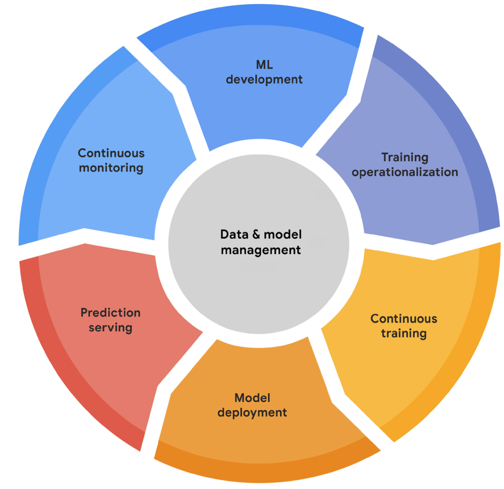
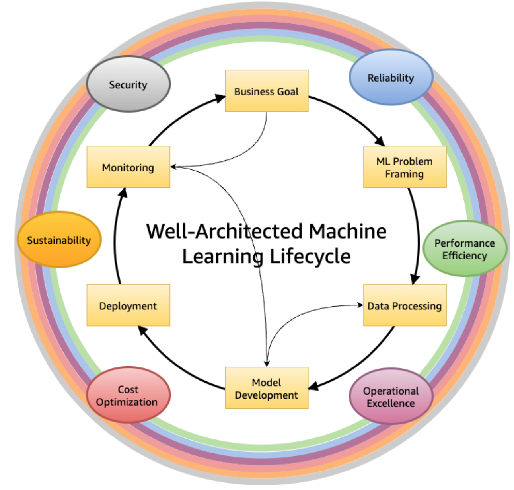
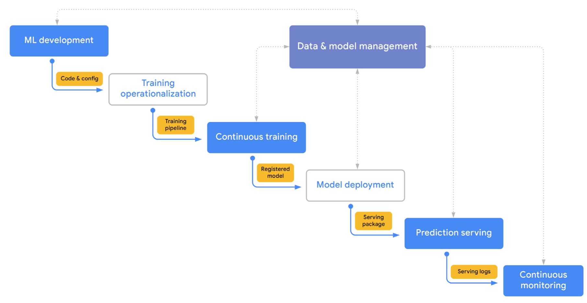
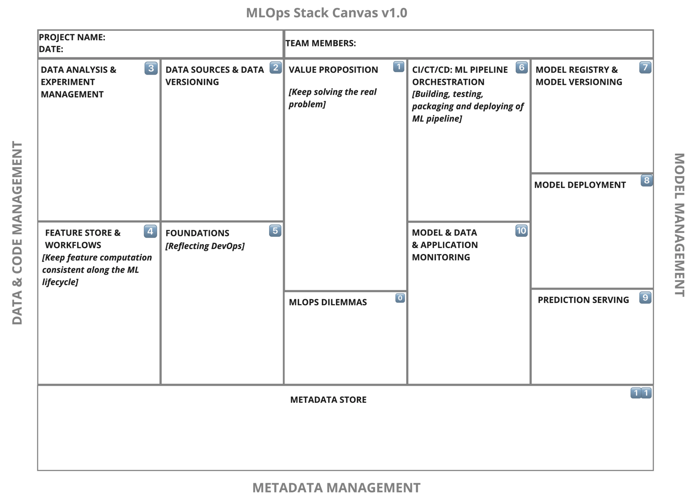
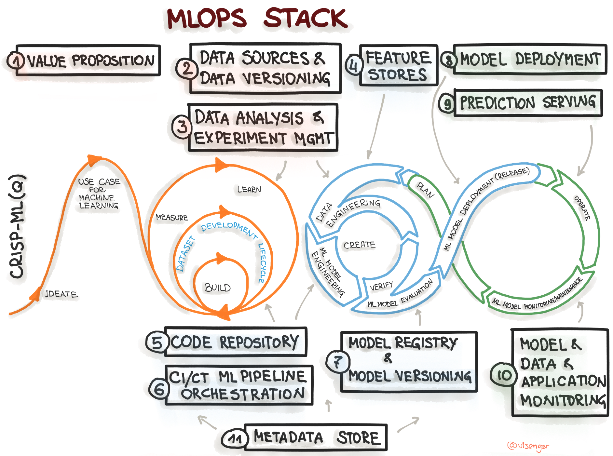
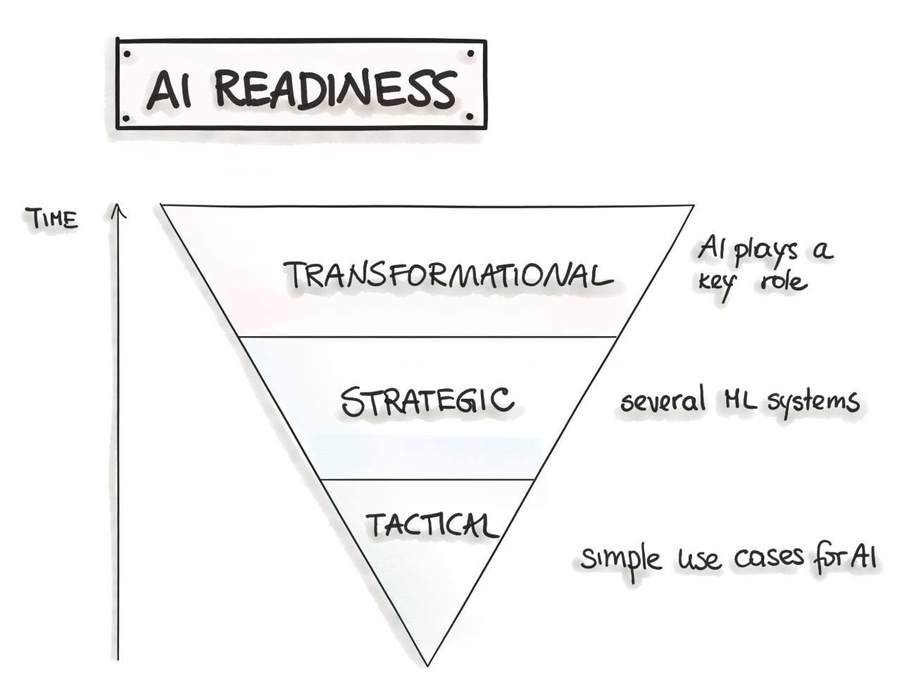
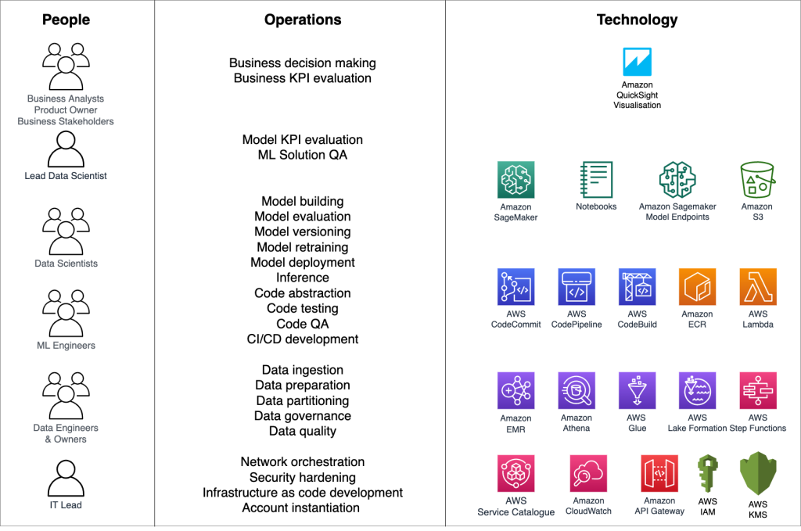
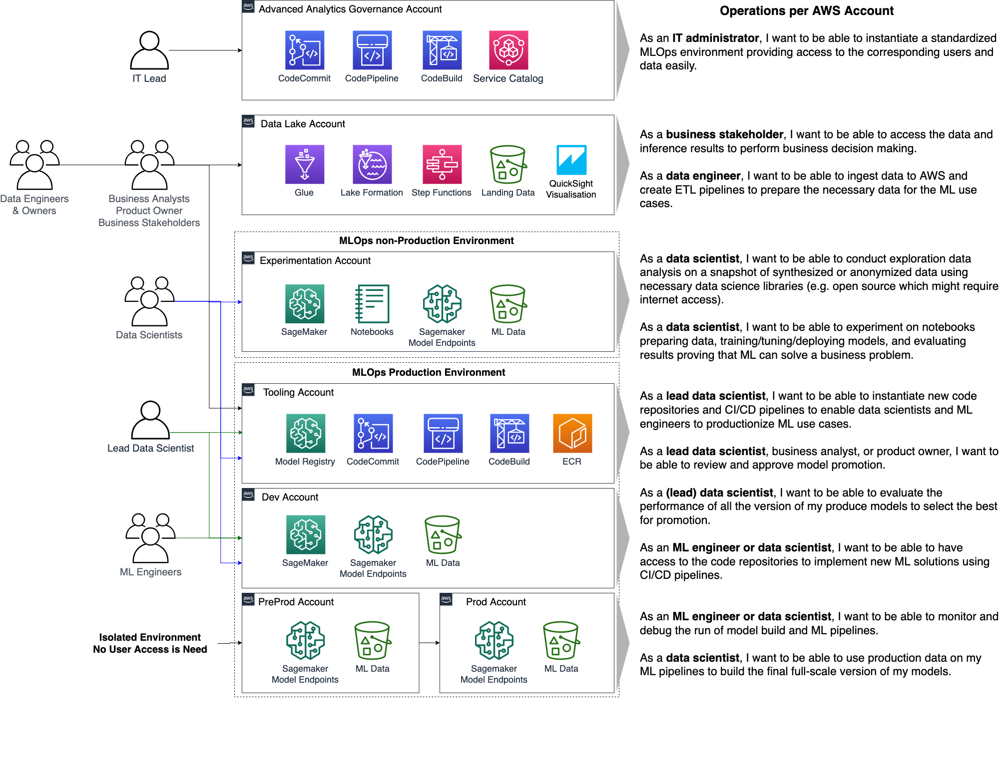
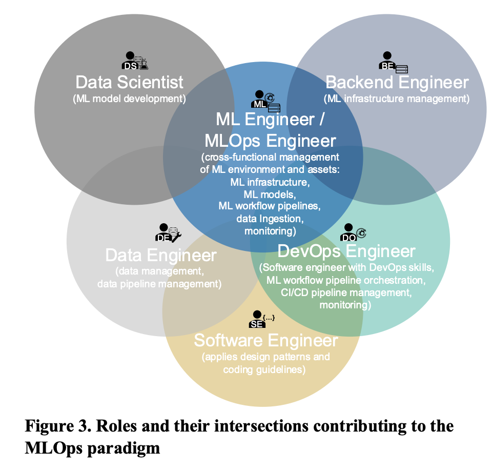

# The MLOps Blueprint & Operational Strategy

**Chapter 2: Designing the Michelin-Grade Kitchen – The MLOps Blueprint & Operational Strategy**

*(Progress Label: 📍Stage 2: The Kitchen Blueprint & Operational Plan)*

### 🧑‍🍳 Introduction: Beyond the Recipe – Architecting the Entire Kitchen

In Chapter 1, we defined the concept for our restaurant and envisioned its signature dish – the ML problem we aim to solve. But a brilliant recipe alone doesn't guarantee a Michelin star. Success requires a meticulously designed kitchen, streamlined processes, skilled staff, and rigorous standards that ensure every plate served meets the highest quality, consistently and efficiently.

Welcome to the MLOps Blueprint. This chapter moves beyond the *what* (the ML problem) to the *how*: the overarching strategy, principles, and infrastructure required to build, deploy, and maintain machine learning systems reliably and at scale. MLOps is the operational discipline – the design of our entire "Michelin-Grade Kitchen" – that transforms experimental ML models ("recipes") into robust, value-generating products ("consistent, five-star dining experiences").

We'll explore the core principles that guide a well-run MLOps kitchen, map out the essential production line (lifecycle), define the necessary equipment and stations (capabilities and stack), and discuss how to staff and manage the operation for sustained excellence. This chapter provides the strategic framework needed before we start setting up individual kitchen stations in the chapters that follow.

---

### Section 2.1: What is MLOps? (Defining Our Culinary Operations)

MLOps stands for Machine Learning Operations. It's an engineering culture and practice that aims to unify ML system development (Dev) and ML system operation (Ops). Think of it as an extension and adaptation of DevOps principles specifically tailored for the unique world of machine learning.

*   **2.1.1 The Evolution from DevOps to MLOps**
    DevOps revolutionized traditional software development by breaking down silos between development and operations teams, emphasizing automation, collaboration, and rapid iteration. MLOps inherits these goals but adapts them for ML systems. While standard software mainly deals with *code*, ML systems involve *code, data, and models* as first-class entities, each with its own lifecycle and complexities.
*   **2.1.2 Unique Challenges of ML Systems vs. Traditional Software**
    MLOps is necessary because ML systems introduce unique challenges not typically found in conventional software: 
    *   **Team Skills:** ML requires collaboration between data scientists (focused on experimentation), ML engineers (focused on productionization), and operations teams, often with different skill sets and cultures.
    *   **Experimental Nature:** ML development is highly iterative and experimental. Tracking experiments and ensuring reproducibility is crucial but difficult.
    *   **Complex Testing:** Testing involves validating not just code, but also data quality, data schemas, model quality, and fairness.
    *   **Complex Deployment:** Deploying an ML system often means deploying a multi-step *pipeline* (for retraining), not just a static model artifact.
    *   **Model Decay:** Models degrade in production due to changing data profiles (drift), requiring continuous monitoring and retraining (Continuous Training - CT).
    *   **Data Dependencies:** ML models are tightly coupled with the data they were trained on. Data issues (quality, lineage, versioning) directly impact model performance.
*   **2.1.3 Core Goals of MLOps: Speed, Reliability, Scalability, Collaboration**
    Implementing MLOps aims to achieve tangible benefits:
    *   **Speed:** Faster experimentation and shorter development cycles (faster time-to-market).
    *   **Reliability:** Dependable, reproducible releases and robust production systems.
    *   **Scalability:** Ability to manage numerous models and handle growing data/traffic volumes.
    *   **Collaboration:** Improved teamwork between data science, engineering, and operations.
    *   **Governance:** Streamlined processes for auditability, compliance, and risk management.

---

### Section 2.2: The MLOps Lifecycle: An End-to-End Workflow (Mapping the Full Production Line)

MLOps encompasses the entire lifecycle of an ML model, from initial development to long-term operation. Several frameworks describe this lifecycle.

**End-to-End Machine Learning Workflow**

- [Source: mlops.org: An Overview of the End-to-End Machine Learning Workflow](https://ml-ops.org/content/end-to-end-ml-workflow)

*   **2.2.1 Overview of Key MLOps Processes**
    We can adapt Google's MLOps lifecycle or the CRISP-ML(Q) process. Both emphasize similar key stages:

    **The MLOps Lifecycle**

    

    - [Google: Practitioners guide to MLOps: A framework for continuous delivery and automation of machine learning](https://services.google.com/fh/files/misc/practitioners_guide_to_mlops_whitepaper.pdf)

    *   **ML Development:** Experimenting, prototyping, data prep, model training & evaluation (offline). Output: Formalized training pipeline code/definition.
    *   **Training Operationalization:** Building, testing, and deploying the training pipeline itself (CI/CD for the pipeline). Output: A deployable training pipeline.
    *   **Continuous Training (CT):** Automatically executing the training pipeline based on triggers (new data, schedule, decay). Output: A trained, validated, and registered model.
    *   **Model Deployment:** Packaging, testing, and deploying the *trained model* to a serving environment. Output: A prediction service.
    *   **Prediction Serving:** Handling inference requests (online, batch, streaming). Output: Predictions.
    *   **Continuous Monitoring:** Tracking model effectiveness (accuracy, drift) and efficiency (latency, resources). Output: Performance metrics, alerts, potential retraining triggers.
    *   **Data and Model Management:** Central governance of ML artifacts (datasets, features, models, metadata) for auditability, reproducibility, and compliance.

*   **2.2.2 The Iterative and Interconnected Nature of MLOps**
    This lifecycle is not linear waterfall. It's highly iterative, with feedback loops connecting various stages. Monitoring results might trigger retraining; deployment issues might require revisiting development; new business needs identified during operation might loop back to the initial ML development phase.

    **AWS Well-Architected ML lifecycle phases**

    

    - [Source: AWS Well-Architected Framework: Machine Learning Lens](https://docs.aws.amazon.com/wellarchitected/latest/machine-learning-lens/machine-learning-lens.html)

    **Simplified MLOps End-to-End Workflow**

    

    - [Google: Practitioners guide to MLOps: A framework for continuous delivery and automation of machine learning](https://services.google.com/fh/files/misc/practitioners_guide_to_mlops_whitepaper.pdf)

---

### Section 2.3: Core MLOps Design Principles (Our Kitchen's Guiding Philosophies)

These principles form the bedrock of a successful MLOps implementation. [MLOps Principles.md, mlops-foundation-roadmap-for-enterprises-with-amazon-sagemaker.md (Page 14), Guidelines for developing high-quality, predictive ML solutions.md]

*   **2.3.1 Automation:** Automate everything possible – data pipelines, model training, testing, deployment, infrastructure provisioning (IaC). Reduces manual effort, errors, and increases speed.
*   **2.3.2 Reproducibility:** Ensure experiments, pipeline runs, and model predictions can be reliably reproduced. This requires meticulous versioning.
    *   *Versioning:* Treat code, data, models, parameters, and environments as versioned artifacts. Use tools like Git (code), DVC (data), Model Registries (models).
*   **2.3.3 Continuous X:** Implement CI/CD/CT/CM.
    *   *CI (Continuous Integration):* Test and validate code, data, and models frequently.
    *   *CD (Continuous Delivery/Deployment):* Reliably release pipeline updates and new model versions.
    *   *CT (Continuous Training):* Automatically retrain models to adapt to new data/patterns.
    *   *CM (Continuous Monitoring):* Constantly track production performance and health.
*   **2.3.4 Comprehensive Testing:** Implement rigorous testing across the lifecycle.
    *   *Data Tests:* Validate schema, distributions, quality.
    *   *Model Tests:* Unit tests for code, training convergence checks, evaluation against metrics, fairness/bias tests.
    *   *Infrastructure Tests:* Reproducibility checks, pipeline integration tests, deployment validation (canary/shadow).
*   **2.3.5 Monitoring and Observability:** Go beyond simple metrics. Instrument systems to understand *why* failures happen. Log extensively. Track lineage.
*   **2.3.6 Modularity & Reusability:** Design loosely coupled components (pipelines, feature logic, models) that can be independently developed, tested, deployed, and reused.
*   **2.3.7 Scalability:** Design systems that can handle growth in data volume, model complexity, number of models, and request load.
*   **2.3.8 Collaboration & Defined Roles:** Foster collaboration between diverse roles (Data Science, MLE, Ops, etc.) with clear ownership and responsibilities.
*   **2.3.9 Governance, Security, and Compliance by Design:** Integrate checks and processes for security, compliance (e.g., GDPR, EU AI Act), auditability, and responsible AI throughout the lifecycle.

---

### Section 2.4: The MLOps Stack Canvas: Architecting Your System (The Kitchen Layout Plan)

The MLOps Stack Canvas provides a framework to systematically plan the architecture and infrastructure components needed for your specific ML project. It helps translate MLOps principles and capabilities into concrete choices. 

*   **2.4.1 Introduction to the MLOps Stack Canvas Framework**
    *   Purpose: Structure workflows, architecture, and infrastructure choices.
    *   Analogy: Like a Business Model Canvas, but for MLOps tech stack.
    *   Structure: Data/Code Management, Model Management, Metadata Management blocks.

    **The MLOps Stack Canvas**
    

    - [Source: mlops.org: MLOps Stack Canvas](https://ml-ops.org/content/mlops-stack-canvas)

    **Mapping the CRISP-ML(Q) process model to the MLOps stack**
    

    - [Source: mlops.org: MLOps Stack Canvas](https://ml-ops.org/content/mlops-stack-canvas)

*   **2.4.2 Block 1: Value Proposition (Revisiting the "Why")**
    *   *Key Questions:* What problem does this ML system solve for the user/business? Why is it important? Who is the user? Who owns the production model?
    *   *Relevant Capability:* Aligning with Business Goals (from Chapter 1).
*   **2.4.3 Block 2: Data Sources and Data Versioning (The Pantry & Inventory System)**
    *   *Key Questions:* Mandatory versioning? Data sources (owned, public, paid)? Storage (lake, DWH)? Labeling required? How to version data? Data pipeline tooling?
    *   *Capability Deep Dive:* Data Ingestion, Data Storage, Data Versioning (DVC, Git LFS), Data Governance (access, privacy).
*   **2.4.4 Block 3: Data Analysis and Experiment Management (The Chef's Lab Notebook)**
    *   *Key Questions:* Language (Python, R, SQL)? Infra needs for training? Evaluation metrics (business & ML)? How to track experiments (metadata, params, data)? ML Frameworks?
    *   *Capability Deep Dive:* Experimentation Environments (Notebooks, IDEs), Experiment Tracking tools (MLflow, W&B, Vertex AI Experiments, SageMaker Experiments), ML Frameworks (TF, PyTorch). 
*   **2.4.5 Block 4: Feature Store and Workflows (The Spice Rack & Prep Instructions)**
    *   *Key Questions:* Mandatory? How are features computed (train vs. serve)? Infra needs? Buy vs. Make? Databases involved? APIs?
    *   *Capability Deep Dive:* Feature Engineering Tools, Feature Stores (Feast, Tecton, Vertex AI Feature Store, SageMaker Feature Store), Data Processing Capabilities (Batch/Stream), Workflow Orchestration.
*   **2.4.6 Block 5: Foundations (DevOps & Code Management) (Kitchen Utensils & Basic Hygiene)**
    *   *Key Questions:* Source control (Git)? System monitoring? Notebook versioning? Trunk-based dev? CI/CD for code? DevOps metrics (DORA)?
    *   *Capability Deep Dive:* Source Control, CI/CD Systems, Testing Frameworks, Monitoring Tools (for infra).
*   **2.4.7 Block 6: Continuous Integration, Training, and Deployment (ML Pipeline Orchestration) (The Automated Assembly Line)**
    *   *Key Questions:* Retraining frequency/trigger? Where (local/cloud)? Workflow definition? Distributed training needed? CI pipeline tools? Non-functional requirement testing (fairness, robustness)?
    *   *Capability Deep Dive:* ML Pipeline Orchestrators (Kubeflow, SageMaker Pipelines, Airflow, Vertex AI Pipelines), CI/CD for ML Pipelines, Automated Testing Frameworks.
*   **2.4.8 Block 7: Model Registry and Model Versioning (The Recipe Book Archive)**
    *   *Key Questions:* Mandatory? Where to store/track models? Versioning standards (semantic)?
    *   *Capability Deep Dive:* Model Registries (MLflow, SageMaker, Vertex AI), Model Versioning Strategies.
*   **2.4.9 Block 8: Model Deployment & Prediction Serving (The Serving Counter & Delivery)**
    *   *Key Questions:* Delivery format? Target environment? Release policy (A/B, canary)? Deployment strategy? (shadow/canary)
    *   *Capability Deep Dive:* Model Serving Frameworks (TF Serving, TorchServe, Triton), Deployment Platforms (Kubernetes, Serverless, SageMaker Endpoints, Vertex AI Endpoints), Online Experimentation Tools.
*   **2.4.10 Block 9: ML Model, Data, and System Monitoring (Quality Control Inspector)**
    *   *Key Questions:* Mandatory? Metrics (ML, domain)? Decay/Drift detection? Operational monitoring? Alerting strategy? Retraining triggers?
    *   *Capability Deep Dive:* Monitoring Platforms (CloudWatch, Datadog, ML-specific tools like WhyLabs, Arize), Alerting Systems, Drift Detection Algorithms.
*   **2.4.11 Block 10: Metadata Store (The Central Kitchen Logbook)**
    *   *Key Questions:* What metadata to collect? Governance needs? Documentation strategy (Datasheets, Model Cards)? Operational metrics?
    *   *Capability Deep Dive:* ML Metadata Management Tools (MLMD, MLflow Tracking), Artifact Repositories.
*   **2.4.12 Overarching Considerations: Build vs. Buy, Platform Choices, Skills**
    *   Revisiting the Build vs. Buy decision for each component.
    *   Choosing an integrated platform vs. best-of-breed tools.
    *   Assessing required team skills vs. available tooling.

---

### Section 2.5: MLOps Maturity Levels (Phasing the Kitchen Construction)

Organizations adopt MLOps practices progressively. Understanding these levels helps set realistic goals.

*   **2.5.1 Level 0: Manual Processes (The Home Cook Experimenting)**
    *   *Characteristics:* Manual, script-driven, interactive; Disconnected Dev/Ops; Infrequent releases; No CI/CD; Deployment = Prediction Service only; Limited monitoring.
    *   *Challenges:* Slow iteration, error-prone, reproducibility issues, model decay unnoticed.
*   **2.5.2 Level 1: ML Pipeline Automation (The Professional Prep Cook)**
    *   *Characteristics:* Rapid experimentation via orchestrated pipelines; Continuous Training (CT) automated; Experimental-operational symmetry; Modular code; Continuous Delivery of models;
    *   *Key Additions:* Automated Data/Model Validation, Feature Store (optional), Metadata Management, Pipeline Triggers.
    *   *Challenges:* Pipeline updates are often manual; CI/CD for the pipeline itself is missing.
*   **2.5.3 Level 2: CI/CD Pipeline Automation (The Fully Automated Kitchen Line)**
    *   *Characteristics:* Adds robust, automated CI/CD for rapid/reliable pipeline updates; Automated build, test, deploy of pipeline components.
    *   *Key Additions:* Source Control, Test/Build Services, Deployment Services, Model Registry, Feature Store, Metadata Store, Pipeline Orchestrator (all fully integrated).
*   **2.5.4 Aligning with AI Readiness (Tactical, Strategic, Transformational)**
    *   Mapping MLOps maturity to broader organizational AI adoption stages. [MLOps Stack Canvas.md]

**Aligning with AI Readiness (Tactical, Strategic, Transformational)**

- [Source: mlops.org: MLOps Stack Canvas](https://ml-ops.org/content/mlops-stack-canvas)

---

### Section 2.6: Documenting MLOps Architecture (Architectural Decision Records - ADRs)

A lightweight method for capturing key architectural decisions and their rationale during the planning phase.

*   *Purpose:* Track choices made for specific MLOps components (e.g., "Why we chose MLflow for experiment tracking").
*   *Format:* Context, Decision, Consequences.

*   The following is a simplified example of such [ARD](https://ml-ops.org/content/mlops-stack-canvas).

    *   **ARD**: Dataset versioning.

    *   **Context**: As requested by the regulatory requirements, every retraining of the ML model should be in sync with the changes in the dataset.

    *   **Decision**: The ML model should be retrained whenever a new batch of data points is collected. Therefore, we decided to use DVC to track datasets and ML models. An alternative solution would be LakeFS.

    *   **Consequences**: We need to move our data storage to the DVC-supported storage mechanisms. Additionally, upskilling our team members is required.
---

### Section 2.7: Roles and Responsibilities in MLOps (Staffing the Kitchen)

Successful MLOps requires a diverse team with clear roles and effective collaboration.

*   **2.7.1 Key Personas:** Data Scientist, ML Engineer, MLOps Engineer, Data Engineer, Platform Engineer, Software Engineer, Domain Expert (SME), Product Manager, IT/Security/Compliance, Business Stakeholders.
*   **2.7.2 Collaboration Models:**
    *   *Approach 1:* Separate Teams (DS/ML vs. Platform/Ops) - Pros (specialization, easier hiring), Cons (handoffs, overhead, debugging challenges, narrow context).
    *   *Approach 2:* Data Scientists Own End-to-End ("Full-Stack DS") - Pros (faster iteration, full context), Cons (requires "unicorn" skills, potential for boilerplate).
    *   *Approach 3:* Hybrid/Platform-Enabled - Specialists build tools/platforms, enabling DS/MLE to own end-to-end workflow with abstractions.
*   **2.7.3 Structuring ML Teams for Success:** Aligning team structure with organizational ML maturity and goals (R&D vs. Embedded vs. Centralized vs. ML-First).

**Key Personas**

- [Source: AWS: MLOps foundation roadmap for enterprises with Amazon SageMaker](https://aws.amazon.com/blogs/machine-learning/mlops-foundation-roadmap-for-enterprises-with-amazon-sagemaker)

**Personas, operations, and technology summary**

- [Source: AWS: MLOps foundation roadmap for enterprises with Amazon SageMaker](https://aws.amazon.com/blogs/machine-learning/mlops-foundation-roadmap-for-enterprises-with-amazon-sagemaker)

- [Source: Machine Learning Operations (MLOps): Overview, Definition, and Architecture](https://arxiv.org/pdf/2205.02302)

---

### Project: "Trending Now" – Blueprinting MLOps Strategy

Let's apply the concepts from this chapter to define the initial MLOps strategy for our "Trending Now" application.

*   **2.P.1 Applying MLOps Principles to "Trending Now"**
    *   *Automation:* Target automation for data ingestion, LLM inference calls, and potentially model retraining (if XGBoost/BERT path is further developed). CI/CD for backend API.
    *   *Reproducibility:* Version control for code (FastAPI, frontend, scraping scripts), data (using DVC for scraped data/labels), model artifacts (XGBoost/BERT in registry), prompts (versioned config/code), and environment (Docker).
    *   *Continuous X:* Implement CI/CD for backend/frontend. Design for potential CT for the XGBoost/BERT model based on new data or performance monitoring. Implement CM for LLM API calls (cost, latency, errors) and model outputs.
    *   *Testing:* Unit tests for backend logic, data validation checks for scraped data, testing LLM prompt effectiveness (offline), integration tests for API.
    *   *Monitoring:* Focus on LLM cost, latency, API errors, output quality (drift in scores/tags), operational metrics of FastAPI service.
    *   *Modularity:* Separate FastAPI backend, frontend, data ingestion pipeline, inference pipeline.
*   **2.P.2 Using the MLOps Stack Canvas to Plan "Trending Now" Infrastructure**
    *   *(Walk through key canvas blocks)*
    *   *Data Sources/Versioning:* Web scraping (APIs/HTML), store raw/processed data (e.g., S3/local Parquet), use DVC for versioning.
    *   *Experiment Management:* Minimal for LLM (prompt variations tracked in Git). Required if developing XGBoost/BERT (MLflow/W&B).
    *   *Feature Store:* Not strictly necessary initially; features (plot/review text) are directly passed to LLM. Could be considered later if complex features are derived.
    *   *CI/CD/CT Orchestration:* GitHub Actions for backend CI/CD. Simple scheduler (cron) or manual trigger for ingestion. Orchestrator less critical initially, could use basic scripts or serverless workflows (AWS Step Functions/Lambda).
    *   *Model Registry:* Minimal registry needed for LLM (track prompt versions/model endpoints). Essential for XGBoost/BERT (SageMaker/MLflow).
    *   *Deployment/Serving:* FastAPI backend (e.g., on AWS App Runner, Google Cloud Run, or simple EC2/VM), LLM via API.
    *   *Monitoring:* CloudWatch/Datadog for basic infra/API monitoring; custom logging/analysis for LLM cost/output drift.
    *   *Metadata Store:* Simple logging initially; potentially MLflow for tracking related artifacts if XGBoost/BERT is developed.
    *   *Build vs Buy:* Buy LLM API. Build backend/frontend/ingestion scripts. Use open-source/managed services for MLOps components where feasible (e.g., Git, DVC, potentially MLflow).
*   **2.P.3 Determining the Initial MLOps Maturity Level for the Project**
    *   Likely starts between Level 0 and Level 1. Manual experimentation (prompt engineering), potentially automated data ingestion pipeline, manual deployment of backend service. Aim to move towards Level 1/2 for the components we build (e.g., CI/CD for backend).
*   **2.P.4 Defining Roles for the "Trending Now" Project Team (Conceptual)**
    *   *ML Engineer/Backend Dev:* Builds FastAPI, integrates LLM, sets up ingestion.
    *   *Frontend Dev:* Builds HTML/CSS/JS and D3.js visualization.
    *   *(Implicit MLOps Role):* Responsible for deployment, monitoring setup, automation scripts. In a small team, this might overlap with the ML/Backend role initially.

---

### 🧑‍🍳 Conclusion: Laying the Kitchen Foundation

We've now designed the blueprint for our Michelin-Grade ML Kitchen. We understand that MLOps is more than just deploying a model; it's a comprehensive set of principles, processes, and capabilities focused on building and operating ML systems reliably and efficiently. We've mapped the entire production line, from initial development to continuous monitoring and improvement, guided by core philosophies like automation and reproducibility.

Using the MLOps Stack Canvas, we've identified the essential "stations" and "equipment" required, considering the trade-offs and maturity needed. We also understand the importance of a skilled and collaborative kitchen crew. This strategic foundation, this MLOps blueprint, is essential before we start assembling the individual parts. With this plan in place, we are ready to start gathering the highest quality ingredients in the next chapter: Data Sourcing, Discovery, and Understanding.

---

### References

- [Google: Practitioners guide to MLOps: A framework for continuous delivery and automation of machine learning](https://services.google.com/fh/files/misc/practitioners_guide_to_mlops_whitepaper.pdf)
- [AWS: MLOps foundation roadmap for enterprises with Amazon SageMaker](https://aws.amazon.com/blogs/machine-learning/mlops-foundation-roadmap-for-enterprises-with-amazon-sagemaker/?mld_ops10)
- [mlops.org: MLOps Stack Canvas](https://ml-ops.org/content/mlops-stack-canvas)
- [Designing Machine Learning Systems by Chip Huyen](https://www.oreilly.com/library/view/designing-machine-learning/9781098107956/)
- [Full Stack Deep Learning - 2022 Course](https://fullstackdeeplearning.com/course/2022/)
- [AWS Well-Architected Framework: Machine Learning Lens](https://docs.aws.amazon.com/wellarchitected/latest/machine-learning-lens/machine-learning-lens.html)

