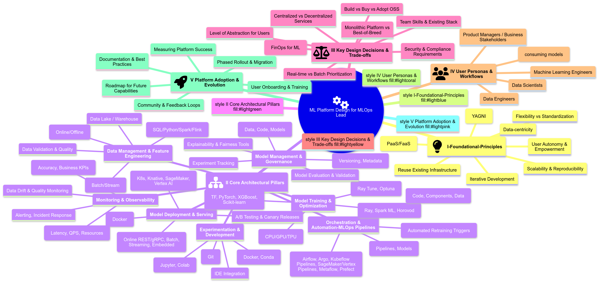

# ML Platforms: How to 

##
### The MLOps Lead's Guide to Designing & Operationalizing Machine Learning Platforms

**Preamble: From Bespoke Solutions to Scalable Ecosystems**

The era of siloed, manually-managed machine learning projects is rapidly giving way to the necessity of robust, scalable, and maintainable **Machine Learning Platforms**. As organizations like Zillow, Shopify, Uber, LinkedIn, Monzo, Coveo, Zomato, GreenSteam, and innovative ventures like Didact AI demonstrate, the ability to efficiently develop, deploy, and operate ML models is a significant competitive differentiator. This guide synthesizes their journeys, combined with MLOps best practices (as outlined by Google Cloud and AWS), to provide a thinking framework for Lead MLOps Engineers tasked with building or evolving such platforms. Our focus is on actionable insights, architectural patterns, critical trade-offs, and the "why" behind the "what."

---

**Chapter 1: The Imperative for an ML Platform - Motivations & Core Principles**

1.  **The "Why": Addressing Pervasive Challenges**
    *   **Fragmentation & Inefficiency:** DS/MLEs using disparate tools, leading to knowledge silos, difficult collaboration, and duplicated effort.
    *   **The Prototype-to-Production Chasm:** Significant friction and engineering effort to move models from research/notebooks to reliable production services. This includes code rewriting, dependency management, and infrastructure concerns.
    *   **Scalability Bottlenecks:** Training on desktop-sized data, inability to handle production load, manual scaling processes.
    *   **Lack of Standardization & Reproducibility:** Inconsistent data pipelines, "it works on my machine" issues, difficulty tracking experiments and model versions.
    *   **Operational Blindness:** Poor monitoring of models in production, leading to silent failures or performance degradation (Google MLOps).
    *   **Slow Iteration Cycles:** Manual handoffs and lack of automation significantly slow down the ability to update models or deploy new ones (All).
    *   **"Hidden Technical Debt in ML Systems":** The complexity surrounding ML code (data dependencies, configuration, monitoring, etc.) often outweighs the ML code itself.

2.  **Core Principles for ML Platform Design**
    *   **Data is King:** Accessible, clean, standardized data provides the biggest marginal gain. Platform must facilitate robust data management and feature engineering.
    *   **Empower Data Scientists & MLEs (Autonomy):** Enable end-to-end workflows, from experimentation to deployment, minimizing handoffs.
    *   **Flexibility:** Accommodate diverse ML frameworks, libraries, and problem types. Avoid overly prescriptive tooling where possible.
    *   **Reuse Over Rebuild:** Leverage existing robust infrastructure (data stacks, microservice platforms, CI/CD) and focus platform efforts on the ML-specific "delta."
    *   **PaaS/FaaS is Better than IaaS:** Abstract away infrastructure management. Utilize managed services for compute, storage, and scaling to free up ML teams.
    *   **ELT is Better than ETL:** Clear separation of raw data ingestion and transformation promotes reliability and reproducibility.
    *   **Standardization & Reproducibility:** Enforce consistent environments, versioning (code, data, models), and workflows.
    *   **Scalability & Elasticity:** Design for on-demand resource provisioning and automatic scaling (Shopify Ray on K8s, AWS MLOps, Zillow Knative/KServe).
    *   **Modularity & Composability:** Break down the ML lifecycle into reusable components/pipelines
    *   **Keep it Simple:** Don't over-engineer. Focus on current needs but allow for future evolution.

---

**Chapter 2: Anatomy of a Modern ML Platform - Key Components & Capabilities**

This chapter outlines the essential building blocks, drawing parallels across the provided examples.

| Component/Capability      | Description & Key Functions                                                                                                                               | Examples from Provided Articles                                                                                                                                                                                                                                                                                          |
| :------------------------ | :-------------------------------------------------------------------------------------------------------------------------------------------------------- | :----------------------------------------------------------------------------------------------------------------------------------------------------------------------------------------------------------------------------------------------------------------------------------------------------------------------- |
| **1. Data Management & Feature Engineering Layer** | Ingesting, storing, transforming data for ML. Creating, sharing, and serving features for training and inference.                     | **Uber Michelangelo:** Shared Feature Store (HDFS/Cassandra), DSL for transformations. **Zomato:** Real-time (Flink -> Redis) & Static (Cassandra) Feature Stores. **Shopify Merlin:** Inputs from Data Lake/Pano (feature store). **Didact AI:** DuckDB/Redis feature store, complex multi-source FE. **Monzo:** SQL-based FE in BigQuery (dbt). |
| **2. Experimentation & Development Environment** | Tools for interactive data exploration, model prototyping, and collaborative development.                                                 | **LinkedIn DARWIN:** JupyterHub on K8s, multi-language, SQL workbooks. **Shopify Merlin:** Jupyter in Merlin Workspaces (Ray on K8s). **Monzo:** Google Colab (prototyping only). **GreenSteam:** Jupyter in Docker. **AWS MLOps:** SageMaker Studio notebooks.                                                              |
| **3. Model Training Orchestration & Execution** | Systems for defining, scheduling, and running model training jobs, often distributed, with hyperparameter tuning.                          | **Uber Michelangelo:** Distributed training, custom model types. **Shopify Merlin:** Ray Train, Ray Tune on K8s. **Monzo:** Custom containers on Google Cloud AI Platform. **Zomato:** MLFlow triggering SageMaker. **GreenSteam:** Argo Workflows. **AWS MLOps:** SageMaker Pipelines, Training Jobs. **Coveo:** Metaflow. |
| **4. Model Registry & Artifact Store** | Centralized repository for versioning, storing, and managing trained models, their metadata, and associated artifacts (e.g., training data snapshots). | **Uber Michelangelo:** Cassandra-based model repo. **Monzo:** Custom Model Registry. **Zomato:** MLFlow. **GreenSteam:** Neptune.ai. **Didact AI:** Local disk + S3. **AWS MLOps:** SageMaker Model Registry. **Google MLOps:** Model Registry.                                                                        |
| **5. Model Evaluation & Validation** | Tools and processes for assessing model performance against metrics, business KPIs, and fairness/bias considerations.                             | **Uber Michelangelo:** Accuracy reports, tree viz, feature reports. **Google MLOps:** Offline & online validation, data/model validation in pipelines. **GreenSteam:** Human-in-the-loop audit reports.                                                                                                               |
| **6. Model Deployment & Serving Layer** | Infrastructure and workflows for deploying models as batch prediction jobs or real-time inference services.                                 | **Uber Michelangelo:** Offline (Spark) & Online (custom serving cluster). **Shopify Merlin:** Batch on Ray (planning online). **Monzo:** Python microservices on AWS (production stack), AI Platform for batch. **Zomato:** SageMaker endpoints, ML Gateway (Go). **GreenSteam:** FastAPI microservices. **Zillow:** KServe/Knative. |
| **7. Monitoring & Observability** | Tracking system health, model performance, data drift, and concept drift in production. Alerting on issues.                                   | **Uber Michelangelo:** Live accuracy monitoring. **Monzo:** Grafana (system), Looker (model perf), dbt-slack (features). **Zomato:** Grafana. **GreenSteam:** Kibana, Sentry. **Google MLOps:** Continuous monitoring. **Didact AI:** Custom Python reports, Feature Explorer.                                      |
| **8. Workflow Orchestration & MLOps Pipelines** | Automating the end-to-end ML lifecycle, including CI/CD for models and pipelines, and CT.                                             | **Google MLOps:** Levels 0, 1, 2 detailing pipeline automation. **AWS MLOps:** SageMaker Projects, Pipelines, CodePipeline. **Shopify Merlin:** Airflow/Oozie. **Monzo:** Airflow. **GreenSteam:** Argo. **Coveo:** Prefect.                                                                                                   |
| **9. Metadata & Artifact Tracking** | System for capturing, storing, and querying metadata about all aspects of the ML lifecycle (experiments, data, models, pipeline runs).          | **Google MLOps:** ML Metadata & Artifact Repository. **LinkedIn DARWIN:** DataHub for resource metadata. **Neptune.ai / MLFlow** are common tools.                                                                                                                                                                        |
| **10. Governance & Compliance** | Ensuring security, privacy, auditability, and responsible AI practices throughout the platform.                                                 | **LinkedIn DARWIN:** Audit trails, fine-grained access control. **Google MLOps:** Handling model fairness, data privacy. **AWS MLOps:** Secure multi-account setup, IAM.                                                                                                                                                      |

**Illustrative High-Level ML Platform Architecture:**

---

**Chapter 3: MLOps Maturity & Pipeline Automation**

1.  **MLOps Level 0: Manual Process**
    *   **Characteristics:** Script-driven, interactive, manual handoffs between DS and Ops, infrequent releases, no CI/CD, focus on deploying model as prediction service, lack of active monitoring. (Google MLOps)
    *   **Challenges:** Model decay, slow iteration, training-serving skew. (Google MLOps)
    *   **GreenSteam's early days** and **Zomato pre-platform** exemplify this.

2.  **MLOps Level 1: ML Pipeline Automation (Continuous Training - CT)**
    *   **Goal:** Automate the ML pipeline for CT, achieve continuous delivery of model prediction service. (Google MLOps)
    *   **Characteristics:** Orchestrated experiment steps, CT in production, experimental-operational symmetry, modularized/containerized code. (Google MLOps)
    *   **Additional Components:** Automated Data Validation, Automated Model Validation, Feature Store (optional but beneficial), Metadata Management, Pipeline Triggers (on-demand, schedule, new data, model decay). (Google MLOps)
    *   **AWS MLOps Initial & Repeatable Phases:** Focus on experimentation (SageMaker Studio) then automating training workflows (SageMaker Pipelines), model registry. Emphasis on multi-account strategy for dev/tooling/data lake.
    *   **Shopify Merlin's initial focus on training and batch inference** aligns here.

3.  **MLOps Level 2: CI/CD Pipeline Automation**
    *   **Goal:** Robust, automated CI/CD system for rapid and reliable updates to ML pipelines themselves. (Google MLOps)
    *   **Characteristics & Stages:**
        *   Development & Experimentation (source code for pipeline steps).
        *   Pipeline Continuous Integration (build, unit/integration tests for pipeline components).
        *   Pipeline Continuous Delivery (deploy pipeline artifacts to target env).
        *   Automated Triggering (of the deployed pipeline for CT).
        *   Model Continuous Delivery (serve trained model as prediction service, progressive delivery - canary, A/B).
        *   Monitoring (live data stats, model performance).
    *   **AWS MLOps Reliable & Scalable Phases:** Introduces automated testing, pre-production/staging environments, manual approvals for promotion, templatization (SageMaker Projects) for onboarding multiple teams/use cases, advanced analytics governance account.
    *   **Zillow's focus on "service as online flow" and automatic deployments** points to this level.

---

**Chapter 4: Designing Your ML Platform - A Lead's Decision Framework**

1.  **Understanding Your Context & Constraints ("Reasonable Scale" - Coveo)**
    *   **Team Size & Skills:** DS, MLE, Data Engineers, Ops. Autonomy vs. specialized roles.
    *   **Data Volume & Velocity:** TBs vs PBs, batch vs real-time.
    *   **Number of Models & Use Cases:** Dozens vs. hundreds.
    *   **Budget & Resources:** Affects build vs. buy, managed vs. self-hosted.
    *   **Existing Infrastructure:** Leverage or rebuild? (Monzo principle)
    *   **Time-to-Market Pressure.**

2.  **Key Architectural Choices & Trade-offs**
    *   **Build vs. Buy vs. Adopt OSS:**
        *   **Build:** Full control, custom fit, high initial cost/effort (Uber often builds significantly).
        *   **Buy (Commercial MLaaS/Point Solutions):** Faster setup, vendor support, potential lock-in, cost (Coveo advocates PaaS).
        *   **Adopt OSS:** Flexibility, community, no license cost, self-management overhead (Shopify, Zomato, GreenSteam, LinkedIn heavily use OSS like Ray, Kubeflow, MLFlow, Flink, Argo, Neptune).
    *   **Monolithic Platform vs. Best-of-Breed Integration:**
        *   **Monolithic (e.g., SageMaker, Vertex AI):** Integrated experience, potentially less flexibility.
        *   **Best-of-Breed:** Choose top tools for each component, integration challenge (Monzo, Coveo lean this way).
    *   **Degree of Abstraction for Users:**
        *   **Low-Code/No-Code vs. Code-First:** Catering to citizen DS vs. expert MLEs (LinkedIn DARWIN aims for both).
        *   **Shopify Merlin:** Python-centric, aiming to abstract K8s/Ray complexities.
        *   **Zillow:** Pythonic "service as online flow" to abstract web service concepts.
    *   **Centralized vs. Decentralized Components:**
        *   **Feature Store:** Centralized (Uber) vs. federated.
        *   **Model Registry:** Typically centralized.
        *   **Compute:** Shared clusters vs. dedicated per-user/project (Shopify Merlin Workspaces).
    *   **Data Ingestion & Processing Strategy for ML:**
        *   ELT for raw data, then ML-specific transformations.
        *   Real-time feature computation (Flink - Zomato, Samza - Uber).
        *   Batch feature computation (Spark - Uber, dbt+BigQuery - Monzo).
    *   **Serving Strategy:**
        *   Online (REST APIs, gRPC) vs. Batch vs. Streaming vs. Embedded.
        *   CPU vs. GPU for inference.
        *   Serverless (Knative - Zillow) vs. Provisioned.
    *   **Environment Management:**
        *   Docker/Containers are standard (GreenSteam, Shopify, AWS MLOps).
        *   Kubernetes for orchestration (Shopify, LinkedIn DARWIN, Zillow).
        *   Dedicated workspaces/sandboxes (Shopify Merlin, LinkedIn DARWIN).

3.  **User Experience (UX) and Developer Productivity**
    *   **Target Personas:** Who are you building for? (DS, MLE, Analysts).
    *   **Seamless Workflow:** Minimize context switching. (LinkedIn DARWIN).
    *   **Reproducibility:** Versioning data, code, models, environments. (GreenSteam, Monzo).
    *   **Collaboration Features:** Sharing notebooks, features, models. (LinkedIn DARWIN).
    *   **Ease of Onboarding:** Templates, CLIs, SDKs. (Shopify Merlin Projects, AWS SageMaker Projects).

4.  **Iterative Platform Development**
    *   Start with core needs (e.g., training, batch inference - Shopify).
    *   Phased rollout based on MLOps maturity (AWS).
    *   Gather user feedback continuously (LinkedIn DARWIN User Council).

---

**Chapter 5: Lessons Learned from the Trenches**

*   **Start Simple, Iterate (GreenSteam YAGNI):** Avoid over-engineering for future unknowns.
*   **Embrace Docker/Containers Early (GreenSteam):** Solves dependency and reproducibility issues significantly.
*   **SQL is Powerful for Feature Engineering (Monzo, Coveo):** Leverage the power of data warehouses for transformations before ML-specific steps. dbt is a key enabler.
*   **Managed Services are Your Friend (Coveo, Monzo, Zomato):** Reduce operational burden, especially at "reasonable scale."
*   **Abstract Complexity from Users (Shopify, Zillow):** Data scientists should focus on ML, not K8s YAML or web server internals. Pythonic SDKs are favored.
*   **Testing ML is Hard (GreenSteam):** Unit tests for ML code can be tricky. Smoke tests on full datasets (with fast hyperparams) can be more effective.
*   **Human-in-the-Loop is Often Unavoidable (GreenSteam):** Especially for model auditing and ensuring business alignment, despite automation efforts.
*   **Feature Stores are Foundational:** They solve training-serving skew and promote feature reuse (Uber, Zomato).
*   **MLFlow is a Popular Starting Point for Experiment Tracking & Registry (Zomato).**
*   **Ray is Gaining Traction for Distributed Python ML (Shopify).**
*   **Orchestration is Key:** Airflow, Argo, Prefect, Metaflow, SageMaker/Vertex Pipelines are essential for automating complex workflows.
*   **Monitoring is Multi-faceted:** System health, data drift, model performance, business KPIs.
*   **Culture of Autonomy and Ownership:** Platforms should empower teams, not create new bottlenecks.

---

**Chapter 6: The Future of ML Platforms**

*   **Greater Abstraction & Automation:** Further reduction of boilerplate and infrastructure management.
*   **Convergence of Data & ML Stacks:** Tighter integration between data warehouses/lakes and ML training/serving.
*   **Rise of Real-time/Online Learning Capabilities:** Platforms need to better support models that adapt continuously.
*   **Specialized Hardware Acceleration becoming Mainstream:** Easier access and management of GPUs/TPUs.
*   **Enhanced Model Governance & Responsible AI Features:** Built-in tools for fairness, explainability, privacy.
*   **Democratization through Low-Code/No-Code Interfaces:** While still providing power for expert users.
*   **OSS Continues to Drive Innovation:** With enterprise-grade managed offerings built on top.

---

**ML Platform Design - MLOps Lead's Mind Map (Mermaid)**

### References

- [Uber: Meet Michelangelo: Uber’s Machine Learning Platform](https://www.uber.com/en-IN/blog/michelangelo-machine-learning-platform/)

- [System Architectures for Personalization and Recommendation](https://netflixtechblog.com/system-architectures-for-personalization-and-recommendation-e081aa94b5d8)

- [Near Real-Time Netflix Recommendations Using Apache Spark Streaming](https://www.slideshare.net/slideshow/near-realtime-netflix-recommendations-using-apache-spark-streaming-with-nitin-sharma-and-elliot-chow/102214667)

- [Shopify: The Magic of Merlin: Shopify's New Machine Learning Platform](https://shopify.engineering/merlin-shopify-machine-learning-platform)

- [Coveo: You Don't Need a Bigger Boat: Recommendations at Reasonable Scale in a (Mostly) Serverless and Open Stack](https://github.com/jacopotagliabue/you-dont-need-a-bigger-boat)

- [Monzo’s machine learning stack](https://monzo.com/blog/2022/04/26/monzos-machine-learning-stack)

- [Real-time Machine Learning Inference Platform at Zomato](https://www.youtube.com/watch?v=0-3ES1vzW14)

- [Didact AI: The anatomy of an ML-powered stock picking engine](https://principiamundi.com/posts/didact-anatomy/)
