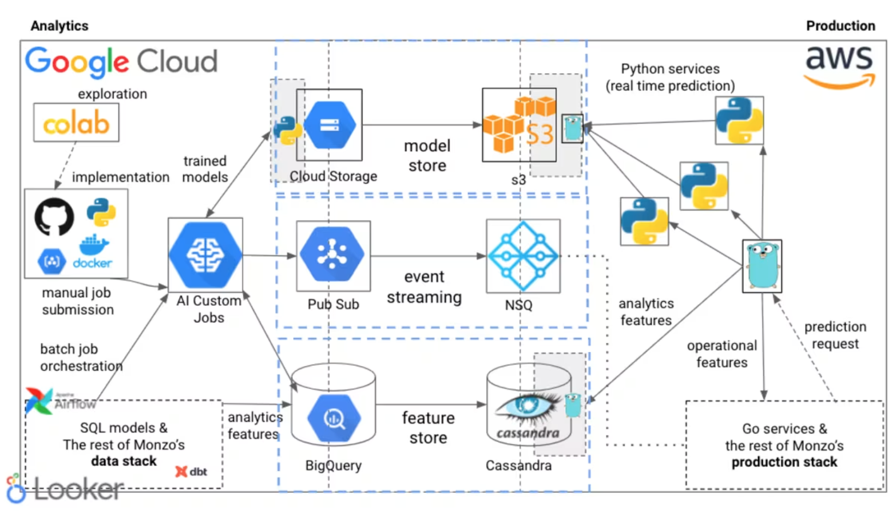

# Monzo ML Stack

**Platform**

- [Monzo’s machine learning stack](https://monzo.com/blog/2022/04/26/monzos-machine-learning-stack)

**Introduction**

*   **ML at Monzo:** Used across various banking areas, including financial crime prevention and customer service optimization.
*   **Focus of Post:** Monzo's ML platform and tools, refined over several years to enable fast and safe development.

**Our early principles**

1.  **Autonomy:** Empower ML practitioners to work end-to-end, including deploying their own models to production, without handover to backend engineers. Goal: Speed up development and encourage end-use consideration during design.
2.  **Flexibility:** Avoid constraining to specific frameworks or ML types, allowing practitioners to pick the "right tool for the job" for diverse problems and data.
3.  **Reuse over rebuild:** Leverage Monzo's existing strong microservice production stack (Go-based) and evolving data stack, rather than building an isolated ML stack. Focus efforts on the "delta."

**Monzo’s machine learning stack (Overview)**

*   The stack aims to support the entire ML lifecycle from prototyping to production deployment and monitoring, catering to various use cases.
*   Integrates with both the data stack (GCP) and production stack (AWS).

**We use Notebooks for prototyping**

*   **Tool:** Google Colab notebooks.
*   **Purpose:** Rapid exploration, prototyping, and gauging idea viability (similar to whiteboarding for engineers). Requires data access.
*   **Scope Limitation:** Explicitly *not* used beyond initial exploration; mature ideas are moved into the codebase.

**We have a monorepo of Python jobs, libraries and command line tools**

*   **Core Tasks:** Dataset preparation and model training are split into two separate jobs.
*   **Decoupling Benefit:** Allows experimentation with model training without altering dataset creation logic.
*   **Workflow:**
    *   All jobs are Python-based, committed and peer-reviewed in a shared GitHub monorepo.
    *   Created using a base `cookiecutter` template.
*   **Dataset Creation Jobs:**
    *   Orchestrate BigQuery SQL queries to create training data.
    *   **Feature Engineering:** Majority implemented in SQL to reuse existing data warehouse features.
    *   Output: Versioned snapshot of data exported to Google Cloud Storage (GCS).
*   **Model Training Jobs:**
    *   Run as custom containers on **Google Cloud AI Platform**.
    *   Start by downloading data snapshot from GCS.
    *   End by uploading trained model to model registry.
    *   **Flexibility:** Allows choice of instance type (e.g., GPUs for deep learning) and job parameterization.
    *   **Orchestration:** `Makefile` commands used to create and submit jobs to AI Platform.
*   **Monorepo Extras:**
    *   Libraries with shared functionality (e.g., saving models to registry).
    *   Shared scripts for building/pushing containers to Google Container Registry (GCR) and submitting jobs to AI Platform.

**Our model registry is the home of all our trained models**

*   **Purpose:** Single, centralized location for *all* trained ML models at Monzo.
*   **Key Functions:**
    *   **Retrieval:** Models can be fetched for inference in both the data stack (GCP) and production stack (AWS).
    *   **State Management:** Controls model state during validation (uses shadow mode deployments extensively).
    *   **Metadata Capture:** Records data about trained models.
*   **Evolution:** Has undergone significant iteration.

**Batch prediction jobs are orchestrated in our data stack**

*   **Use Case:** Scheduled predictions (e.g., daily, weekly).
*   **Principle Applied:** "Reuse over rebuild" – runs within the existing data stack.
*   **Workflow:**
    1.  **Data Transformation:** `dbt models` used to prepare input for the batch prediction job.
    2.  **Prediction Job:** Python job pulls data, loads model, generates predictions.
    3.  **Orchestration:** `dbt models` and Python job orchestrated together using **Airflow** (managed by Data Platform Engineering team). Job submitted to AI Platform after dbt models complete.
*   **Output Handling:**
    *   Predictions published as events to **Google Pub/Sub**.
    *   Allows consumers to trigger actions (e.g., inserting back to BigQuery, triggering customer account actions).
    *   A consumer in the production stack republishes events onto **NSQ** for backend service consumption and injection back into the data warehouse.

**Real time inference is deployed alongside the rest of the bank**

*   **Use Case:** Models requiring real-time predictions (e.g., fraud classifiers run on every transaction).
*   **Production Stack Context:** Monzo's production stack is largely Go, using Cassandra.
*   **Serving Components:**
    *   **Deployments:**
        *   Introduced **Python microservices** into the production stack.
        *   Kept intentionally lightweight (often just loading model and serving predictions via handlers).
        *   Heavy lifting delegated to Go services.
        *   Generated from a template, integrated with standard deployment tooling (aim for parity with Go service deployment).
    *   **Models:**
        *   Built a **model registry in production**.
        *   API allows Python services to request specific models.
        *   Supports automatic reloading of new models in Python services.
        *   **Flexibility Demonstrated:** Shipped scikit-learn, XGBoost, LightGBM, PyTorch, transformers, skorch, and Gensim models.
    *   **Features (Inputs to Models):**
        *   **Operational Features:** Computed in real-time.
            *   Consumed from NSQ event streams.
            *   OR via RPC requests to other services on demand (e.g., real-time text embeddings, fraud features).
        *   **Analytics Features:**
            *   Computed on a schedule in the data warehouse (BigQuery).
            *   Transferred from BigQuery into **Cassandra** for low-latency on-demand retrieval in production.
            *   Don't need millisecond accuracy but provide high value (e.g., multi-month aggregations).

**Machine learning systems are monitored with the same tools we use to analyse our systems and products**

*   **Principle Applied:** "Reuse over rebuild" – adopted company-wide tools for accessibility.
*   **Monitoring Types:**
    *   **System Monitoring:** Service health (requests, timing, memory/CPU).
        *   **Tool:** **Grafana** (same as backend engineers).
    *   **Feature Monitoring:** Health of data ingested into the feature store from the data warehouse.
        *   **Tool:** **dbt-slack alert integration** (built by Data Platform team) + other data validation queries (ingestion preconditions).
    *   **Model Performance Monitoring:** Model impact (precision, recall, effect on company metrics like fraud rates).
        *   **Tool:** **Looker** (same as data scientists for product dashboards).
*   **Benefit:** Easy accessibility of ML metrics alongside product metrics for stakeholders like product managers.

**Reflections and future plans**

*   **Current Approach Benefit:** Little to no time spent managing infrastructure.
    *   SQL-based feature engineering leverages BigQuery's distributed architecture, avoiding manual cluster management (e.g., for Spark).
    *   Rarely spin up VMs manually.
    *   Uniform approach makes it easy to switch between ML systems; upgrades benefit everyone.
*   **Missing Pieces (Future Work):**
    *   Offline experiment tracking.
    *   Automated builds.
*   **Adoption & Evolution:**
    *   Platform being adopted by other data teams (e.g., Decision Science for statistical models in borrowing).
    *   Revisiting which pieces should be part of the broader Data Platform.
    *   Focus on making existing platform safer and easier to use.

### References

- [Monzo’s machine learning stack](https://monzo.com/blog/2022/04/26/monzos-machine-learning-stack)
