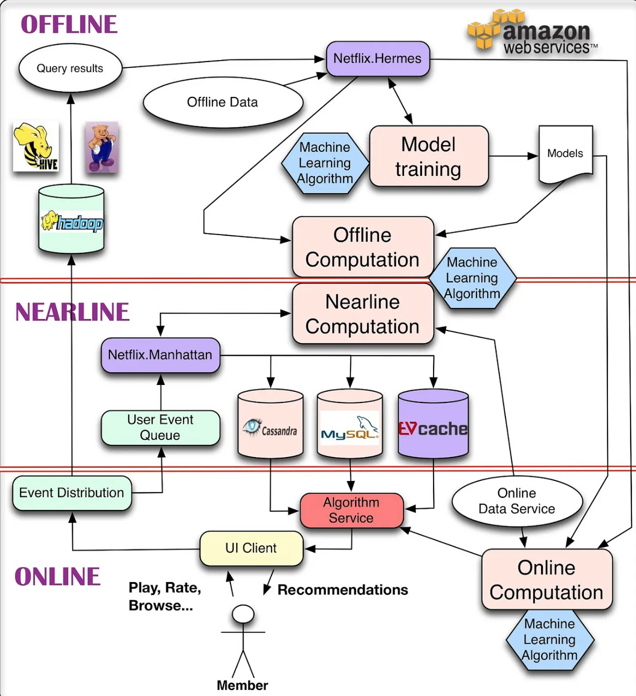
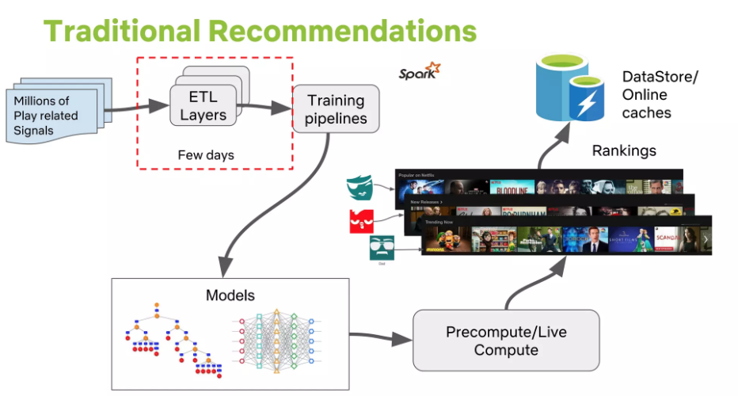
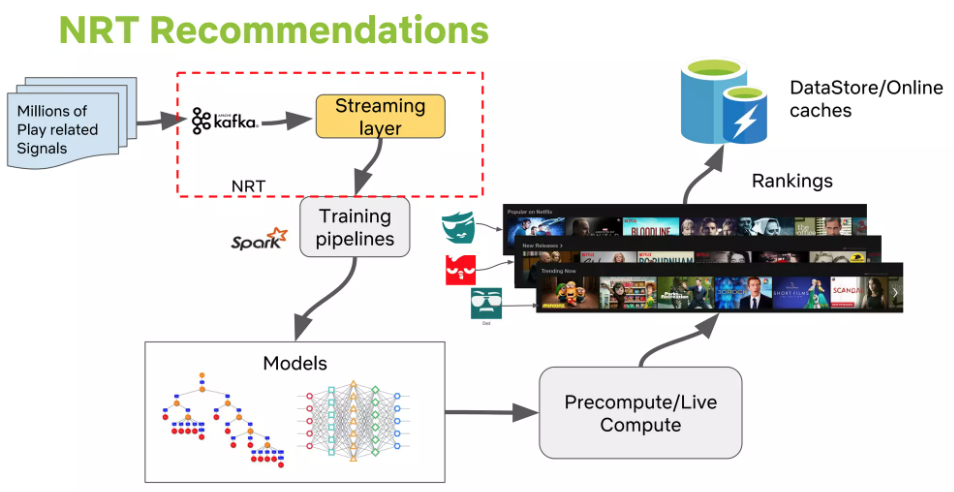
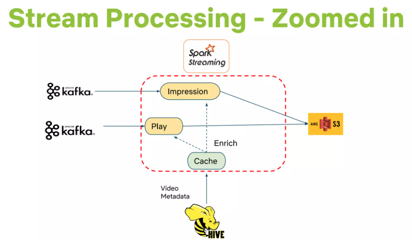
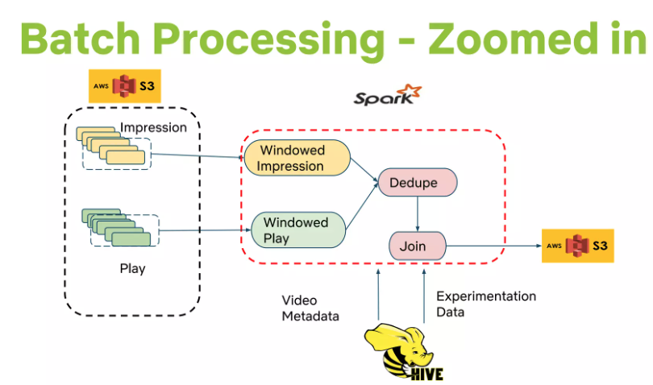

# Netflix 

##
### System Architectures for Personalization and Recommendation

- [System Architectures for Personalization and Recommendation](https://netflixtechblog.com/system-architectures-for-personalization-and-recommendation-e081aa94b5d8)

**Introduction**

*   **Core Idea:** Effective personalization at Netflix relies on both data and algorithms, and critically, a robust software architecture to deliver the experience and support rapid innovation.
*   **Challenge:** Designing an architecture to handle large data volumes, be responsive to user interactions, and facilitate experimentation with new recommendation approaches.
*   **Overall System Components:** The architecture involves managing Offline jobs, Online computation, Nearline computation, Model training, Event and Data Distribution, combining Signals and Models, and composing Recommendation Results.
*   **Infrastructure:** Entire infrastructure runs on the public Amazon Web Services (AWS) cloud.

**Offline, Nearline, and Online Computation**

*   **Three Modes of Computation:**
    *   **Online Computation:**
        *   **Pros:** Responds quickly to events, uses most recent data (e.g., assembling a gallery of action movies sorted by current context).
        *   **Cons:** Subject to strict availability and response time SLAs (latency limits). This can restrict algorithmic complexity and data processed. Requires fast fallbacks (e.g., to precomputed results) if SLA is missed. Involved data sources must also be online.
    *   **Offline Computation:**
        *   **Pros:** More algorithmic choice (complex algorithms), fewer limits on data volume. Simpler engineering requirements, relaxed SLAs. Supports agile innovation (can deploy more EC2 instances for slower experimental algorithms instead of premature optimization).
        *   **Cons:** Can become stale between updates as recent data isn't incorporated. Requires infrastructure for storing/computing/accessing large precomputed result sets.
    *   **Nearline Computation:**
        *   **Compromise:** Online-like computation but asynchronous (results stored, not served in real-time).
        *   **Trigger:** Done in response to user events for better responsiveness between requests.
        *   **Pros:** Allows for potentially more complex processing per event (e.g., updating recommendations immediately after a movie is watched). Natural fit for incremental learning algorithms.
        *   **Storage:** Results stored in intermediate caching/storage.
*   **Combining Modes:** Not an either/or; modes should be combined.
    *   Offline as fallback for online.
    *   Precompute parts offline, leave less costly/context-sensitive parts for online.
*   **Hybrid Modeling:**
    *   **Matrix Factorization:** Some factors precomputed offline, others updated online for freshness.
    *   **Clustering:** Cluster centers computed offline, online assignment of clusters.
    *   Points to separating large-scale global model training from lighter, user-specific online model training/updating.

**Offline Jobs**

*   **Types of Offline Tasks:**
    1.  **Model Training:** Collects existing data, applies ML algorithm to produce model parameters (stored as a file). (Most models trained offline, but some online learning for incremental training exists).
    2.  **Batch Computation:** Uses existing models and input data to compute intermediate or final results for later online processing or direct presentation.
*   **Data Sourcing:** Usually generated by database queries (Hive or Pig on Hadoop for large, distributed queries).
*   **Data Publishing Mechanism (Internal Tool: Hermes):**
    *   **Requirements:** Notify subscribers when query results are ready, support various repositories (HDFS, S3, Cassandra), transparent error handling, monitoring, alerting.
    *   **Functionality:** Publish-subscribe framework, delivering data to subscribers in near real-time. Covers some use cases similar to Apache Kafka but is not a message/event queue.

**Signals & Models**

*   **Three Kinds of Inputs for Algorithms (Online or Offline):**
    1.  **Models:** Small files of parameters, previously trained offline.
    2.  **Data:** Previously processed information stored in databases (e.g., movie metadata, popularity).
    3.  **Signals:** Fresh information obtained from live services.
        *   User-related (e.g., what member watched recently).
        *   Context data (e.g., session, device, date, time).

**Event & Data Distribution**

*   **Goal:** Turn member interaction data into insights to improve experience.
*   **Event Collection:** Netflix UI applications (Smart TVs, tablets, etc.) collect user events (clicks, browsing, viewing, viewport content).
*   **Events vs. Data (Conceptual Distinction):**
    *   **Events:** Small, time-sensitive information units needing low-latency processing, triggering subsequent actions (e.g., updating nearline results).
    *   **Data:** Denser information units processed and stored for later use; latency less critical than quality/quantity. (User events can be treated as both).
*   **Event Flow Management (Internal Tool: Manhattan):**
    *   Distributed computation system central to algorithmic architecture.
    *   Somewhat similar to Twitter's Storm but addresses different internal requirements.
*   **Data Flow Management:**
    *   Initial logging via Chukwa to Hadoop.
    *   Later, Hermes used as the publish-subscribe mechanism.

**Recommendation Results**

*   **Generation:** Can be serviced directly from precomputed lists or generated on-the-fly by online algorithms.
*   **Hybrid Approach:** Bulk computed offline, freshness added by online post-processing using real-time signals.
*   **Storage Repositories (Offline & Intermediate Results):**
    *   **Cassandra:** Distributed, scalable NoSQL store.
    *   **EVCache:** Memcache-based, better fit for intensive/constant write operations than Cassandra.
    *   **MySQL:** For structured relational data needed by future processes via general-purpose querying (scalability can be an issue in distributed environments).
*   **Key Challenge:** Balancing query complexity, read/write latency, and transactional consistency optimally for each use case.

**Conclusions**

*   **Critical Architectural Considerations:** Ability to use sophisticated algorithms, handle huge data, allow flexible/agile innovation, and ensure fresh, responsive results.
*   **Strategic Decomposition:** Finding the sweet spot requires thoughtful analysis, technology selection, and breaking down recommendation algorithms to achieve best outcomes.

**Near Real-Time Netflix Recommendations Using Apache Spark Streaming**

- [Near Real-Time Netflix Recommendations Using Apache Spark Streaming](https://www.slideshare.net/slideshow/near-realtime-netflix-recommendations-using-apache-spark-streaming-with-nitin-sharma-and-elliot-chow/102214667)

### References
- [System Architectures for Personalization and Recommendation](https://netflixtechblog.com/system-architectures-for-personalization-and-recommendation-e081aa94b5d8)
