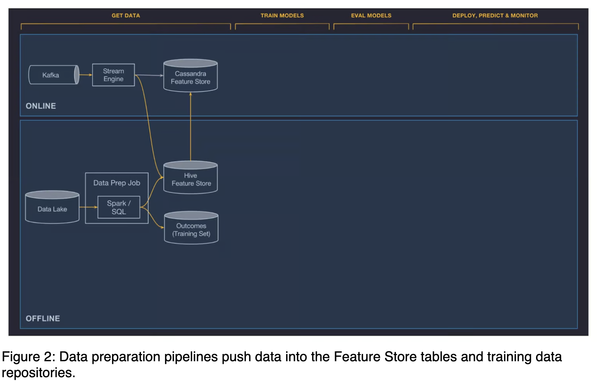
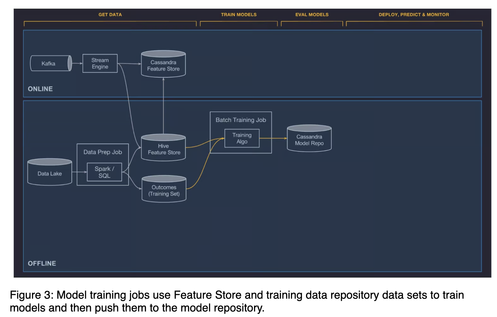
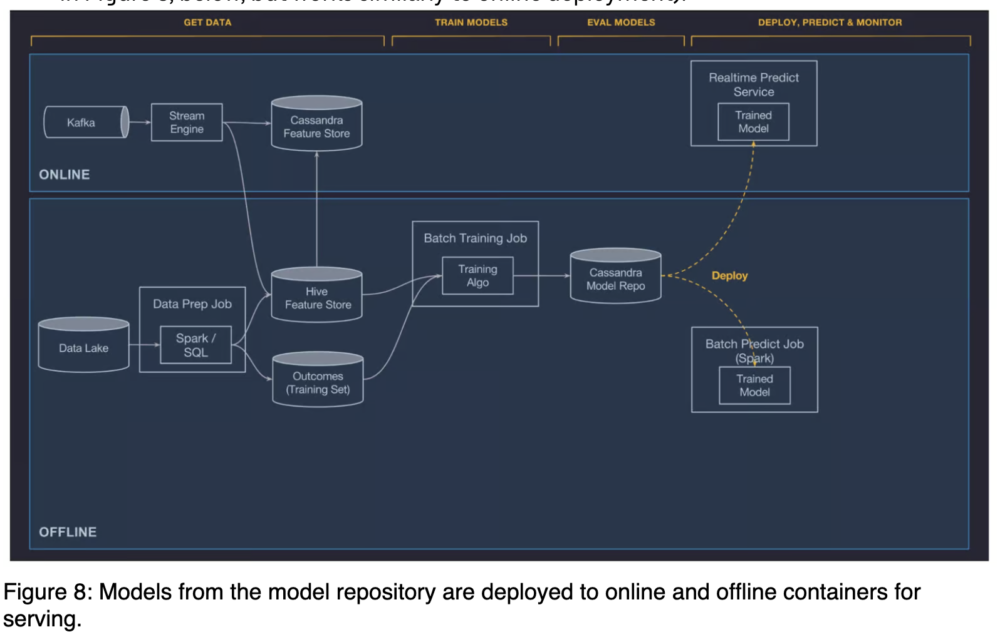
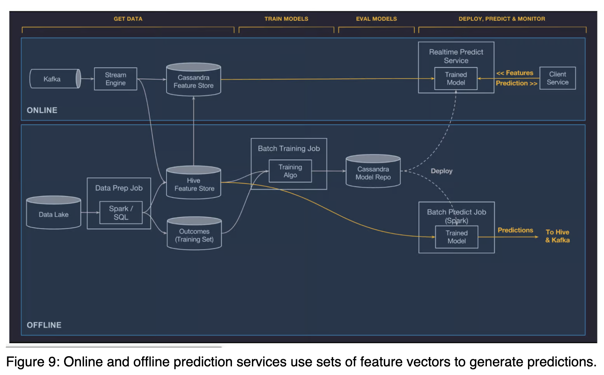
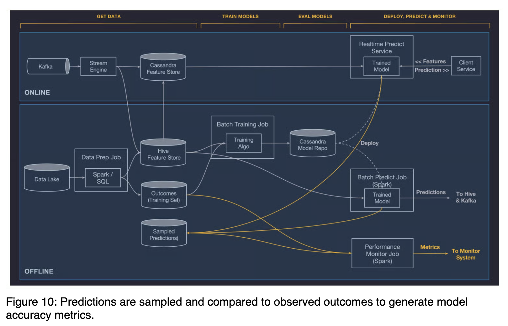

# Uber Michelangelo

**Overall Introduction**

*   **What it is:** Michelangelo is Uber's internal, end-to-end Machine Learning-as-a-Service (MLaaS) platform.
*   **Goal:** Democratize ML across Uber, enabling teams to easily build, deploy, and operate ML solutions at scale.
*   **Scope:** Covers the entire ML workflow: data management, training, evaluation, deployment, prediction, and monitoring.
*   **Model Types Supported:** Traditional ML (decision trees, linear/logistic models), time series forecasting, and deep learning.
*   **Impact:** De-facto ML system at Uber, serving production use cases for dozens of teams, deployed across multiple data centers, and handles high-load online services.

**Motivation behind Michelangelo**

*   **Pre-Michelangelo Challenges:**
    *   **Tool Fragmentation:** Data scientists used various tools (R, scikit-learn); engineers built bespoke deployment systems.
    *   **Lack of Standardization:** No reliable, uniform, reproducible pipelines for training/prediction data.
    *   **Scalability Issues:** Model training limited to desktop-sized data; no central storage for experiment results or easy comparison.
    *   **Deployment Hurdles:** No standard path to production; custom serving containers per project.
    *   **Emergence of ML Anti-Patterns:** "Hidden technical debt" was becoming apparent.
*   **Michelangelo's Aims:**
    *   Standardize workflows and tools.
    *   Enable easy building and operation of ML systems at scale.
    *   Solve immediate problems and create a system that grows with the business.
    *   **Phased Development:**
        1.  Scalable model training and deployment.
        2.  Better systems for managing/sharing feature pipelines.
        3.  Developer productivity (idea to production, fast iterations).

**Use case: UberEATS estimated time of delivery model**

*   **Problem:** Predict meal ETD, a complex multi-stage process (order, restaurant prep, driver dispatch, pickup, transit, parking, delivery).
*   **Model Type:** Gradient Boosted Decision Tree regression models.
*   **Features Used:**
    *   Request info (time of day, delivery location).
    *   Historical features (e.g., average meal prep time for last 7 days).
    *   Near-realtime calculated features (e.g., average meal prep time for last 1 hour).
*   **Deployment:** Deployed to Michelangelo model serving containers across Uber's data centers, invoked via network requests from UberEATS microservices.

**System architecture**

*   **Mix of Open Source and In-House:**
    *   **Open Source:** HDFS, Spark, Samza, Cassandra, MLLib, XGBoost, TensorFlow.
    *   **Approach:** Prefer mature open source, fork/customize/contribute back as needed, build in-house when open source isn't ideal.
*   **Built on Uber's Infrastructure:**
    *   Data lake (transactional/logged data).
    *   Kafka brokers (aggregating logs).
    *   Samza streaming compute.
    *   Managed Cassandra clusters.
    *   In-house service provisioning/deployment tools.

**Machine learning workflow (6 Steps)**

The core of Michelangelo is designed around these steps:

**1. Manage data**

*   **Challenge:** Feature engineering and data pipeline management are often the costliest parts of ML.
*   **Platform Goals:**
    *   Standard tools for feature/label generation (online/offline).
    *   Deep integration with data lake/warehouses and online serving systems.
    *   Scalable, performant pipelines with integrated monitoring.
    *   Feature sharing to reduce duplication and improve quality.
    *   Guardrails for best practices (e.g., consistency between training/prediction data generation).
*   **Pipelines:**
    *   **Offline:** Feeds batch model training and batch prediction. Uses Spark and Hive SQL on HDFS. Scheduled jobs with data quality monitoring.
    *   **Online:** Feeds low-latency online predictions. Features precomputed and stored in Cassandra.
        *   **Batch Precompute (for online):** Bulk precompute/load historical features from HDFS to Cassandra regularly (e.g., daily for 'restaurant's average meal prep time over last 7 days').
        *   **Near-Real-Time Compute (for online):** Metrics to Kafka -> Samza streaming jobs -> aggregate features written to Cassandra and logged to HDFS (e.g., 'restaurant's average meal prep time over last 1 hour'). Backfilling tool for historical logs.
*   **Shared Feature Store:**
    *   Centralized repository for teams to create, manage, discover, and share canonical features.
    *   Requires metadata (owner, description, SLA).
    *   *Once features are in the Feature Store, they are very easy to consume, both online and offline, by referencing a feature’s simple canonical name in the model configuration. Equipped with this information, the system handles joining in the correct HDFS data sets for model training or batch prediction and fetching the right value from Cassandra for online predictions.*
    *   Approximately 10,000 features; automatically calculated/updated daily.
*   **Domain Specific Language (DSL) for Feature Selection and Transformation:**
    *   Addresses needs like: formatting, filling missing values, subsetting features, transforming (timestamp to hour-of-day), normalizing.
    *   Implemented as a subset of Scala (pure functional language).
    *   Supports common functions and user-defined functions.
    *   Accesses features from current context (data pipeline/client request) or Feature Store.
    *   Crucially, DSL expressions are part of model config and applied identically at training and prediction time for consistency.

- [Uber: Meet Michelangelo: Uber’s Machine Learning Platform](https://www.uber.com/en-IN/blog/michelangelo-machine-learning-platform/)

**2. Train models**

*   **Supported Algorithms:** Decision trees, linear/logistic models, k-means, time series models, deep neural networks. New algorithms added based on need (e.g., from AI Labs).
*   **Customization:** Teams can add their own model types (custom training, evaluation, serving code).
*   **Training System:** Distributed, scales from billions of samples to small datasets.
*   **Model Configuration:** Specifies model type, hyper-parameters, data source, feature DSL, compute resources (machines, memory, GPUs).
*   **Execution:** Training jobs run on YARN or Mesos clusters.
*   **Post-Training:** Performance metrics (ROC, PR curves) computed, evaluation report generated. Config, learned parameters, and report saved to model repository.
*   **Advanced Training:**
    *   Hyper-parameter search.
    *   Partitioned models (e.g., one model per city, fallback to country-level).
*   **Management:** Web UI or API (often via Jupyter notebook), enabling scheduled re-training.

- [Uber: Meet Michelangelo: Uber’s Machine Learning Platform](https://www.uber.com/en-IN/blog/michelangelo-machine-learning-platform/)

**3. Evaluate models**

*   **Challenge:** Managing and comparing hundreds of experimental models.
*   **Model Repository (in Cassandra):** Stores versioned objects for every trained model, including:
    *   Trainer, training time.
    *   Full model configuration.
    *   References to training/test data.
    *   Feature distribution and importance.
    *   Model accuracy metrics & standard charts (ROC, PR, confusion matrix).
    *   Full learned parameters.
    *   Summary statistics for visualization.
*   **Accessibility:** Via Web UI and API for inspecting individual models and comparisons.
*   **Model Accuracy Report:** Shows relevant metrics (e.g., regression metrics like R-squared, RMSLE, RMSE).
*   **Decision Tree Visualization:** Allows browsing individual trees, split points, feature importance per tree, data distribution at splits. User can specify feature values to see triggered paths and predictions.
*   **Feature Report:** Shows features by importance, partial dependence plots, distribution histograms. Supports two-way partial dependence for feature interactions.

**4. Deploy models**

*   **Management:** End-to-end support via UI or API.
*   **Deployment Modes:**
    *   **Offline:** Deployed to an offline container, run in Spark for batch predictions (on-demand or scheduled).
    *   **Online:** Deployed to an online prediction service cluster (hundreds of machines behind a load balancer) for RPC calls.
    *   **Library (Planned):** Model deployed to a serving container embedded as a library in another service (Java API).
*   **Deployment Process:**
    *   *Model artifacts (metadata, parameters, compiled DSL) packaged in ZIP.
    *   Copied to hosts via standard code deployment infrastructure.
    *   The prediction containers automatically load the new models from disk and start handling prediction requests.*
*   **Automation:** Many teams automate re-training and deployment via API.

- [Uber: Meet Michelangelo: Uber’s Machine Learning Platform](https://www.uber.com/en-IN/blog/michelangelo-machine-learning-platform/)

**5. Make predictions**

*   **Process:**
    1.  Features loaded (from data pipeline or client service).
    2.  Raw features passed through compiled DSL (can modify or fetch from Feature Store).
    3.  Final feature vector constructed.
    4.  Vector passed to model for scoring.
*   **Output:**
    *   **Online:** Prediction returned to client service over network.
    *   **Offline:** Predictions written to Hive, consumable by batch jobs or SQL queries.
*   **Referencing Models:**
    *   Multiple models can be deployed simultaneously.
    *   Supports safe transitions and A/B testing.
    *   Identified by UUID and optional tag (alias).
    *   Clients send feature vector + UUID/tag. Tag resolves to the most recently deployed model for that tag.
*   **Seamless Updates:** If signatures match, deploy new model to the same tag for immediate switchover without client code change.
*   **Gradual Rollouts/A/B Testing:** Deploy new model with UUID, gradually shift traffic. Use Uber's experimentation framework to send traffic portions to different models and track performance.
*   **Scale and Latency:**
    *   Models are stateless, share-nothing -> trivial to scale out.
    *   Online serving latency:
        *   < 5ms P95 (no Cassandra feature fetch).
        *   < 10ms P95 (with Cassandra feature fetch).
    *   Highest traffic models: > 250,000 predictions/second.

- [Uber: Meet Michelangelo: Uber’s Machine Learning Platform](https://www.uber.com/en-IN/blog/michelangelo-machine-learning-platform/)

**6. Monitor predictions**

*   **Goal:** Ensure ongoing model accuracy in a changing production environment.
*   **Process:**
    1.  Automatically log and optionally hold back a percentage of predictions.
    2.  Later join these predictions with observed outcomes (labels) from the data pipeline.
    3.  Generate ongoing, live measurements of model accuracy (e.g., R-squared, RMSLE, RMSE, MAE for regression).
*   **Output:** Metrics published to Uber’s time series monitoring systems for analysis, charts, and threshold alerts.

- [Uber: Meet Michelangelo: Uber’s Machine Learning Platform](https://www.uber.com/en-IN/blog/michelangelo-machine-learning-platform/)

**Management plane, API, and web UI**

*   **Brains of the System:** A management application serving the web UI and network API.
*   **Integrations:** With Uber's system monitoring and alerting.
*   **Workflow Orchestration:** Manages batch data pipelines, training jobs, batch prediction jobs, and model deployments.
*   **User Interaction:** Via web UI, REST API, and monitoring/alerting tools.

**Building on the Michelangelo platform (Future Work)**

*   **Continue Scaling/Hardening:** Support growth of customer teams and Uber's business.
*   **AutoML:** Automatically search/discover optimal model configurations (algorithm, features, hyper-parameters) and build production data pipelines. Amplify data scientist productivity.
*   **Model Visualization:** Enhance tools for understanding, debugging, and tuning models (especially deep learning).
*   **Online Learning:** Full platform solution for models that need to adapt in real-time, involving easily updateable models, faster training/evaluation, automated validation/deployment, and sophisticated monitoring.
*   **Distributed Deep Learning:** Provide unique platform support for the different workflow, larger data quantities, and hardware requirements (GPUs) of deep learning, including tighter integration with resource management.

### References

- [Meet Michelangelo: Uber’s Machine Learning Platform](https://www.uber.com/en-IN/blog/michelangelo-machine-learning-platform/)