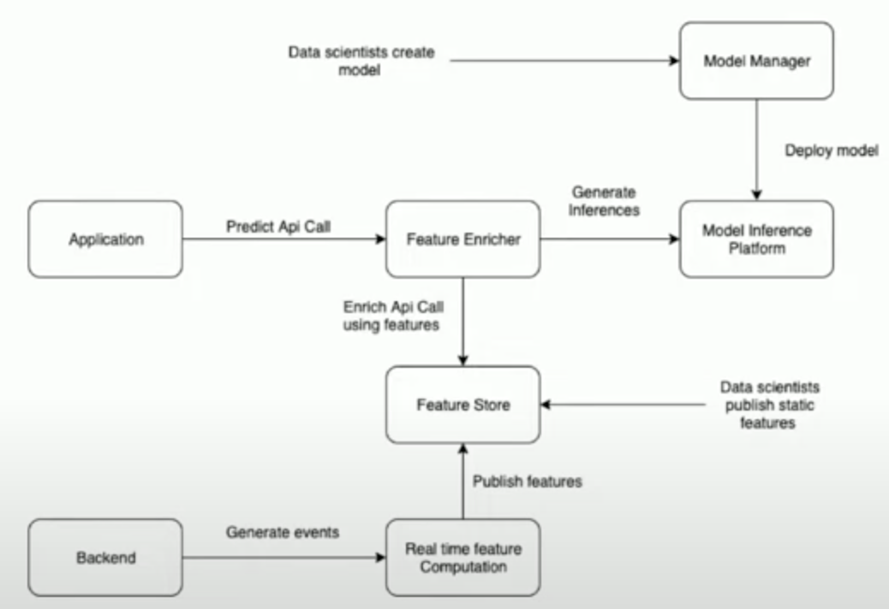

# Zomato: Real-time ML

- [Real-time Machine Learning Inference Platform at Zomato](https://www.youtube.com/watch?v=0-3ES1vzW14)

**What is Machine Learning?**

*   **Core Concept:** Given an input (e.g., an image), extract features (e.g., RGB values of pixels), pass these features to a classification algorithm (a "black box" that has learned from past data, like a linear combination or more complex models like XGBoost), which then produces an output (e.g., "car" or "not car").
*   **Feature Types:**
    *   **Real-time Features:** Computed based on immediate events. Example: For Zomato recommendations, the last restaurant a user clicked on (e.g., if Haldiram was clicked, next might be Bikanerwala, both being "chaat" places).
    *   **Static Features:** Computed on a historical basis. Example: Restaurant attributes like cuisine type or dishes served.
*   **Model Variety:** Different algorithms can be used, such as regression or tree-based models.

**ML @Zomato (Use Cases)**

*   **Predicting Kitchen Preparation Time (KPT):** Estimate how long a restaurant will take to prepare an order given the dishes. Crucial for optimizing rider dispatch (don't send rider too early if prep time is long).
*   **Predicting Rider Assignment Time:** Estimate time to find and assign a rider, especially during peak hours with high order volume and rider density.
*   **Personalization and Recommendations:** Show relevant restaurants to users when they open the app.
*   **Fraud Detection:** Identify fraudulent activities by users, merchants, or riders.
*   **Photo Classification:** Classify user-uploaded photos as food, menu, or ambiance.
*   **Rider Allocation:** (Implicitly related to KPT and Rider Assignment Time) Efficiently assigning riders to orders.

**Challenges (Pre-Platform)**

*   **Dependency on Engineers for Deployment:** Data scientists created models, but relied on engineers for production deployment, especially for real-time inference.
*   **No Standard Workflows:** Lack of standardized processes for model deployment.
*   **Inability for Data Scientists to Push Features:** Data scientists performed offline analysis and feature construction, but couldn't easily push or manage features for production.
*   **No Platform for Real-Time Feature Computation:** Difficult to compute and use features in real-time at scale.
*   **Many One-Off Production Systems:** Ad-hoc solutions for serving, leading to inconsistencies (e.g., some using Redis, some MySQL for feature storage).

**Requirements (for the New Platform)**

1.  **Enable Data Scientists:** Allow them to easily build and deploy ML models at scale across the company (autonomy). DS are not expected to be full-fledged software engineers.
2.  **Platform for Real-Time and Static Feature Computation & Pushing:** Data scientists should be able to directly push static features.
3.  **Ability to Store and Version Models:** A "GitHub for models" for auditing and versioning.
4.  **Low Latency Real-Time Inference:** Predictions should take less than 50ms (P99).
5.  **Fast Time to Production:** Model deployment should be less than a week.

**Case Study: KPT Prediction**

*   **Model:** In-house XGBoost-based model.
*   **Input Features:**
    *   **Static Features:** Historical KPT for the specific restaurant and time slot.
    *   **Real-Time Features:** Number of currently running/pending orders at that restaurant at that specific point in time.
*   **Goal:** Predict how long a restaurant will take to prepare a given order based on items, cost, etc.

**Proposed Architecture (and its Components)**

1.  **Model Manager (MLFlow):**
    *   **Purpose:** Platform for data scientists to develop, log, and manage their models independently.
    *   **Technology Choice:** Evaluated MLFlow and Kubeflow. Chose MLFlow because it was very easy to set up (speaker set it up in ~1 hour), whereas Kubeflow (Kubernetes-based) had a steeper learning curve as the team lacked prior extensive Kubernetes experience.
    *   **Functionality:** Allows versioning of models (e.g., KPT model v1, v2, v3, with v3 in production).
2.  **Real-Time Feature Computation (Apache Flink):**
    *   **Need:** A stream processing framework to calculate real-time features (like running orders at a restaurant) by listening to order-level events (from order service/backend).
    *   **Technology Evaluation:** Spark Streaming, Kafka Streams, and Flink.
    *   **Technology Choice (Flink):** Chosen due to its strong community, ease of setup, and crucial **job-level isolation**.
    *   **Job-Level Isolation Importance:** With hundreds of models and tens of jobs per model, one job failure (e.g., KPT job) must not affect others (e.g., rider assignment job).
3.  **Feature Store (Real-Time & Static):**
    *   **Real-Time Feature Store (AWS ElastiCache backed by Clustered Redis):**
        *   **Requirements:** Store features produced by Flink, easily scalable for high write and read throughput, eventual consistency is acceptable (data can reflect after 5-10 seconds).
        *   **Technology Choice (ElastiCache/Redis):**
            *   Supports adding shards for write scaling and read replicas for read scaling.
            *   Managed service providing automatic failovers (high availability).
            *   Very low read/write latency.
            *   Supports TTL for features (many real-time features are short-lived, e.g., 2-5 mins).
        *   **Scale Example (KPT):** ~10 features/output * 100k+ restaurants every minute = ~1 million writes/minute. Reads can be up to 100k RPM from users building carts.
    *   **Static Feature Store (Cassandra):**
        *   **Requirements:** Store static features (e.g., historical KPT for a restaurant/time slot), key-value access, eventual consistency, high read throughput.
        *   **Technology Evaluation:** Redis, Cassandra, DynamoDB.
        *   **Technology Choice (Cassandra):** Chosen for cost-effectiveness and the team's prior experience using it (over Redis which is in-memory and more expensive for this type of static data).
4.  **Model Inference Platform (AWS SageMaker):**
    *   **Purpose:** Deploy models for real-time inference.
    *   **Technology Evaluation:** Elastic Beanstalk, ECS, AWS SageMaker.
    *   **Technology Choice (SageMaker):**
        *   Very easy to set up (model up and running in a day).
        *   Provides direct integration with MLFlow (can deploy models from MLFlow to SageMaker with a single command).
        *   Handles inbuilt auto-scaling, logging, and monitoring.
    *   **Monitoring:** Grafana dashboards show invocations and model latency for deployed SageMaker endpoints.
5.  **ML Gateway (In-house Go service - "Feature Enricher"):**
    *   **Purpose:** A system to stitch everything together for real-time inference. Acts as a central point for applications to call for predictions.
    *   **Functionality:**
        *   Receives predict API call from an application.
        *   Fetches necessary features from the Feature Store (both real-time Redis and static Cassandra).
        *   Enriches the request with these features.
        *   Sends the enriched request to AWS SageMaker for inference.
        *   Gets the inference result and sends it back to the application.
    *   **Implementation:** KPT Plan (YAML configuration) defines the workflow for the ML Gateway (fetch features, get KPT prediction from SageMaker, publish).

**Final Architecture Diagram:**

*   **Data Scientist Workflow:** Creates models and logs them in MLFlow.
*   **Deployment:** Engineers deploy models from MLFlow to AWS SageMaker.
*   **Real-Time Path:**
    *   Application calls ML Gateway.
    *   ML Gateway enriches API call with features from Feature Store.
    *   ML Gateway calls SageMaker using enriched features.
    *   SageMaker returns inference to ML Gateway, then to Application.
*   **Feature Generation Path:**
    *   Backend generates events to Flink via Kafka.
    *   Flink performs real-time feature computation.
    *   Flink publishes real-time features to the Feature Store (Redis) via Kafka.
    *   Data scientists publish static features to the Feature Store (Cassandra) via Kafka (or other batch processes).

**Future Work**

*   **Ability to shadow models:** Test new models (e.g., KPT V2) on real traffic via ML Gateway before taking them live, without impacting users.
*   **Archiving real-time features to S3:** Store features from Redis/Feature Store to S3 for model retraining.
*   **Ability to retrain models automatically:** Schedule model retraining at a fixed frequency.
*   **Tracking model performance online:** Continuously monitor model performance in production.