# Environments, Branching, CI/CD, and Deployments Explained
##
### Appendix A: The MLOps Workflow: Environments, Branching, CI/CD, and Deployments Explained

The interplay between development environments, branching strategies, CI/CD pipelines, and the distinction between deploying the *pipeline* versus deploying the *model* is fundamental to MLOps but often confusing for newcomers (and even experienced practitioners!).

Let's break down how these concepts fit together in a practical, step-by-step workflow, using the choices we've made (GitHub Flow, GitHub Actions, Terraform, Airflow, FastAPI deployment on Serverless Containers, etc.).

---

**Introduction:**

Building and operating ML systems involves more than just writing code and training models. It requires a structured workflow to manage changes, ensure quality, and reliably deploy updates. This appendix clarifies how key concepts – Development Environments (Dev, Staging, Prod), Git Branching Strategies (like GitHub Flow), Continuous Integration/Continuous Delivery (CI/CD) pipelines, and the different types of deployments (ML Pipelines vs. ML Models) – work together in a typical MLOps project.

**Core Concepts:**

1.  **Environments (Dev, Staging, Prod):** These are distinct, isolated instances of your infrastructure (compute, storage, network configurations, deployed services).
    *   **Dev:** The developer's local machine or a personal cloud workspace. Used for writing code, initial development, and local testing. Highly flexible, often inconsistent between developers without standardization.
    *   **Staging (Pre-Production):** A shared environment designed to *exactly mirror* Production. Used for thorough testing (integration, end-to-end, load) of code *before* it goes live. Uses realistic (but usually non-production) data. Deployed to automatically after code passes CI and is merged.
    *   **Production (Prod):** The live environment serving end-users. Receives code only after successful validation in Staging and necessary approvals. Runs on live data. Highest requirements for stability, reliability, and monitoring.
2.  **Branching Strategy (GitHub Flow):** A system for managing code changes using Git. We'll use GitHub Flow as our example:
    *   `main`: This branch always reflects the latest *production-ready* code. It should always be deployable.
    *   `feature/your-feature-name`: Short-lived branches created from `main`. Developers work here. Once complete, a Pull Request (PR) is opened to merge back into `main`.
3.  **CI/CD Pipeline (GitHub Actions):** Automated workflows triggered by Git events (like pushes or merges).
    *   **CI (Continuous Integration):** Focuses on *integrating* code changes frequently and *verifying* them automatically. Runs tests (linters, unit tests) on feature branches/PRs. *Goal: Catch errors early, ensure code quality before merge.*
    *   **CD (Continuous Delivery/Deployment):** Focuses on *automatically releasing* verified code to environments. Triggered by merges to `main`. Deploys to Staging, runs further tests, and often includes a manual gate before deploying to Production. *Goal: Make releases reliable, repeatable, and fast.*
4.  **Deploying ML Pipelines vs. Deploying ML Models:** This is a key MLOps distinction.
    *   **ML Pipeline:** The automated workflow code (e.g., an Airflow DAG definition, SageMaker Pipeline script, associated container images for steps) that performs tasks like data ingestion, preprocessing, training, and evaluation. You *deploy the pipeline definition* when the *code or logic* of the workflow changes.
    *   **ML Model:** The trained artifact (`.pkl`, `.pt`, `.onnx` file, etc.) produced by *running* the training pipeline. You *deploy the model artifact* to a serving endpoint when a *new, validated model version* is available (usually after a successful pipeline run).

**Step-by-Step Workflow Example:**

Let's trace a change, like improving a feature extraction step in our "Trending Now" project:

*   **Step 1: Start Development (Dev Environment & Feature Branch)**
    *   **Action:** Developer needs to modify the feature extraction script (`feature_extractor.py`).
    *   **Branching:** Create a new branch from `main`: `git checkout -b feature/improve-extraction`.
    *   **Environment:** Developer works in their **Dev** environment (e.g., VS Code connected to a cloud workspace or local machine with Docker). They edit `feature_extractor.py`, write corresponding unit tests (`test_feature_extractor.py`), and test locally using sample data.
    *   **Tools:** Git, Python, Pandas, Pytest, IDE.

*   **Step 2: Commit & Push Code**
    *   **Action:** Developer commits the changes: `git commit -am "Improve feature extraction logic"`.
    *   **Action:** Developer pushes the feature branch to GitHub: `git push origin feature/improve-extraction`.
    *   **Branching:** The changes exist only on the feature branch in the remote repository.

*   **Step 3: Continuous Integration (CI Triggered by Push)**
    *   **Action:** GitHub Actions detects the push to the `feature/improve-extraction` branch (or more commonly, the opening of a PR from this branch - see Step 4).
    *   **Pipeline:** The **CI pipeline** (defined in `.github/workflows/ci.yml`) runs automatically.
    *   **Environment:** Runs on a temporary GitHub Actions runner (an isolated environment).
    *   **CI Steps:**
        *   Checks out the code from `feature/improve-extraction`.
        *   Sets up Python environment.
        *   Installs dependencies (from `requirements.txt`).
        *   Runs linters (e.g., `flake8`, `black`).
        *   Runs unit tests (e.g., `pytest tests/unit/`).
        *   (If applicable) Runs static code analysis or security scans.
        *   (If applicable) Builds Docker images for modified components (though maybe deferred until merge).
    *   **Outcome:** Reports Pass/Fail status.

*   **Step 4: Code Review (Pull Request)**
    *   **Action:** Developer opens a Pull Request (PR) on GitHub to merge `feature/improve-extraction` into `main`.
    *   **Interaction:** The CI results from Step 3 are displayed on the PR. Team members review the code changes, suggest improvements, and eventually approve.

*   **Step 5: Merge to `main` (Triggering CD to Staging)**
    *   **Action:** The approved PR is merged into the `main` branch.
    *   **Branching:** `main` now contains the updated feature extraction logic.
    *   **Pipeline:** The merge triggers the **CD pipeline** (defined in `.github/workflows/cd-staging.yml`) targeting the **Staging** environment.

*   **Step 6: Continuous Delivery to Staging**
    *   **Action:** GitHub Actions runs the CD workflow for Staging.
    *   **Environment:** Interacts with the **Staging** AWS account/resources managed by Terraform.
    *   **CD Steps (Example):**
        *   Checks out code from `main`.
        *   Builds necessary artifacts (e.g., updates the Docker container for the data processing step in the Airflow DAG).
        *   Packages the Airflow DAG definition.
        *   Uses Terraform/AWS CLI to deploy the updated DAG and associated resources (like the new container image to ECR) to the **Staging** Airflow environment.
        *   *(Optional but recommended)* Triggers a run of the *Data Ingestion Pipeline* in Staging using sample/staging data.
        *   Runs **Integration Tests** (e.g., using `pytest tests/integration/`) against the Staging environment (Does the pipeline run end-to-end? Does the FastAPI endpoint respond correctly if that was updated?).
        *   Runs **Infrastructure Tests** (e.g., using `pytest + boto3` or Terratest) to verify Terraform deployment was successful.
    *   **Outcome:** Updated Data Ingestion Pipeline (or potentially Training Pipeline if the change affected it) is running in Staging; Test results are reported.

*   **Step 7: Validation in Staging & Manual Approval**
    *   **Action:** Automated tests (Integration, E2E) pass in Staging.
    *   **Action:** A QA engineer or ML engineer might manually trigger the pipeline in Staging and verify the output data or features look correct. They check dashboards (Staging Grafana).
    *   **Action:** Stakeholder (e.g., Lead ML Engineer, Product Manager) gives **Manual Approval** for Production deployment (e.g., via GitHub Environments approval gate).
    *   **Environment:** Review happens based on the **Staging** environment's behaviour.

*   **Step 8: Continuous Deployment to Production**
    *   **Action:** The manual approval triggers the **CD pipeline** for Production (defined in `.github/workflows/cd-prod.yml`).
    *   **Environment:** Interacts with the **Production** AWS account/resources managed by Terraform.
    *   **CD Steps (Example):**
        *   Uses the *exact same* artifacts built and tested for Staging (avoids rebuilding).
        *   Uses Terraform/AWS CLI to deploy the updated DAG/container to the **Production** Airflow environment.
        *   *(Optional)* Performs automated smoke tests immediately after deployment.
        *   *(Crucial)* Monitors Production (CloudWatch, Prometheus/Grafana) closely after deployment. Rollback manually or automatically if critical issues arise.
    *   **Outcome:** The updated Data Ingestion Pipeline is now live in Production.

**How ML Model Deployment Fits In:**

Notice the above workflow focused on deploying a change to the *code* of a pipeline (the feature extractor). Where does the *model* deployment fit?

*   **Model Training (CT):** The *Training Pipeline* runs periodically or on a trigger in its designated environment (often Prod or a dedicated Training env).
*   **Model Validation (Offline):** As the *last step* of the Production Training Pipeline run, the newly trained model candidate is evaluated against metrics on a holdout dataset. It uses a static holdout dataset (Test Set) to evaluate the model's *predictive performance* (accuracy, F1, precision, recall, AUC, etc.) against known ground truth. It answers: "Is this model statistically good enough based on historical data?"
*   **Model Registration:** If the model candidate passes offline validation, the pipeline registers it (e.g., as `version 1.1-candidate`) in the **Model Registry** (W&B).
*   **Approval Gate 1 (Pre-Staging):** A process (manual or semi-automated based on metric thresholds) approves the registered candidate model for deployment to the **Staging environment**.
*   **Model Deployment CD Pipeline (Stage 1 - Deploy to Staging):** Triggered by the pre-staging approval.
    *   Fetches the specific model artifact (`version 1.1-candidate`) from the registry.
    *   Deploys it to the **Staging Serving Environment** (e.g., Staging FastAPI service on Staging App Runner).
*   **Model Testing in Staging (Operational Validation):** Automated tests run against the Staging endpoint:
    *   Basic health checks (is the endpoint responsive?).
    *   Integration tests (does it work with other staging services?).
    *   Load/Performance tests (using Locust) to check latency and resource usage under simulated load.
    *   Consistency checks (optional).
*   **Approval Gate 2 (Pre-Production):** Based on successful Staging tests (automated reports + possibly manual review), the model (`version 1.1-candidate`) is approved for **Production deployment**. The model version in the registry might be updated (e.g., tag changed from `candidate` to `approved-for-prod`).
*   **Model Deployment CD Pipeline (Stage 2 - Deploy/Test in Production):** Triggered by the pre-production approval.
    *   Deploys the *same validated model artifact* (`version 1.1-candidate`) to the **Production Serving Environment**, typically using a progressive rollout strategy (Canary, Shadow, or setting up an A/B test variant).
    *   Online experiments run, monitoring business metrics and operational health.
*   **Full Production Rollout / Promotion:** If online experiments are successful, the candidate model (`version 1.1`) is fully rolled out (becomes the new champion), replacing the previous production version. The Model Registry is updated to reflect its `production` status. If experiments fail, the candidate is rolled back.

**Integrated MLOps Workflow: Code, Pipeline, and Model Deployments**

**Conclusion:**

This step-by-step flow illustrates how environments, branching, CI/CD, pipeline deployments, and model deployments work together. Developers work on features in isolated **Dev** environments and branches. **CI** validates code quality automatically before merging. **CD** automates the release of verified code (including pipeline definitions) through **Staging** (for integration testing) and finally to **Production**. Continuous Training pipelines run *within* an environment (often Prod) to produce new *models*, which are then deployed to serving endpoints via their own (often simpler) deployment process triggered by the model registry. This structured approach ensures changes are tested incrementally, deployments are reliable, and the distinct lifecycles of code, pipelines, and models are managed effectively.
