# Data Discovery Platforms: Industry Case Studies

## 

In today's data-driven enterprises, the sheer volume, variety, and velocity of data can transform a valuable asset into an overwhelming deluge. The ability to efficiently source, discover, and understand relevant, trustworthy data is no longer a luxury but a foundational necessity for innovation, operational excellence, and informed decision-making. This document synthesizes learnings from leading tech companies to provide a technical guide for MLOps leads and senior engineers on approaching data discovery.

### 1. The "Why": Core Motivations & Goals

Companies invest in data discovery platforms to address a confluence of challenges:

*   **Skyrocketing Data Volume & Complexity**: As organizations like Twitter, Netflix, and Uber scaled, their data ecosystems (Hadoop clusters, S3, diverse DBs) grew exponentially, making manual discovery untenable.
*   **Productivity Bottlenecks**: Data scientists and engineers spent an inordinate amount of time searching for the "right dataset" rather than deriving insights or building models (a common pain point at LinkedIn, Lyft, Spotify).
*   **Erosion of Trust & Confidence**: Navigating a "sea of data resources of varying quality, complexity, relevance, and trustworthiness" (Airbnb's challenge) leads to uncertainty and reluctance to use data outside one's immediate sphere. Facebook's Nemo also aimed to improve confidence in data accuracy.
*   **Fragmented Landscapes & Siloed Knowledge**: Data often becomes isolated by tool or team, necessitating reliance on "tribal knowledge," which is inefficient and doesn't scale (highlighted by Airbnb, Spotify).
*   **Need for Governance & Compliance**: With regulations like GDPR, understanding data lineage, PII, and managing data lifecycle (retention, deletion) becomes critical (a driver for Lyft's Amundsen and future DataHub use cases).
*   **Interoperability Across Tools & Systems**: Enabling diverse compute engines (Spark, Presto, Hive, Pig) to access varied data stores (S3, Druid, Redshift) seamlessly is a key goal, as seen with Netflix's Metacat.

The overarching goals of these platforms converge on:
*   **Democratizing Data Access**: Empowering all employees to be data-informed (Airbnb's Dataportal).
*   **Enhancing Discoverability & Exploration**: Making it easy to find relevant data assets.
*   **Building Trust & Understanding**: Providing context, metadata, lineage, and quality signals.
*   **Improving Efficiency & Productivity**: Reducing the time-to-insight/time-to-market.
*   **Facilitating Governance & Compliance**.

### 2. Anatomy of a Data Discovery Platform: Key Features & Capabilities

While implementations vary, several core features are common:

| Feature Category        | Description & Key Aspects                                                                                                                               | Examples                                                                                                                                                                  |
| :---------------------- | :------------------------------------------------------------------------------------------------------------------------------------------------------ | :------------------------------------------------------------------------------------------------------------------------------------------------------------------------ |
| **Unified Search**      | Centralized search across diverse data entities (tables, dashboards, pipelines, ML models, users, etc.). Supports keyword, faceted, and sometimes NLP. | Airbnb Dataportal, Lyft Amundsen, LinkedIn DataHub, Facebook Nemo, Spotify Lexikon.                                                                       |
| **Rich Metadata**       | Technical (schema, location, types), Operational (freshness, update frequency, job stats), Business (descriptions, ownership, tags, classifications).     | All platforms. Netflix Metacat distinguishes logical vs. physical business metadata. Uber Databook uses Dragon for standardized metadata vocabulary.         |
| **Data Lineage**        | Visualizing upstream sources and downstream consumers of data assets. Crucial for impact analysis, trust, and debugging.                                | Airbnb Dataportal, LinkedIn DataHub, Twitter DAL. Facebook Nemo uses lineage for trust signals.                                                            |
| **Data Profiling & Stats** | Statistics about data content (null counts, distributions, min/max, distinct values, column popularity).                                                | Airbnb Dataportal (column popularity, distributions). Spotify Lexikon (schema-field consumption). Uber Databook (trends, quality indicators).                  |
| **Collaboration & Social Features** | User-generated content (tags, descriptions, comments), expert finders, Q&A, sharing.                                                          | Airbnb (employee/team pages). Spotify Lexikon (expert mapping, Slack bot). Uber Databook (manage issues, contact owners).                                   |
| **Curation & Certification** | Mechanisms to highlight trusted, high-quality, or officially endorsed data assets.                                                                    | Airbnb (planned certification). LinkedIn DataHub (certified entities).                                                                                         |
| **Programmatic Access (APIs)** | REST, GraphQL, or Thrift APIs for integration with other tools and enabling programmatic metadata use cases (e.g., governance, automation).          | LinkedIn DataHub (Rest.li, MCE/MAE events). Netflix Metacat (REST/Thrift). Uber Databook (RPC, GraphQL, event log).                                        |
| **Data Abstraction**    | Presenting a logical view of data independent of physical storage, format, or location.                                                                   | Twitter DAL (logical vs. physical datasets). Netflix Metacat (canonical types for interoperability).                                                              |
| **Personalization**     | Tailoring search results and recommendations based on user role, team, query history, or other context.                                                 | Spotify Lexikon (personalized homepage). Facebook Nemo (role, team, GBDT model for ranking). Uber Databook (planned).                                     |
| **User Interface (UI)** | Intuitive web portal for browsing, searching, and exploring metadata.                                                                                     | All platforms focus heavily on UI/UX. Uber Databook specifically mentions a UI redesign around Discover, Understand, Manage pillars.                              |

### 3. Architectural Blueprints: Generations & Patterns

Shirshanka Das from LinkedIn (DataHub) provides an excellent framework for understanding the evolution of metadata architectures:

*   **Generation 1: Monolith Everything (Pull-based ETL)**
    *   **Description**: Typically a frontend (e.g., Flask app) with a primary store (MySQL/Postgres), a search index (Elasticsearch), and possibly a graph index (Neo4j). Metadata is ingested via crawlers (pull-based) running periodically. Transformations are often embedded in ingestion jobs.
    *   **Examples**: Original WhereHows, Lyft Amundsen, Airbnb Dataportal, Spotify Lexikon.
    *   **Pros**: Few moving parts, quick to prototype, a single team can manage.
    *   **Cons**: Crawler fragility (network, credentials), operational burden on source systems, metadata freshness issues, scalability limitations for diverse use cases.

*   **Generation 2: 3-Tier App with a Service API (Push-enabled)**
    *   **Description**: A service layer is introduced in front of the metadata store, offering APIs for push-based metadata updates. Programs can also read metadata programmatically. The metadata store itself might still be a single relational DB or KV store.
    *   **Examples**: Evolved WhereHows, commercial tools like Collibra/Alation, Marquez.
    *   **Pros**: Better contracts via schema-ed interfaces, enables programmatic use cases (e.g., automated data deletion based on tags).
    *   **Cons**: No inherent changelog for metadata, reactive systems are hard to build (requires polling/full scans), centralized team bottleneck for model evolution and diverse use cases.

*   **Generation 3: Event-Sourced Metadata (Stream-first, Decoupled)**
    *   **Description**: Metadata is treated as a stream of events (changelog). Mutations generate events, which are then deterministically materialized into appropriate stores (search, graph, data lake, OLAP). This allows for an unbundled metadata database architecture. It also emphasizes extensible, strongly-typed, domain-oriented, and collaboratively defined metadata models.
    *   **Examples**: LinkedIn DataHub, Apache Atlas, Uber Databook, Egeria.
    *   **Pros**: Real-time subscription to changes, reliable bootstrapping/repair of indexes, efficient reactive systems, decentralized model evolution, supports diverse consumers, high metadata freshness.
    *   **Cons**: Higher initial complexity to set up and manage multiple components.

**Common Architectural Components & Considerations:**

*   **Metadata Ingestion**:
    *   **Push vs. Pull**: LinkedIn's DataHub strongly advocates for **push** (producers emit Metadata Change Events - MCEs) as more scalable, timely, and less burdensome on a central team than pull (crawlers). Uber Databook also recommends push to a Kafka topic. Netflix Metacat acts as a gateway, capturing changes.
    *   **APIs & Event Streams**: Kafka is a common choice for asynchronous ingestion (DataHub's MCEs, Uber's Event Log). REST/Thrift APIs for synchronous or direct updates.
*   **Metadata Storage**:
    *   **Primary Store**: Relational DBs (MySQL, Postgres) for structured metadata, NoSQL (LinkedIn's Espresso, Uber's MySQL with JSON) for flexible/document-oriented aspects.
    *   **Search Index**: Elasticsearch is nearly ubiquitous for enabling powerful text search.
    *   **Graph Database**: Neo4j (Airbnb), specialized graph DBs (LinkedIn) are used to model and query complex relationships (lineage, ownership, dependencies). Uber Databook represents relationships as a graph.
    *   **Key-Value Store**: For low-latency lookups.
*   **Metadata Modeling**:
    *   **Extensibility & Federation**: Supporting diverse, evolving metadata types from different domains without a central bottleneck. DataHub uses Pegasus with aspects. Uber Databook uses Dragon for schema definition, allowing flexible entity models. Netflix Metacat directly stores business/user metadata but federates schema metadata.
    *   **Relationships as First-Class Citizens**: Explicitly modeling how data entities connect is crucial.
    *   **Standardization**: Uber's Dragon tool enforces a standard vocabulary for metadata. Netflix Metacat uses canonical data types.
*   **Serving Layer**:
    *   **APIs**: REST (DataHub, Metacat), GraphQL (Uber Databook UI), Thrift (Metacat) for UI and programmatic access.
    *   **Change Data Capture (CDC)**: LinkedIn DataHub's Metadata Audit Events (MAEs) from its Key-Value DAO enable a lambda architecture for processing metadata changes. Uber Databook's central Event Log serves a similar purpose. Netflix Metacat has data change notifications.
*   **Processing/Indexing Layer**:
    *   Stream processors (e.g., Samza for DataHub) consume change events (MCEs/MAEs) to update search indexes and graph views. Uber Databook builds derived storages (like search indexes) from its event log.

**Illustrative High-Level Architecture (Gen 3 Inspired):**

### 4. Navigating the Labyrinth: Common Challenges

Building and operating these platforms is fraught with challenges:

*   **Scale**: Handling millions of data assets and their relationships, and serving queries with low latency (LinkedIn, Facebook).
*   **Metadata Freshness & Accuracy**: Keeping metadata up-to-date is paramount for trust. Pull-based systems struggle here. Event-driven architectures (Gen 3) aim to solve this.
*   **Trust in Data**: Beyond freshness, users need to trust the quality and lineage of data. Signals like usage, certifications, and data quality checks are vital. (Airbnb, Facebook Nemo, Uber Databook).
*   **Adoption & User Engagement**: "It takes time for employees to change habits" (Airbnb). Making the tool intuitive, integrated into workflows (Spotify's Slack bot), and demonstrating clear value is key.
*   **Discovery vs. Curation**: Finding the right balance. Pure discovery can be overwhelming without curation to highlight important/trusted assets (Lyft's Amundsen).
*   **Security vs. Democratization**: How to provide broad discovery while respecting access controls and data privacy (Lyft). Nemo filters by privacy restrictions.
*   **Model Extensibility & Evolution**: The types of data assets and the metadata associated with them constantly evolve. Rigid models become a bottleneck (DataHub's learning).
*   **Bootstrapping & Backfilling Metadata**: Populating the catalog initially and enriching existing assets with quality metadata is a significant effort.
*   **Measuring Success**: Defining and tracking metrics that reflect the platform's impact (e.g., time saved, data usage increase, user satisfaction). Facebook Nemo noted A/B testing was slow for internal tools.
*   **Centralized vs. Decentralized Contributions**: A purely central team can't scale metadata curation. Enabling distributed ownership and contribution while maintaining standards is a balancing act (Uber's Dragon for standardization).

### 5. Wisdom from the Trenches: Best Practices & Lessons Learned

*   **Push over Pull for Ingestion**: More scalable, timely, and distributes responsibility (LinkedIn DataHub).
*   **Generalize the Architecture**: Design for diverse and evolving metadata types from the outset (LinkedIn DataHub's "General is better than specific").
*   **Event-Driven is Key for Freshness & Reactivity**: A metadata changelog (e.g., Kafka) enables near real-time updates and downstream reactive systems (LinkedIn DataHub, Uber Databook).
*   **Relationships are First-Class Citizens**: Model and index relationships effectively, often using graph databases (Airbnb Dataportal, LinkedIn DataHub).
*   **Online Access is as Important as Offline**: Many use cases require querying the latest metadata online, not just offline analysis (LinkedIn DataHub).
*   **Iterative Development & User Focus**: Start with core use cases and iterate based on user feedback (Spotify Lexikon's journey). Uber Databook rebuilt based on extensive user research.
*   **Embrace a Product Mindset**: Treat the data discovery platform as a product with a focus on UI/UX (Airbnb, Spotify, Uber).
*   **Integrate, Don't Isolate**: Embed discovery into existing workflows and tools (Spotify's Slack bot, Facebook Nemo's awareness of Presto queries).
*   **Data Abstraction Simplifies Consumption**: Decoupling logical data representation from physical storage aids interoperability and migration (Twitter DAL, Netflix Metacat).
*   **Service Layer over Libraries**: For better security, scalability, and rollout management (Twitter DAL's learning).
*   **People are Part of the Ecosystem**: Facilitate connections between data consumers and domain experts (Spotify Lexikon's expert mapping).
*   **Start with Foundation**: "A metadata service is something that every data platform needs, and would highly recommend that it be one of the first things to build a data platform around" (Twitter DAL).
*   **"Putting metadata to work is harder than just putting metadata together."** (LinkedIn DataHub). Focus on actionable insights and integrations.

### 6. Designing Your Data Discovery Compass: A Thinking Framework for MLOps Leads

As an MLOps Lead, approaching data sourcing and discovery requires a structured thought process:

**I. Define the North Star: Scope & Objectives**
    1.  **Problem Definition**:
        *   What specific pain points are we addressing? (e.g., ML engineer productivity finding features, model governance, data quality for training).
        *   Quantify the problem if possible (e.g., hours wasted, project delays).
    2.  **Target Users & Personas**:
        *   Who are the primary users? (ML Engineers, Data Scientists, Data Engineers, Analysts, Governance teams).
        *   What are their key discovery workflows and needs? (e.g., finding features, understanding data distributions, lineage of training data, model dependencies).
    3.  **Key Data Entities for MLOps**:
        *   Core: Datasets, Features (Feature Stores), ML Models, Pipelines (ETL/ML), Experiments, Code Repositories.
        *   Supporting: Dashboards, Metrics, Users/Teams, Documentation.
    4.  **Success Metrics**:
        *   How will we measure success? (e.g., time-to-find data, model deployment frequency, data reuse, user satisfaction scores).

**II. Charting the Course: Architectural & Design Choices**

| Decision Area         | Key Questions & Considerations                                                                                                                               | Potential Options & Trade-offs                                                                                                                              |
| :-------------------- | :----------------------------------------------------------------------------------------------------------------------------------------------------------- | :-------------------------------------------------------------------------------------------------------------------------------------------------------------------- |
| **Overall Architecture** | Greenfield vs. Brownfield? Start simple (Gen 1) or aim for event-driven (Gen 3)? Team size & expertise? Time to market? Expected scale?                   | Gen 1: Faster MVP, less infra. Gen 3: More resilient, scalable, fresh, but complex. Consider open-source like DataHub/Amundsen.                             |
| **Metadata Ingestion** | How will metadata enter the system? Primary sources? Cadence?                                                                                                | Pull (Crawlers): Easier for some sources, can be stale. Push (APIs, Events): Fresher, producer-driven, better contract. Hybrid common.                            |
| **Metadata Storage**   | What types of queries need to be supported? (Search, graph traversal, KV lookup, analytical). Durability, availability needs.                               | Combination: Relational (structured), NoSQL (flexibility), Search Index (text), Graph DB (relationships). Event Log (Kafka) as source of truth.                |
| **Metadata Model**     | How to represent entities & relationships? Centralized vs. federated schema? How to ensure extensibility for MLOps-specific entities?                     | Standardized URNs. Well-defined core entities. Aspect-based models (DataHub) or flexible schemas (Uber's JSON in MySQL) for extensibility. Graph for relationships. |
| **APIs & SDKs**        | How will users and systems interact programmatically? Read/Write needs?                                                                                      | REST, GraphQL. SDKs in relevant languages (Python for ML). Event subscription for reactive systems.                                                                  |
| **User Interface**     | What are the critical user journeys for discovery & understanding? How to present complex MLOps info (e.g., feature lineage, model versions) intuitively? | Modular, component-based UI. Focus on search, lineage visualization, clear metadata presentation.                                                                   |

**III. Equipping the Expedition: Feature Prioritization for MLOps**
    1.  **Must-Haves**:
        *   Search for ML features, datasets, models.
        *   Detailed metadata pages for these entities (description, schema, owner, version).
        *   Lineage: Feature -> Dataset -> Model; Pipeline -> Artifact.
        *   Basic data profiling for datasets/features.
    2.  **Should-Haves**:
        *   Usage statistics (e.g., "features used in top N models").
        *   Links to code, experiment tracking, model registries.
        *   Collaboration: Tagging, comments on features/models.
        *   Data quality indicators for training data.
    3.  **Could-Haves**:
        *   Advanced search (NLP, semantic search for features).
        *   Personalized recommendations ("models similar to X," "features often used with Y").
        *   Automated metadata extraction from pipeline logs, code.
        *   Integration with monitoring/alerting for model/data drift.

**IV. Navigational Aids: Operational & Cross-Cutting Concerns**
    1.  **Adoption Strategy**: How to onboard users and integrate into MLOps workflows? Training, documentation, champions.
    2.  **Governance**: Who owns metadata? How is quality maintained? Processes for curation and certification of critical ML assets.
    3.  **Security**: Role-based access to metadata and underlying data. PII handling.
    4.  **Evolution**: Plan for new MLOps entities, changing metadata needs, and platform scaling.
    5.  **Build vs. Buy/Adopt**: Evaluate existing open-source (DataHub, Amundsen) or commercial tools against custom build efforts.

**Mind-Map for MLOps Data Discovery Approach:**

### 7. The Horizon: Evolution & Future Directions

The field of data discovery is continuously evolving:

*   **AI-Powered Discovery**: Leveraging ML for smarter search (Facebook Nemo's GBDT model), automated tagging, anomaly detection in metadata, and generating descriptions.
*   **Knowledge Graphs**: Moving beyond simple asset catalogs to rich, interconnected knowledge graphs representing data, processes, people, and their relationships. Uber and LinkedIn are heavily invested here.
*   **Active Metadata**: Metadata that doesn't just describe data but actively participates in governing, orchestrating, and optimizing data processes.
*   **Deeper MLOps Integration**: Tighter coupling with feature stores, model registries, experiment tracking, and CI/CD for ML.
*   **Data Mesh Alignment**: Supporting decentralized data ownership and discovery across different domains, where the data discovery platform acts as a critical federating layer.
*   **Natural Language Interfaces**: Enabling users to ask questions in natural language and get directed to data or insights (Facebook Nemo).
*   **Proactive Insights & Recommendations**: Systems that surface relevant data or insights to users before they even search (Spotify Lexikon's homepage, Airbnb's future plans).

### Conclusion

Data sourcing, discovery, and understanding are no longer ancillary concerns but core enablers of a data-driven, AI-first organization. For MLOps, where the quality, lineage, and context of data are paramount for building robust and trustworthy ML systems, a well-designed data discovery platform is an indispensable compass. By learning from the architectures, challenges, and best practices of industry leaders, organizations can build or adopt solutions that transform their data landscapes from overwhelming mazes into navigable sources of insight and innovation. The journey requires a thoughtful approach to architecture, a keen focus on user needs, and a commitment to continuous evolution.