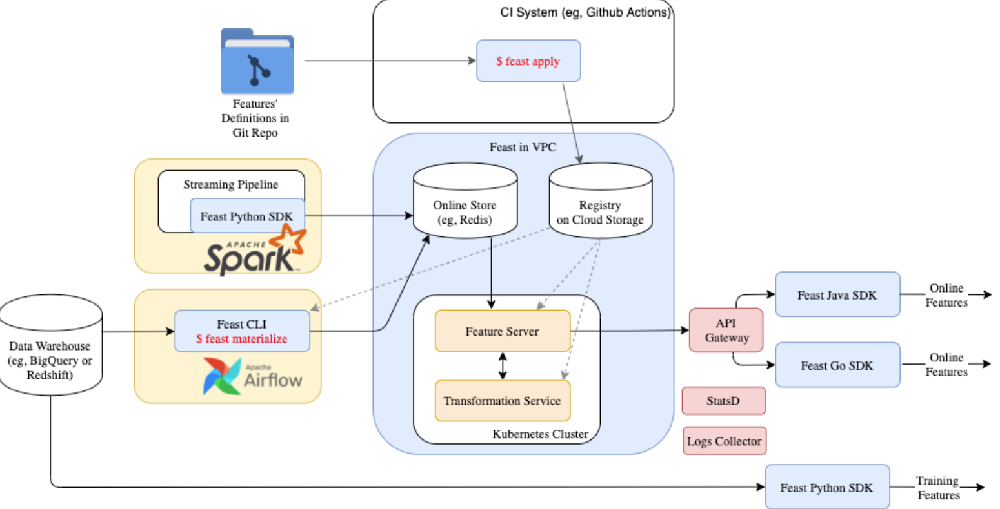
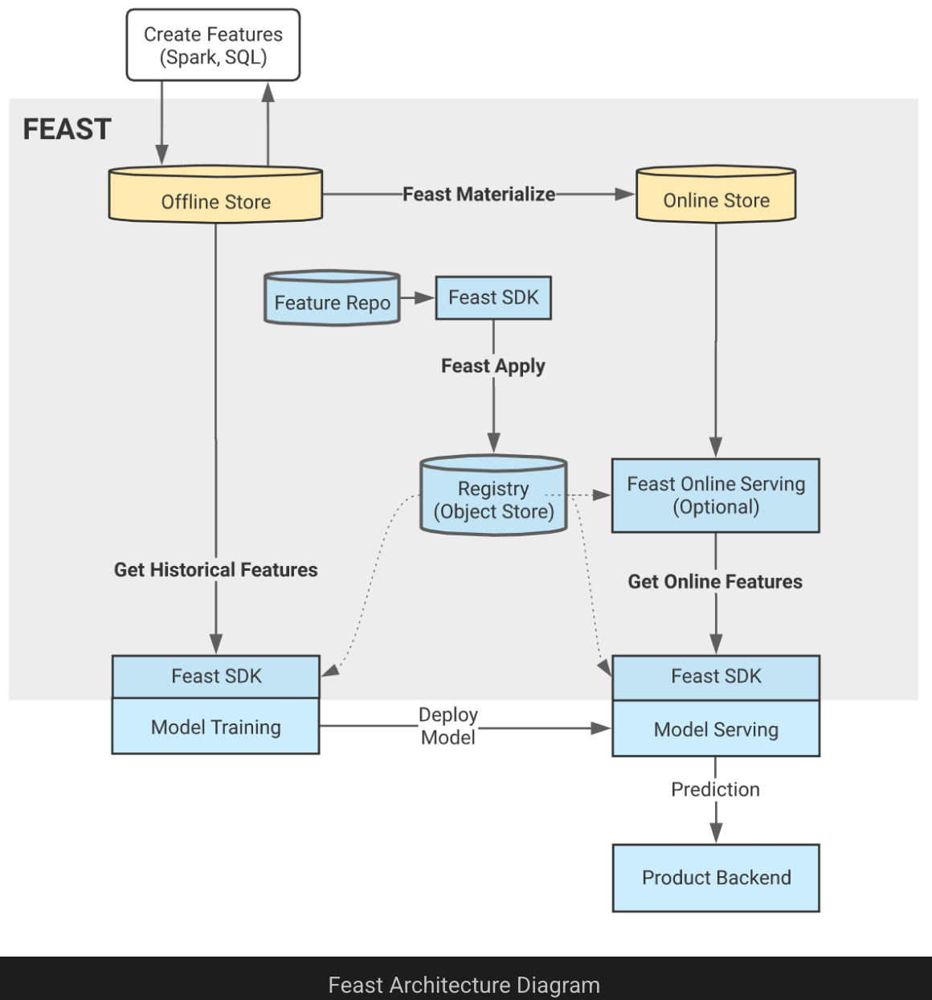

# Feast Feature Store

```{toctree}
:hidden:

feast_architecture
feast_concepts
feast_components
feast_usecases
feast_aws
run_in_prod
validate_historical_with_gx
add_reuse_tests
```

##
___

*	[Feast Architecture](feast_architecture.md)
*	[Feast Concepts](feast_concepts.md)
*	[Feast Components](feast_components.md)
*	[Feast Use Cases](feast_usecases.md)
*	[Feast in Production](run_in_prod.md)
*	[Feast with AWS](feast_aws.md)
*	[Validate historical features with GX](validate_historical_with_gx.md)
*	[Add and reuse tests](add_reuse_tests.md)

___

**Block Diagram: Feast Feature Store**





___
