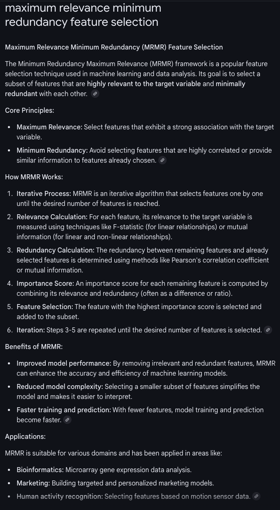

# Feature Engineering for MLOps

**Preamble: The Alchemist's Stone of Machine Learning**

In the realm of Machine Learning, raw data is the base metal, and insightful predictions are the gold. **Feature Engineering** is the alchemical process that transmutes this raw potential into valuable signals that fuel intelligent systems. It's widely acknowledged that the quality and relevance of features often have a more significant impact on model performance than the choice of algorithm itself. For MLOps Leads, mastering feature engineering isn't just about crafting clever transformations; it's about building scalable, reliable, and governable processes to consistently create, manage, and serve these crucial inputs across the entire ML lifecycle. This compendium synthesizes insights from pioneering companies (Uber, LinkedIn, Netflix, Meta, DoorDash, Zillow, etc.) and foundational texts to provide a technically deep, actionable framework for this critical MLOps pillar.

---

**Chapter 1: The Strategic Imperative of Feature Engineering**

1.  **Defining Feature Engineering:**
    *   **Core Concept:** The process of using domain knowledge to extract, transform, and select relevant information from raw data into a format (features) that ML models can effectively consume to make accurate predictions.
    *   **Beyond Raw Data:** ML models (especially non-deep learning ones) often struggle with raw, complex data. Feature engineering bridges this gap by providing a more meaningful and digestible representation.
    *   **Art and Science:** It's an iterative process combining domain expertise, data exploration, statistical understanding, and creative problem-solving.

2.  **Why Feature Engineering is Paramount for MLOps Success:**
    *   **Model Performance Driver:** The single most impactful lever for improving model accuracy and generalization. (Google "Rules of ML" - "most of the gains come from great features," Facebook Ads paper)
    *   **Reducing Model Complexity:** Well-engineered features can allow simpler, more interpretable models to achieve high performance.
    *   **Enabling Real-Time ML:** Critical for generating fresh, low-latency features that make models sensitive to immediate user actions and environmental changes.
    *   **Mitigating Training-Serving Skew:** Consistent feature engineering across training and serving is vital for reliable production models.
    *   **Facilitating Rapid Experimentation:** Standardized approaches to feature creation and management accelerate the model development lifecycle.
    *   **Governance and Reusability:** Feature Stores, as a direct outcome of systematized feature engineering, promote sharing, discovery, and consistent use of features.

3.  **The Scope: Learned Features vs. Engineered Features**
    *   **Engineered (Handcrafted) Features:** Manually designed based on domain knowledge (e.g., n-grams, aggregations, ratios). Still crucial for most ML, especially with tabular data or where interpretability is key.
    *   **Learned Features (Automated Feature Extraction):** Typically associated with deep learning (e.g., embeddings from text/images, hidden layer activations). DL models learn representations from raw(er) data.
    *   **The Reality:** A hybrid approach is common. Even with DL, initial data processing and some high-level engineered features (e.g., metadata alongside images) are often necessary.
    *   **Google's Rule #17:** "Start with directly observed and reported features as opposed to learned features." Build a simple baseline first.

---

**Chapter 2: The Feature Engineering Lifecycle & Process**

1.  **Feature Ideation & Discovery:**
    *   Understanding business problems and model objectives.
    *   Domain expert consultation.
    *   Exploratory Data Analysis (EDA) on raw data sources.
    *   Reviewing existing features (Feature Store discovery).
    *   Hypothesizing new signals.

2.  **Raw Data Sourcing & Preparation:**
    *   Identifying and accessing relevant raw data (logs, databases, streams, APIs). (Netflix Axion for facts, LinkedIn Feed sourcing from multiple online systems)
    *   Initial data cleaning, parsing, and validation.
    *   Understanding data lineage of raw sources.

3.  **Feature Transformation & Generation:**
    *   Applying various operations (see Chapter 3) to raw data to create candidate features.
    *   Code implementation (SQL, Python/Pandas, Spark, Flink).
    *   **Key Challenge:** Ensuring logic is consistently applicable for both batch (training) and real-time/streaming (inference). (Hopsworks Taxonomy, Databricks "Best Practices for RT Feature Computation")

4.  **Feature Validation & Quality Assurance:**
    *   Checking for missing values, outliers, correct distributions.
    *   Ensuring features are free of data leakage.
    *   Verifying feature importance and generalization.

5.  **Feature Storage & Management (The Role of Feature Stores):**
    *   Storing computed features in an Offline Store (for training) and an Online Store (for low-latency inference).
    *   Registering features with metadata (definitions, ownership, versions, lineage) in a Feature Registry.

6.  **Feature Serving:**
    *   Providing features to models for training (point-in-time correct) and inference (latest values).

7.  **Feature Monitoring & Iteration:**
    *   Tracking feature distributions, freshness, and quality in production.
    *   Identifying feature drift or degradation.
    *   Iterating on feature definitions based on model performance and new data. (Google "Rules of ML" - Rule #16, #22)

---

**Chapter 3: A Lexicon of Feature Engineering Operations & Techniques**

1.  **Handling Missing Values:**
    *   **Types:** Missing Not At Random (MNAR), Missing At Random (MAR), Missing Completely At Random (MCAR). Understanding the "why" is crucial.
    *   **Deletion:** Column deletion (if too many missing), Row deletion (if MCAR and few). Risk: losing info, bias.
    *   **Imputation:** Mean/median/mode, default values (e.g., empty string, 0), model-based prediction. Risk: injecting bias, data leakage if not done carefully (use train-split stats only).

2.  **Scaling & Normalization (Numerical Features):**
    *   **Why:** Models (esp. distance-based, gradient-based) are sensitive to feature ranges. Aids convergence.
    *   **Techniques:**
        *   **Min-Max Scaling:** To a specific range (e.g., \ or \[-1,1]). Sensitive to outliers.
        *   **Z-Score Standardization (StandardScaler):** Mean 0, StdDev 1. Assumes normality.
        *   **Clipping/Winsorizing:** Handles outliers by capping at percentiles/thresholds before scaling.
        *   **Non-Linear Transformations (for skewed data):** Log transform, Box-Cox, fourth-root.
    *   **Data Leakage Alert:** Always scale *after* splitting data, using statistics *only* from the training split.

3.  **Discretization/Binning (Numerical to Categorical):**
    *   **Purpose:** Convert continuous features into a finite number of bins. Can help models capture non-linearities or simplify learning.
    *   **Methods:** Equal width, equal frequency (quantiles), custom/domain-driven boundaries. Histogram equalization (BigQuery `ML.BUCKETIZE`).
    *   **Trade-off:** Introduces discontinuities, loses fine-grained information.

4.  **Encoding Categorical Features:**
    *   **Challenge:** High cardinality, new/unknown categories in production (cold start).
    *   **Techniques:**
        *   **Ordinal Encoding:** For categories with inherent order.
        *   **One-Hot Encoding (OHE):** Standard for nominal categories. Problem: dimensionality explosion with high cardinality. Dummy coding is a variant.
        *   **Hashing Trick (Vowpal Wabbit, TensorFlow `categorical_column_with_hash_bucket`):** Maps high-cardinality categories to a fixed-size vector. Handles unknown values, reduces dimensionality. Trade-off: collisions (but often acceptable loss).
        *   **Binary/BaseN Encoding:** Compresses OHE.
        *   **Learned Embeddings:** (See below).
        *   **Bayesian Encoders (Target, WoE, James-Stein, Leave-One-Out):** Use target variable statistics. Powerful but high risk of data leakage if not implemented carefully (e.g., use proper cross-validation for encoding).

5.  **Feature Crossing:**
    *   **Purpose:** Explicitly model interactions between categorical (or bucketized numerical) features. Helps linear models learn non-linear relationships.
    *   **Mechanism:** Create new features representing combinations (e.g., `day_of_week` X `hour_of_day`).
    *   **Tools:** BigQuery ML `ML.FEATURE_CROSS`, TensorFlow `crossed_column`.
    *   **Challenges:** Cardinality explosion. Often paired with hashing or embeddings, and regularization (L1 to encourage sparsity).

6.  **Embeddings:**
    *   **Purpose:** Map high-cardinality categorical inputs or complex data (text, images, graphs) into dense, lower-dimensional numerical vectors, capturing semantic similarity.
    *   **Types & Methods:**
        *   **Categorical Embeddings:** Learned as part of a neural network (e.g., TensorFlow `embedding_column`). An alternative to OHE for high cardinality. (Natality dataset plurality example).
        *   **Text Embeddings:** Word2Vec, GloVe, FastText, NNLM (pre-trained or trained from scratch). Contextual (BERT, Transformers - from Hugging Face).
        *   **Image Embeddings:** Output of pre-trained CNNs (Inception, ResNet) before the final classification layer.
        *   **Multimodal Embeddings:** Combining different data types (e.g., text + tabular, image + metadata).
        *   **Autoencoders:** Unsupervised learning of dense representations (bottleneck layer). TabNet for tabular data.
    *   **Positional Embeddings (Discrete & Continuous/Fourier Features):** Crucial for sequence models (Transformers) to understand order when processing in parallel. (e.g., text, time series).
    *   **Benefits:** Dimensionality reduction, captures relationships, transfer learning (using pre-trained embeddings).
    *   **Choosing Embedding Dimension:** Rule of thumb (e.g., fourth root of unique categories) or hyperparameter tuning.

7.  **Feature Selection & Importance:**
    *   **Purpose:** Identify the most relevant features, reduce dimensionality, improve model interpretability and performance, reduce overfitting, and mitigate data leakage. (Google "Rules of ML" Rule #22)
    *   **Techniques:**
        *   **Filter Methods (Univariate):** Evaluate features independently of the model.
            *   Variance Thresholding.
            *   Correlation (Pearson, Spearman, Kendall) with target.
            *   Mutual Information (captures non-linear relationships).
            *   Chi-Squared (for categorical features).
        *   **Wrapper Methods (Multivariate):** Use a model to score subsets of features.
            *   Forward Selection, Backward Elimination, Recursive Feature Elimination (RFE).
        *   **Embedded Methods:** Feature selection is part of the model training process (e.g., L1/Lasso regularization, tree-based feature importance from XGBoost/LightGBM).
        *   **Information-Theoretic Feature Selection (Uber X-Ray):** MRMR (Maximum Relevance, Minimum Redundancy).
        *   **SHAP (SHapley Additive exPlanations):** Model-agnostic, explains contribution of each feature to individual predictions and overall importance.
    *   **Coverage & Generalization:**
        *   **Coverage:** Percentage of samples where the feature has a value.
        *   **Generalization:** How well the feature performs on unseen data. Watch for differing distributions between train/test.

8.  **Handling Time & Sequences:**
    *   **Windowed Aggregations:** Sum, average, min, max, count over rolling time windows (e.g., transactions in last 7 days). Critical for real-time ML.
    *   **Lags:** Previous values of a feature.
    *   **Trends & Seasonality:** Decomposing time series.
    *   **Event Time vs. Chronological Time (Clock Time):** Aggregating by event counts (e.g., volume bars) rather than fixed time intervals can reveal different patterns.

9.  **Domain-Specific Feature Engineering:**
    *   **LinkedIn Feed:** `historicalActionsInFeed` (categorical actions X discrete time windows), represented as tensors. Using URNs for typed features and metadata for definition/resolution. Hashing for evolving categoricals.
    *   **Didact AI (Financial Markets):** Price/volume patterns, options data, text sentiment from earnings/filings, peer contextualization, historical contextualization, market regime features, trading strategy-based features, accuracy gap.
    *   **Google Rules of ML:** Turning heuristics into features (Rule #7), combining existing features into human-understandable ways (Rule #20).

---

**Chapter 4: Architecting Feature Engineering Pipelines**

1.  **Batch Feature Engineering Pipelines:**
    *   **Tools:** SQL (in DWHs like Snowflake, BigQuery, Redshift - used by Monzo with dbt), Apache Spark (Uber Michelangelo, Netflix Axion, Databricks, Hopsworks), Python/Pandas (for smaller scale).
    *   **Orchestration:** Airflow, Dagster, Kubeflow Pipelines, etc.
    *   **Typical Flow:** Read raw data -> Transform -> Write to Offline Feature Store -> (Optional) Push to Online Store.
    *   **LinkedIn Feathr:** Defines features, computes them for training (typically batch).

2.  **Streaming / Real-Time Feature Engineering Pipelines:**
    *   **Challenges:** State management, windowing, latency, throughput, consistency.
    *   **Tools:** Apache Flink (DoorDash Riviera, Netflix Keystone, Uber Real-Time Infra), Spark Structured Streaming (Databricks, Tecton), Kafka Streams, ksqlDB.
    *   **Typical Flow:** Consume from Stream (Kafka, Kinesis) -> Transform (aggregations, joins) -> Write to Online Feature Store -> (Optional) Write to Offline Store/Data Lake for consistency and training.
    *   **Databricks Architectures:** Clear distinction for batch, streaming, and on-demand. Streaming uses Spark Structured Streaming to write to online/offline stores.
    *   **LinkedIn NRT Features:** Samza stream processor -> Kafka -> Pinot (online store for recent actions, queried for on-demand feature summarization).
    *   **Netflix Axion:** Keystone (Flink-based) processes logged facts -> Iceberg (offline) / EVCache (online).

3.  **On-Demand Feature Computation:**
    *   **Concept:** Features computed at inference time using request-time data, often combined with pre-computed features from an online store.
    *   **Implementation (Databricks):** MLflow `pyfunc` model wrappers include preprocessing steps for on-demand features. Ensures training (using historical data) and serving use the *same* computation logic.
    *   **Implementation (LinkedIn NRT):** Recommender system queries Pinot for recent actions and performs summarization *at recommendation time*.
    *   **Trade-off:** Adds to inference latency vs. pre-computation cost and potential staleness.

4.  **The Data Transformation Taxonomy & Pipeline Placement (Hopsworks):**
    *   **Model-Independent Transformations:** Executed in Feature Pipelines (batch/stream), output to Feature Store.
    *   **Model-Dependent Transformations:** Executed in Training/Inference Pipelines (on data *from* Feature Store or after on-demand computation).
    *   **On-Demand Transformations:**
        *   *Online:* In Inference Pipeline (using request context + FS data).
        *   *Backfill:* Same logic in Feature Pipeline on historical data -> FS.
    *   **This taxonomy dictates *where* in the overall MLOps flow different feature engineering steps should logically reside to maximize reusability and minimize skew.**

---

**Chapter 5: Feature Stores - Centralizing Feature Management & Serving**

*(This chapter expands on the previous compendium's Feature Store section, integrating insights from the newly added specialized Feature Engineering articles)*

1.  **Core Value Proposition & Components:** (As detailed in prior response, reinforced by LinkedIn Feathr, Databricks, Tecton, Hopsworks, Splice Machine, Featurestore.org).
    *   Crucially, LinkedIn Feathr emphasizes the **abstraction layer** and **common feature namespace** as key benefits for productivity and sharing.

2.  **Point-in-Time Correctness & Time Travel (Critical FS Capability):**
    *   **Problem:** Avoiding data leakage from future feature values into training examples for past events. (Tecton "Back to the Future," Feast PIT, Databricks PIT)
    *   **Mechanism:** "AS OF" joins using event timestamps from the label/spine data and feature timestamps from the historical feature store.
    *   **Implementations:**
        *   **Feast:** `get_historical_features` API.
        *   **Databricks:** Time Series Feature Tables with `timestamp_lookup_key`.
        *   **Hopsworks:** Hudi backend enables `as_of()` queries.
        *   **Tecton:** Automates PIT joins.
        *   **Netflix DeLorean/Axion:** Snapshotting/logging facts and regenerating features for specific time points.

3.  **Online Store Optimizations for Low Latency & High Throughput:**
    *   **DoorDash Gigascale FS (Redis):**
        *   Use of Redis Hashes (`HMGET`) over flat key-values.
        *   String hashing for feature names (`xxHash32`).
        *   Binary serialization (Protobufs) for compound types.
        *   Compression (Snappy) for serialized lists.
    *   **LinkedIn NRT Features (Pinot):**
        *   Pinot chosen for near real-time ingestion from Kafka and low-latency analytical queries.
        *   Data partitioned and sorted by `actor` (member ID) for quick retrieval of actions.

4.  **Architectural Choices for Feature Computation with Feature Stores:**
    *   **Batch Features (Databricks):** Spark jobs write to offline tables, then publish to online store.
    *   **Streaming Features (Databricks):** Spark Structured Streaming writes to offline and online stores. `streaming=True` flag in Feature Store API.
    *   **On-Demand Features (Databricks):** MLflow `pyfunc` model wraps feature computation logic, ensuring consistency between training (using historical context) and serving (using real-time context). Lineage information in the logged model resolves online store lookups.
    *   **LinkedIn Feathr:** Defines features (transformations on raw sources or other Feathr features), then Feathr computes them for training (point-in-time correct) and materializes for online serving.

---

**Chapter 6: MLOps for Feature Engineering - Best Practices for Leads**

1.  **Standardization for Rapid Experimentation (LinkedIn "Typed AI Features"):**
    *   **Problem:** Disparate formats and schemas across training, inference, offline snapshots, and online systems slow down iteration.
    *   **Solution:** A unified type system for features (e.g., LinkedIn's tensor-based system with feature-specific metadata for names, domains, vocabulary mappings).
        *   Features serialized in a generic schema (tensors).
        *   Metadata (URN-resolvable) provides type information and interpretation.
        *   Handles evolving categoricals via hashing and a central metadata update process.
    *   **Benefit:** Flexibility to add features without API changes, efficiency, unified documentation.

2.  **Prioritizing Feature Quality & Governance:**
    *   **Data Validation in Pipelines:** Check for schema compliance, statistical properties, anomalies before features are written to the store or used for training.
    *   **Feature Documentation & Ownership:** Clear definitions, owners, and documentation are crucial for discovery and trust.
    *   **Monitoring for Feature Drift:** Track distributions and statistics of features in production to detect changes that might impact model performance.

3.  **Tackling Training-Serving Skew (Google Rule #29, #31, #32, #37):**
    *   **Rule #29 (Best Way):** Save features used at serving time, then pipe those to a log for training. (Netflix Axion embodies this by logging facts from compute applications).
    *   **Rule #32 (Reuse Code):** Share feature transformation code between training and serving pipelines. (Feature Stores aim to enforce this; Databricks `pyfunc` is a pattern).
    *   **Rule #31 (Beware Joins):** If joining with tables that change between training and serving, data can skew. PIT joins and snapshotting help.
    *   **Rule #37 (Measure Skew):** Explicitly monitor differences in performance and feature distributions.

4.  **Iteration and Continuous Improvement:**
    *   **Plan to Launch and Iterate (Google Rule #16):** Feature engineering is not a one-off task.
    *   **Clean Up Unused Features (Google Rule #22):** Reduce technical debt and complexity.
    *   **Explore and Combine Features (Google Rule #18, #20):** Look for features that generalize, combine existing ones in human-understandable ways.

5.  **Collaboration and Team Structure:**
    *   Feature engineering often involves DS, MLE, and DE. Clear roles and responsibilities are needed.
    *   Platforms (like Feature Stores or LinkedIn DARWIN for broader DS work) can facilitate collaboration by providing common tools and repositories.

---

**Chapter 7: The Lead's Feature Engineering Thinking Framework (Mind Map)**

---