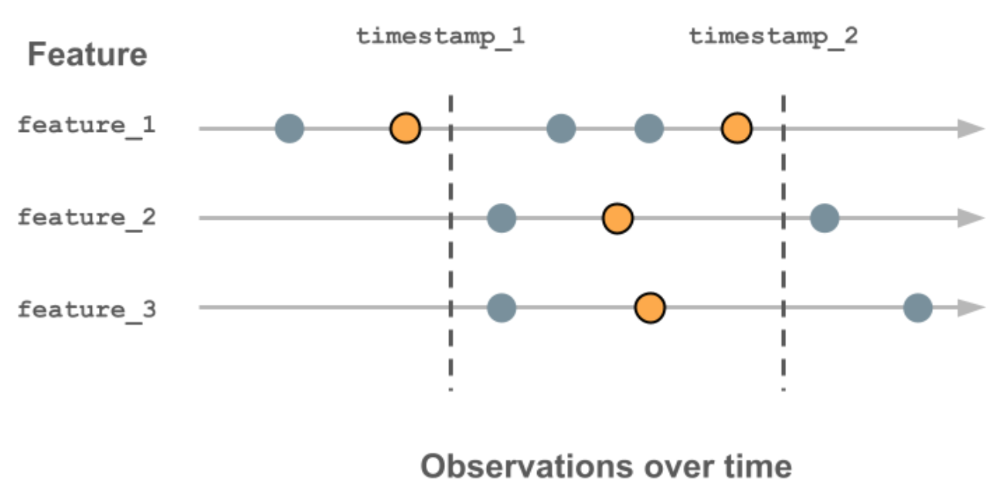
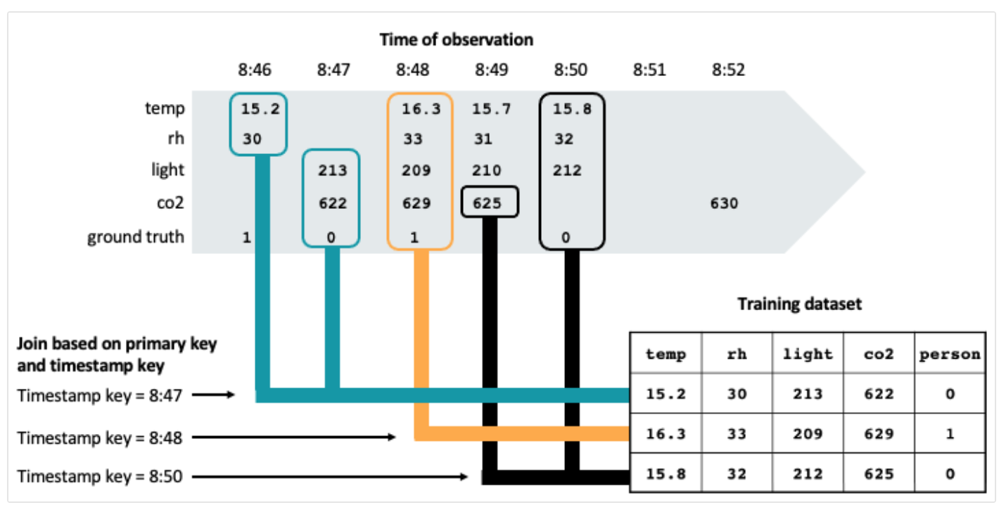
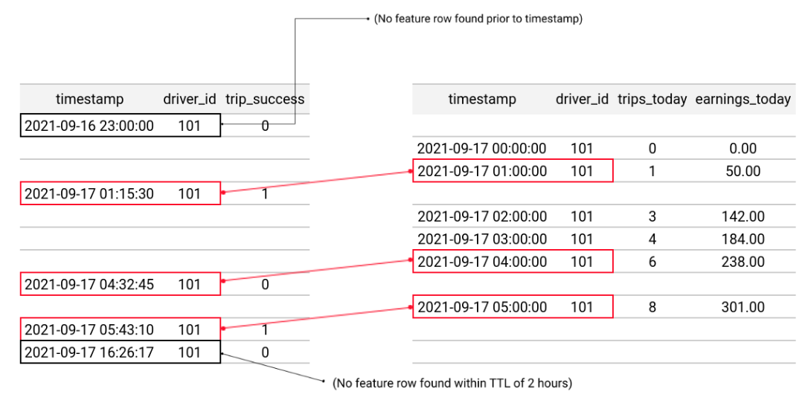
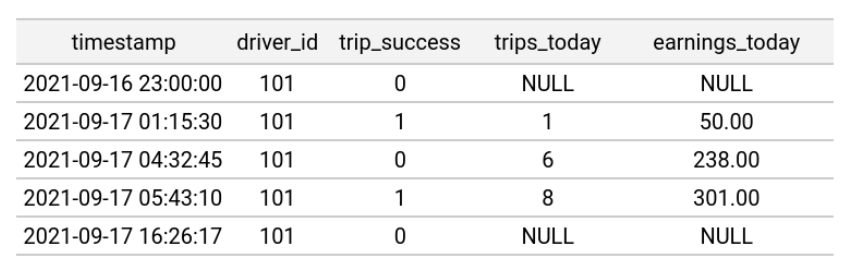
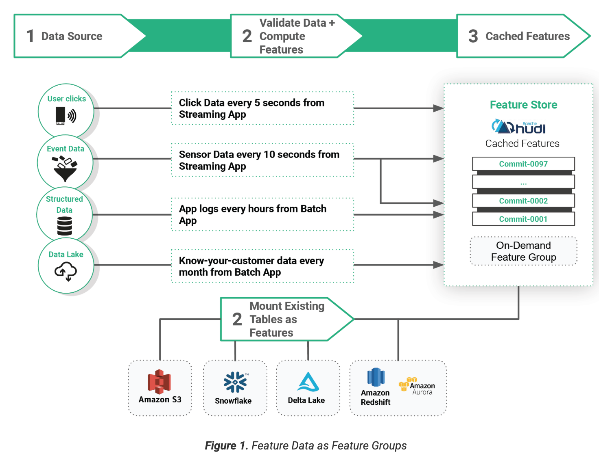
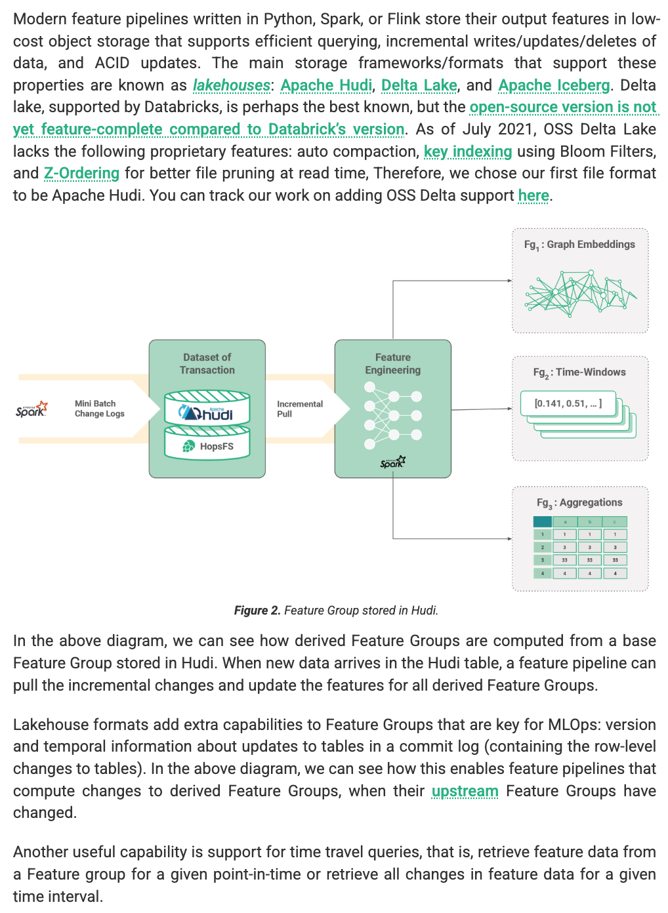

# Point-in-Time Correctness & Time Travel in ML Data Pipelines

**Preamble: Doc Brown's Warning for Machine Learning**

Just as Marty McFly learned the hard way, using information from the "future" to influence the "past" can lead to disastrous paradoxes. In Machine Learning, this paradox manifests as **data leakage**, where models are trained on information that wouldn't have been available at the actual moment of a past event. This leads to models that perform spectacularly in offline validation but falter dramatically in production—a direct path to eroding trust and business value. This compendium dives deep into the "time-travel problem" in ML, explains the mechanics and importance of **Point-in-Time (PIT) Joins**, and synthesizes industry best practices and solutions for ensuring temporal data integrity in your MLOps pipelines.

---

**Chapter 1: The Core Problem - Data Leakage and the Perils of Hindsight**

1.  **The Data Leakage Conundrum**
    *   **Definition:** Training an ML model using feature values that would not have been available at the *actual time of the labeled event/observation*.
    *   **Why it Happens:**
        *   **Real-time Inference Simplicity:** In production, models use the *latest known* feature values. It seems natural to replicate this for training by querying current feature values.
        *   **The Hindsight Trap:** When constructing training data from historical events, joining with *current* feature values (or feature values computed *after* the event) inadvertently provides the model with future information.
    *   **Consequences:**
        *   Inflated offline model performance metrics (appearing too good to be true).
        *   Poor and erratic model performance in production (the "sports almanac" is taken away).
        *   Difficult-to-diagnose issues, wasted resources, and loss of trust in ML systems.
    *   **Common Scenario:** A model predicting ad clicks. Training data might join ad display events with user features that were updated *after* the ad was actually displayed and clicked (or not).

2.  **Training-Serving Skew as a Symptom:**
    *   While training-serving skew can have multiple causes (e.g., different preprocessing logic), incorrect temporal handling of features is a major contributor. The model effectively learns on a different "world" than the one it operates in during real-time inference.

---

**Chapter 2: Point-in-Time (PIT) Joins - The Mechanism for Temporal Accuracy**

1.  **What is a Point-in-Time Join?**
    *   **Core Idea:** When constructing a training dataset, for each labeled event (e.g., a user click, a transaction), join feature values that were *known and available at the exact timestamp of that specific event*, not before and certainly not after.
    *   **Mechanism:** It involves joining an "entity dataframe" (or "label dataframe" / "spine dataframe") containing primary keys and event timestamps with one or more "feature views" (or "feature tables") that store historical feature values, also timestamped.
    *   **The "AS OF" Logic:** For each row in the entity dataframe, the join selects feature values from the feature view(s) such that:
        *   The feature's timestamp is less than or equal to the event timestamp in the entity dataframe.
        *   Among all such qualifying feature values, the *most recent one* is chosen.
    *   **Visualizing:**
        *   Feast's diagram clearly shows scanning backward from the entity timestamp.
        *   Databricks' diagram illustrates selecting the outlined orange circle (latest value before or at the event time).






[Point-in-time support using time series feature tables](https://docs.databricks.com/aws/en/machine-learning/feature-store/time-series)





[Point-in-time joins](https://docs.feast.dev/getting-started/concepts/point-in-time-joins)


2.  **Why PIT Joins are Essential:**
    *   They directly prevent the primary cause of future data leakage in training sets.
    *   They are fundamental for building accurate historical training data for models that rely on dynamic features.
    *   They enable the true evaluation of a feature's predictive power as it would have existed at decision time.

---

**Chapter 3: Key Requirements for Achieving Point-in-Time Correctness**

1.  **Historical Feature Value Storage (Offline Store):**
    *   A system (Data Lake, Data Warehouse) that stores all historical versions of feature values, not just the latest state.
    *   Each feature update must be timestamped accurately (ideally with event time).
    *   **Technologies:**
        *   **Data Lake Table Formats:** Apache Hudi, Delta Lake, Apache Iceberg are designed for this, supporting ACID transactions, versioning, and efficient time-travel queries. (Hopsworks uses Hudi, Tecton mentions Delta Lake, Databricks uses Delta tables).
        *   Traditional Data Warehouses can also be used if data is appended with timestamps and queries are structured carefully.

2.  **Timestamped Event/Label Data:**
    *   The data for which you are generating training examples (your "labels" or target events) must have accurate timestamps representing when the event or observation occurred. This is the "point-in-time" reference.

3.  **Timestamped Features:**
    *   All features being joined must have associated timestamps indicating when their value was computed or became valid.

4.  **Join Logic with Temporal Awareness:**
    *   The query engine or feature retrieval system must be capable of performing "AS OF" joins or equivalent logic.
    *   **Netflix DeLorean:** Builds APIs to serve snapshot data for a given time coordinate in the past.
    *   **Feast:** `get_historical_features` API performs this logic.
    *   **Databricks Feature Store:** Uses `timestamp_lookup_key` in `FeatureLookup`.
    *   **Hopsworks:** Leverages Hudi's time-travel capabilities with `as_of()` calls on queries.
    *   **Tecton:** `get_offline_features` (similar to Feast) performs PIT joins.

5.  **Handling of Feature Update Cadence & Granularity:**
    *   Features might be updated at different frequencies (batch daily, streaming seconds). The PIT join must correctly find the latest relevant value for each feature independently based on the event timestamp.

---

**Chapter 4: Common Approaches & Architectural Patterns for Historical Feature Data**

1.  **The "Log and Wait" Approach (Tecton "Back to the Future")**
    *   **Process:** Start logging feature values as they are fetched/computed for *real-time inference*. These logs, now timestamped with the prediction event, become the source for future training datasets.
    *   **Pros:**
        *   Uses the exact feature data from the time of the prediction event, potentially minimizing one form of training-serving skew (if the logging is perfectly aligned with what the model sees).
    *   **Cons:**
        *   **Slow Iteration:** Takes weeks/months to collect enough data for a new feature before it can be used in training. Old historical events become obsolete for new features.
        *   **Limited Reusability:** Logged data is specific to the prediction times and population distributions of the first use case. May require re-logging for other use cases.
    *   **When Viable:** High-volume predictions, low seasonality, quick data accumulation. (Netflix's "Axion Fact Store" has elements of this for facts logged by compute applications, but also focuses on regeneration).

2.  **Backfilling Data with Point-in-Time Joins (Tecton "Back to the Future", General Concept)**
    *   **Process:** Reconstruct what feature values *would have been* in the past using historical raw event data (logs, transactional data). Then use PIT joins to assemble training datasets.
    *   **Pros:** Enables rapid experimentation with new features on existing historical label data. Avoids the "wait" of the logging approach.
    *   **Cons:**
        *   **Computational Cost:** Backfilling can be expensive, especially for complex features or long historical windows. (Tecton "Aggregations Part 1")
        *   **Accuracy of Reconstruction:** Critical to accurately represent historical data. Errors in backfilling logic lead to poor training data.
        *   **Complexity:** Implementing correct and efficient backfilling and PIT join logic can be complex.
    *   **This is where Feature Stores shine:** They aim to automate and optimize this backfilling and PIT join process.

3.  **Snapshot-Based Time Travel / Service Snapshotting (Netflix "DeLorean", Tecton "Back to the Future")**
    *   **Netflix DeLorean Approach:**
        *   **Context Selection:** Periodically (daily) select samples of contexts (member profiles, devices, etc.) to snapshot.
        *   **Data Snapshots:** Fetch data from various online microservices (Viewing History, My List, etc.) for these selected contexts at a specific point in time. Uses Prana as a data proxy to call live services.
        *   **Storage:** Snapshotted data (POJOs transformed to Parquet) stored in S3, location indexed in Cassandra.
        *   **APIs for Time Travel:** Given a destination time in the past, API fetches snapshot data from S3. Feature encoders operate on these POJOs.
        *   **Goal:** Reconstruct inputs a model *would have seen online* at a past time.
    *   **Tecton's Mention of Snapshot-based Time Travel:** A simpler form where a *single cutoff time* is chosen for all feature values. Useful for models with slow-moving signals or large prediction windows. Delta Lake and Hudi make fetching data from a single point in time easy. This is less granular than per-event PIT joins.

---

**Chapter 5: Platform-Specific Implementations of Point-in-Time Correctness**

1.  **Feast (`get_historical_features`)**
    *   **Input:** An "entity dataframe" (Pandas DataFrame) containing entity keys and `event_timestamp` columns.
    *   **Process:** For each row in the entity dataframe, Feast queries the specified `FeatureView`(s). It scans backward in time from the row's `event_timestamp` up to a maximum of the `ttl` (Time To Live) defined for the `FeatureView`.
    *   **Output:** A training dataframe with original entity rows joined with the historically accurate feature values.
    *   **Limitations Noted by Feast:** Rows in entity dataframe older than earliest feature data, or outside TTL, won't be joined.

2.  **Databricks Feature Store (Time Series Feature Tables)**
    *   **Concept:** Uses `TIMESERIES` primary key on Delta tables (includes a timestamp key column).
    *   **Mechanism:**
        *   `timestamp_lookup_key` argument in `FeatureLookup` specifies the timestamp column in the input DataFrame (spine).
        *   Performs an "AS OF join" logic: retrieves the latest feature values *prior to or at* the `timestamp_lookup_key` for matching primary keys.
        *   Supports `lookback_window` (e.g., `timedelta(days=7)`) in `FeatureLookup` to exclude feature values older than the specified window relative to the lookup timestamp.
    *   **Photon-enabled Spark Native Join:** Can be used for faster lookups.
    *   **Online Store Publishing:** Can publish a snapshot (latest values) or a time window (with TTL for expiration) to online stores like DynamoDB.

3.  **Hopsworks Feature Store (Leveraging Apache Hudi)**
    *   **Underlying Tech:** Stores "cached Feature Groups" as Apache Hudi tables (Parquet + metadata). Hudi supports versioned data, ACID updates, incremental ingestion, and time-travel.
    *   **Time-Travel Queries:**
        *   `read()`: Returns latest snapshot.
        *   `read_changes(commit_timestamp_A, commit_timestamp_B)`: Retrieves incremental changes between two Hudi commits.
        *   `as_of(timestamp_string)`: Called on a query object to retrieve data as of a specific point in time.
    *   **Joining Feature Groups at PIT:** Can call `as_of()` on individual feature group queries before joining them, allowing joins of different features from different historical points if needed.
    *   **Pipeline Triggering:** Can poll Hudi commit details (`commit_details()`) to detect new data and trigger downstream training pipelines.





[Hopsworks: MLOps Wars: Versioned Feature Data with a Lakehouse](https://www.hopsworks.ai/post/mlops-wars-versioned-feature-data-with-a-lakehouse)

4.  **Tecton (`get_offline_features`)**
    *   **Declarative Approach:** User defines raw data source, feature transformation, and calculation frequency.
    *   **Tecton's Role:** Handles backfilling historical feature values and ongoing calculation/serving. Performs point-in-time joins automatically when `get_offline_features` is called with a spine dataframe containing event timestamps.
    *   **Aim:** Data scientists only need to specify *what* features for *which* training events, and Tecton handles the "how" of PIT joins.

5.  **Netflix Axion (Evolution of ML Fact Store)**
    *   **Motivation:** Original "DeLorean" was for feature *generation*. Axion is more of a *fact store* logging facts (member/video data with timestamps) from compute applications.
    *   **ETL Evolution:**
        *   Initial: Normalize facts into multiple tables (querying became inefficient due to large joins).
        *   Current: Denormalize into a single Iceberg table (nested Parquet). Querying still slow for sparse lookups.
    *   **Low-Latency Query Solution:** Introduced EVCache (key-value store) for a subset of recent/hot facts and indices (e.g., by member ID). Queries first hit EVCache, then fall back to Iceberg. This is for *online feature generation/lookup by compute applications*, and these generated features/facts are logged.
    *   **Offline Feature Generator:** *Regenerates* features using these logged facts for temporal accuracy, ensuring no training-serving skew. This is where the PIT concept is crucial for Axion.

---

**Chapter 6: Key Technical Considerations & Challenges in Implementing Time Travel / PIT**

1.  **Historical Data Availability & Retention:**
    *   Streaming sources (Kafka, Kinesis) often have limited retention. A long-term offline store (Data Lake) is essential for backfilling features over extended periods.
    *   Netflix DeLorean snapshots online services because not all data is available offline or easily queryable historically from source systems.

2.  **Computational Cost of Backfilling & PIT Joins:**
    *   Recomputing features for entire historical datasets can be very expensive.
    *   Joins involving large historical tables and many spine events are resource-intensive.
    *   **Optimizations:**
        *   Partitioning offline feature tables by time and entity ID.
        *   Efficient file formats (Parquet, ORC) and table formats (Delta, Hudi, Iceberg) with data skipping/indexing.
        *   Distributed compute engines (Spark, Flink).

3.  **Schema Evolution:**
    *   How does the system handle features that didn't exist at a certain point in the past, or whose schema (data type, definition) changed?
    *   Feature values should ideally be `null` or a defined default if the feature didn't exist.
    *   Schema registries and versioned feature definitions are crucial. Hopsworks Hudi supports schema evolution.

4.  **Data Granularity & Aggregation Windows:**
    *   Ensuring that aggregations (e.g., "sum of transactions in last 7 days") are computed correctly based on the exact window relative to each event timestamp. This is complex with overlapping windows.
    *   Tecton's tiled aggregation is a solution for this.

5.  **Late Arriving Data:**
    *   How are events that arrive late (with an event_timestamp in the past but ingested now) handled in feature computations and PIT joins? This can affect feature accuracy if not managed carefully. Watermarks in stream processing are relevant here.

6.  **Consistency Between Backfilled Data and Real-Time Computed Data:**
    *   The logic used for backfilling historical features must be identical to the logic used for computing features from live streams or real-time requests to avoid skew. This is a core tenet of Feature Store design (e.g., Tecton's unified pipelines, Databricks `pyfunc` wrapper).

7.  **Offline Store Performance for PIT Lookups:**
    *   The offline store needs to be optimized for potentially many small, time-bounded lookups for different entities, which can be different from typical analytical scan patterns. (Databricks recommends Liquid Clustering/Z-Ordering).

8.  **Defining "Event Time":**
    *   Clarity on which timestamp represents the true "event time" for labels and features is critical. Clock skews and system delays can introduce noise.

---

**Chapter 7: Best Practices for MLOps Leads - Navigating Temporal Data Challenges**

1.  **Prioritize Point-in-Time Correctness from Day One:** Do not treat it as an afterthought. Data leakage from incorrect temporal joins is a silent killer of ML models.
2.  **Timestamp Everything:** Ensure all raw data, intermediate transformations, and final features have reliable event timestamps.
3.  **Invest in an Offline Store Optimized for Temporal Data:** Use modern data lake table formats (Delta, Hudi, Iceberg) that support versioning, time-travel queries, and efficient updates.
4.  **Leverage a Feature Store:** A mature Feature Store (whether built or bought) should abstract away the complexity of PIT joins and backfilling.
    *   Look for: `get_historical_features` or equivalent API, support for `timestamp_lookup_key` or `as_of` semantics, and automated backfilling capabilities.
5.  **Ensure Consistency in Feature Logic:** Use the *exact same* transformation code for generating historical training data (backfills) and for serving/computing features in real-time.
    *   This is a core value proposition of tools like Tecton and the `pyfunc` wrapper pattern in Databricks/MLflow.
    *   Hopsworks' transformation functions tied to Feature Views aim for this.
6.  **Understand Data Source Retention and Latency:** Know how long raw event data is kept and the typical delays in its availability for feature computation.
7.  **Validate Backfilled Data:** After backfilling features, compare distributions and spot-check values against known historical states or alternative computation methods if possible.
8.  **Iterate on Feature Freshness Requirements:** Start with what's feasible (e.g., daily batch). If models show significant lift with fresher data, then invest in more complex real-time or streaming feature pipelines. (Databricks feature computation architectures).
9.  **Educate Your Team:** Ensure data scientists and MLEs understand the implications of time in feature engineering and how the platform provides PIT correctness.
10. **Monitor for Data Leakage:** Even with PIT joins, errors in upstream data or complex scenarios can lead to leakage. Implement checks to compare feature distributions between training and serving.

---

**Conclusion: Time is of the Essence**

The "time-travel problem" is not a futuristic hypothetical; it's a present-day reality for any team serious about productionizing reliable ML models, especially those dealing with dynamic, time-sensitive data. Point-in-Time correct feature engineering is the DeLorean that ML practitioners need to avoid polluting their training data with future knowledge. By understanding the core challenges, the architectural patterns like PIT joins and snapshotting, and leveraging the capabilities of modern Feature Stores and data lakehouse technologies, MLOps Leads can build robust systems that ensure models learn from the true past to accurately predict the future. Ignoring temporal integrity is an invitation for Biff Tannen to ruin your ML-powered future.

---

<!--
**MLOps Lead's Time-Travel & PIT Join Mind Map (Mermaid)**

```mermaid
mindmap
  root((Time Travel & PIT Joins in ML))
    ::icon(fa fa-clock)
    **I. The Core Problem**
      Data Leakage (Using Future Info)
        Consequences
          Inflated Offline Metrics
          Poor Production Performance
          Wasted Resources
      Training-Serving Skew (Symptom)

    **II. Point-in-Time (PIT) Join Defined**
      Goal: Temporal Accuracy
      Mechanism
        Entity/Label DataFrame (with Event Timestamps)
        Historical Feature Views/Tables (with Feature Timestamps)
        "AS OF" Logic: Most recent feature <= event_ts

    **III. Requirements for PIT Correctness**
      Historical Feature Storage (Offline Store)
        Versioning (Hudi, Delta, Iceberg)
      Timestamped Labels/Events
      Timestamped Features
      Temporal Join Logic in Query Engine/FS

    **IV. Approaches to Getting Historical Features**
      **Log and Wait**
        Pros: Exact data from prediction time
        Cons: Slow iteration, limited reuse
      **Backfilling with PIT Joins**
        Pros: Faster iteration for new features
        Cons: Computationally expensive, reconstruction accuracy vital
      **Snapshotting Services (e.g., Netflix DeLorean)**
        Method for collecting data for backfilling
        Select contexts -> Snapshot online services -> Store -> Serve via Time API

    **V. Platform Implementations for PIT**
      **Feast:** `get_historical_features`, scans backward up to TTL
      **Databricks FS:** Time Series Tables, `timestamp_lookup_key`, AS OF join, `lookback_window`
      **Hopsworks FS:** Hudi backend, `as_of()` queries, incremental pulls
      **Tecton:** `get_offline_features`, automates backfills & PIT joins
      **Netflix Axion/DeLorean:** Fact logging + offline regeneration for PIT

    **VI. Technical Challenges**
      Data Volume & Query Performance
      Schema Evolution over Time
      Late Arriving Data
      Computational Cost of Backfills
      Consistency (Backfill vs. Real-time logic)
      Offline Store Optimization for Temporal Queries

    **VII. Best Practices for MLOps Leads**
      Prioritize PIT Correctness
      Timestamp Everything
      Invest in Optimized Offline Store (Lakehouse formats)
      Leverage Feature Store capabilities
      Ensure Consistent Transformation Logic
      Understand Data Source Latency/Retention
      Validate Backfilled Data
      Iterate on Freshness Needs
      Educate Team

    %% Conceptual Colors for readability
    style I. The Core Problem fill:#ffcccc
    style II. Point-in-Time (PIT) Join Defined fill:#ccffcc
    style III. Requirements for PIT Correctness fill:#cceeff
    style IV. Approaches to Getting Historical Features fill:#ffffcc
    style V. Platform Implementations for PIT fill:#ffccff
    style VI. Technical Challenges fill:#ffebcc
    style VII. Best Practices for MLOps Leads fill:#e6ccff
```
-->