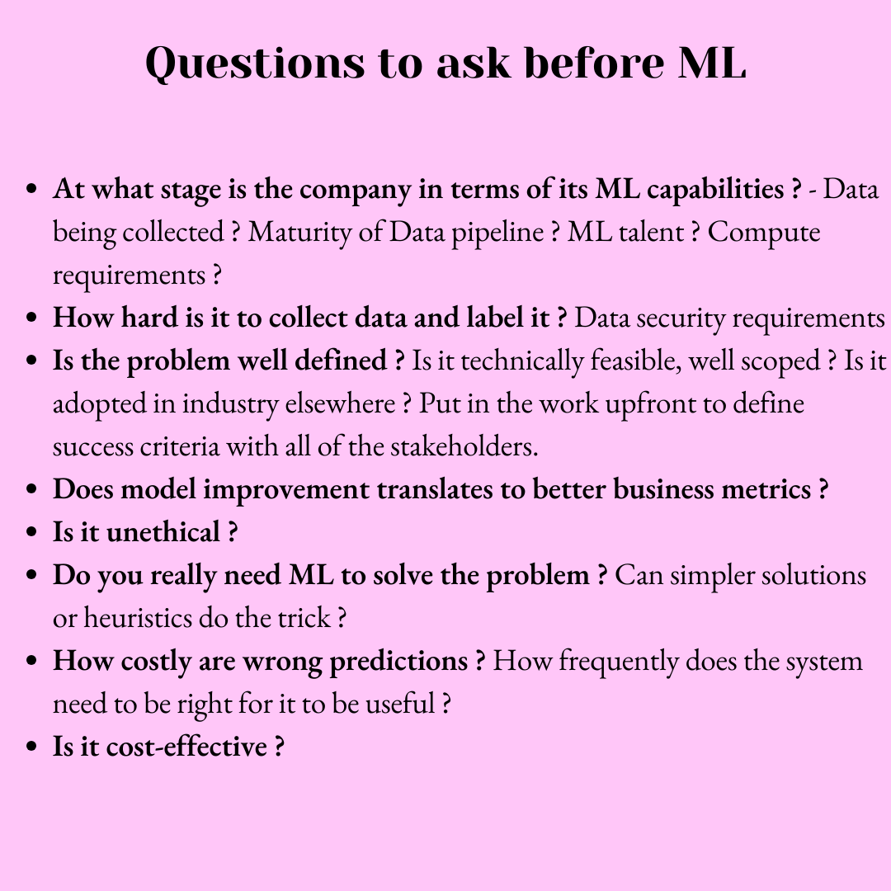
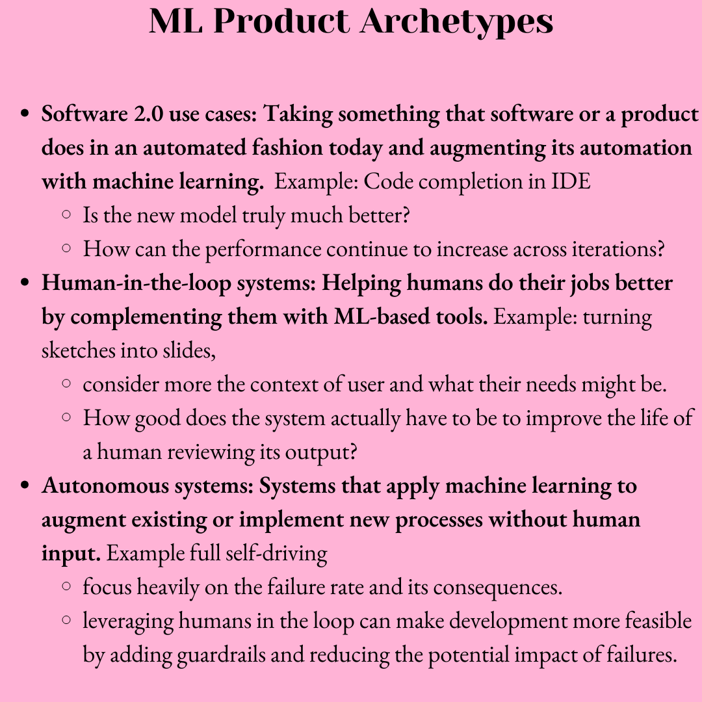

# ML Problem framing

```{toctree}
:hidden:

```

<!---->






<br/>
Click <a href="../../_static/mlops/problem_framing/mlops_probframing.png">here</a> for high resolution image.


### References
- [Designing Machine Learning Systems by Chip Huyen](https://www.oreilly.com/library/view/designing-machine-learning/9781098107956/)
- [Full Stack Deep Learning - 2022 Course](https://fullstackdeeplearning.com/course/2022/)

