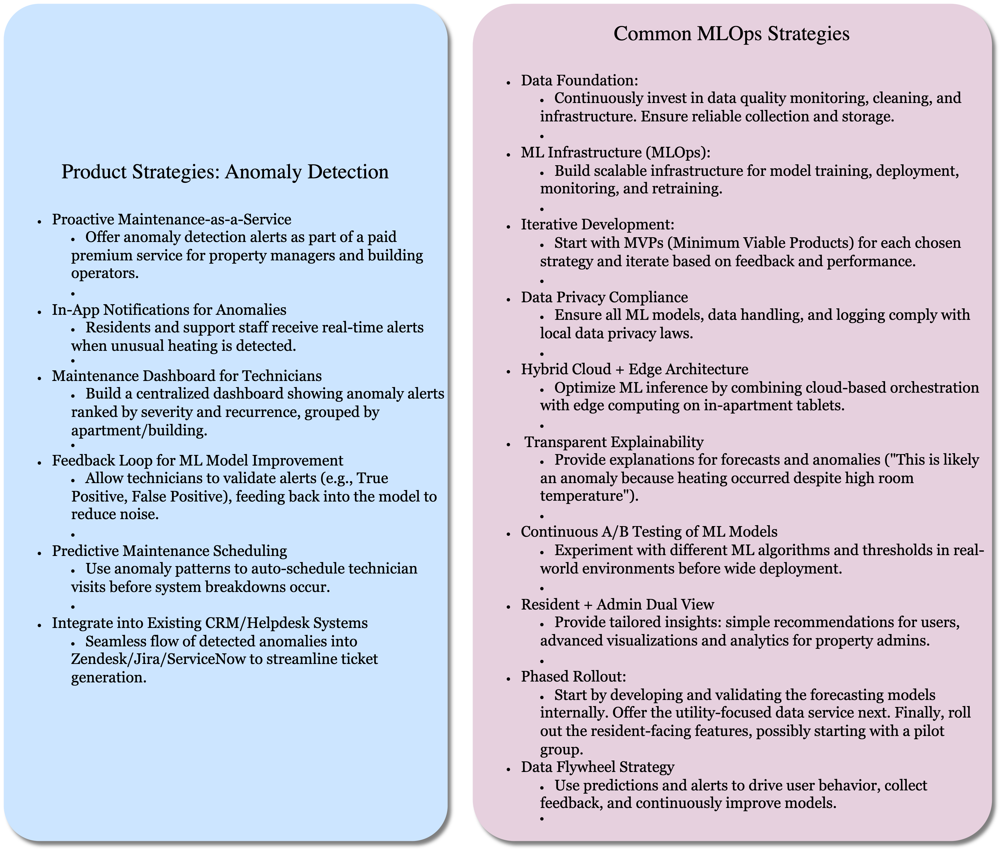
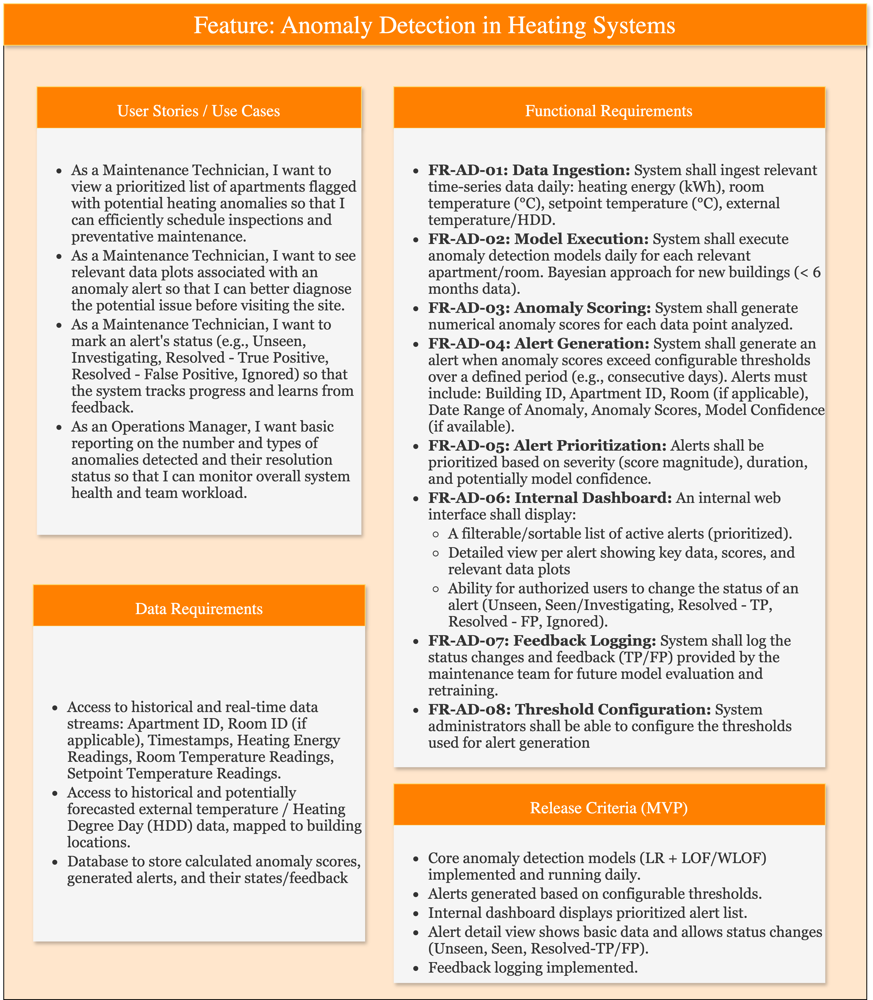
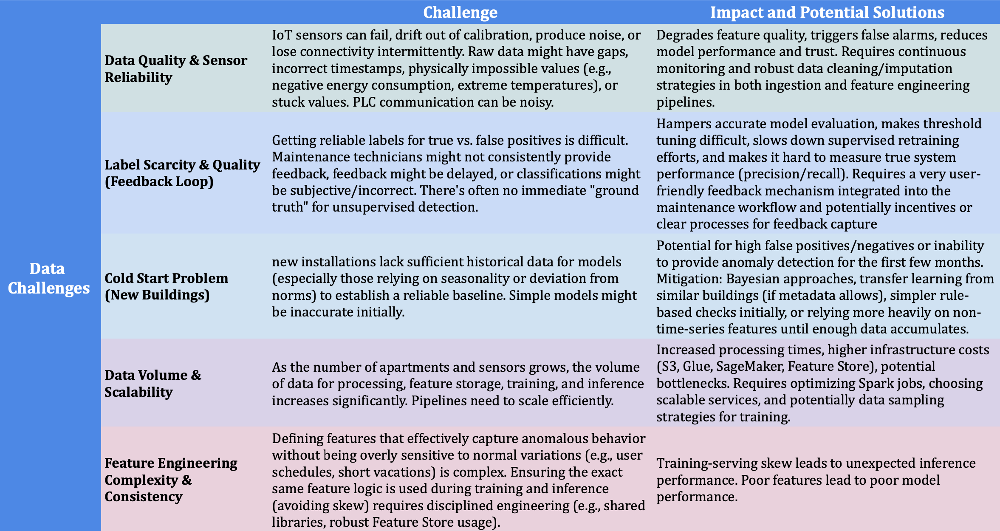

# Anomaly Detection in Time Series IoT Data

<!-- ## Anomaly Detection in Heating Energy Consumption using IoT Data for Predictive Maintenance -->

##

### Introduction

#### Purpose

This document provides detailed technical information about the Machine Learning (ML) based Anomaly Detection system. It serves as a guide for developers, MLOps engineers, and operations teams involved in maintaining, operating, and further developing the system.

#### Business Goal

The primary goal is to transition from reactive to predictive maintenance for apartment heating systems. By detecting anomalies indicative of potential malfunctions *before* they cause resident discomfort or system failure, the system aims to:

*   Reduce operational costs associated with emergency maintenance.
*   Optimize maintenance scheduling and resource allocation.
*   Improve heating system reliability and uptime.
*   Enhance overall resident satisfaction.

#### Key Technologies

*   **Cloud Platform:** AWS (Amazon Web Services)
*   **Data Lake:** Amazon S3
*   **Data Processing/ETL:** AWS Glue (PySpark), AWS Lambda (Python), SageMaker Processing Jobs (PySpark/Scikit-learn)
*   **Feature Management:** Amazon SageMaker Feature Store (Offline Store)
*   **Model Training:** Amazon SageMaker Training Jobs (using custom Docker containers)
*   **Model Inference:** Amazon SageMaker Batch Transform
*   **Model Registry:** Amazon SageMaker Model Registry
*   **Orchestration:** AWS Step Functions
*   **Scheduling:** Amazon EventBridge Scheduler
*   **Alert Storage:** Amazon DynamoDB
*   **Infrastructure as Code:** Terraform
*   **CI/CD:** Bitbucket Pipelines
*   **Containerization:** Docker
*   **Core Libraries:** PySpark, Pandas, Scikit-learn, Boto3, Joblib, PyYAML


### Table of Contents

1.  [Introduction](#introduction)
    *   [Purpose](#purpose)
    *   [Business Goal](#business-goal)
    *   [Scope](#scope)
    *   [Key Technologies](#key-technologies)
2.  [Discovery and Scoping](#discovery-and-scoping)
    *   [Use Case Evaluation](#use-case-evaluation)
    *   [Product Strategies](#product-strategies)
    *   [Features](#features)
    *   [Product Requirements Document](#product-requirements-document)
    *   [Milestones and Timelines](#milestones-and-timelines)
3.  [System Architecture](#system-architecture)
    *   [Overall Data Flow](#overall-data-flow)
    *   [Training Workflow Diagram](#training-workflow-diagram)
    *   [Inference Workflow Diagram](#inference-workflow-diagram)
4.  [Challenges and learnings](#challenges-and-learnings)
5.  [Configuration Management](#configuration-management)
6.  [Infrastructure as Code (Terraform)](#infrastructure-as-code-terraform)
    *   [Stacks Overview](#stacks-overview)
    *   [Key Resources](#key-resources)
7.  [Cost Analysis](#cost-analysis)
8.  [CI/CD Pipeline (Bitbucket)](#cicd-pipeline-bitbucket)
    *   [CI Workflow](#ci-workflow)
    *   [Training CD Workflow](#training-cd-workflow)
    *   [Inference CD Workflow](#inference-cd-workflow)
9.  [Deployment & Execution](#deployment--execution)
    *   [Prerequisites](#prerequisites)
    *   [Initial Deployment](#initial-deployment)
    *   [Running Training](#running-training)
    *   [Running Inference](#running-inference)
    *   [Model Approval](#model-approval)
10.  [Monitoring & Alerting](#monitoring--alerting)
11. [Troubleshooting Guide](#troubleshooting-guide)
12. [Security Considerations](#security-considerations)
13. [Roadmap & Future Enhancements](#roadmap--future-enhancements)
14. [Appendices](#appendices)
    *   [Configuration File Example](#configuration-file-example)


### Discovery and Scoping

#### Use Case Evaluation 


#### Product Strategies



#### Features



#### Product Requirements Document


#### Development Stages

<!---->
<p align="center">
     
</p>


#### Milestones and Timelines


### System Architecture

#### Overview

The system follows a modular, event-driven, and batch-oriented architecture on AWS. It consists of distinct pipelines for data ingestion, model training, and daily inference. Orchestration relies heavily on AWS Step Functions, with SageMaker providing core ML capabilities.

<!---->
<p align="center">
	 
</p>


#### Data Flow

[TODO: Overall System Architecture and Pipelines]

1.  **Raw Data:** Meter, Weather, Topology data lands in the S3 Raw Zone.
2.  **Processed Data:** The Ingestion pipeline processes raw data into a structured, partitioned format (Parquet) in the S3 Processed Zone and updates the Glue Data Catalog.
3.  **Features:** The Training pipeline's Feature Engineering step reads processed data, calculates features, and ingests them into the SageMaker Feature Store Offline Store (S3). The Inference pipeline recalculates features for the target date using shared logic.
4.  **Model Artifacts:** Training jobs output serialized model objects (`model.tar.gz`) to S3.
5.  **Evaluation Reports:** Evaluation jobs output metrics (JSON) to S3.
6.  **Model Packages:** Approved models are registered in the SageMaker Model Registry.
7.  **Inference Scores:** Batch Transform jobs read inference features and write raw anomaly scores to S3.
8.  **Alerts:** The final inference step processes scores and writes alerts to DynamoDB.


#### Ingestion Workflow

The Ingestion pipeline processes raw data into a structured, partitioned format (Parquet) in the S3 Processed Zone and updates the Glue Data Catalog.

*	**Responsibility:** Separate pipeline/process
*   **Output:** Partitioned Parquet data with corresponding Glue Data Catalog tables.

<!---->
<p align="center">
	 
</p>


#### Training Workflow

**Summary:** Triggered manually or by CI/CD/schedule -> Validates Schema -> Engineers Features (to Feature Store) -> Trains Model (using custom container) -> Evaluates Model -> Conditionally Registers Model (Pending Approval).

[TODO: Training Pipeline]

1.  **State:** `ValidateSchema`
    *   **Service:** SageMaker Processing Job (Spark)
    *   **Action:** Reads sample/metadata from `processed_meter_data` for the input date range. Compares schema against predefined definition. Fails workflow on critical mismatch.
2.  **State:** `FeatureEngineering`
    *   **Service:** SageMaker Processing Job (Spark) / AWS Glue ETL Job
    *   **Action:** Reads `processed_meter_data` and `processed_weather_data` for input date range. Calculates features (aggregations, lags, rolling windows, joins). Ingests features into SageMaker Feature Store (`ad-apartment-features` group).
3.  **State:** `ModelTraining`
    *   **Service:** SageMaker Training Job
    *   **Action:** Reads features for the training period from Feature Store Offline S3 location. Instantiates selected model strategy (e.g., `LR_LOF_Model`). Fits model components (Scaler, LR, LOF). Saves fitted artifacts as `model.joblib` within `model.tar.gz` to S3 output path.
4.  **State:** `ModelEvaluation`
    *   **Service:** SageMaker Processing Job (Python/Scikit-learn)
    *   **Action:** Loads `model.tar.gz` artifact. Reads evaluation features (hold-out set) from Feature Store Offline S3 location. Calculates performance metrics (e.g., backtesting precision/recall if labels available, score distributions). Estimates training throughput. Writes `evaluation_report.json` to S3.
5.  **State:** `CheckEvaluation` (Choice)
    *   **Service:** Step Functions Choice State
    *   **Action:** Compares key metrics from `evaluation_report.json` (requires parsing, possibly via an intermediate Lambda) against configured thresholds. Transitions to `RegisterModelLambda` or `EvaluationFailed`.
6.  **State:** `RegisterModelLambda`
    *   **Service:** AWS Lambda
    *   **Action:** Reads evaluation report URI and model artifact URI from state. Gathers metadata (git hash, params, metrics, data lineage). Creates a new Model Package version in the target SageMaker Model Package Group with status `PendingManualApproval`.
7.  **Terminal States:** `WorkflowSucceeded`, `EvaluationFailed`, `WorkflowFailed`.


#### Inference Workflow 

[TODO: Training Pipeline]

1.  **State:** `GetApprovedModelPackage`
    *   **Service:** AWS Lambda
    *   **Action:** Queries SageMaker Model Registry for the latest Model Package with `Approved` status in the configured group. Returns its ARN. Fails if none found.
2.  **State:** `CreateModelResource`
    *   **Service:** AWS Lambda
    *   **Action:** Creates a SageMaker `Model` resource using the approved Model Package ARN from the previous step and a unique name. This `Model` resource links the artifacts and container for Batch Transform. Returns the created `ModelName`.
3.  **State:** `FeatureEngineeringInference`
    *   **Service:** SageMaker Processing Job (Spark) / AWS Glue ETL Job
    *   **Action:** Reads processed data for the inference date + lookback period. Calculates features using the *exact same logic* as training feature engineering. Outputs features (e.g., CSV format without headers) required by the model to a unique S3 path for this execution.
4.  **State:** `BatchTransform`
    *   **Service:** SageMaker Batch Transform Job
    *   **Action:** Uses the `ModelName` created earlier. SageMaker launches the container, mounts the model artifact to `/opt/ml/model`, and provides input features from S3. The script loads the model, generates anomaly scores, and outputs scores (e.g., CSV format with identifiers and scores) to the specified S3 output path.
5.  **State:** `ProcessResults`
    *   **Service:** AWS Lambda
    *   **Action:** Triggered after Batch Transform. Reads raw score files from the S3 output path. Applies the configured alert threshold. Formats alert data (ApartmentID, Date, Score, Status='Unseen', etc.). Writes alerts to the DynamoDB Alert Table using `BatchWriteItem`.
6.  **Terminal States:** `WorkflowSucceeded`, `WorkflowFailed`.


### Challenges and learnings




### Configuration Management

*   **Primary Method:** Version-controlled configuration files (e.g., `config/ad_config.yaml`) stored in Git. These define non-sensitive parameters like hyperparameters, feature lists, thresholds, instance types.
*   **Distribution:** Config files are uploaded to a designated S3 location (e.g., `s3://[scripts-bucket]/config/`) by the CI/CD pipeline.
*   **Loading:** Scripts (Glue, SM Processing, Lambda) receive the S3 URI of the relevant config file via an environment variable (`CONFIG_S3_URI`) or argument. They use `boto3` to download and parse the file at runtime. Libraries like `PyYAML` are needed.
*   **Runtime Overrides:** Step Function inputs or job arguments can override specific parameters from the config file for execution-specific needs (e.g., `inference_date`, experimental hyperparameters).
*   **Secrets:** Sensitive information MUST be stored in AWS Secrets Manager or SSM Parameter Store (SecureString) and fetched by the application code using its IAM role. Do NOT store secrets in Git config files.
*   **Environment Variables:** Used primarily for passing S3 URIs (config file, data paths), resource names (table names, feature group), and potentially secrets fetched from secure stores.


### Infrastructure as Code (Terraform)

*   **Tool:** Terraform manages all AWS infrastructure.
*   **State Management:** Configure a remote backend (e.g., S3 with DynamoDB locking) for Terraform state files.
*   **Stacks:** Infrastructure is divided into logical stacks:
    *   `ingestion`: S3 buckets (Raw, Processed), Glue DB/Tables, Ingestion Glue Job, associated IAM roles.
    *   `training`: S3 buckets (Scripts, Artifacts, Reports - potentially reused/shared), ECR Repo, Feature Group, Model Package Group, specific IAM roles, Lambdas (Register Model), Step Function (`ADTrainingWorkflow`).
    *   `inference`: DynamoDB Table (Alerts), specific IAM roles, Lambdas (Get Model, Create Model, Process Results), Step Function (`ADInferenceWorkflow`), EventBridge Scheduler.
*   **Variables & Outputs:** Stacks use input variables (defined in `variables.tf`) for configuration and expose key resource identifiers via outputs (defined in `outputs.tf`). Outputs from one stack (e.g., `processed_bucket_name` from ingestion) are passed as inputs to dependent stacks.


### CI/CD Pipeline (Bitbucket)

*   **Tool:** Bitbucket Pipelines (`bitbucket-pipelines.yml`).
*   **CI Workflow (Branches/PRs):**
    1.  Lint Python code (`flake8`).
    2.  Run Unit Tests (`pytest tests/unit/`).
    3.  Build Training/Inference Docker container.
    4.  Push container to AWS ECR (tagged with commit hash).
    5.  Validate Terraform code (`terraform validate`, `fmt -check`) for all stacks.
*   **Training CD Workflow (`custom:deploy-and-test-ad-training`):**
    1.  (Manual Trigger Recommended)
    2.  Run CI steps (Lint, Unit Test, Build/Push).
    3.  Apply `training_ad` Terraform stack (using commit-specific image URI).
    4.  Prepare integration test data (trigger ingestion or verify pre-staged).
    5.  Run Training Integration Tests (`pytest tests/integration/test_training_workflow.py`).
*   **Inference CD Workflow (`custom:deploy-and-test-ad-inference`):**
    1.  (Manual Trigger Recommended)
    2.  (Optional) Run CI checks.
    3.  Apply `inference_ad` Terraform stack.
    4.  Prepare integration test data (verify processed data, ensure approved model exists).
    5.  Run Inference Integration Tests (`pytest tests/integration/test_inference_workflow.py`).
*   **Variables:** Uses Bitbucket Repository Variables (CI) and Deployment Variables (CD) for AWS credentials and environment-specific parameters.


### Cost Analysis


**Cost Optimisations**

- S3 Storage Dominates: The largest cost component by far is S3 storage. Implementing S3 Lifecycle policies to move older raw/processed data or feature versions to cheaper tiers (like Intelligent-Tiering or Glacier) is crucial for long-term cost management.
- Compute is Relatively Low: The actual compute cost for running the training jobs weekly is quite low with these assumptions.
- Assumptions Matter: If your training jobs run much longer, use more instances, or run more frequently, the SageMaker costs will increase proportionally. If your data volume is significantly larger, S3 costs increase.
- Spot Instances: For SageMaker Processing and Training Jobs, using Spot Instances can potentially save up to 90% on compute costs, but requires designing the jobs to handle potential interruptions (checkpointing for Training, stateless design for Processing). This could significantly reduce the ~$1.45 compute estimate.
- Instance Selection: Choosing the right instance type (e.g., ml.t3.medium for less demanding tasks can optimize compute cost.


### Deployment & Execution

**Initial Deployment:**

1.  Configure AWS credentials locally/in CI runner.
2.  Configure Bitbucket variables (Repository & Deployment).
3.  Create `terraform.tfvars` files for each stack (`ingestion`, `training`, `inference`) providing required inputs (unique suffixes, potentially outputs from previous stacks).
4.  Deploy Terraform stacks **in order**: `ingestion` -> `training` -> `inference`. Run `init`, `plan`, `apply` for each.
5.  Build and push the initial Docker training/inference container to the ECR repository created by `training`. Ensure the `training_image_uri` variable used by Terraform deployments points to this image.
6.  Place initial configuration files (`config.yaml`) in the designated S3 config location.
7.  Prepare initial raw data and run the Ingestion Glue job once to populate the processed data zone.

**Running Training:**

*   Trigger the `ADTrainingWorkflow` Step Function manually or via its schedule.
*   Provide input JSON specifying date range, parameters, code version (via image URI/git hash).

**Running Inference:**

*   The `ADInferenceWorkflow` Step Function runs automatically based on the EventBridge schedule.
*   Ensure an *Approved* model package exists in the Model Registry for the workflow to succeed.

**Model Approval:**

*   After a successful *Training* run, navigate to SageMaker -> Model Registry -> Model Package Groups -> [Your AD Group].
*   Select the latest version (`PendingManualApproval`).
*   Review Description, Metadata, Evaluation Metrics.
*   If satisfactory, update status to `Approved`.


### Monitoring & Alerting

*   **CloudWatch Logs:** Central location for logs from Lambda, Glue, SageMaker Jobs. Implement structured logging within Python scripts for easier parsing.
*   **CloudWatch Metrics:** Monitor key metrics:
    *   Step Functions: `ExecutionsFailed`, `ExecutionsTimedOut`.
    *   Lambda: `Errors`, `Throttles`, `Duration`.
    *   SageMaker Jobs: `CPUUtilization`, `MemoryUtilization` (if needed), Job Status (via Logs/Events).
    *   DynamoDB: `ThrottledWriteRequests`, `ThrottledReadRequests`.
*   **CloudWatch Alarms:** **REQUIRED:** Set alarms on critical failure metrics (SFN `ExecutionsFailed`, Lambda `Errors`). Configure SNS topics for notifications.
*   **SageMaker Model Monitor (Future):** Implement data quality and model quality monitoring to detect drift over time.
*   **Application-Level Monitoring:** Track the number of alerts generated daily, processing times, etc.


### Troubleshooting Guide

1.  **Workflow Failure (Step Functions):** Check the Step Functions execution history in the AWS Console. Identify the failed state and examine its input, output, and error message.
2.  **Job Failures (Glue/SageMaker):** Go to the corresponding CloudWatch Log Group for the failed job (links often available in Step Function state details). Look for Python exceptions or service errors. Check job metrics for resource exhaustion.
3.  **Lambda Failures:** Check the Lambda function's CloudWatch Log Group. Look for errors, timeouts, or permission issues. Verify environment variables and input payload.
4.  **IAM Permissions:** If errors indicate access denied, carefully review the IAM roles and policies associated with the failing service (SFN, Lambda, SageMaker Job roles) ensuring necessary permissions to other services (S3, SageMaker API, DynamoDB, ECR, etc.).
5.  **Data Issues:**
    *   **Schema Mismatch:** Check `ValidateSchema` logs. Verify Glue Catalog definition matches actual data.
    *   **Missing Features:** Ensure feature engineering script runs correctly and produces all columns needed by the model. Check Feature Store ingestion if used.
    *   **Empty Data:** Check upstream processes; ensure ingestion ran and data exists for the target dates.
6.  **Configuration Errors:** Verify config files in S3 are correct and accessible. Check environment variables passed to jobs/lambdas.
7.  **Model Artifact Issues:** Ensure the `model.tar.gz` exists, is not corrupted, and contains all necessary files (`model.joblib`, etc.). Verify the `inference.py` script loads it correctly.
8.  **Batch Transform Failures:** Check Batch Transform job logs in CloudWatch. Common issues include container errors (script failures, dependency issues), data format errors, or IAM permission problems for the model's execution role.


### Security Considerations

*   **IAM Least Privilege:** Regularly review and tighten IAM roles assigned to Step Functions, Lambdas, Glue, and SageMaker jobs. Grant only necessary permissions.
*   **Data Encryption:**
    *   **At Rest:** Enable server-side encryption (SSE-S3, SSE-KMS) on all S3 buckets. Enable encryption for DynamoDB tables. Ensure EBS volumes attached to SageMaker jobs are encrypted.
    *   **In Transit:** AWS services use TLS for communication by default. Ensure any custom external connections also use TLS.
*   **Secret Management:** Use AWS Secrets Manager or SSM Parameter Store (SecureString) for any sensitive credentials or API keys.
*   **Network Security:** For enhanced security, consider deploying resources within a VPC using VPC Endpoints for AWS service access, minimizing exposure to the public internet. Configure Security Groups appropriately.
*   **Container Security:** Regularly scan the custom Docker container image for vulnerabilities using ECR Image Scanning or third-party tools. Keep base images and libraries updated.
*   **Input Validation:** Sanitize and validate inputs to Lambda functions and Step Function executions, especially if triggered externally.
*   **Access Control:** Restrict access to the SageMaker Model Registry and approval workflows to authorized personnel.


### Roadmap & Future Enhancements

*   Implement SageMaker Model Monitor for data quality and model drift detection.
*   Set up automated retraining triggers based on schedule or drift detection.
*   Explore more sophisticated anomaly detection algorithms (e.g., Autoencoders, Isolation Forests) via the Strategy Pattern.
*   Implement A/B testing for different model versions using SageMaker Inference Pipelines.
*   Enhance the Internal Dashboard for better alert visualization and diagnostics.
*   Integrate alerts directly with maintenance ticketing systems.


### Appendices

#### Data Schemas

*(Raw Meter Data, Processed Meter Data, Weather Data, Feature Store Features, Alert Table Schema)*

#### Configuration File Example

```yaml
feature_engineering:
  lookback_days: 7
  weather_feature_cols: ["hdd", "avg_temp_c"]

training:
  model_strategy: "LR_LOF"
  hyperparameters:
    lof_neighbors: 20
    lof_contamination: "auto"
  feature_columns: # List of features model actually uses
    - daily_energy_kwh
    - avg_temp_diff
    # ... etc
  instance_type: "ml.m5.large"

evaluation:
  metrics_thresholds:
    min_f1_score: 0.6 # Example if using labels
    max_throughput_deviation: 0.2 # Example
  holdout_data_path: "s3://..." # Path to specific eval data

inference:
  alert_threshold: 5.0
  batch_transform_instance_type: "ml.m5.large"
```