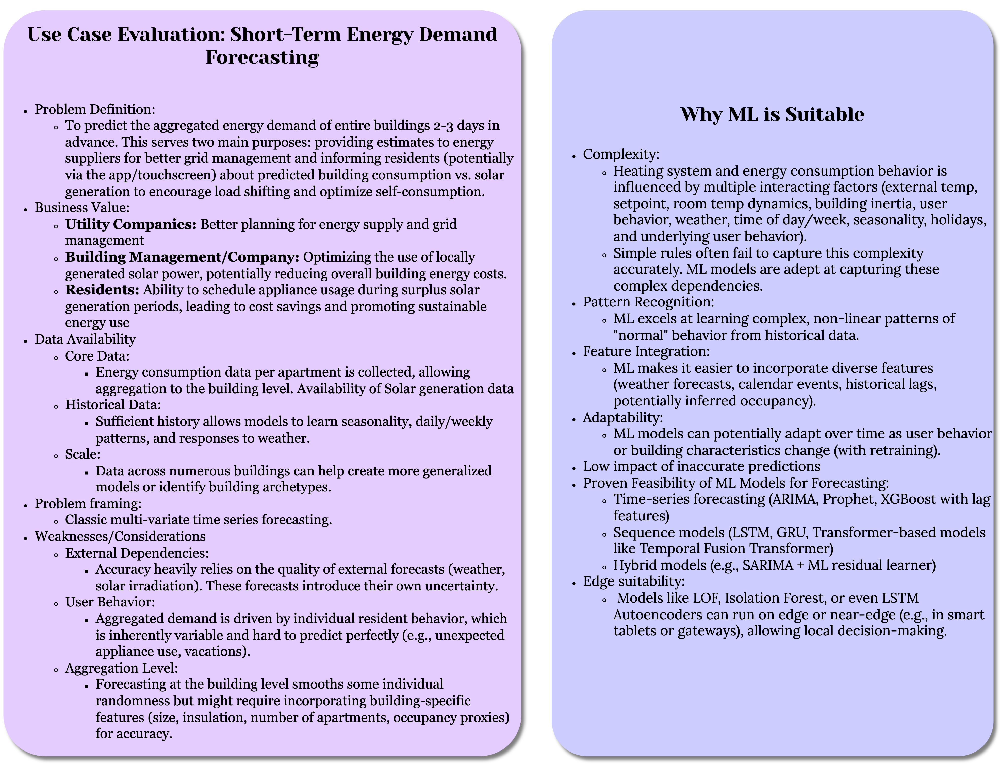
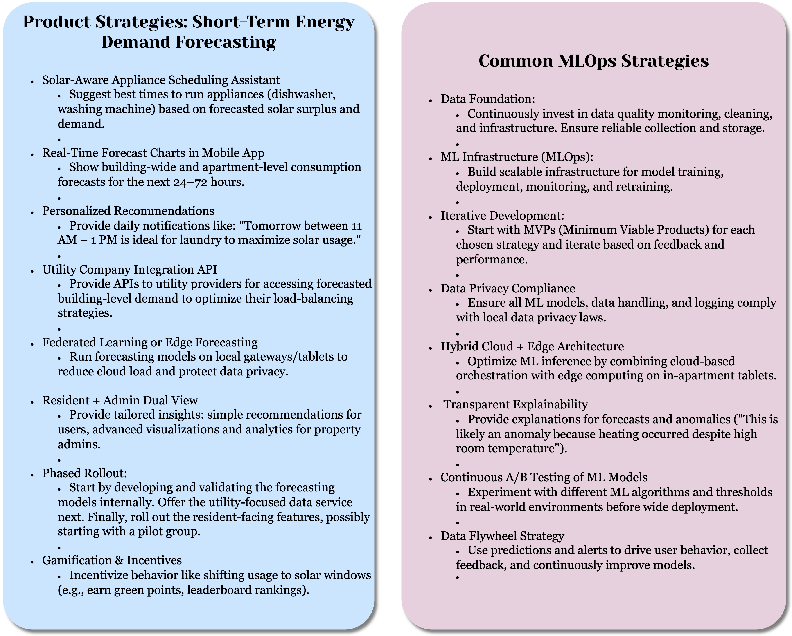
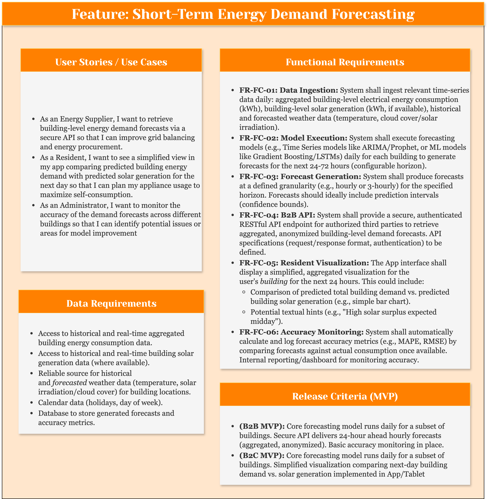
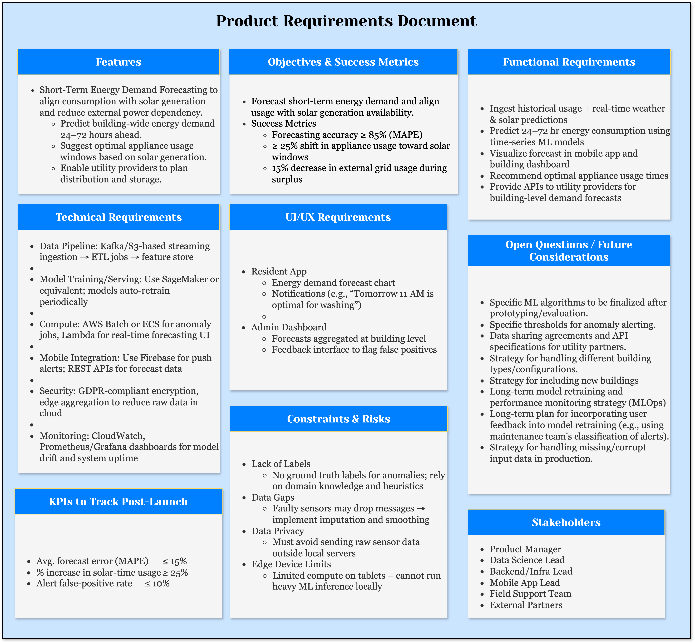
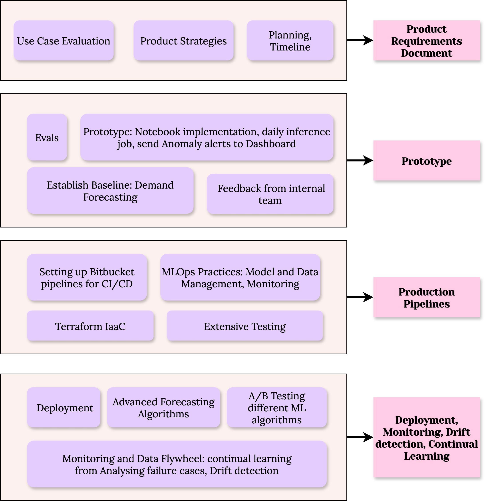

# Energy Demand Forecasting in Time Series IoT Data

##

### Introduction

#### Purpose

This document provides detailed technical information about the Machine Learning (ML) based Energy Demand Forecasting (EDF) system developed. It serves as a guide for developers, MLOps engineers, operations teams.

#### Business Goal

The primary goals of the EDF system are to:

*   Provide accurate short-term (e.g., 24-72 hours) aggregated energy demand forecasts at the building level to external energy suppliers and Distribution System Operators (DSOs) for improved grid balancing, energy procurement, and network management.
*   Empower residents by providing insights into predicted building energy consumption versus predicted solar generation, enabling them to optimize appliance usage for increased solar self-consumption and potential cost savings.


#### Scope

This documentation details the end-to-end pipelines for data processing, model training, model evaluation, model registration, batch inference (forecasting), forecast storage, and the conceptual API serving layer. It assumes the existence of a separate data ingestion pipeline providing the necessary raw data feeds. 

#### Key Technologies

*   **Cloud Platform:** AWS (Amazon Web Services)
*   **Data Lake:** Amazon S3
*   **Data Processing/ETL:** AWS Glue (PySpark), AWS Lambda (Python), SageMaker Processing Jobs (PySpark/Python)
*   **Feature Management:** Shared Code Libraries (Primary), Amazon SageMaker Feature Store (Optional for historical features)
*   **Model Training:** Amazon SageMaker Training Jobs (using custom Docker containers with Prophet, XGBoost, etc.)
*   **Model Forecasting:** Amazon SageMaker Processing Jobs (running forecast generation scripts)
*   **Model Registry:** Amazon SageMaker Model Registry
*   **Orchestration:** AWS Step Functions
*   **Scheduling:** Amazon EventBridge Scheduler
*   **Forecast Storage:** Amazon Timestream (Primary Example), Amazon RDS, Amazon DynamoDB
*   **API Layer:** Amazon API Gateway, AWS Lambda
*   **Infrastructure as Code:** Terraform
*   **CI/CD:** Bitbucket Pipelines
*   **Containerization:** Docker
*   **Core Libraries:** PySpark, Pandas, Scikit-learn, Boto3, PyYAML, Prophet, XGBoost, AWS Data Wrangler.


**Table of Contents**

1.  [Introduction](#introduction)
    *   [Purpose](#purpose)
    *   [Business Goal](#business-goal)
    *   [Scope](#scope)
    *   [Key Technologies](#key-technologies)
2.  [Discovery and Scoping](#discovery-and-scoping)
    *   [Use Case Evaluation](#use-case-evaluation)
    *   [Product Strategies](#product-strategies)
    *   [Features](#features)
    *   [Product Requirements Document](#product-requirements-document)
    *   [Milestones and Timelines](#milestones-and-timelines)
3.  [System Architecture](#system-architecture)
    *   [Overall Data Flow](#overall-data-flow)
    *   [Training Workflow Diagram](#training-workflow-diagram)
    *   [Inference Workflow Diagram](#inference-workflow-diagram)
4.  [Configuration Management](#configuration-management)
5.  [Infrastructure as Code (Terraform)](#infrastructure-as-code-terraform)
    *   [Stacks Overview](#stacks-overview)
    *   [Key Resources](#key-resources)
6.  [CI/CD Pipeline (Bitbucket)](#cicd-pipeline-bitbucket)
    *   [CI Workflow](#ci-workflow)
    *   [Training CD Workflow](#training-cd-workflow)
    *   [Inference CD Workflow](#inference-cd-workflow)
7.  [Deployment & Execution](#deployment--execution)
    *   [Prerequisites](#prerequisites)
    *   [Initial Deployment](#initial-deployment)
    *   [Running Training](#running-training)
    *   [Running Inference](#running-inference)
    *   [Model Approval](#model-approval)
8.  [Monitoring & Alerting](#monitoring--alerting)
9. [Troubleshooting Guide](#troubleshooting-guide)
10. [Security Considerations](#security-considerations)
11. [Roadmap & Future Enhancements](#roadmap--future-enhancements)
12. [Appendices](#appendices)
    *   [Configuration File Example](#configuration-file-example)


### Discovery and Scoping

#### Use Case Evaluation 



#### Product Strategies



#### Features



#### Product Requirements Document



#### Development Stages

<!---->
<p align="center">
     
</p>

#### Milestones and Timelines


### System Architecture


#### Overall Data Flow

The EDF system utilizes distinct, automated pipelines for training forecasting models and generating daily forecasts. It relies on processed historical data and external weather forecasts. Forecasts are stored in a time-series database and made available via APIs.

[TODO: Overall System Architecture and Pipelines]

1.  **Raw Data:** Aggregated Consumption, Solar Generation, Historical Weather, *Future Weather Forecasts*, Calendar/Topology data land in S3 Raw Zone.
2.  **Processed Data:** Ingestion pipeline processes *historical* data into `processed_edf_data` in S3 Processed Zone / Glue Catalog.
3.  **Features (Training):** Training Feature Engineering step reads `processed_edf_data`, calculates historical time-series features (lags, windows, time components), splits train/eval sets, and writes them to S3.
4.  **Features (Inference):** Inference Feature Engineering step reads recent `processed_edf_data` and *future raw weather forecasts*, calculates features for the forecast horizon using shared logic, and writes them to S3.
5.  **Model Artifacts:** Training jobs save serialized forecast models (Prophet JSON, XGBoost UBJ) to S3.
6.  **Evaluation Reports:** Evaluation jobs save forecast metrics (MAPE, RMSE) to S3.
7.  **Model Packages:** Approved forecast models are registered in the EDF Model Package Group.
8.  **Raw Forecasts:** Inference forecast generation step writes raw forecast outputs (timestamp, building, yhat, yhat_lower, yhat_upper) to S3.
9.  **Stored Forecasts:** Load Forecasts step reads raw forecasts from S3 and writes them into the target database (e.g., Timestream).
10. **Served Forecasts:** API Gateway and Lambda query the forecast database to serve B2B and B2C clients.


#### Training Workflow

**Summary:** Triggered by Schedule/Manual -> Validates Schema -> Engineers Historical Features (Train/Eval Sets) -> Trains Model (Prophet/XGBoost) -> Evaluates Model (MAPE, RMSE) -> Conditionally Registers Model (Pending Approval).

[TODO: Training Pipeline]

**Step Function State Machine**

1.  **State:** `ValidateSchema` (Optional)
    *   **Service:** SM Processing / Glue Shell
    *   **Action:** Validates schema of `processed_edf_data`.
2.  **State:** `FeatureEngineeringTrainingEDF`
    *   **Service:** SM Processing Job (Spark) / Glue ETL
    *   **Action:** Reads `processed_edf_data` for training range. Creates time features, lags (consumption, weather), rolling windows. Splits into train/eval feature sets (Parquet) written to S3.
3.  **State:** `ModelTrainingEDF`
    *   **Service:** SM Training Job
    *   **Action:** Reads training features from S3. Instantiates/fits chosen model (Prophet/XGBoost) based on input strategy and hyperparameters. Saves model artifact (`prophet_model.json` / `xgboost_model.ubj` + `model_metadata.json`) within `model.tar.gz` to S3.
4.  **State:** `ModelEvaluationEDF`
    *   **Service:** SM Processing Job (Python + libs)
    *   **Action:** Loads model artifact. Reads evaluation features from S3. Generates forecasts for eval period. Calculates MAPE, RMSE, MAE against actuals (from eval features). Writes `evaluation_report_edf.json` to S3.
5.  **State:** `CheckEvaluationEDF` (Choice)
    *   **Action:** Compares metrics (e.g., MAPE, RMSE) against thresholds from config.
6.  **State:** `RegisterModelEDF`
    *   **Service:** Lambda
    *   **Action:** Creates Model Package in EDF group (`PendingManualApproval`), embedding metadata and evaluation results.
7.  **Terminal States:** `WorkflowSucceeded`, `EvaluationFailedEDF`, `WorkflowFailed`.


#### Inference Workflow

[TODO: Inference Pipeline]

**Summary:** Triggered Daily by Scheduler -> Gets Latest Approved Model -> Creates SM Model Resource -> Engineers Inference Features -> Generates Forecasts (SM Processing) -> Loads Forecasts into DB (Timestream/RDS).

1.  **State:** `GetInferenceDate` (Optional Lambda / Step Functions Context)
    *   **Action:** Determines target forecast start date (e.g., "today" or "tomorrow" relative to execution time) and forecast end date based on horizon.
2.  **State:** `GetApprovedEDFModelPackage`
    *   **Service:** Lambda
    *   **Action:** Gets latest `Approved` Model Package ARN from EDF group.
3.  **State:** `CreateEDFSageMakerModel`
    *   **Service:** Lambda
    *   **Action:** Creates SM `Model` resource from the approved package ARN.
4.  **State:** `FeatureEngineeringInferenceEDF`
    *   **Service:** SM Processing Job (Spark) / Glue ETL
    *   **Action:** Reads recent historical `processed_edf_data` (for lags) AND future raw `weather-forecast` data. Creates feature set covering the forecast horizon (including future dates and weather). Writes inference features (Parquet) to S3.
5.  **State:** `GenerateForecastsEDF`
    *   **Service:** SM Processing Job (Python + libs)
    *   **Action:** Loads model artifact (mounted via SM Model resource). Reads inference features from S3. Calls model's `predict` method to generate forecasts (`yhat`, `yhat_lower`, `yhat_upper`). Writes forecast results (Parquet/CSV) to S3.
6.  **State:** `LoadForecastsToDB`
    *   **Service:** Lambda / Glue Python Shell
    *   **Action:** Reads forecast results from S3. Formats data for target DB (Timestream example). Writes records to the database using batch operations.
7.  **Terminal States:** `WorkflowSucceeded`, `WorkflowFailed`.


#### Forecast Serving

*   **B2B API:** API Gateway endpoint proxying to a Lambda function. Lambda queries the Forecast DB (e.g., Timestream) based on requested `building_id` and `time_range`. Requires authentication/authorization (e.g., API Keys, Cognito Authorizer).
*   **B2C API:** Separate API Gateway endpoint/Lambda. Queries Forecast DB, potentially performs simple comparison with Solar forecast (if available), returns simplified data structure for UI visualization. Requires app user authentication.


#### Configuration Management

*   Uses `config/edf_config.yaml` version-controlled in Git.
*   File uploaded to S3 by CI/CD.
*   Scripts load config from S3 URI passed via environment variable/argument.
*   Includes sections for `feature_engineering`, `training` (with nested model hyperparameters), `evaluation` (thresholds), `inference` (schedule, instance types, DB config).
*   Secrets managed via AWS Secrets Manager / SSM Parameter Store.


#### Infrastructure as Code (Terraform)

*   Manages all AWS resources for EDF pipelines.
*   **Stacks:**
    *   `training_edf`: ECR Repo (`edf-training-container`), Model Package Group (`EDFBuildingDemandForecaster`), Lambda (`RegisterEDFModelFunction`), Step Function (`EDFTrainingWorkflow`), associated IAM roles. Optionally Feature Group (`edf-building-features`). Requires outputs from `ingestion`.
    *   `inference_edf`: Timestream DB/Table (or RDS/DDB), Lambdas (GetModel, CreateModel - potentially reused; LoadForecasts), Step Function (`EDFInferenceWorkflow`), EventBridge Scheduler, API Gateway Endpoints/Lambdas (for serving), associated IAM roles. Requires outputs from `ingestion` and `training_edf`.
*   **State:** Remote backend (S3/DynamoDB) configured.


#### CI/CD Pipeline (Bitbucket)

*   Defined in `bitbucket-pipelines.yml`.
*   **CI (Branches/PRs):** Lints, runs ALL unit tests, builds EDF container, pushes to ECR (`edf-training-container` repo), validates ALL Terraform stacks.
*   **EDF Training CD (`custom:deploy-and-test-edf-training`):** Manual trigger. Deploys `training_edf` stack. Runs EDF training integration tests.
*   **EDF Inference CD (`custom:deploy-and-test-edf-inference`):** Manual trigger. Deploys `inference_edf` stack. Runs EDF inference integration tests (requires approved model).


#### Deployment & Execution

**8.1 Prerequisites:** Base AWS setup, Terraform, Docker, Python, Git, Bitbucket config, deployed `ingestion` stack.

**8.2 Initial Deployment:** Deploy Terraform stacks (`training_edf`, `inference_edf`) after `ingestion`. Build/push EDF container. Upload initial `edf_config.yaml`. Ensure processed EDF data exists.

**8.3 Running Training:** Trigger `EDFTrainingWorkflow` Step Function (schedule/manual) with appropriate input JSON (date range, model strategy, hyperparameters, image URI).

**8.4 Running Inference:** `EDFInferenceWorkflow` runs automatically via EventBridge Scheduler. Ensure prerequisite data (processed history, weather forecasts) is available daily.

**8.5 Model Approval:** Manually review `PendingManualApproval` packages in the `EDFBuildingDemandForecaster` group and promote to `Approved` based on evaluation metrics.


#### Monitoring & Alerting

*   **CloudWatch Logs:** Monitor logs for EDF Step Functions, Lambdas, SageMaker Processing Jobs.
*   **CloudWatch Metrics:** Monitor SFN `ExecutionsFailed`, Lambda `Errors`/`Duration`, Processing Job `CPU/Memory`, Timestream/RDS metrics (if applicable), API Gateway `Latency`/`4XX/5XX Errors`.
*   **Forecast Accuracy Tracking:** **CRITICAL:** Implement a separate process (e.g., scheduled Lambda/Glue job) to periodically compare stored forecasts against actual consumption data (loaded later) and calculate ongoing MAPE/RMSE. Log these metrics to CloudWatch or a dedicated monitoring dashboard.
*   **Data Pipeline Monitoring:** Monitor success/failure of ingestion jobs providing raw data and the `process_edf_data` Glue job.
*   **Weather Forecast API:** Monitor availability and error rates of the external weather forecast API.
*   **CloudWatch Alarms:** Set alarms on: SFN Failures, Lambda Errors, Forecast Accuracy Degradation (MAPE/RMSE exceeding threshold), Weather API Fetch Failures, Target DB Write Errors.


#### Troubleshooting Guide

1.  **SFN Failures:** Check execution history for failed state, input/output, error message.
2.  **Job Failures (Processing/Training):** Check CloudWatch Logs for the specific job run. Look for Python errors, resource exhaustion, S3 access issues.
3.  **Lambda Failures:** Check CloudWatch Logs. Verify IAM permissions, input payload structure, environment variables, timeouts, memory limits. Check DLQ if configured.
4.  **Forecast Accuracy Issues:**
    *   Verify quality/availability of input weather forecasts.
    *   Check feature engineering logic for errors or skew vs. training.
    *   Analyze residuals from the model evaluation step.
    *   Check if model drift has occurred (compare recent performance to registry metrics). Trigger retraining if needed.
    *   Ensure correct model version was loaded by inference pipeline.
5.  **Data Loading Issues (Timestream/RDS):** Check `LoadForecastsToDB` Lambda logs for database connection errors, write throttling, data type mismatches, constraint violations. Check DB metrics.
6.  **API Serving Issues:** Check API Gateway logs and metrics. Check serving Lambda logs. Verify DB connectivity and query performance.

#### Security Considerations

*   Apply IAM least privilege to all roles.
*   Encrypt data at rest (S3, Timestream/RDS, EBS) and in transit (TLS).
*   Use Secrets Manager for any API keys (e.g., weather provider).
*   Secure API Gateway endpoints (Authentication - Cognito/IAM/API Keys, Authorization, Throttling).
*   Perform regular vulnerability scans on the EDF container image.
*   Consider VPC deployment and endpoints for enhanced network security.

#### Roadmap & Future Enhancements

*   Implement probabilistic forecasting (prediction intervals).
*   Incorporate more granular data (e.g., appliance recognition, improved occupancy detection) if available.
*   Explore more advanced forecasting models (LSTM, TFT) and benchmark rigorously.
*   Implement automated retraining triggers based on monitored forecast accuracy drift.
*   Develop more sophisticated XAI for forecasting (feature importance).
*   Add A/B testing framework for forecast models.
*   Integrate forecasts with building control systems (e.g., HVAC pre-cooling based on forecast).


### Appendices

**Configuration File Example**

```yaml
# config/.yaml

# --- General Settings ---
project_name: "hometech-ml"
aws_region: "eu-central-1"
# env_suffix will likely be passed dynamically or set per deployment environment

# --- Data Paths (Templates - Execution specific paths often constructed) ---
# Base paths defined here, execution IDs/dates appended by scripts/workflows
s3_processed_edf_path: "s3://{processed_bucket}/processed_edf_data/"
s3_raw_weather_fcst_path: "s3://{raw_bucket}/edf-inputs/weather-forecast/"
s3_raw_calendar_path: "s3://{raw_bucket}/edf-inputs/calendar-topology/"
s3_feature_output_base: "s3://{processed_bucket}/features/edf/{workflow_type}/{sfn_name}/{exec_id}/" # workflow_type=training/inference
s3_model_artifact_base: "s3://{processed_bucket}/model-artifacts/{sfn_name}/{exec_id}/"
s3_eval_report_base: "s3://{processed_bucket}/evaluation-output/{sfn_name}/{exec_id}/"
s3_forecast_output_base: "s3://{processed_bucket}/forecast-output/{sfn_name}/{exec_id}/"

# --- AWS Resource Names (Base names - suffix added in Terraform locals) ---
scripts_bucket_base: "hometech-ml-glue-scripts" # Base name for script bucket
processed_bucket_base: "hometech-ml-processed-data" # Base name for processed bucket
raw_bucket_base: "hometech-ml-raw-data" # Base name for raw bucket
edf_feature_group_name_base: "edf-building-features"
ecr_repo_name_edf_base: "edf-training-container"
edf_model_package_group_name_base: "EDFBuildingDemandForecaster"
lambda_register_edf_func_base: "RegisterEDFModelFunction"
lambda_load_forecasts_func_base: "LoadEDFResultsLambda"
lambda_get_model_func_base: "GetApprovedModelLambda" # Shared Lambda
lambda_create_sm_model_func_base: "CreateSageMakerModelLambda" # Shared Lambda
edf_training_sfn_base: "EDFTrainingWorkflow"
edf_inference_sfn_base: "EDFInferenceWorkflow"
edf_scheduler_base: "DailyEDFInferenceTrigger"
forecast_db_base: "EDFDatabase" # Timestream DB base name
forecast_table_name: "BuildingDemandForecasts" # Timestream table name

# --- Feature Engineering (Common & EDF Specific) ---
common_feature_eng:
  lookback_days_default: 14 # Default days history needed

edf_feature_eng:
  target_column: "consumption_kwh"
  timestamp_column: "timestamp_hour"
  building_id_column: "building_id"
  time_features: # Features derived from timestamp
    - "hour_of_day"
    - "day_of_week"
    - "day_of_month"
    - "month_of_year"
    - "is_weekend" # Example custom flag
  lag_features: # Lag values in hours
    consumption_kwh: [24, 48, 168] # 1d, 2d, 1wk
    temperature_c: [24, 48, 168]
    solar_irradiance_ghi: [24]
  rolling_window_features: # Window size in hours, aggregations
    consumption_kwh:
      windows: [3, 24, 168]
      aggs: ["avg", "stddev", "min", "max"]
    temperature_c:
      windows: [24]
      aggs: ["avg"]
  imputation_value: 0.0 # Value used for fillna after lags/windows

# --- Training Workflow ---
edf_training:
  default_strategy: "Prophet" # Model strategy to use if not specified
  instance_type: "ml.m5.xlarge" # Larger instance for potentially heavier training
  instance_count: 1
  max_runtime_seconds: 7200 # 2 hours
  # Base hyperparameters (can be overridden by execution input)
  hyperparameters:
    Prophet:
      prophet_changepoint_prior_scale: 0.05
      prophet_seasonality_prior_scale: 10.0
      prophet_holidays_prior_scale: 10.0
      prophet_daily_seasonality: True
      prophet_weekly_seasonality: True
      prophet_yearly_seasonality: 'auto'
      # prophet_regressors: ["temperature_c", "is_holiday_flag"] # Example if using regressors
    XGBoost:
      xgb_eta: 0.1
      xgb_max_depth: 5
      xgb_num_boost_round: 150
      xgb_subsample: 0.7
      xgb_colsample_bytree: 0.7
      # feature_columns must align with feature_engineering output for XGBoost
      feature_columns_string: "temperature_c,solar_irradiance_ghi,humidity,is_holiday_flag,hour_of_day,day_of_week,day_of_month,month_of_year,consumption_lag_24h,consumption_lag_168h,consumption_roll_avg_24h"

# --- Evaluation Workflow ---
edf_evaluation:
  instance_type: "ml.m5.large"
  instance_count: 1
  # Metrics thresholds for the 'CheckEvaluation' choice state
  metrics_thresholds:
    max_mape: 20.0 # Example: Fail if MAPE > 20%
    max_rmse: 5.0  # Example: Fail if RMSE > 5 kWh (adjust based on typical consumption)
  # Optional: Path to historical labelled data for backtesting
  # historical_labels_path: "s3://..."

# --- Inference Workflow ---
edf_inference:
  scheduler_expression: "cron(0 5 * * ? *)" # 5 AM UTC Daily
  scheduler_timezone: "UTC"
  forecast_horizon_hours: 72
  # Processing job instance types (can override training defaults if needed)
  feature_eng_instance_type: "ml.m5.large"
  feature_eng_instance_count: 1
  forecast_gen_instance_type: "ml.m5.large" # Needs forecasting libs installed
  forecast_gen_instance_count: 1
  # Target DB Config
  forecast_db_type: "TIMESTREAM" # TIMESTREAM | RDS | DYNAMODB
  # Lambda Config
  load_forecasts_lambda_memory: 512 # MB
  load_forecasts_lambda_timeout: 300 # seconds

# --- Common Lambda Config ---
# Assuming shared Lambdas from AD are used
lambda_shared:
   get_model_memory: 128
   get_model_timeout: 30
   create_sm_model_memory: 128
   create_sm_model_timeout: 60
```