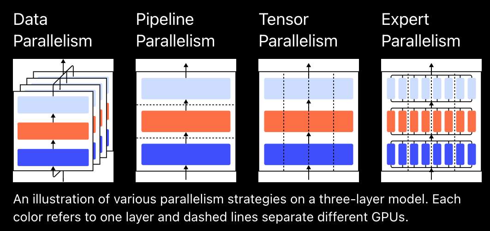
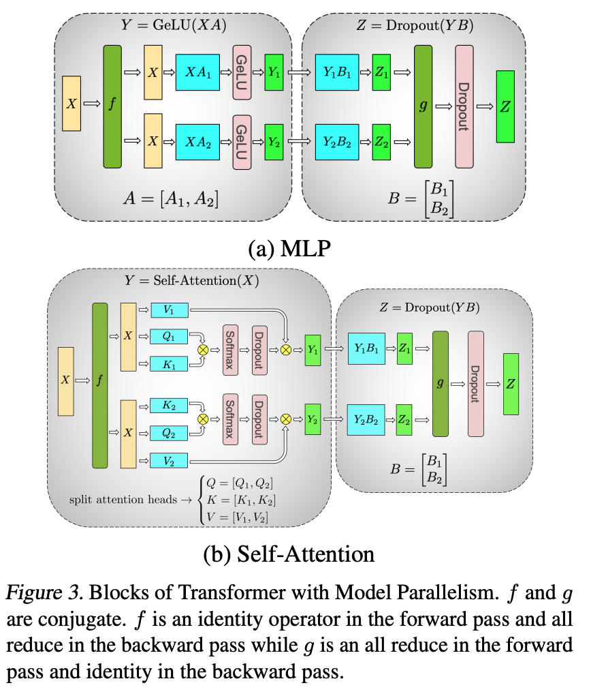
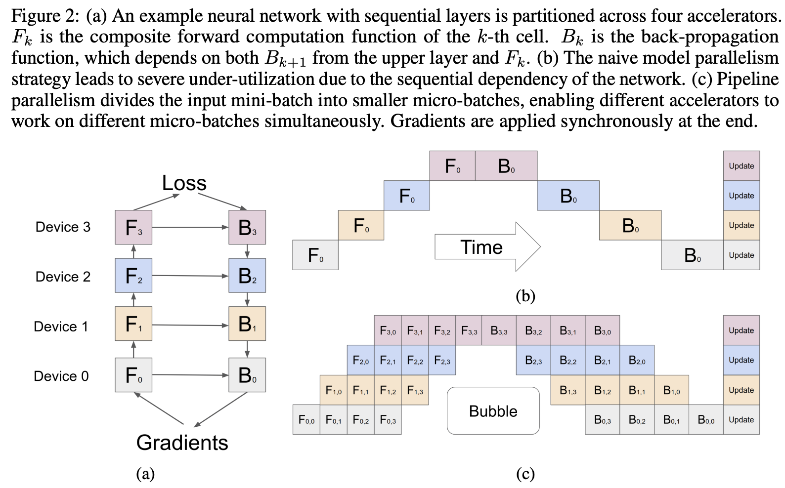
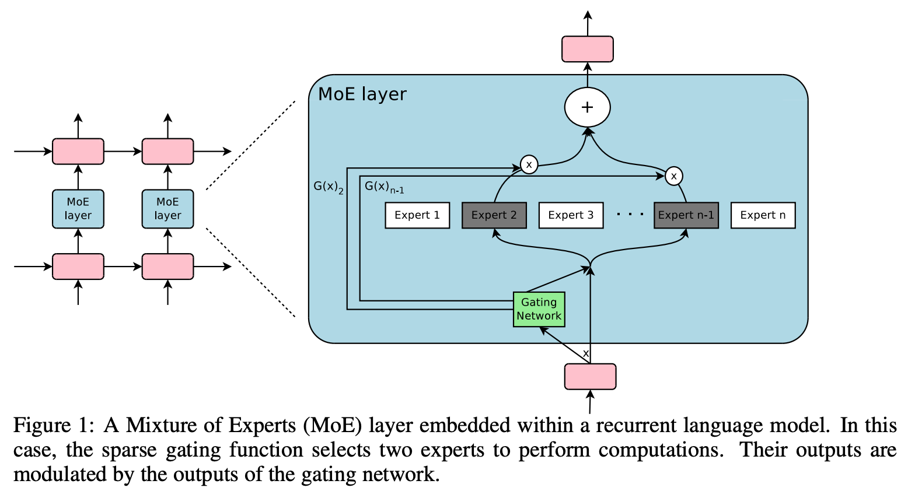
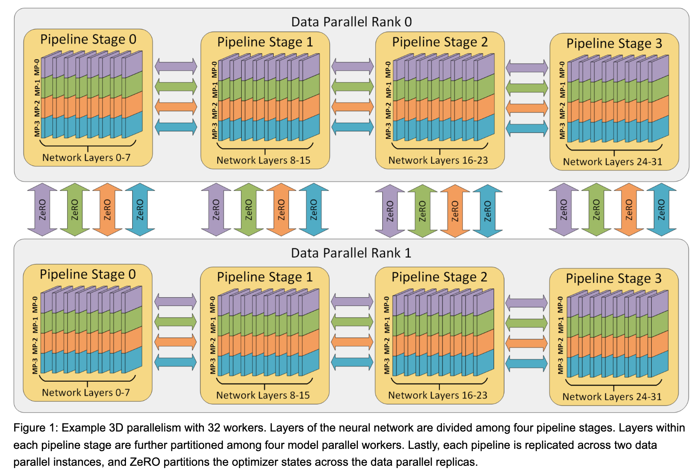
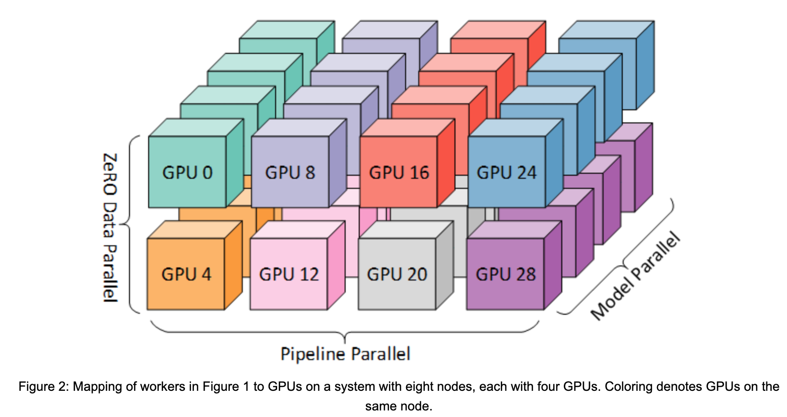

# 3D Parallelism: When to use which ?

##

The core principle behind applying 3D parallelism effectively is to **map the most communication-intensive parallelism strategies to the highest-bandwidth network links.** You should think of the three techniques in a hierarchical order based on their communication overhead:

- [Techniques for training large neural networks](https://openai.com/index/techniques-for-training-large-neural-networks/)

1.  **Tensor/Model Parallelism (MP/TP): Highest Communication Cost.** Splits individual layers across GPUs. It requires frequent, low-latency communication of activations during forward and backward passes. This makes it ideal for the ultra-high-speed, intra-node connections (like NVIDIA's NVLink).

- [Megatron-LM: Training Multi-Billion Parameter Language Models Using Model Parallelism](https://arxiv.org/pdf/1909.08053)

2.  **Pipeline Parallelism (PP): Medium Communication Cost.** Splits the model into stages (groups of layers) across GPUs or nodes. It only communicates activations and gradients at the boundaries of these stages, making it less chatty than Tensor Parallelism. This makes it suitable for the high-speed, inter-node connections (like InfiniBand or high-speed Ethernet).

- [GPipe: Easy Scaling with Micro-Batch Pipeline Parallelism](https://arxiv.org/pdf/1811.06965)

3.  **Data Parallelism (DP) with ZeRO: Lowest Communication Cost per unit of computation.** Replicates the entire model (or the entire pipeline) and processes different data on each replica. Communication only happens once per step (gradient synchronization). With ZeRO, the communication volume is still significant but is highly optimized and can be scaled across many nodes.
4.  **Mixture-of-Experts (MoE)**: With the Mixture-of-Experts (MoE)⁠(opens in a new window) approach, only a fraction of the network is used to compute the output for any one input. One example approach is to have many sets of weights and the network can choose which set to use via a gating mechanism at inference time. This enables many more parameters without increased computation cost. Each set of weights is referred to as “experts,” in the hope that the network will learn to assign specialized computation and skills to each expert. Different experts can be hosted on different GPUs, providing a clear way to scale up the number of GPUs used for a model.

---

### Part 1: The Building Blocks - Understanding Each Technique

Here is a breakdown of each parallelism technique, its pros and cons, and when it makes the most sense to use.

| Technique | What It Is | Pros | Cons | Best Suited For... |
| :--- | :--- | :--- | :--- | :--- |
| **Data Parallelism (DP) with ZeRO** | Replicates the model on each GPU, with each GPU processing a different slice of the data batch. ZeRO enhances this by partitioning optimizer states, gradients, and parameters across the GPUs, drastically reducing memory redundancy. | - **Simple to implement** and widely supported. - **Excellent compute efficiency** at smaller scales. - ZeRO makes it highly memory-efficient for model states. | - **Does not reduce activation memory**, which becomes a bottleneck for very large models. - Requires scaling the global batch size with more GPUs, which can affect convergence. - Communication cost for gradient aggregation scales with model size. | - **Default choice for most models** that can fit on a single GPU. - Scaling out training when you have enough memory for the model and activations but want to use more GPUs to train faster. |
| **Tensor/Model Parallelism (MP/TP)** | Splits the weights and computations of *individual layers* (like a large matrix multiplication) across multiple GPUs. | - **The only technique that reduces activation memory**, which is crucial for models with massive hidden sizes or long sequences. - Reduces the memory footprint of weights within a layer. | - **Very high communication overhead** due to exchanging activations in every forward/backward pass. - **Poor compute efficiency if network bandwidth is low.** - Often requires significant model code changes (though handled by libraries like Megatron-LM). | - **When a single layer and its activations are too large to fit in one GPU's memory.** This is a non-negotiable requirement for using MP. - Scenarios with extremely high intra-node bandwidth (NVLink) where the communication cost can be tolerated. |
| **Pipeline Parallelism (PP)** | Splits the model layer-by-layer into sequential *stages*, where each stage is placed on a different GPU/node. | - **Lowest communication volume,** as it only sends activations/gradients between stage boundaries. - Excellent for scaling model depth across many nodes, even with slower interconnects. - Reduces memory for model weights and optimizer states (but not activations within a layer). | - **Suffers from a "pipeline bubble"** where some GPUs are idle at the start and end of a batch, reducing utilization. - Requires careful load balancing between stages to be efficient. - Bubble overhead is mitigated by having a large number of micro-batches in flight, which increases activation memory. | - **When the entire model is too large to fit on a single node**, even with Tensor Parallelism applied. - Scaling to a very large number of GPUs when you can't increase the batch size further for Data Parallelism. |

---

### Part 2: The 3D Parallelism Decision Framework

When training a very large model, you rarely use just one of these techniques. The goal is to combine them intelligently. Here is a step-by-step decision framework, which can be visualized as a flowchart.

#### Decision Flowchart

#### Explanation of the Flowchart

1.  **Start with the Memory Constraint of a Single Layer:** The first and most critical question is about memory. If even one layer's weights and the memory required for its activations (which scales with batch size and sequence length) are too large for a single GPU, you have no choice but to start with **Tensor Parallelism (MP)**. You'll set the MP degree just high enough for it to fit (e.g., 2-way, 4-way, or 8-way). MP should be confined **within a single node** to leverage high-speed NVLink.

2.  **Address the Full Model Memory Constraint:** Once a single layer fits, check if the *entire model* fits on the GPUs within one node (e.g., 8 GPUs). If it doesn't, you must use **Pipeline Parallelism (PP)** to split the model across multiple nodes. The number of pipeline stages will be determined by how many nodes you need to fit the model.

3.  **Scale Out with Data Parallelism:** After you have a configuration (MP x PP) that can successfully hold your model in memory, you can use any remaining GPUs to scale your training throughput. This is where **Data Parallelism (DP) with ZeRO** comes in. You replicate the entire pipeline and use DP to train on more data simultaneously. This is the final dimension of parallelism, and this strategy amplifies the effective communication bandwidth because each pipeline stage's DP group communicates in parallel.

---

### Part 3: A Practical Example

Let's use the **1 Trillion parameter model** on **4,096 NVIDIA A100 GPUs** to see this framework in action.

1.  **Single Layer Fit?** A trillion-parameter model has massive layers. A single layer and its activations will absolutely not fit on one 40GB A100 GPU.
    *   **Action:** We *must* use **Tensor Parallelism**. Let us use an **8-way MP** degree. This is done within each node.

2.  **Full Model Fit on a Node?** An 8-GPU node with 8-way MP still cannot hold a 1T parameter model. The memory required is around 16TB for model states alone.
    *   **Action:** We *must* use **Pipeline Parallelism**. To fit the model across the available hardware, a high degree of PP is needed. Let us use **64-way PP** (64 stages). These stages are spread across different nodes.

3.  **Remaining GPUs for Scaling?**
    *   GPUs required so far = MP degree × PP degree = 8 × 64 = 512 GPUs.
    *   We have 4,096 GPUs available. We have 4096 / 512 = 8 sets of GPUs remaining.
    *   **Action:** Use **Data Parallelism**. We can create 8 full replicas of the 512-GPU pipeline. So, the DP degree is **8-way DP**.

**Final 3D Configuration:** `8-way MP` x `64-way PP` x `8-way DP` = 4,096 GPUs.

This configuration perfectly aligns with the principles:
*   **MP (8-way)** handles the most intense communication within nodes.
*   **PP (64-way)** handles the inter-node model splitting with its lower communication volume.
*   **DP (8-way)** scales the entire setup for higher throughput, benefiting from the parallel communication across pipeline stages.

___

### References

- [3D parallelism: Scaling to trillion-parameter models](https://www.microsoft.com/en-us/research/blog/deepspeed-extreme-scale-model-training-for-everyone/)
- [Affordable, fast, and accurate training of large-scale models](https://www.microsoft.com/en-us/research/blog/deepspeed-accelerating-large-scale-model-inference-and-training-via-system-optimizations-and-compression/)
- [Techniques for training large neural networks](https://openai.com/index/techniques-for-training-large-neural-networks/)