# NVIDIA GPU Architecture

##
###

NVIDIA's GPU architecture is a complex, hierarchical system designed for massively parallel processing. It is the foundation for accelerating a wide range of applications, from gaming and professional graphics to high-performance computing (HPC) and artificial intelligence (AI). The core components have been refined over several generations, but they share a common architectural philosophy.

#### **GPU Processing Hierarchy**

A full NVIDIA GPU is composed of several high-level building blocks:

*   **GPU Processing Clusters (GPCs):** These are the major structural blocks of the GPU. A GPC contains a dedicated raster engine and multiple Texture Processing Clusters (TPCs).
*   **Texture Processing Clusters (TPCs):** Each TPC contains a PolyMorph Engine (for geometry processing) and a number of Streaming Multiprocessors.
*   **Streaming Multiprocessors (SMs):** The SM is the fundamental, core processing unit of the NVIDIA GPU. Thousands of computationally intensive applications are built on the parallel computing platform of the SM.

#### **Streaming Multiprocessor (SM)**

The SM is where the bulk of the computation happens. It is designed to execute hundreds of threads concurrently. Each SM is partitioned into smaller processing blocks and contains several key components:

*   **CUDA Cores:** These are the primary execution units for floating-point and integer calculations. While the name is a branding term, they are responsible for executing the core instructions of a program. Modern GPUs have dedicated cores for 32-bit floating-point (FP32) and 32-bit integer (INT32) operations, allowing for their simultaneous execution. This increases efficiency for workloads that mix calculations with memory address computations. Some architectures also include a number of 64-bit floating-point (FP64) cores for high-precision HPC tasks.
*   **Tensor Cores:** Introduced in the Volta architecture, Tensor Cores are specialized execution units designed to dramatically accelerate matrix multiplication and accumulation (MMA) operations, which are the heart of deep learning. They excel at mixed-precision computing, for instance, by multiplying two 16-bit floating-point (FP16) matrices and accumulating the result into a 32-bit FP32 matrix. This process delivers significant throughput gains for both AI training and inference with minimal loss in precision.
*   **L1 Data Cache and Shared Memory:** This is a small, high-speed memory block located within the SM. It serves two related purposes:
    *   **Shared Memory:** A programmer-managed memory space that can be used by threads within the same thread block to share data, enabling high-speed, low-latency cooperation.
    *   **L1 Cache:** A hardware-managed cache for global memory accesses, reducing latency.
    In older architectures, these were separate units. Starting with Volta and continuing in subsequent architectures, they were combined into a single, more flexible memory block. This unified design allows for dynamic resizing; for example, if a workload uses less shared memory, more of the block can be allocated as L1 cache, and vice-versa.
*   **Register File:** A very high-speed memory pool that stores thread-local variables and data for in-flight calculations.
*   **Warp Scheduler and Dispatch Units:** A "warp" is a group of 32 threads that are scheduled and executed together. The warp scheduler is responsible for selecting which warps are ready to execute and issuing their instructions to the CUDA Cores, Tensor Cores, and other units.

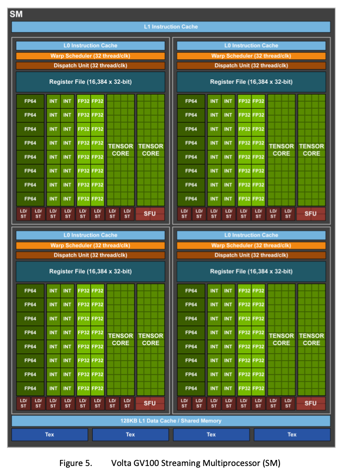

#### **Memory Architecture**

NVIDIA GPUs employ a sophisticated memory hierarchy to feed their powerful processing cores:

*   **High-Bandwidth Memory (HBM):** Modern data center GPUs use HBM (such as HBM2, HBM2e, and HBM3) instead of traditional GDDR memory. HBM consists of multiple DRAM dies stacked vertically on the same physical package as the GPU. This design provides a much wider memory interface, resulting in exceptionally high memory bandwidth (often measured in terabytes per second), substantial power savings, and reduced physical footprint compared to GDDR.
*   **L2 Cache:** A large, unified cache shared by all SMs on the GPU. The L2 cache serves as an intermediate memory level between the SMs' L1 caches and the main HBM. Its purpose is to capture frequently accessed data, reducing the need for slower accesses to the main HBM, which in turn improves performance and reduces power consumption. The size of the L2 cache has grown significantly with each generation.
*   **ECC (Error Correction Code) Memory:** A critical feature for data centers, ECC memory can detect and correct single-bit memory errors on the fly. This ensures the high reliability and data integrity required for large-scale, long-running computations in scientific and AI applications.

#### **NVLink and NVSwitch Interconnect**

To overcome the bandwidth limitations of the standard PCIe bus, NVIDIA developed NVLink, a high-speed, direct GPU-to-GPU interconnect.

*   **NVLink:** Provides significantly higher bandwidth and lower latency for data transfers between multiple GPUs in a single server compared to PCIe. This is essential for scaling AI and HPC applications, as it allows multiple GPUs to work together on a single massive dataset or model as if they were one giant GPU.
*   **NVSwitch:** An interconnect fabric that uses NVLink to connect multiple GPUs in a fully non-blocking topology. In systems like the NVIDIA DGX, NVSwitches allow every GPU to communicate with every other GPU at full NVLink speed simultaneously, which is crucial for complex communication patterns in large-scale AI training.

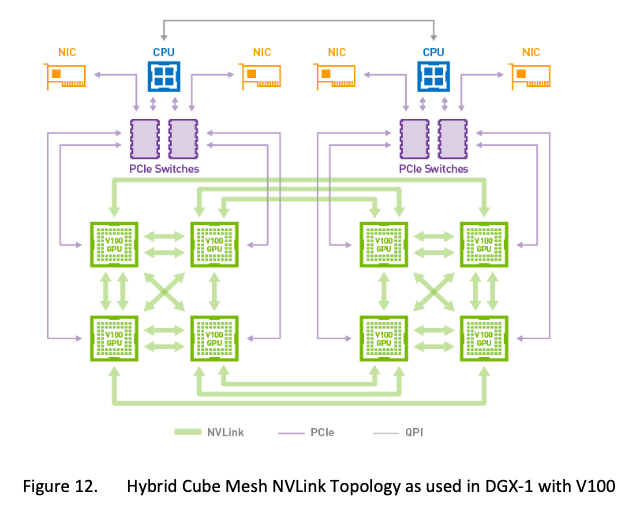

#### **Specialized Hardware: RT Cores and Video Engines**

*   **RT Cores:** Introduced with the Turing architecture, RT Cores are dedicated hardware units designed to accelerate ray tracing. They perform Bounding Volume Hierarchy (BVH) traversal and ray-triangle intersection calculations with extraordinary efficiency, offloading this work from the SMs. This makes real-time, photorealistic rendering possible.
*   **Video Engines (NVENC/NVDEC):** NVIDIA GPUs include dedicated hardware for video encoding (NVENC) and decoding (NVDEC). These engines support various codecs (H.264, HEVC, VP9) and offload the computationally intensive task of video processing from the main CPU and GPU cores, making them ideal for streaming, video production, and AI-based video analytics.

### **2. The Evolution of GPU Architecture: Volta to Hopper**

NVIDIA's GPU architecture has undergone a dramatic evolution, with each generation delivering significant leaps in performance, efficiency, and capability.

#### **Volta (V100) - The Dawn of the AI Era**

Released in 2017, the Volta architecture was a revolutionary leap forward, primarily by establishing the GPU as the engine of the AI revolution.

*   **Key Innovation: Tensor Cores:** Volta introduced the world's first Tensor Cores, which delivered a 12x increase in deep learning training TFLOPS compared to the previous Pascal generation. This single innovation drastically reduced the time required to train complex neural networks.
*   **SM Architecture:** The Volta SM (GV100) featured 64 FP32 cores and 32 FP64 cores, offering a strong balance for both AI and traditional HPC workloads. It also introduced independent thread scheduling, allowing for finer-grain synchronization and cooperation between threads within a warp, which simplified programming for complex algorithms.
*   **Interconnect and Memory:** It featured second-generation NVLink with a total bandwidth of 300 GB/s and was the first architecture to make wide use of high-speed HBM2 memory.

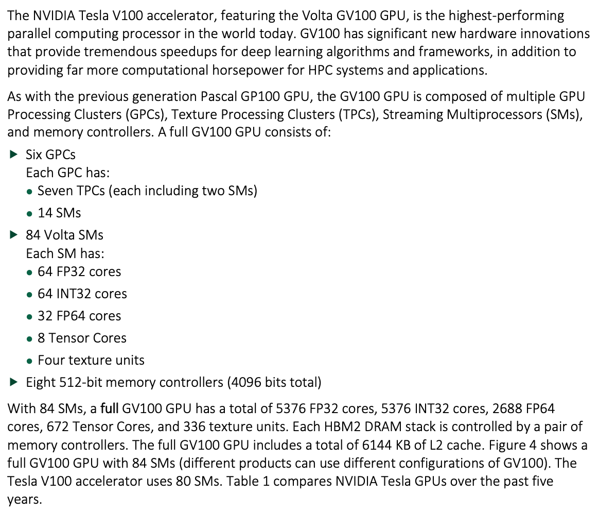
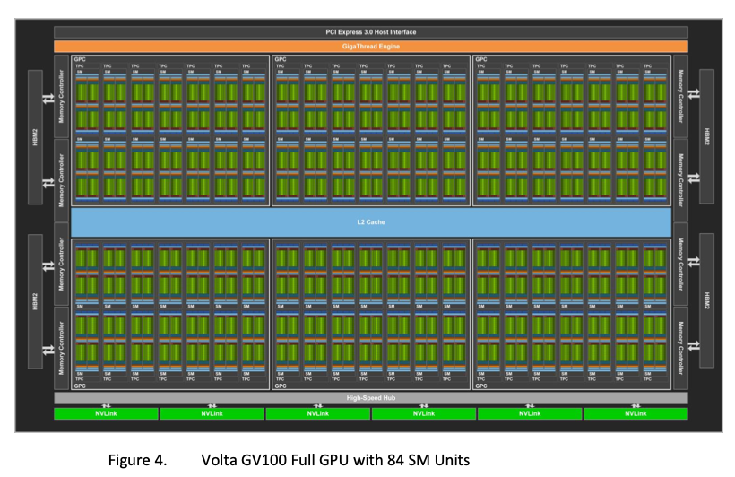
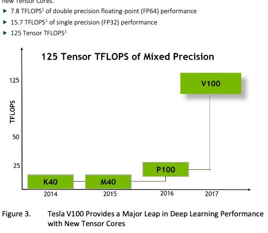
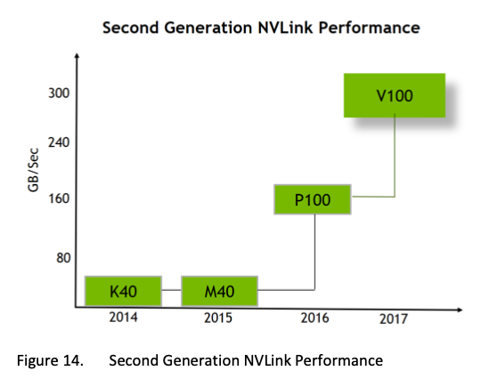
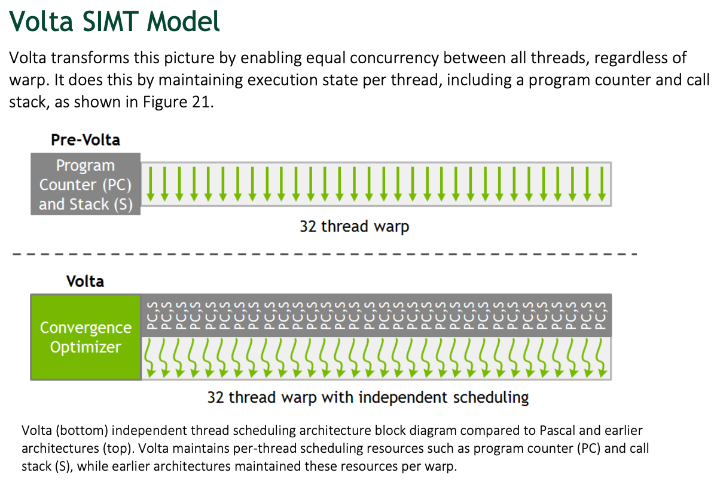

#### **Turing (Tesla T4) - Real-Time Ray Tracing and Inference Acceleration**

The Turing architecture, launched in 2018, built upon Volta's foundation, extending its AI capabilities to inference and introducing groundbreaking features for computer graphics.

*   **Key Innovation: RT Cores:** Turing's defining feature was the introduction of dedicated RT Cores for real-time ray tracing, fusing rasterization and ray tracing in a "hybrid rendering" model that brought cinematic-quality lighting to games and professional applications.
*   **Tensor Core Evolution:** Turing enhanced the Tensor Cores by adding support for lower-precision INT8 and INT4 modes. These modes are ideal for AI inference, where performance and efficiency are often more critical than the high precision required for training. This resulted in up to 40x higher inference performance compared to CPU-based solutions.
*   **SM Architecture:** The Turing SM introduced concurrent execution of floating-point and integer operations. Since many workloads mix math calculations with address generation and other integer work, this dual-pipeline design improved overall throughput by up to 36%. It also featured a unified architecture for shared memory, L1, and texture caching, improving L1 hit rates and bandwidth.

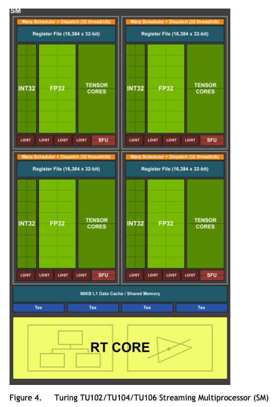

#### **Ampere (A100) - A Leap in Performance and Scalability**

Announced in 2020, the Ampere architecture delivered the greatest generational performance leap in NVIDIA's history, designed to power AI, data analytics, and HPC workloads from the data center to the edge.

*   **Key Innovation: Multi-Instance GPU (MIG):** Ampere introduced MIG, a revolutionary feature that allows a single A100 GPU to be partitioned into up to seven smaller, fully isolated GPU instances. Each instance has its own dedicated compute and memory resources, allowing cloud providers and data centers to provide right-sized, secure GPU acceleration for multiple users and workloads, dramatically improving utilization.

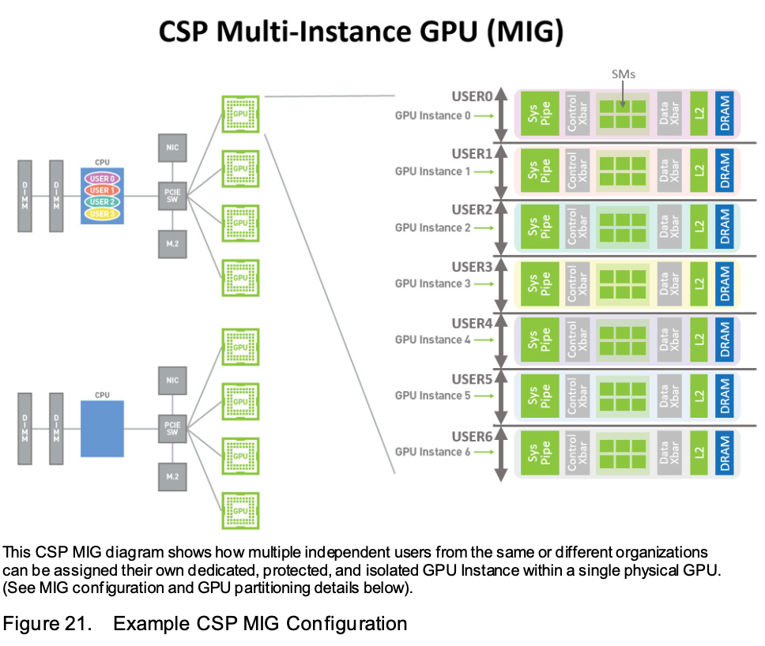

*   **Third-Generation Tensor Cores:** Ampere's Tensor Cores were a major upgrade. They doubled the performance for traditional FP16 and INT8 operations. Crucially, they introduced **TensorFloat-32 (TF32)**, a new math mode that matches the range of FP32 while using the precision of FP16, allowing it to accelerate standard FP32 AI workloads by up to 20x over the V100 with zero code changes. Ampere Tensor Cores also introduced support for **sparsity**, a feature that exploits the fine-grained zero values in AI models to double compute throughput.

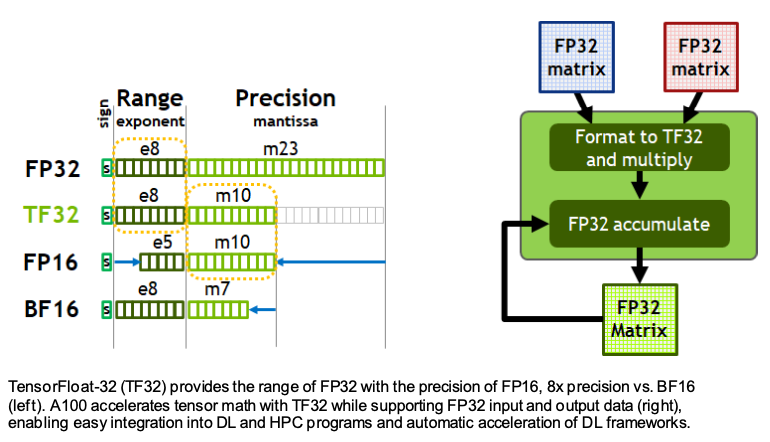
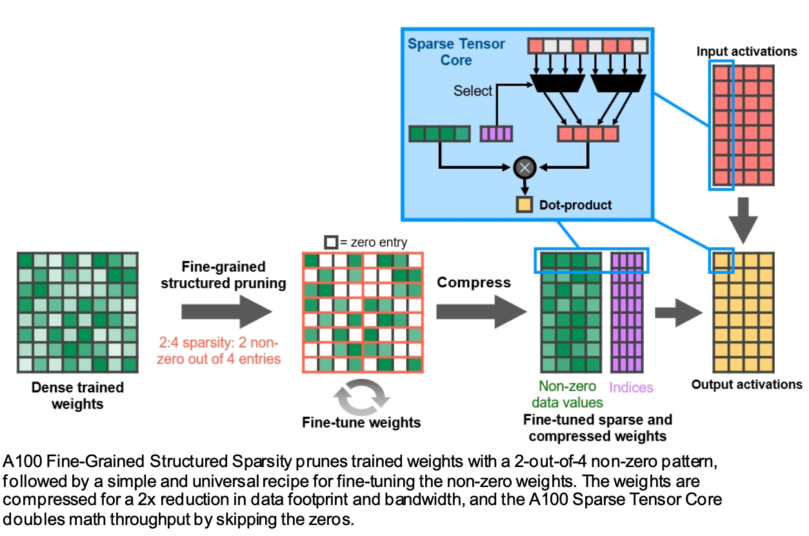

*   **Increased Scale:** The A100 featured a much larger 40 MB L2 cache (nearly 7x larger than V100), providing faster data access and reducing traffic to HBM2 memory. It also moved to third-generation NVLink, increasing total bandwidth to 600 GB/s.

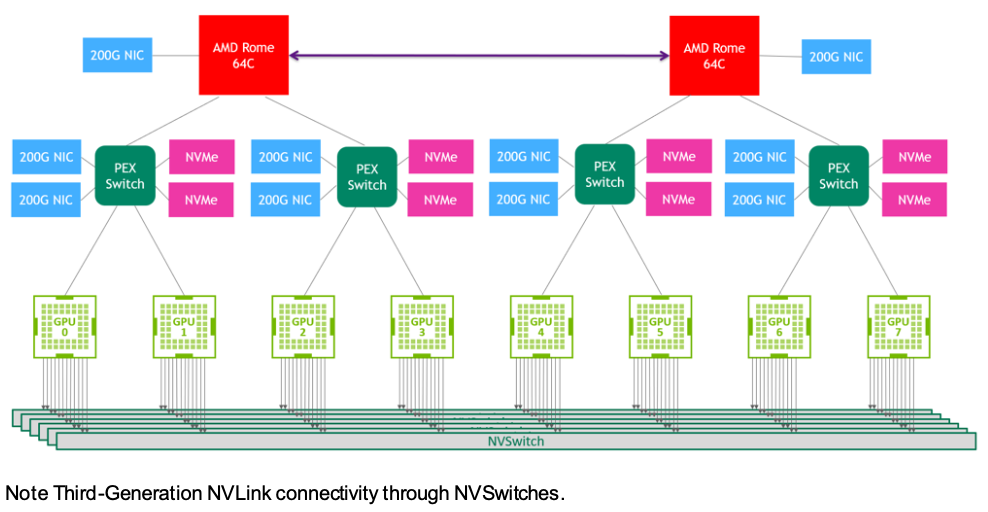

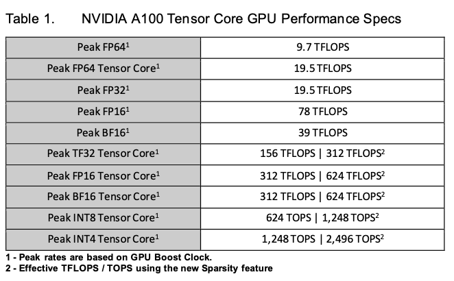
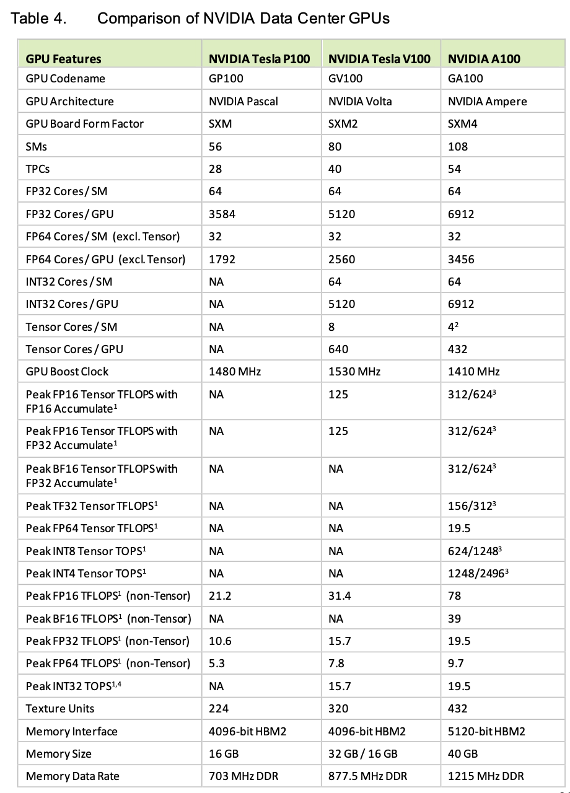
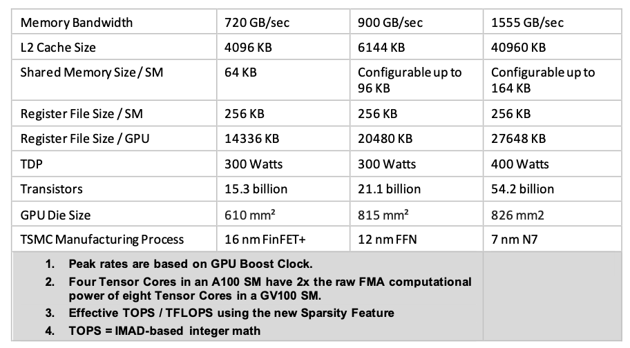
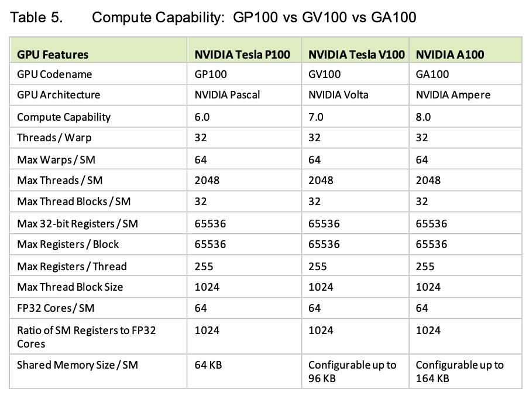
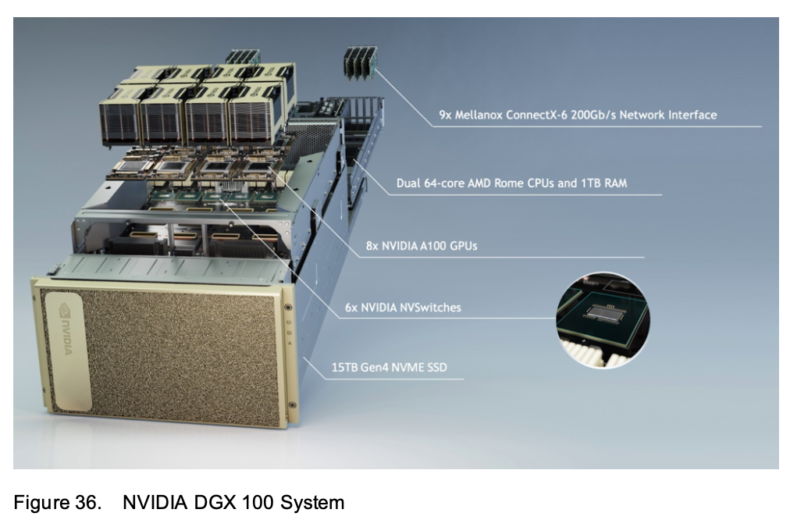

#### **Hopper (H100) - Designed for Exascale AI and HPC**

The Hopper architecture, unveiled in 2022, is designed to handle the next generation of massive AI models and exascale HPC applications.

*   **Key Innovation: Transformer Engine:** Hopper's fourth-generation Tensor Cores include the Transformer Engine. Transformers are the dominant model architecture for natural language processing (e.g., BERT, GPT-3). This engine uses software and custom hardware to dynamically choose between FP8 and 16-bit calculations, dramatically accelerating both training and inference for these models by up to 9x over the A100.
*   **New Programming Models:** Hopper introduces **Thread Block Clusters**, a new level in the GPU programming hierarchy that allows groups of thread blocks across multiple SMs to cooperate efficiently. This is supported by hardware features like the **Tensor Memory Accelerator (TMA)**, which efficiently moves large blocks of data, and **Distributed Shared Memory**, which allows threads in one SM to directly access the shared memory of another SM in the same cluster.

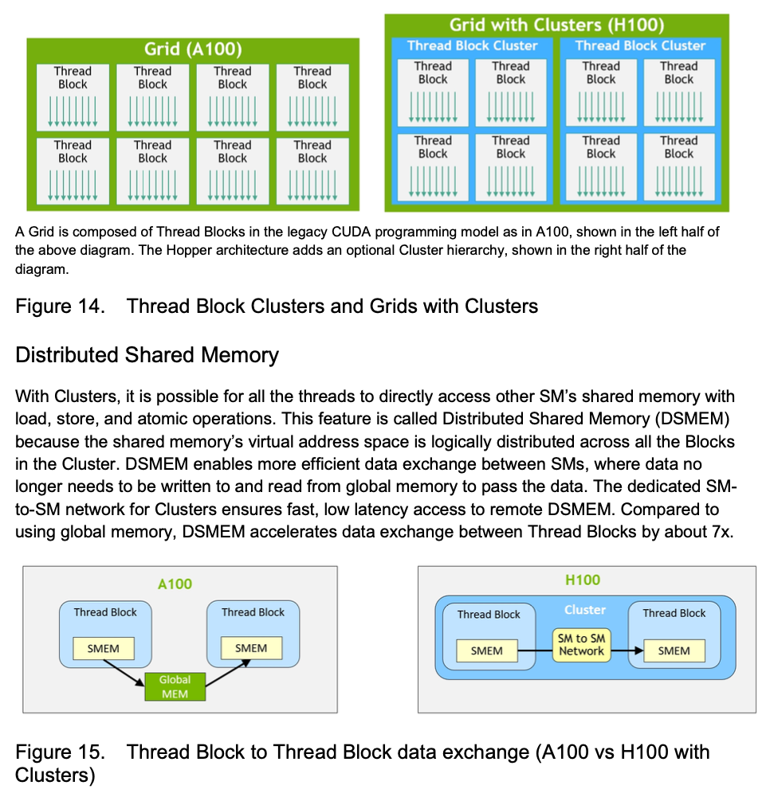

*   **Next-Generation Scale and Security:** Hopper uses fourth-generation NVLink and a new NVLink Switch System to scale to up to 256 GPUs in a single, fully connected fabric, providing an incredible 900 GB/s of bandwidth per GPU. It also introduces **second-generation Secure MIG** with Confidential Computing, the first of its kind, which isolates and protects data and applications in-use on the GPU from the hardware level up.
*   **Memory and Performance:** The H100 is the world's first GPU to feature **HBM3 memory**, delivering an unprecedented 3 TB/s of memory bandwidth. Combined with a 50 MB L2 cache and numerous architectural efficiencies, the H100 delivers another massive performance leap across AI and HPC.

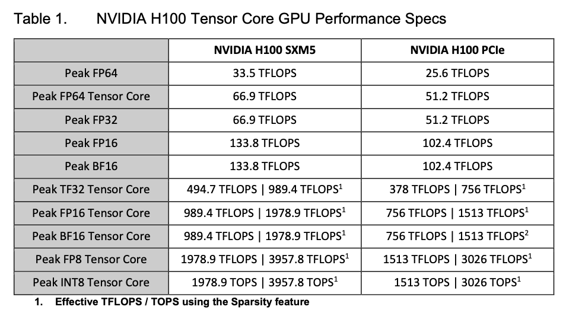
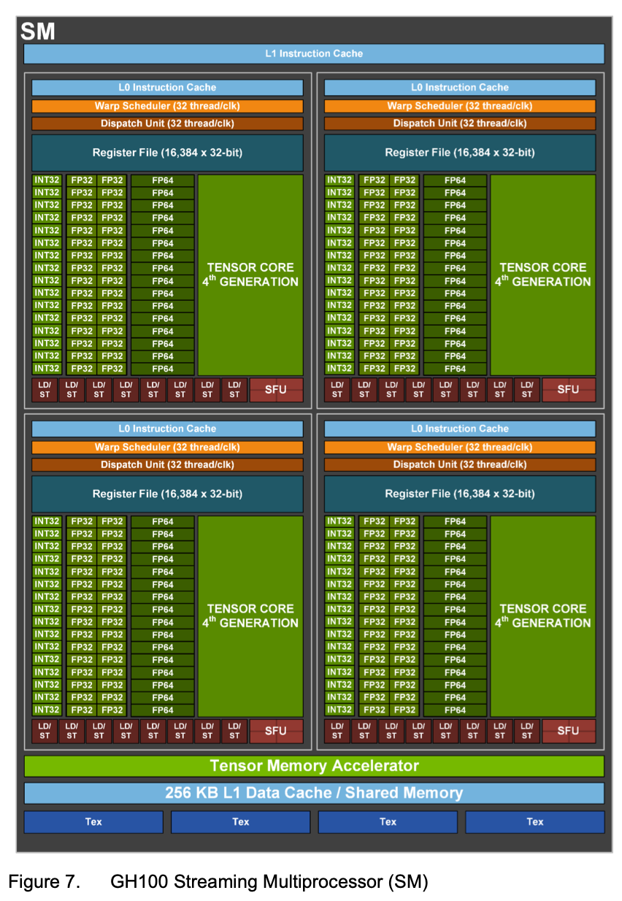
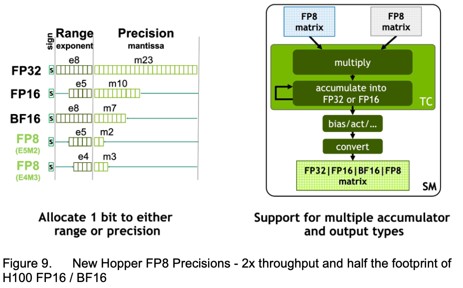

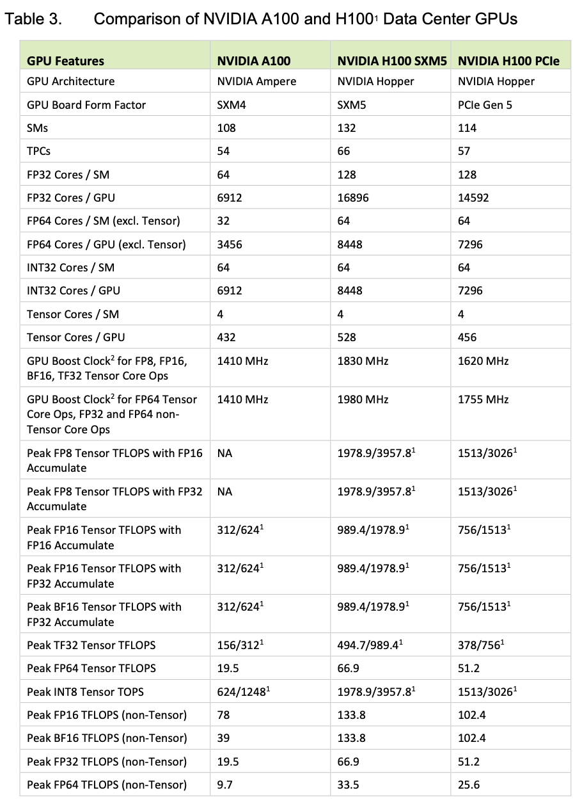
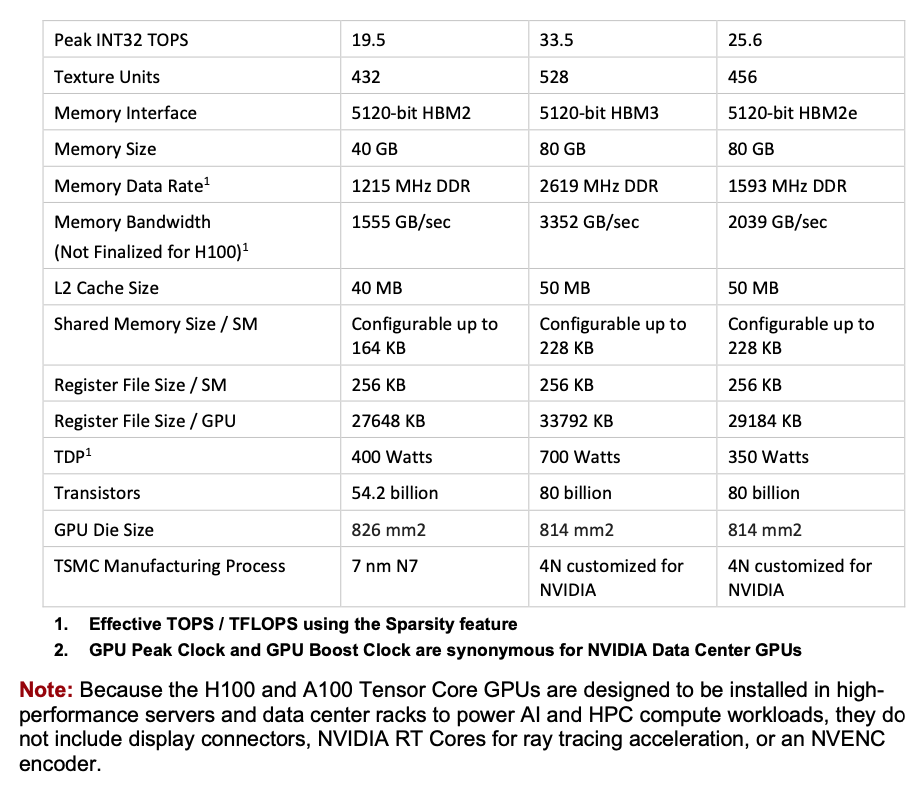

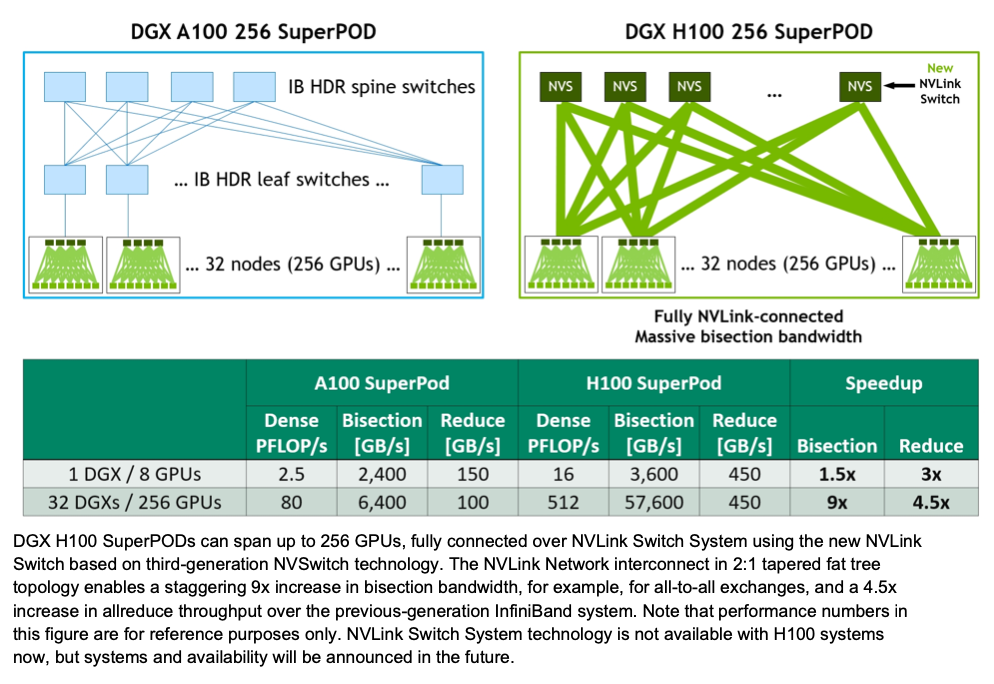

| Feature | Volta (V100) | Turing (Tesla T4) | Ampere (A100) | Hopper (H100) |
| :--- | :--- | :--- | :--- | :--- |
| **Primary Innovation** | 1st Gen Tensor Cores for AI Training | RT Cores for Ray Tracing, Inference Tensor Cores | Multi-Instance GPU (MIG), TF32 & Sparsity | Transformer Engine, Thread Block Clusters |
| **Tensor Core Precision** | FP16 | FP16, INT8, INT4 | FP64, TF32, BF16, FP16, INT8 (with Sparsity) | FP8, FP16, BF16, TF32, FP64, INT8 (with Sparsity) |
| **SM Concurrency** | Independent Thread Scheduling | FP + INT Concurrent Execution | FP + INT Concurrent Execution | FP + INT Concurrent Execution |
| **GPU Partitioning** | Multi-Process Service (MPS) | MPS | Multi-Instance GPU (MIG) | 2nd Gen Secure MIG with Confidential Computing |
| **Interconnect** | 2nd Gen NVLink (300 GB/s) | N/A (Data Center) | 3rd Gen NVLink (600 GB/s) | 4th Gen NVLink (900 GB/s) & NVLink Network |
| **Memory Type** | HBM2 | GDDR6 | HBM2 / HBM2e | HBM3 / HBM2e |
| **Max L2 Cache** | 6 MB | N/A (Data Center) | 40 MB | 50 MB |

This evolution shows a clear trajectory: from establishing a foundation for AI acceleration with Volta, to expanding into new domains like graphics and inference with Turing, to achieving massive leaps in performance and data center flexibility with Ampere, and finally to enabling the next exascale generation of AI models and HPC with Hopper.

#### References

- [NVIDIA TESLA V100 GPU ARCHITECTURE](https://images.nvidia.com/content/volta-architecture/pdf/volta-architecture-whitepaper.pdf)
- [NVIDIA TURING GPU ARCHITECTURE](https://images.nvidia.com/aem-dam/en-zz/Solutions/design-visualization/technologies/turing-architecture/NVIDIA-Turing-Architecture-Whitepaper.pdf)
- [NVIDIA AMPERE GA102 GPU ARCHITECTURE](https://www.nvidia.com/content/PDF/nvidia-ampere-ga-102-gpu-architecture-whitepaper-v2.pdf)
- [NVIDIA H100 GPU Whitepaper](https://resources.nvidia.com/en-us-hopper-architecture/nvidia-h100-tensor-c)