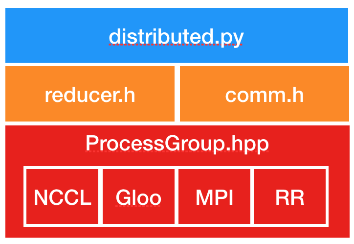

# Distributed Data Parallel

- [PyTorch Doc: Distributed Data Parallel](https://pytorch.org/docs/stable/notes/ddp.html)
- [PyTorch Doc: DDP Tutorial](https://pytorch.org/tutorials/intermediate/ddp_tutorial.html)

### DistributedDataParallel (DDP)
- implements data parallelism at the module level which can run across multiple machines. Applications using DDP should spawn multiple processes and create a single DDP instance per process. 

- DDP uses collective communications in the torch.distributed package to synchronize gradients and buffers. More specifically, DDP registers an autograd hook for each parameter given by model.parameters() and the hook will fire when the corresponding gradient is computed in the backward pass.

- Then DDP uses that signal to trigger gradient synchronization across processes. Please refer to DDP design note for more details.

- <b>The recommended way to use DDP is to spawn one process for each model replica, where a model replica can span multiple devices. DDP processes can be placed on the same machine or across machines, but GPU devices cannot be shared across processes. </b>

- <b> DDP wraps lower-level distributed communication details and provides a clean API as if it were a local model. Gradient synchronization communications take place during the backward pass and overlap with the backward computation. When the backward() returns, param.grad already contains the synchronized gradient tensor. For basic use cases, DDP only requires a few more LoCs to set up the process group. When applying DDP to more advanced use cases, some caveats require caution. </b>


### Code Sample
```python
def example(rank, world_size):
    # create default process group
    dist.init_process_group("gloo", rank=rank, world_size=world_size)
    # create local model
    model = nn.Linear(10, 10).to(rank)
    # construct DDP model
    ddp_model = DDP(model, device_ids=[rank])
    # define loss function and optimizer
    loss_fn = nn.MSELoss()
    optimizer = optim.SGD(ddp_model.parameters(), lr=0.001)

    # forward pass
    outputs = ddp_model(torch.randn(20, 10).to(rank))
    labels = torch.randn(20, 10).to(rank)
    # backward pass
    loss_fn(outputs, labels).backward()
    # update parameters
    optimizer.step()

def main():
    world_size = 2
    mp.spawn(example,
        args=(world_size,),
        nprocs=world_size,
        join=True)
```

DDP works with TorchDynamo. When used with TorchDynamo, apply the DDP model wrapper before compiling the model, such that torchdynamo can apply DDPOptimizer (graph-break optimizations) based on DDP bucket sizes.

```python
ddp_model = DDP(model, device_ids=[rank])
ddp_model = torch.compile(ddp_model)
```

### How it works ?

<div class="container py-4 py-md-5 px-4 px-md-3 text-body-secondary">
    <div class="row" >
      <div class="col-lg-4 mb-4">
        </img>
      </div>
    </div>
</div>

1. DDP relies on c10d ProcessGroup for communications. Hence, applications must create ProcessGroup instances before constructing DDP.

2. Construction
    - The DDP constructor takes a reference to the local module, and broadcasts state_dict() from the process with rank 0 to all other processes in the group to make sure that all model replicas start from the exact same state. 
    - Then, each DDP process creates a local Reducer, which later will take care of the gradients synchronization during the backward pass.
        - Buckets:
            - To improve communication efficiency, the Reducer organizes parameter gradients into buckets, and reduces one bucket at a time. Bucket size can be configured by setting the bucket_cap_mb argument in DDP constructor. The mapping from parameter gradients to buckets is determined at the construction time, based on the bucket size limit and parameter sizes.
            - Model parameters are allocated into buckets in (roughly) the reverse order of Model.parameters() from the given model. The reason for using the reverse order is because DDP expects gradients to become ready during the backward pass in approximately that order.
    - Besides bucketing, the Reducer also registers autograd hooks during construction, one hook per parameter. These hooks will be triggered during the backward pass when the gradient becomes ready.

3. Forward Pass
    - The DDP takes the input and passes it to the local model, and then analyzes the output from the local model if find_unused_parameters is set to True. This mode allows running backward on a subgraph of the model, and DDP finds out which parameters are involved in the backward pass by traversing the autograd graph from the model output and marking all unused parameters as ready for reduction.

4. Backward Pass:
    - The backward() function is directly invoked on the loss Tensor, which is out of DDP’s control, and DDP uses autograd hooks registered at construction time to trigger gradients synchronizations. When one gradient becomes ready, its corresponding DDP hook on that grad accumulator will fire, and DDP will then mark that parameter gradient as ready for reduction. When gradients in one bucket are all ready, the Reducer kicks off an asynchronous allreduce on that bucket to calculate mean of gradients across all processes. When all buckets are ready, the Reducer will block waiting for all allreduce operations to finish. When this is done, averaged gradients are written to the param.grad field of all parameters. So after the backward pass, the grad field on the same corresponding parameter across different DDP processes should be the same.

5. Optimizer Step:
    - From the optimizer’s perspective, it is optimizing a local model. Model replicas on all DDP processes can keep in sync because they all start from the same state and they have the same averaged gradients in every iteration.


### Implementation

<div class="container py-4 py-md-5 px-4 px-md-3 text-body-secondary">
    <div class="row" >
      <div class="col-lg-4 mb-4">
        </img>
      </div>
    </div>
</div>

##### ProcessGroup
- ProcessGroup.hpp:
    - contains the abstract API of all process group implementations. The c10d library provides 3 implementations out of the box, namely, ProcessGroupGloo, ProcessGroupNCCL, and ProcessGroupMPI.
    - DistributedDataParallel uses ProcessGroup::broadcast() to send model states from the process with rank 0 to others during initialization and
    - ProcessGroup::allreduce() to sum gradients.


##### DistributedDataParallel
- distributed.py: is the Python entry point for DDP. It implements the initialization steps and the forward function for the nn.parallel.DistributedDataParallel module which call into C++ libraries. Its _sync_param function performs intra-process parameter synchronization when one DDP process works on multiple devices, and it also broadcasts model buffers from the process with rank 0 to all other processes. The inter-process parameter synchronization happens in Reducer.cpp.
- comm.h: implements the coalesced broadcast helper function which is invoked to broadcast model states during initialization and synchronize model buffers before the forward pass.

- reducer.h: provides the core implementation for gradient synchronization in the backward pass. It has three entry point functions:

    - Reducer: The constructor is called in distributed.py which registers Reducer::autograd_hook() to gradient accumulators.

    - autograd_hook() function will be invoked by the autograd engine when a gradient becomes ready.

    - prepare_for_backward() is called at the end of DDP forward pass in distributed.py. It traverses the autograd graph to find unused parameters when find_unused_parameters is set to True in DDP constructor.


### TorchDynamo DDPOptimizer: Overlap communications with compute

- DDP’s performance advantage comes from overlapping allreduce collectives with computations during backwards. AotAutograd prevents this overlap when used with TorchDynamo for compiling a whole forward and whole backward graph, because allreduce ops are launched by autograd hooks _after_ the whole optimized backwards computation finishes.

- TorchDynamo’s DDPOptimizer helps by breaking the forward graph at the logical boundaries of DDP’s allreduce buckets during backwards. Note: the goal is to break the graph during backwards, and the simplest implementation is to break the forward graphs and then call AotAutograd and compilation on each section. This allows DDP’s allreduce hooks to fire in-between sections of backwards, and schedule communications to overlap with compute.


### Save and Load Checkpoints

- It’s common to use torch.save and torch.load to checkpoint modules during training and recover from checkpoints.
- When using DDP, one optimization is to save the model in only one process and then load it to all processes, reducing write overhead. This is correct because all processes start from the same parameters and gradients are synchronized in backward passes, and hence optimizers should keep setting parameters to the same values. If you use this optimization, make sure no process starts loading before the saving is finished.

```python
def demo_checkpoint(rank, world_size):
    print(f"Running DDP checkpoint example on rank {rank}.")
    setup(rank, world_size)

    model = ToyModel().to(rank)
    ddp_model = DDP(model, device_ids=[rank])


    CHECKPOINT_PATH = tempfile.gettempdir() + "/model.checkpoint"
    if rank == 0:
        # All processes should see same parameters as they all start from same
        # random parameters and gradients are synchronized in backward passes.
        # Therefore, saving it in one process is sufficient.
        torch.save(ddp_model.state_dict(), CHECKPOINT_PATH)

    # Use a barrier() to make sure that process 1 loads the model after process
    # 0 saves it.
    dist.barrier()
    # configure map_location properly
    map_location = {'cuda:%d' % 0: 'cuda:%d' % rank}
    ddp_model.load_state_dict(
        torch.load(CHECKPOINT_PATH, map_location=map_location))

    loss_fn = nn.MSELoss()
    optimizer = optim.SGD(ddp_model.parameters(), lr=0.001)

    optimizer.zero_grad()
    outputs = ddp_model(torch.randn(20, 10))
    labels = torch.randn(20, 5).to(rank)

    loss_fn(outputs, labels).backward()
    optimizer.step()

    # Not necessary to use a dist.barrier() to guard the file deletion below
    # as the AllReduce ops in the backward pass of DDP already served as
    # a synchronization.

    if rank == 0:
        os.remove(CHECKPOINT_PATH)

    cleanup()
```

### Combining DDP with Model Parallelism

- When passing a multi-GPU model to DDP, device_ids and output_device must NOT be set. Input and output data will be placed in proper devices by either the application or the model forward() method.

```python
class ToyMpModel(nn.Module):
    def __init__(self, dev0, dev1):
        super(ToyMpModel, self).__init__()
        self.dev0 = dev0
        self.dev1 = dev1
        self.net1 = torch.nn.Linear(10, 10).to(dev0)
        self.relu = torch.nn.ReLU()
        self.net2 = torch.nn.Linear(10, 5).to(dev1)

    def forward(self, x):
        x = x.to(self.dev0)
        x = self.relu(self.net1(x))
        x = x.to(self.dev1)
        return self.net2(x)

def demo_model_parallel(rank, world_size):
    print(f"Running DDP with model parallel example on rank {rank}.")
    setup(rank, world_size)

    # setup mp_model and devices for this process
    dev0 = rank * 2
    dev1 = rank * 2 + 1
    mp_model = ToyMpModel(dev0, dev1)
    ddp_mp_model = DDP(mp_model)

    loss_fn = nn.MSELoss()
    optimizer = optim.SGD(ddp_mp_model.parameters(), lr=0.001)

    optimizer.zero_grad()
    # outputs will be on dev1
    outputs = ddp_mp_model(torch.randn(20, 10))
    labels = torch.randn(20, 5).to(dev1)
    loss_fn(outputs, labels).backward()
    optimizer.step()

    cleanup()


if __name__ == "__main__":
    n_gpus = torch.cuda.device_count()
    assert n_gpus >= 2, f"Requires at least 2 GPUs to run, but got {n_gpus}"
    world_size = n_gpus
    run_demo(demo_basic, world_size)
    run_demo(demo_checkpoint, world_size)
    world_size = n_gpus//2
    run_demo(demo_model_parallel, world_size)
```


### DDP Communication Hooks
- DDP communication hook is a generic interface to control how to communicate gradients across workers by overriding the vanilla allreduce in DistributedDataParallel. A few built-in communication hooks are provided, and users can easily apply any of these hooks to optimize communication. Besides, the hook interface can also support user-defined communication strategies for more advanced use cases.
- To use a communication hook, the user just needs to let the DDP model register the hook before the training loop as below. <code>torch.nn.parallel.DistributedDataParallel.register_comm_hook()</code>
- A communication hook provides a flexible way to allreduce gradients. Therefore, it mainly operates on the gradients on each replica before allreduce, which are bucketized to increase the overlap between communication and computation.


### Initialize DDP with torch.distributed.run/torchrun

```python
import torch
import torch.distributed as dist
import torch.nn as nn
import torch.optim as optim

from torch.nn.parallel import DistributedDataParallel as DDP

class ToyModel(nn.Module):
    def __init__(self):
        super(ToyModel, self).__init__()
        self.net1 = nn.Linear(10, 10)
        self.relu = nn.ReLU()
        self.net2 = nn.Linear(10, 5)

    def forward(self, x):
        return self.net2(self.relu(self.net1(x)))


def demo_basic():
    dist.init_process_group("nccl")
    rank = dist.get_rank()
    print(f"Start running basic DDP example on rank {rank}.")

    # create model and move it to GPU with id rank
    device_id = rank % torch.cuda.device_count()
    model = ToyModel().to(device_id)
    ddp_model = DDP(model, device_ids=[device_id])

    loss_fn = nn.MSELoss()
    optimizer = optim.SGD(ddp_model.parameters(), lr=0.001)

    optimizer.zero_grad()
    outputs = ddp_model(torch.randn(20, 10))
    labels = torch.randn(20, 5).to(device_id)
    loss_fn(outputs, labels).backward()
    optimizer.step()
    dist.destroy_process_group()

if __name__ == "__main__":
    demo_basic()
```

- One can then run a torch elastic/torchrun command on all nodes to initialize the DDP job created above:
```
torchrun --nnodes=2 --nproc_per_node=8 --rdzv_id=100 --rdzv_backend=c10d --rdzv_endpoint=$MASTER_ADDR:29400 elastic_ddp.py
```

- We are running the DDP script on two hosts, and each host we run with 8 processes, aka, we are running it on 16 GPUs. Note that $MASTER_ADDR must be the same across all nodes.

- Here torchrun will launch 8 process and invoke elastic_ddp.py on each process on the node it is launched on, but user also needs to apply cluster management tools like slurm to actually run this command on 2 nodes.

- For example, on a SLURM enabled cluster, we can write a script to run the command above and set MASTER_ADDR as:
```
export MASTER_ADDR=$(scontrol show hostname ${SLURM_NODELIST} | head -n 1)
```
Then we can just run this script using the SLURM command: srun --nodes=2 ./torchrun_script.sh.


### When is DDP not enough?
- A typical training run’s memory footprint consists of model weights, activations, gradients, the input batch, and the optimizer state. Since DDP replicates the model on each GPU, it only works when GPUs have sufficient capacity to accomodate the full footprint. When models grow larger, more aggressive techniques might be useful:

    - Activation checkpointing: Instead of saving intermediate activations during the forward pass, the activations are recomputed during the backward pass. In this approach, we run more compute but save on memory footprint.

    - Fully-Sharded Data Parallel: Here the model is not replicated but “sharded” across all the GPUs, and computation is overlapped with communication in the forward and backward passes.


### DDP on multiple nodes using Torchrun (and optionally Slurm)

Reference: [PyTorch Doc: Multinode Training using DDP](https://github.com/pytorch/examples/tree/main/distributed/ddp-tutorial-series)

```python
import torch
import torch.nn.functional as F
from torch.utils.data import Dataset, DataLoader
from datautils import MyTrainDataset

import torch.multiprocessing as mp
from torch.utils.data.distributed import DistributedSampler
from torch.nn.parallel import DistributedDataParallel as DDP
from torch.distributed import init_process_group, destroy_process_group
import os


def ddp_setup():
    init_process_group(backend="nccl")
    torch.cuda.set_device(int(os.environ["LOCAL_RANK"]))

class Trainer:
    def __init__(
        self,
        model: torch.nn.Module,
        train_data: DataLoader,
        optimizer: torch.optim.Optimizer,
        save_every: int,
        snapshot_path: str,
    ) -> None:
        self.local_rank = int(os.environ["LOCAL_RANK"])
        self.global_rank = int(os.environ["RANK"])
        self.model = model.to(self.local_rank)
        self.train_data = train_data
        self.optimizer = optimizer
        self.save_every = save_every
        self.epochs_run = 0
        self.snapshot_path = snapshot_path
        if os.path.exists(snapshot_path):
            print("Loading snapshot")
            self._load_snapshot(snapshot_path)

        self.model = DDP(self.model, device_ids=[self.local_rank])

    def _load_snapshot(self, snapshot_path):
        loc = f"cuda:{self.local_rank}"
        snapshot = torch.load(snapshot_path, map_location=loc)
        self.model.load_state_dict(snapshot["MODEL_STATE"])
        self.epochs_run = snapshot["EPOCHS_RUN"]
        print(f"Resuming training from snapshot at Epoch {self.epochs_run}")

    def _run_batch(self, source, targets):
        self.optimizer.zero_grad()
        output = self.model(source)
        loss = F.cross_entropy(output, targets)
        loss.backward()
        self.optimizer.step()

    def _run_epoch(self, epoch):
        b_sz = len(next(iter(self.train_data))[0])
        print(f"[GPU{self.global_rank}] Epoch {epoch} | Batchsize: {b_sz} | Steps: {len(self.train_data)}")
        self.train_data.sampler.set_epoch(epoch)
        for source, targets in self.train_data:
            source = source.to(self.local_rank)
            targets = targets.to(self.local_rank)
            self._run_batch(source, targets)

    def _save_snapshot(self, epoch):
        snapshot = {
            "MODEL_STATE": self.model.module.state_dict(),
            "EPOCHS_RUN": epoch,
        }
        torch.save(snapshot, self.snapshot_path)
        print(f"Epoch {epoch} | Training snapshot saved at {self.snapshot_path}")

    def train(self, max_epochs: int):
        for epoch in range(self.epochs_run, max_epochs):
            self._run_epoch(epoch)
            if self.local_rank == 0 and epoch % self.save_every == 0:
                self._save_snapshot(epoch)


def load_train_objs():
    train_set = MyTrainDataset(2048)  # load your dataset
    model = torch.nn.Linear(20, 1)  # load your model
    optimizer = torch.optim.SGD(model.parameters(), lr=1e-3)
    return train_set, model, optimizer


def prepare_dataloader(dataset: Dataset, batch_size: int):
    return DataLoader(
        dataset,
        batch_size=batch_size,
        pin_memory=True,
        shuffle=False,
        sampler=DistributedSampler(dataset)
    )


def main(save_every: int, total_epochs: int, batch_size: int, snapshot_path: str = "snapshot.pt"):
    ddp_setup()
    dataset, model, optimizer = load_train_objs()
    train_data = prepare_dataloader(dataset, batch_size)
    trainer = Trainer(model, train_data, optimizer, save_every, snapshot_path)
    trainer.train(total_epochs)
    destroy_process_group()


if __name__ == "__main__":
    import argparse
    parser = argparse.ArgumentParser(description='simple distributed training job')
    parser.add_argument('total_epochs', type=int, help='Total epochs to train the model')
    parser.add_argument('save_every', type=int, help='How often to save a snapshot')
    parser.add_argument('--batch_size', default=32, type=int, help='Input batch size on each device (default: 32)')
    args = parser.parse_args()
    
    main(args.save_every, args.total_epochs, args.batch_size)
```

##### Configuration to set up an AWS cluster
```yaml
Region: us-east-1

Image:
  Os: ubuntu1804

SharedStorage:
  - MountDir: /shared
    Name: shared-fs
    StorageType: FsxLustre
    FsxLustreSettings:
      StorageCapacity: 1200
      DeploymentType: SCRATCH_1
      StorageType: SSD

HeadNode:
  InstanceType: c5.xlarge
  Networking:
    SubnetId: subnet-xxxxxxx
  Ssh:
    KeyName: your-keyname-file

Scheduling:
  Scheduler: slurm
  SlurmQueues:
  - Name: train
    ComputeResources:
    - Name: p32xlarge
      InstanceType: p3.2xlarge
      MinCount: 0
      MaxCount: 5
    Networking:
      SubnetIds:
      - subnet-xxxxxxx
```

##### Slurm script to launch the training job
```shell
#!/bin/bash

#SBATCH --job-name=multinode-example
#SBATCH --nodes=4
#SBATCH --ntasks=4
#SBATCH --gpus-per-task=1
#SBATCH --cpus-per-task=4

nodes=( $( scontrol show hostnames $SLURM_JOB_NODELIST ) )
nodes_array=($nodes)
head_node=${nodes_array[0]}
head_node_ip=$(srun --nodes=1 --ntasks=1 -w "$head_node" hostname --ip-address)

echo Node IP: $head_node_ip
export LOGLEVEL=INFO

srun torchrun \
--nnodes 4 \
--nproc_per_node 1 \
--rdzv_id $RANDOM \
--rdzv_backend c10d \
--rdzv_endpoint $head_node_ip:29500 \
/shared/examples/multinode_torchrun.py 50 10
```

### Further Reading

- [PyTorch Doc: Training “real-world” models with DDP (minGPT)](https://pytorch.org/tutorials/intermediate/ddp_series_minGPT.html)
- [Training a 1T parameter model with FSDP](https://medium.com/pytorch/training-a-1-trillion-parameter-model-with-pytorch-fully-sharded-data-parallel-on-aws-3ac13aa96cff)