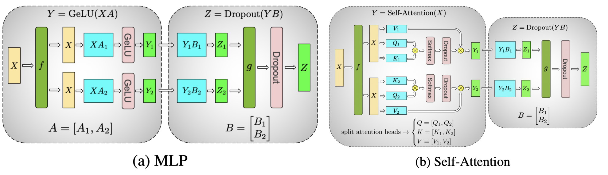
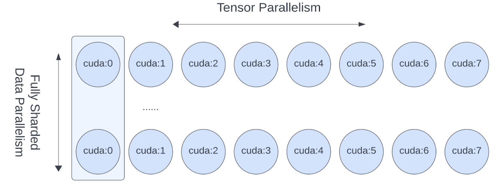

# Tensor parallelism

### References
- [PyTorch Doc: Large Scale Transformer model training with Tensor Parallel (TP)](https://pytorch.org/tutorials/intermediate/TP_tutorial.html)


### How Tensor Parallel works?
- Tensor Parallel (TP) was originally proposed in the [Megatron-LM paper](https://arxiv.org/abs/1909.08053), and it is an efficient model parallelism technique to train large scale Transformer models. Sequence Parallel (SP) we mention in this tutorial is a variant of Tensor Parallel that shards on the sequence dimension for nn.LayerNorm or RMSNorm to further save activation memory during training. As the model becomes larger, the activation memory becomes the bottleneck, so in Tensor Parallel training it usually applies Sequence Parallel to LayerNorm or RMSNorm layers.

<div class="container py-4 py-md-5 px-4 px-md-3 text-body-secondary">
    <div class="row" >
      <div class="col-lg-4 mb-4">
        </img>
      </div>
    </div>
</div>

At a high level, PyTorch Tensor Parallel works as follows:

- Sharding initialization

	- Determine which ParallelStyle to apply to each layer and shard the initialized module by calling parallelize_module.
	- The parallelized modules would have their model parameters be swapped to DTensors, and DTensor would be responsible to run the parallelized module using sharded computation.

- Runtime foward/backward

	- Depending on the input/outputs DTensor layouts user specified for each ParallelStyle, it would run proper communication operation to transform the DTensor layouts for inputs/outputs (such as allreduce, allgather and reduce_scatter).
	- Run sharded computation for the parallelized layers to save compute/memory (for example, nn.Linear, nn.Embedding).


### When and Why you should apply Tensor Parallel ?

The PyTorch Fully Sharded Data Parallel (FSDP) already has the capability to scale model training to a specific number of GPUs. However, when it comes to further scale the model training in terms of model size and GPU quantity, many additional challenges arise that may require combining Tensor Parallel with FSDP.:

- As the world size (number of GPUs) is becoming excessively large (exceeding 128/256 GPUs), the FSDP collectives (such as allgather) are being dominated by ring latency. By implementing TP/SP on top of FSDP, the FSDP world size could be reduced by 8 by applying FSDP to be inter-host only, consequently decreasing the latency costs by the same amount.

- Hit data parallelism limit where you can not raise the global batch size to be above the number of GPUs due to both convergence and GPU memory limitations, Tensor/Sequence Parallel is the only known way to “ballpark” the global batch size and continue scaling with more GPUs. This means both model size and number of GPUs could continue to scale.

- For certain types of models, when local batch size becomes smaller, TP/SP can yield matrix multiplication shapes that are more optimized for floating point operations (FLOPS).

<b>So, when pre-training, how easy is it to hit those limits? As of now, pre-training a Large Language Model (LLM) with billions or trillions of tokens could take months, even when using thousands of GPUs.</b>

- It will always hit limitation 1 when training LLM on a large scale. For example, Llama 2 70B trained with 2k GPUs for 35 days, multi-dimensional parallelisms are needed at 2k scale.

- When the Transformer model becomes larger (such as Llama2 70B), it will also quickly hit the limitation 2. One could not use FSDP alone with even local batch_size=1 due to memory and convergence constraints. For example, Llama 2 global batch size is 1K, so data parallelism alone can not be used at 2K GPUs.


### How to apply Tensor Parallel ?
PyTorch Tensor Parallel APIs offers a set of module level primitives (ParallelStyle) to configure the sharding for each individual layers of the model, including:

- ColwiseParallel and RowwiseParallel: Shard the nn.Linear and nn.Embedding in the column or row fashion.

- SequenceParallel: Perform sharded computations on nn.LayerNorm, nn.Dropout, RMSNormPython, etc.

- PrepareModuleInput and PrepareModuleOutput: Configure the module inputs/outputs sharding layouts with proper communication operations.


### Tensor Parallelism on Llama2 model 

- Since Tensor Parallel shard individual tensors over a set of devices, we would need to set up the distributed environment (such as NCCL communicators) first. 
- Tensor Parallelism is a Single-Program Multiple-Data (SPMD) sharding algorithm similar to PyTorch DDP/FSDP, and it under the hood leverages the PyTorch DTensor to perform sharding.
- It also utilizes the DeviceMesh abstraction (which under the hood manages ProcessGroups) for device management and sharding.

##### Feedforward layer
The core TransformerBlock consists of an Attention layer and a FeedForward layer. Let us first look at the simpler FeedForward layer. For the FeedForward Layer it consists of three Linear layers, where it performs a SwiGLU style MLP, looking at its forward function:

```python
# forward in the FeedForward layer
def forward(self, x):
    return self.w2(F.silu(self.w1(x)) * self.w3(x))
```

It performs w1 and w3 matmuls concurrently and followed by a w2 matmul with the result of the combined w1/w3 linear projection results. This means we could use the idea from the Tensor Parallelism paper to shard the w1/w3 Linear layers in the colwise fashion and shard the w2 Linear layer in the rowwise fashion, so that there is only one allreduce communication happening at the end of all the three layers. With the PyTorch native Tensor Parallel, we can simply create a parallelize_plan for the FeedForward layer like below:


```python
from torch.distributed.tensor.parallel import ColwiseParallel, RowwiseParallel, parallelize_module

layer_tp_plan = {
    # by default ColwiseParallel input layouts is replicated
    # and RowwiseParallel output layouts is replicated
    "feed_foward.w1": ColwiseParallel(),
    "feed_forward.w2": RowwiseParallel(),
    "feed_forward.w3": ColwiseParallel(),
}
```

Users would only need to specify how to shard the individual layers and the communications (for example, allreduce) will happen under the hood.


##### Attention layer
- It consists of wq, wk, wv Linear layers to project input to q/ k / v, and then it performs attention and output projection with the wo Linear layer. Tensor Parallelism here intends to perform column-wise sharding for the q/k/v projection and row-wise sharding for the wo linear projection. 

```python
layer_tp_plan = {
    # by default ColwiseParallel input layouts is replicated
    # and RowwiseParallel output layouts is replicated
    "attention.wq": ColwiseParallel(),
    "attention.wk": ColwiseParallel(),
    "attention.wv": ColwiseParallel(),
    "attention.wo": RowwiseParallel(),
    "feed_forward.w1": ColwiseParallel(),
    "feed_forward.w2": RowwiseParallel(),
    "feed_forward.w3": ColwiseParallel(),
}
```

Finally, we need to call parallelize_module API to make the plan for each TransformerBlock effective. Under the hood, it distributes the model parameters inside Attention and FeedForward layers to DTensors, and registers communication hooks for model inputs and outputs (before and after each module respectively), if necessary:

```python
for layer_id, transformer_block in enumerate(model.layers):
    layer_tp_plan = {...}  # i.e. the plan we just generated

    # Adjust attention module to use the local number of heads
    attn_layer = transformer_block.attention
    attn_layer.n_heads = attn_layer.n_heads // tp_mesh.size()
    attn_layer.n_kv_heads = attn_layer.n_kv_heads // tp_mesh.size()

    parallelize_module(
        module=transformer_block,
        device_mesh=tp_mesh,
        parallelize_plan=layer_tp_plan,
    )
```

##### Apply Sequence Parallel to LayerNorm/RMSNorm layers
- <b>Sequence Parallel works on top of the Tensor Parallel illustrated above. Compared with basic Tensor Parallel, which only shards tensors within the Attention modules and FeedForward modules and keep their module inputs and outputs (namely activations in the forward pass and gradients in the backward pass) replicated, Sequence Parallel keeps them sharded on the sequence dimension.</b>

In a typical TransformerBlock, the forward function combines norm layers (LayerNorm or RMSNorm), an attention layer, a feed forward layer, and residual connections. For example:

```python
# forward in a TransformerBlock
def forward(self, x):
    h = x + self.attention(self.attention_norm(x))
    out = h + self.feed_forward(self.ffn_norm(h))
    return out
```

- Next let’s adjust the layer_tp_plan to enable sequence parallel on the RMSNorm layers:

```python
layer_tp_plan = {
    # Now the input and output of SequenceParallel has Shard(1) layouts,
    # to represent the input/output tensors sharded on the sequence dimension
    "attention_norm": SequenceParallel(),
    "attention": PrepareModuleInput(
        input_layouts=(Shard(1),),
        desired_input_layouts=(Replicate(),),
    ),
    "attention.wq": ColwiseParallel(),
    "attention.wk": ColwiseParallel(),
    "attention.wv": ColwiseParallel(),
    "attention.wo": RowwiseParallel(output_layouts=Shard(1)),
    "ffn_norm": SequenceParallel(),
    "feed_forward": PrepareModuleInput(
        input_layouts=(Shard(1),),
        desired_input_layouts=(Replicate(),),
    ),
    "feed_forward.w1": ColwiseParallel(),
    "feed_forward.w2": RowwiseParallel(output_layouts=Shard(1)),
    "feed_forward.w3": ColwiseParallel(),
}
```

##### Apply Loss Parallel
- Loss Parallel is a related technique to save memory and communication when the loss function is computed, as model outputs are usually very large. In Loss Parallel, when the model outputs are sharded on the (often huge) vocabulary dimension, the cross-entropy loss can be computed efficiently, without gathering all the model outputs to every single GPU. This not only significantly reduces the memory consumption, but also improves training speed by reducing communication overhead and doing sharded computation in parallel. The picture below briefly illustrates how Loss Parallel avoids gathering all model outputs to every GPU by doing sharded computation.

- To apply Loss Parallel, the model predictions, usually of the shape [batch size, sequence length, vocabulary size], should be sharded on the vocabulary dimension. This can be easily done via marking the output layouts of the last linear projection layer output:

```python
model = parallelize_module(
    model,
    tp_mesh,
    {
        "tok_embeddings": RowwiseParallel(
            input_layouts=Replicate(),
            output_layouts=Shard(1),
        ),
        "norm": SequenceParallel(),
        "output": ColwiseParallel(
            input_layouts=Shard(1),
            # use DTensor as the output
            use_local_output=False,
        ),
    },
)
```

### Tensor Parallel with FSDP
- Since Tensor Parallelism incurs communications that block the computation, we want to make sure it runs within a fast communication channel, such as NVLink. In practice, we <b>usually apply Tensor Parallel within each host, and apply Fully Sharded Data Parallel across the hosts.</b>

- This 2-D parallelism pattern can be easily expressed via a 2-D DeviceMesh, and we just need pass each “sub” DeviceMesh to each individual parallelism APIs:

```python
from torch.distributed.device_mesh import init_device_mesh
from torch.distributed.tensor.parallel import ColwiseParallel, RowwiseParallel, parallelize_module
from torch.distributed.fsdp import FullyShardedDataParallel as FSDP

# i.e. 2-D mesh is [dp, tp], training on 64 GPUs that performs 8 way DP and 8 way TP
mesh_2d = init_device_mesh("cuda", (8, 8))
tp_mesh = mesh_2d["tp"] # a submesh that connects intra-host devices
dp_mesh = mesh_2d["dp"] # a submesh that connects inter-host devices

model = Model(...)

tp_plan = {...}

# apply Tensor Parallel intra-host on tp_mesh
model_tp = parallelize_module(model, tp_mesh, tp_plan)
# apply FSDP inter-host on dp_mesh
model_2d = FSDP(model_tp, device_mesh=dp_mesh, use_orig_params=True, ...)
```

<div class="container py-4 py-md-5 px-4 px-md-3 text-body-secondary">
    <div class="row" >
      <div class="col-lg-4 mb-4">
        </img>
      </div>
    </div>
</div>

Source: [Large Scale Transformer model training with Tensor Parallel (TP)](https://pytorch.org/tutorials/intermediate/TP_tutorial.html#combine-tensor-parallel-with-fully-sharded-data-parallel-together)
- FSDP and TP work on separate device dimensions, FSDP communication happens inter-host and TP communication happens intra-host

- <b>This would allow us to easily apply Tensor Parallel within each host (intra-host) and apply FSDP across hosts (inter-hosts), with 0-code changes to the Llama model. The Tensor(Model) Parallel and Data Parallel techniques combined together provides the ability to continue increasing model size and training efficiently using a large number of GPUs.</b>
